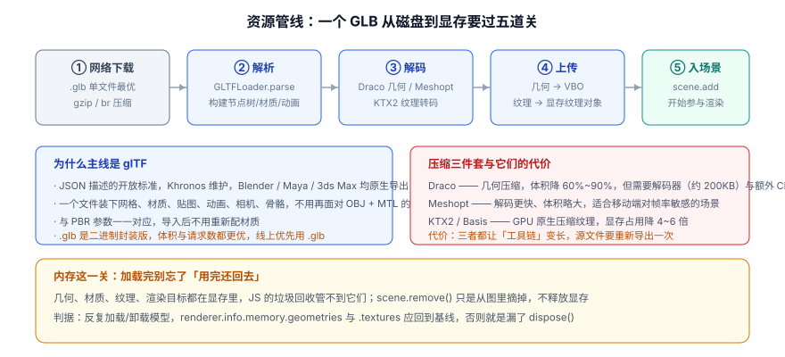

# 模型与资源管线

前面的页面都在讲「场景怎么写」，这一页讲**模型从哪来、怎么进显存、以及怎么还回去**。

一句话定位：这一页解决三个问题——**用什么格式、怎么压体积、怎么不把显存漏光**。

## 格式选型：主线是 glTF

现实世界的 3D 素材来源很杂（Blender、Maya、C4D、Sketchfab、各类素材站）。给浏览器用的格式，只推荐一条主线。



| 格式 | 结构 | 优势 | 问题 | 建议 |
| --- | --- | --- | --- | --- |
| **glTF 2.0（`.glb` / `.gltf`）** | JSON + 二进制缓冲区 | Khronos 开放标准，**一个文件装下网格/材质/贴图/动画/相机/骨骼**；与 PBR 参数一一对应 | 导出时贴图需要内嵌或外链 | **唯一推荐的主线格式** |
| OBJ + MTL | 纯文本 | 通用、古老、几乎什么软件都能导 | 无动画、无 PBR、材质表达能力弱、文件巨大 | 只在对接老资产时用 |
| FBX | 二进制/文本 | 动画与绑定信息完整，DCC 工具通吃 | 规范私有、体积大、解析慢、版权风险 | 用 DCC 打开后**转成 glTF** |
| STL | 纯几何 | 3D 打印的事实标准 | 没有材质、没有 UV、没有颜色 | 只做几何预览 |
| PLY / 3DGS | 点云 / 高斯泼溅 | 扫描与重建结果 | 生态较新、工具链另成一套 | 特定场景单独评估 |

:::tip 为什么 `.glb` 优于 `.gltf`
`.gltf` 是「JSON 描述 + 一堆外链文件（`.bin` + 贴图）」，一个模型可能变成 20 个请求；`.glb` 把所有东西塞进一个二进制文件，**一次请求搞定**，还能整包 gzip/brotli 压缩。线上优先用 `.glb`，把 `.gltf` 留在调试阶段用（可读性好）。
:::

## 加载器矩阵

Three.js 的加载器都在 `three/addons/loaders/` 下，接口风格统一（`load` / `loadAsync` / `parse`）。

| 加载器 | 格式 | 备注 |
| --- | --- | --- |
| `GLTFLoader` | glTF / GLB | **主力**，支持 Draco / KTX2 / Meshopt 扩展 |
| `DRACOLoader` | —— | Draco 几何解码器，需指定解码器目录 |
| `KTX2Loader` | KTX2 / Basis | GPU 压缩纹理转码器，需指定 transcoder 目录 |
| `RGBELoader` / `EXRLoader` | HDR / EXR | 环境贴图（用于 `scene.environment`） |
| `TextureLoader` | 常见位图 | 普通贴图 |
| `FileLoader` | 任意 | 自己解析二进制时的底层入口 |
| `OBJLoader` / `STLLoader` / `PLYLoader` | 对应格式 | 只在对接存量资产时用 |
| `FBXLoader` | FBX | 建议离线转 glTF，不在线上转 |

## 最小可运行示例：加载一个 GLB

```javascript [load-glb.js]
import * as THREE from 'three';
import { GLTFLoader } from 'three/addons/loaders/GLTFLoader.js';
import { DRACOLoader } from 'three/addons/loaders/DRACOLoader.js';
import { KTX2Loader } from 'three/addons/loaders/KTX2Loader.js';
import { MeshoptDecoder } from 'three/addons/libs/meshopt_decoder.module.js';

const renderer = new THREE.WebGLRenderer({ antialias: true });
renderer.setPixelRatio(Math.min(devicePixelRatio, 2));
renderer.setSize(innerWidth, innerHeight);
document.body.appendChild(renderer.domElement);

const scene = new THREE.Scene();
const camera = new THREE.PerspectiveCamera(45, innerWidth / innerHeight, 0.1, 200);
camera.position.set(4, 3, 6);
scene.add(new THREE.HemisphereLight(0xffffff, 0x334155, 2.0));
const sun = new THREE.DirectionalLight(0xffffff, 2.5);
sun.position.set(5, 8, 6);
scene.add(sun);

// ---------- 三个解码器：用了压缩就必须挂，否则加载直接报错 ----------
const draco = new DRACOLoader()
  .setDecoderPath('/draco/');            // 自托管：把 draco 解码器文件放到 public/draco/

const ktx2 = new KTX2Loader()
  .setTranscoderPath('/basis/');          // 自托管 transcoder 文件

const loader = new GLTFLoader()
  .setDRACOLoader(draco)
  .setKTX2Loader(ktx2.detectSupport(renderer))   // 必须在拿到 renderer 之后调用
  .setMeshoptDecoder(MeshoptDecoder);

// ---------- 加载 ----------
const gltf = await loader.loadAsync('/models/robot.glb');

console.log('节点数：', gltf.scene.children.length);
console.log('动画数：', gltf.animations.length);
console.log('生成器：', gltf.asset.generator);

gltf.scene.traverse((o) => {
  if (o.isMesh) {
    o.castShadow = true;
    o.receiveShadow = true;
    // glTF 导出时贴图的色彩空间已由加载器正确处理，这里不要重复设
  }
});
scene.add(gltf.scene);

// 自动对焦：把模型缩放到合适大小并居中（素材尺寸五花八门，这一步很实用）
const box = new THREE.Box3().setFromObject(gltf.scene);
const size = box.getSize(new THREE.Vector3());
const center = box.getCenter(new THREE.Vector3());
const maxDim = Math.max(size.x, size.y, size.z);
const scale = 3 / maxDim;
gltf.scene.scale.setScalar(scale);
gltf.scene.position.sub(center.multiplyScalar(scale));
console.log('原始包围盒：', size.toArray().map((n) => n.toFixed(2)).join(' × '));

renderer.setAnimationLoop(() => renderer.render(scene, camera));
```

**验证方式**：把任意 `.glb` 放到 `public/models/` 下，`pnpm dev` 后打开页面。预期现象：

1. 模型出现在画面中央，**大小适中且居中**（说明自动对焦逻辑生效）；
2. 控制台打印节点数、动画数、生成器名称与原始包围盒尺寸；
3. Network 面板里能看到 `.glb` 请求返回 200，若用了压缩则还能看到 `draco` 或 `basis` 目录下的解码器文件；
4. 控制台无报错。

## 压缩三件套：用哪一套，代价是什么

| 手段 | 压什么 | 体积收益 | 运行时代价 | 什么时候用 |
| --- | --- | --- | --- | --- |
| **Draco** | 几何（顶点/索引） | 降 60%~90% | 解码器约 200KB + 首次解码的 CPU 时间 | 高面数模型（> 10 万面） |
| **Meshopt** | 几何 | 降 40%~70% | **解码速度远快于 Draco** | 移动端、对首帧时间敏感 |
| **KTX2 / Basis** | 纹理 | **显存占用降 4~6 倍**，下载体积降 3~5 倍 | 需 transcode（很快） | 几乎总是值得，尤其是大贴图 |

:::warning KTX2 的两个「静默失败」
1. **`.detectSupport(renderer)` 必须在拿到渲染器之后调用**。用 `WebGPURenderer` 时更严格：它需要先 `await renderer.init()`（因为后端是异步选择的），在 `init()` 之前调 `detectSupport` 是**「贴图全黑但没有任何报错」**的头号原因。
2. **转码目标格式没协商对**。同一张 KTX2 在 WebGL 2 后端正常，在 WebGPU 原生后端可能变黑——要做的是**让 `detectSupport` 去协商**，而不是自己硬编码某个转码目标。
:::

离线压缩用 `gltf-transform` 一条命令就能完成（`@gltf-transform/core` 2026-09 口径为 4.5.x）：

```shell [离线优化]
# 安装 CLI（一次性）
npx @gltf-transform/cli --help

# 压缩几何（Draco）+ 压缩贴图（WebP）+ 清理冗余节点
npx @gltf-transform/cli optimize input.glb output.glb \
  --compress draco \
  --texture-compress webp \
  --texture-size 1024

# 检查产物规模与结构
npx @gltf-transform/cli inspect output.glb
```

:::tip Meshopt 还是 Draco
经验判据：**首屏时间敏感 → Meshopt；体积敏感（弱网、包体积受限）→ Draco**。Draco 压得更小但解码慢，在一个 500 万面的模型上，Draco 的解码时间可能达到几百毫秒并造成明显卡顿；Meshopt 通常只要几十毫秒。

如果两个都想要，可以给不同模型分别配置——`GLTFLoader` 同时挂了两个解码器时，会按文件里的扩展声明自动选择。
:::

## 加载管理：进度、并发与失败兜底

```javascript [loading-manager.js]
import { LoadingManager } from 'three';

const manager = new LoadingManager();
manager.onStart = (url, loaded, total) => console.log(`开始加载 ${loaded + 1}/${total}：${url}`);
manager.onProgress = (url, loaded, total) => {
  const pct = ((loaded / total) * 100).toFixed(0);
  progressEl.textContent = `加载中 ${pct}%`;
};
manager.onError = (url) => console.error('加载失败：', url);
manager.onLoad = () => console.info('全部资源加载完成');

const loader = new GLTFLoader(manager);

// 并发加载多个模型，同时给出兜底
async function loadAll(list) {
  const settled = await Promise.allSettled(list.map((it) => loader.loadAsync(it.url)));
  return settled.map((s, i) => (s.status === 'fulfilled'
    ? { ...list[i], scene: s.value.scene, animations: s.value.animations }
    // 关键：一个模型失败不该让整个场景白屏
    : { ...list[i], error: s.reason?.message ?? 'unknown' }));
}
```

| 策略 | 做法 | 适用 |
| --- | --- | --- |
| 全部并发 | `Promise.allSettled` 一把全发 | 资源数量少（< 10）、都需要立即显示 |
| 分批并发 | 每批 4~6 个，批间串行 | 资源多，避免占满浏览器连接数（HTTP/1.1 下尤其明显） |
| 优先级加载 | 先加载「主视觉」，其余延后 | 首屏体验优先 |
| 按需加载 | 交互触发时再加载 | 可选项（如「展开细节」） |

## 生命周期：`dispose()` 与显存回收

这是 3D 项目最容易积累问题的地方：**GPU 资源不在 JS 的垃圾回收范围内**。

```javascript [dispose-and-monitor.js]
// 记录基线（场景稳定后取一次）
function snapshot(tag) {
  const { memory, render } = renderer.info;
  console.log(
    `[${tag}] geometries=${memory.geometries} textures=${memory.textures} ` +
    `programs=${render.programs?.length ?? '-'} calls=${render.calls} triangles=${render.triangles}`
  );
}

// 加载 → 使用 → 卸载 一个完整循环
async function swapModel(url) {
  snapshot('before');
  const gltf = await loader.loadAsync(url);
  scene.add(gltf.scene);
  renderer.render(scene, camera);      // 渲染一次让资源真正上传
  snapshot('after-load');

  // 想卸载时：
  disposeSubtree(gltf.scene);
  renderer.render(scene, camera);
  snapshot('after-dispose');
}

function disposeSubtree(root) {
  root.parent?.remove(root);                       // 先从场景树上摘下来
  root.traverse((obj) => {
    if (!obj.isMesh) return;
    obj.geometry?.dispose();
    const mats = Array.isArray(obj.material) ? obj.material : [obj.material];
    mats.filter(Boolean).forEach((mat) => {
      for (const key of Object.keys(mat)) {
        const val = mat[key];
        if (val && val.isTexture) val.dispose();   // 材质上的每一张贴图都要单独释放
      }
      mat.dispose();
    });
  });
}

// 页面卸载时整体清理
window.addEventListener('beforeunload', () => {
  renderer.setAnimationLoop(null);    // 先停循环，否则还在渲染已释放的资源
  renderer.dispose();
});
```

:::tip 判据：反复加载卸载 20 次，`renderer.info.memory` 必须回到基线
这是**唯一可靠的显存泄漏检测方法**：把 `memory.geometries` 与 `memory.textures` 打出来，做 20 次「加载 → 渲染 → 卸载」，观察这两个数字是**稳定在一个区间内波动**，还是**单调递增**。单调递增就是漏了 `dispose()`。

注意 Three.js 内部有缓存（材质、着色器程序），所以数字不会精确回零——看重的是**趋势**，不是绝对值。
:::

| 需要 `dispose()` 的对象 | 说明 |
| --- | --- |
| `geometry` | 顶点缓冲区 |
| `material` | 着色器程序与 uniform |
| `texture`（含 `map` / `normalMap` / … 每一个槽位） | 显存中最大的部分，最容易漏 |
| `renderTarget` / `WebGLRenderTarget` | 后处理、阴影贴图都会占用 |
| `WebGLRenderer` | 整个上下文，页面卸载时释放 |
| `PMREMGenerator` | 生成完环境贴图后就该 `dispose()` |
| `OrbitControls` 等控制器 | 释放事件监听 |

## 体积优化清单

按收益从高到低排：

1. **贴图尺寸与格式**：4K 贴图降到 1K 通常肉眼无差，体积直接降到 1/16；再用 KTX2/WebP 转码。
2. **几何压缩**：Draco 或 Meshopt（见上文）。
3. **清理冗余节点**：DCC 导出常带一堆空 `Object3D`、无用相机、辅助物体、隐藏的备选模型——用 `gltf-transform` 的 `prune` / `dedup` 清掉。
4. **合并同材质网格**：把几十个小零件合成一个网格，顺带减少 draw call（见 [性能与 WebGPU 边界](../Performance/index.md)）。
5. **删除动画中未使用的轨道**：多余的 `AnimationClip` 往往占几十 KB。
6. **`.glb` + gzip/brotli**：这一步只是「开启服务器压缩」，成本为零。

:::danger 资源相关的五个坑
1. **Draco 解码器路径写错**。`setDecoderPath('/draco/')` 指向的目录里必须真的有解码器文件；否则表现为「模型加载到一半失败」，且错误信息不直观。**建议自托管**（放到 `public/` 下），不要依赖第三方 CDN。
2. **CORS 或 `file://` 加载失败**。与 WebAssembly 一样，模型与解码器都必须经 HTTP 加载，`file://` 下 fetch 会被拦掉。
3. **`scene.remove()` 当成释放**。它只是从树上摘掉，显存一点没还。
4. **材质贴图漏 `dispose()`**。只 `material.dispose()` 而不释放 `material.map` / `normalMap`，纹理仍留在显存——这是最常见的泄漏点。
5. **导出单位与朝向不一致**。glTF 规定 **Y 轴向上、单位是米**，Three.js 也是 Y-up，正常情况不需要额外旋转；但如果模型「躺在地上」或「大得离谱」，先怀疑导出设置（Z-up 导出、单位是厘米），**不要靠猜着改 `rotation.x = -Math.PI/2` 来掩盖**——算一次包围盒再决定更可靠。
:::

## 参考资料

1. glTF 2.0 规范（Khronos）：<https://registry.khronos.org/glTF/>
2. three.js 文档 · `GLTFLoader`：<https://threejs.org/docs/#examples/en/loaders/GLTFLoader>
3. three.js 手册 · 加载 3D 模型：<https://threejs.org/manual/#en/loading-3d-models>
4. gltf-transform 官方文档（离线优化）：<https://gltf-transform.dev/>
5. Draco 官方仓库：<https://github.com/google/draco>
6. KTX2 / Basis Universal：<https://github.com/KhronosGroup/KTX-Software>
7. three.js 手册 · 如何释放资源：<https://threejs.org/docs/#manual/en/introduction/How-to-dispose-of-objects>
