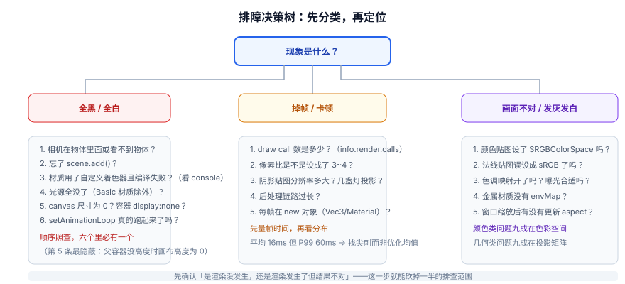

# 常见问题与最佳实践

3D 调试和普通前端调试最大的区别是：**大多数时候没有报错**。画面黑着、糊着、慢着，控制台一片干净。

一句话定位：这一页把高频问题按**现象**分类，给你一条能顺着走的排查路径——先定位问题属于哪一类，再动手。

## 排障决策树



**第一步永远是问自己：渲染到底「发生了没有」？**

- 完全黑屏/白屏 → 大概率**渲染没发生**（相机、尺寸、资源、异常中断）
- 有画面但不对 → 渲染发生了，问题在**参数或色彩**
- 有画面但卡 → 渲染发生了，问题在**开销**

这三条岔路对应完全不同的排查清单，先把岔路选对，能省掉一半时间。

## 一、黑屏 / 看不到东西

| 问题 | 原因 | 解决 |
| --- | --- | --- |
| 全黑，控制台无报错 | 用了 `MeshStandardMaterial` 但**没有任何光源** | 加一盏 `AmbientLight` + 一盏 `DirectionalLight`；或临时换成 `MeshBasicMaterial` 确认几何没问题 |
| 全黑 | 相机在物体内部 / 看向反方向 / `near` 设成 0 | `camera.position.set(0, 0, 5)` 后重试；检查 `lookAt` |
| 全黑 | 容器高度为 0，画布尺寸是 0 | 确保父元素有明确高度（`100vh` 或固定 px），且初始化时已插入 DOM |
| 全黑 | 自定义着色器**编译失败** | `renderer.debug.checkShaderErrors = true`，看控制台打印的完整着色器与错误行 |
| 全黑 | `far` 太小，物体在远平面之外 | 打印包围盒尺寸与相机距离，让 `far` 覆盖到 |
| 全黑 | 在 `await` 之后才 `scene.add()`，但渲染循环已先行 | 确认资源加载完成后再启动渲染循环，或用 `setAnimationLoop` 自动等待初始化 |
| 只有一片纯色 | `setAnimationLoop` 没跑起来（异常在回调里被吞掉） | 在回调首行 `console.log('frame')` 确认循环活着 |
| 物体忽隐忽现 | 视锥剔除误判（自定义几何未算包围球） | 手动 `geometry.computeBoundingSphere()`；临时 `mesh.frustumCulled = false` 验证 |

:::danger 「黑屏」排查的最短路径
按这四步走，两分钟内必定位：

1. **把材质换成 `MeshBasicMaterial({ color: 0xff0000, wireframe: true })`**。能看到 → 问题在光照或材质；看不到 → 问题在相机/尺寸/几何。
2. **打印 `renderer.domElement.clientWidth/clientHeight`**。是 0 的话立刻去修布局。
3. **`camera.position.set(0, 0, 5); camera.lookAt(0, 0, 0);`** 把相机摆到一个「一定看得见原点」的位置。
4. **在帧循环第一行 `console.log(renderer.info.render.calls)`**。是 0 → 什么都没画（相机/视锥问题）；大于 0 → 画了但结果不对（材质/光照问题）。

这四步的价值在于**把「黑屏」这个模糊现象拆成互相排斥的几种可能**，而不是漫无目的地改参数。
:::

## 二、画面「不对」：颜色、材质、光照

| 现象 | 原因 | 解决 |
| --- | --- | --- |
| 贴图发灰、发白、像蒙了层雾 | 颜色贴图**忘了设** `colorSpace = SRGBColorSpace` | 颜色贴图设 sRGB；数据贴图保持默认 |
| 表面像被腐蚀、光照方向乱 | **法线贴图被设成了 sRGB** | 法线贴图必须保持 `NoColorSpace`（默认） |
| 暗部死黑、亮部过曝 | 未开色调映射 | `renderer.toneMapping = THREE.ACESFilmicToneMapping` |
| 金属材质是纯黑球 | `metalness: 1` 但没有环境贴图 | 设 `scene.environment`（`RoomEnvironment` 或一张 HDR） |
| 物体被拉伸变形 | 窗口缩放后没更新 `aspect` | `camera.aspect = w/h; camera.updateProjectionMatrix()` |
| 平面竖在面前 | `PlaneGeometry` 默认在 XY 平面 | `mesh.rotation.x = -Math.PI / 2` 放倒 |
| 模型上下颠倒 / 大得离谱 | 导出设置问题（Z-up、单位是厘米） | **算一次包围盒**再决定缩放与旋转，别靠试 |
| 透明物体互相穿透闪烁 | 透明排序问题 | 设 `transparent: true`，必要时 `depthWrite: false` + `renderOrder`；尽量合并透明材质 |
| 阴影完全没有 | 四个条件缺一个 | 见 [材质、光照与纹理](../Material/index.md) 的阴影排查表 |
| 表面出现条纹/斑点 | 阴影 `bias` 不合适 | 调 `shadow.bias`（负值）或 `shadow.normalBias` |

## 三、性能：卡顿、掉帧

```javascript [通过三个数字快速定位]
// ① 是 CPU 侧还是 GPU 侧？把渲染尺寸减半再测
renderer.setSize(innerWidth / 2, innerHeight / 2);
// 帧率显著变好 → GPU 侧（填充率）；几乎没变 → CPU 侧（draw call / JS）

// ② draw call 数
console.log('calls =', renderer.info.render.calls);

// ③ 有没有周期性尖刺（GC）？看帧时间序列，而不是平均值
console.log('frame ms =', frameSamples.slice(-20).map((n) => n.toFixed(1)).join(' '));
```

| 现象 | 最可能的原因 | 首选手段 |
| --- | --- | --- |
| 物体越多越卡，降分辨率没用 | draw call 过多（CPU 侧） | `InstancedMesh` / 合并几何 / 共享材质 |
| 降分辨率立刻变好 | 填充率不足（GPU 侧） | 限制像素比到 2；减少 overdraw；简化后处理 |
| 每 20~30 帧卡一下 | 每帧 new 对象导致 GC | 复用模块级临时对象（`Vector3` / `Box3` / `Matrix4`） |
| 加了阴影就掉一半帧 | 阴影是「额外渲染一遍场景」 | 减少投影光源数、缩小 shadow camera、静态场景关掉 `shadowMap.autoUpdate` |
| 后处理一开就卡 | 每个 Pass 都是全屏绘制 | 按需开启；半分辨率；低端设备直接降级 |
| 高分屏上尤其卡 | 像素比 3 倍 → 9 倍像素 | `setPixelRatio(Math.min(devicePixelRatio, 2))` |
| 长时间运行越来越卡 | 资源泄漏（显存持续上涨） | 补 `dispose()`；用 `renderer.info.memory` 监控趋势 |
| 场景静止时风扇还转 | 一直在渲染 | 按需渲染（脏标记 + 空闲停渲） |

:::tip 优化的正确顺序
1. **先量**：拿到帧时间分布 + `renderer.info` 三个数字。
2. **先做「一行代码」的优化**：像素比上限、按需渲染、静态阴影。这三项收益常常超过后面所有手段的总和。
3. **再做结构性优化**：实例化、合批、压缩贴图。
4. **每改一项，重测一次**，确认真的变好了。**没有度量的优化不是优化，是改代码。**
:::

## 四、加载与资源

| 问题 | 原因 | 解决 |
| --- | --- | --- |
| 加载失败，`file://` 下 fetch 报错 | 模型/解码器必须经 HTTP | 起一个静态服务器（`python3 -m http.server`、`vite preview`） |
| Draco 模型加载失败 | 解码器路径不对或未自托管 | `setDecoderPath('/draco/')` 且目录里真有文件 |
| KTX2 贴图全黑**且无报错** | `detectSupport()` 调用时机不对 | 必须在拿到 renderer 之后调；`WebGPURenderer` 要先 `await renderer.init()` |
| 模型大小/朝向不对 | 导出单位或上轴不同 | 算包围盒后统一缩放居中，别硬编码旋转 |
| 加载完显存狂涨不回落 | 只 `scene.remove()` 没 `dispose()` | 几何、材质、**每一张贴图**都要单独 `dispose()` |
| 一个模型失败导致白屏 | 用了 `Promise.all` | 改 `Promise.allSettled`，失败项降级显示 |
| 首屏很慢 | 贴图太大、模型未压缩 | KTX2/WebP + Draco/Meshopt；4K 降到 1K/2K |

## 五、兼容与部署

| 问题 | 说明 | 解决 |
| --- | --- | --- |
| 老设备不支持 WebGL 2 | 覆盖率约 95%+，仍有长尾 | `getContext('webgl2') \|\| getContext('webgl')` 兜底，或降级到 Canvas 2D |
| WebGPU 不可用 | 覆盖率约 85%~87%，Linux/Android 仍在推进 | `WebGPURenderer` 会自动回落 WebGL 2；**不要假设一定走 WebGPU** |
| 想同时支持两条渲染路径 | 代码会分叉 | 用 `three/webgpu` 入口 + TSL 写着色器；`WebGLRenderer` 不支持从 `three/webgpu` 导入 |
| 打包后体积很大 | three 未做代码分割 | 只 import 需要的模块；`three/addons` 是按需引入的，不会全量打包 |
| 移动端发热严重 | 一直在满帧渲染 | 按需渲染 + 降像素比 + 降低帧率上限 |
| 隐私模式 / 远程桌面下黑屏 | 上下文创建失败 | 检测 `getContext` 返回值，给出友好降级提示 |
| 切标签页回来画面跳变 | delta 累积过大 | `dt = Math.min(dt, 0.1)` |
| 上下文丢失后画面卡死 | 未监听丢失事件 | 监听 `webglcontextlost` / `webglcontextrestored`，见 [WebGL 基础与渲染管线](../Overview/index.md) |

## 六、工程与协作

:::danger 六条应该写进团队规范的纪律
1. **所有与时间相关的量都乘 `dt`**。禁止 `+= 0.01` 或 `+= 1/60`。
2. **帧循环里禁止 `new` 对象**。临时向量/矩阵/盒统一在模块顶部创建并复用。
3. **`dispose()` 与创建配对**。谁创建谁负责释放；组件卸载时先 `setAnimationLoop(null)` 再释放资源。
4. **像素比必须设上限**。统一封装在一个 `createRenderer()` 里，禁止各处自己 `setPixelRatio`。
5. **`renderer.info` 要能被读到**。生产环境保留一个可开关的调试面板（`draw calls` / `geometries` / `textures`），否则线上出问题无从下手。
6. **升级 three.js 一次不超过 10 个 release**。弃用警告只保留 10 个 release，跨太多会直接跳过告警期，代码「毫无提示地坏掉」。
:::

## 七、自查清单

上线前逐项过一遍：

| 检查项 | 判据 |
| --- | --- |
| 像素比有上限 | `setPixelRatio(Math.min(dpr, 2))` |
| 窗口缩放已处理 | 监听 `resize`，同步 `aspect` + `updateProjectionMatrix()` + `setSize()` |
| 帧率无关 | 所有位移/旋转都乘 `dt` |
| 无每帧分配 | 帧循环里没有 `new THREE.*` |
| 阴影成本可控 | 投影光源数 ≤ 2，`mapSize` 与 shadow camera 范围都经过测量 |
| 必要时更新阴影 | 静态场景设了 `shadowMap.autoUpdate = false` |
| 资源可释放 | 提供了 `teardown()`，且反复进出后 `memory.*` 不单调增长 |
| 上下文丢失有兜底 | 监听了 `webglcontextlost` 并暂停渲染 |
| 加载失败有降级 | 用 `Promise.allSettled`，失败项有占位或提示 |
| 低端设备有降级 | 根据设备能力关闭后处理 / 降低像素比 / 降低阴影质量 |
| 关键数字可观测 | 能随时读出 `renderer.info` 的三个数字 |
| 版本已核对 | `npm view three version` 与锁文件一致，`THREE.REVISION` 与预期相符 |

## 八、最佳实践（十条）

1. **先让画面出来，再让它好看，最后让它变快。** 三个阶段不要混着做。
2. **一次只改一个变量**。3D 的因果关系比 2D 复杂，同时改三处会让你失去归因能力。
3. **能内置就不自定义**。自定义着色器是最后手段，不是第一选择。
4. **能实例化就不逐个建**。`InstancedMesh` 的收益通常是数量级的。
5. **能静态就不动态**。静态阴影、`matrixAutoUpdate = false`、按需渲染，都是免费收益。
6. **资源进得来，也要出得去**。`dispose()` 从第一天就写上，别等泄漏了再补。
7. **数字优先于感觉**。每一次「优化」都要有前后对比的数字。
8. **保留降级路径**。低端设备不崩，比高端设备满帧更重要。
9. **别追新版本号**。升级是为了修复与能力，不是为了数字；`r186` 的破坏性变更清单要先读。
10. **理解管线再谈优化**。所有手段都能在[管线六阶段](../Overview/index.md)里找到归属——找不到归属的手段，大概率是玄学。

## 参考资料

1. three.js 手册 · 常见问题与最佳实践：<https://threejs.org/manual/#en/faq>
2. three.js 迁移指南（升级前必读）：<https://github.com/mrdoob/three.js/wiki/Migration-Guide>
3. World Wide Web Consortium · WebGPU 规范（状态与实现范围）：<https://www.w3.org/TR/webgpu/>
4. Khronos · WebGL 规范与实现状态：<https://registry.khronos.org/webgl/>
5. MDN · WebGL 最佳实践：<https://developer.mozilla.org/zh-CN/docs/Web/API/WebGL_API/WebGL_best_practices>
6. 本库 [前端性能优化 · 运行时优化](../../Others/PerformanceOptimization/Runtime/index.md)（页面级性能，与 3D 帧预算互补）
