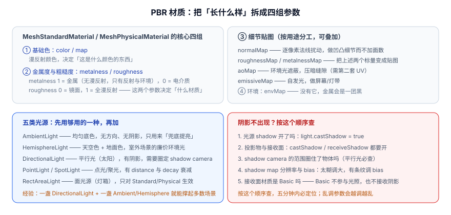
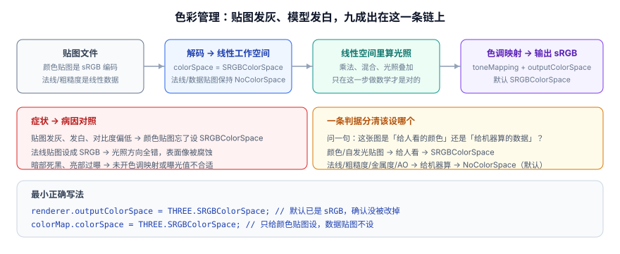

# 材质、光照与纹理

「几何决定形状，材质决定外表，光照决定能不能看见。」三句话概括了这一页的全部内容。

一句话定位：这一页解决两类问题——**该选哪个材质**，以及**为什么画面「看着就不对」**（发灰、发白、全黑、没有阴影）。

## 材质：一张选型表

材质（`Material`）描述表面如何与光交互。Three.js 内置了十几种，真正需要记住的只有六个。

| 材质 | 是否受光照 | 主要参数 | 适用场景 | 性能 |
| --- | --- | --- | --- | --- |
| `MeshBasicMaterial` | **否** | `color` / `map` | 纯色/贴图面板、线框、调试用、UI 元素 | 最低 |
| `MeshLambertMaterial` | 是（漫反射） | `color` / `map` / `emissive` | 低成本漫反射，老项目常见 | 低 |
| `MeshPhongMaterial` | 是（漫反射 + 镜面） | `shininess` / `specular` | 需要高光但不要求物理正确 | 中 |
| **`MeshStandardMaterial`** | 是（PBR） | `metalness` / `roughness` + 全套贴图 | **默认选择**，与 glTF 模型一一对应 | 中高 |
| `MeshPhysicalMaterial` | 是（PBR 扩展） | Standard 全部 + `clearcoat` / `transmission` / `iridescence` 等 | 玻璃、漆面、车漆、宝石 | 高 |
| `ShaderMaterial` / `RawShaderMaterial` | 由你决定 | 自己的 GLSL | 内置材质做不到的效果 | 看实现 |
| `MeshNormalMaterial` | 否 | —— | 一眼看出法线朝向，调试利器 | 低 |
| `PointsMaterial` / `LineBasicMaterial` | 视配置 | `size` / `sizeAttenuation` | 点云、线框 | 低 |

```javascript [choose-material.js]
// 调试阶段：先用 Basic 排除光照因素
const debugMat = new THREE.MeshBasicMaterial({ color: 0xff0000, wireframe: true });

// 生产阶段：Standard 是默认答案
const mat = new THREE.MeshStandardMaterial({
  color: 0xffffff,
  map: colorTex,             // 基础色贴图
  roughness: 0.4,            // 0 = 镜面，1 = 全漫反射
  metalness: 0.0,            // 0 = 电介质（塑料/木/布），1 = 金属
  envMapIntensity: 1.0,      // 环境贴图强度，没有 envMap 时无效
});
```

:::tip 记住 PBR 两个参数的直觉
- **`roughness` 决定「反射有多散」**：0 是镜子，0.3 是抛光金属，0.8 是水泥。
- **`metalness` 决定「是金属还是别的」**：**只有 0 和 1 有意义**，中间值（0.5）在物理上不存在，只该出现在贴图的过渡区里。

一个金属球 = `metalness: 1, roughness: 0.2` + **一张环境贴图**；`metalness: 1` 而没有 `envMap`，它会变成一团黑——因为金属没有漫反射，全靠反射环境成像。
:::

## 光照：五类光源与它们的物理单位



| 光源 | 类型 | 阴影 | 强度单位 | 典型用法 |
| --- | --- | --- | --- | --- |
| `AmbientLight` | 环境光 | 无 | 无量纲 | 兜底提亮，避免暗部死黑；**别当主光源** |
| `HemisphereLight` | 半球光 | 无 | 无量纲 | 天空色 + 地面色，室外廉价环境光 |
| `DirectionalLight` | 平行光 | **有** | 无量纲（类似 lux） | 太阳光，主光源首选 |
| `PointLight` | 点光源 | 有 | **坎德拉 cd** | 灯泡、局部照明 |
| `SpotLight` | 聚光灯 | 有 | **坎德拉 cd** | 舞台灯、手电 |
| `RectAreaLight` | 面光源 | 无 | 坎德拉/平方米 | 灯箱、柔光板；**只对 Standard/Physical 生效** |

```javascript [lights.js]
// 一套能撑起大多数场景的最小光照
scene.add(new THREE.AmbientLight(0xffffff, 0.5));            // 兜底

const sun = new THREE.DirectionalLight(0xffffff, 2.5);        // 主光（太阳）
sun.position.set(6, 10, 8);
sun.castShadow = true;
sun.shadow.mapSize.set(2048, 2048);                          // 越大越清晰，也越贵
// 关键：平行光的阴影相机是正交相机，必须圈住「会投影的区域」
const d = 12;
sun.shadow.camera.left = -d;
sun.shadow.camera.right = d;
sun.shadow.camera.top = d;
sun.shadow.camera.bottom = -d;
sun.shadow.camera.near = 1;
sun.shadow.camera.far = 40;
sun.shadow.bias = -0.0005;                                   // 有条纹/浮影时微调
sun.shadow.normalBias = 0.02;                                // 曲面上的自阴影问题
scene.add(sun);

// 点光源：注意强度单位是坎德拉
const lamp = new THREE.PointLight(0xffd7a0, 120, 30, 2);      // 颜色、强度、距离、衰减
lamp.position.set(-3, 3, 2);
lamp.castShadow = true;
scene.add(lamp);
```

:::danger 点光源强度写 1 会几乎看不见
从 r155 起 Three.js 默认使用**物理正确的光照单位**（旧的 `useLegacyLights` 开关已在 r165 移除）。这意味着：

- `DirectionalLight` / `AmbientLight` / `HemisphereLight` 的 `intensity` 是**无量纲的相对强度**，1~3 是常见范围；
- `PointLight` / `SpotLight` 的 `intensity` 单位是**坎德拉（cd）**，并且默认 `decay = 2`（平方反比衰减）。沿用旧教程写 `intensity: 1`，在 5 米外几乎什么都照不到。

**正确做法**：点光源/聚光灯从几十到几百开始试（如 `120`），并显式给出 `distance` 与 `decay`。如果你从网上抄来的代码「点光源完全没效果」，先把强度乘上 100 试试——八成就是这个原因。
:::

## 阴影：不出现的五个原因，按顺序查

阴影是新手最容易卡住的地方，因为它需要**四个条件同时满足**，缺一个就什么都没有。

```javascript [shadow-checklist.js]
// ① 光源开了阴影
sun.castShadow = true;

// ② 投影物与接收面各开自己的开关
model.traverse((o) => {
  if (o.isMesh) {
    o.castShadow = true;      // 它要投影
    o.receiveShadow = true;    // 它要接影（地面必须有这一行）
  }
});

// ③ 阴影相机的范围圈住了物体 —— 平行光必查，圈小了阴影会被裁掉
sun.shadow.camera.left = -d;  // 见上文

// ④ 分辨率与 bias 合理
sun.shadow.mapSize.set(2048, 2048);
sun.shadow.bias = -0.0005;

// ⑤ 接收面不能是 Basic 材质（Basic 完全不参与光照，也不接收阴影）
ground.material = new THREE.MeshStandardMaterial({ color: 0x94a3b8 });
```

| 现象 | 病因 | 处理 |
| --- | --- | --- |
| 完全没有阴影 | 五个条件缺一个 | 按上表顺序逐条确认 |
| 阴影边缘全是锯齿 | 分辨率不足 | 提高 `mapSize`，或**缩小阴影相机范围**（同样的分辨率覆盖更小的区域 = 更高的有效精度） |
| 阴影上出现横向条纹 | 深度偏移不足 | 调 `shadow.bias`（负值）与 `shadow.normalBias` |
| 物体表面自己身上出现斑块 | 自阴影偏移过大 | 减小 `mapSize`/增大 `bias` 的绝对值，优先调 `normalBias` |
| 阴影糊成一团 | 阴影相机覆盖范围过大 | 缩小范围，让阴影贴图的像素更「值钱」 |

:::warning r186 起 `PCFSoftShadowMap` 已移除
r186 **移除了 `PCFSoftShadowMap`**：`WebGPURenderer` 侧不再支持；`WebGLRenderer` 侧使用时控制台会告警并回落到 `PCFShadowMap`。而 `PCFShadowMap`（`renderer.shadowMap.type` 的默认值）本身已具备软阴影效果，对多数场景视觉差异很小。

**升级动作**：把代码里的 `THREE.PCFSoftShadowMap` 换成 `THREE.PCFShadowMap`；确实需要更强的软阴影再考虑 `THREE.VSMShadowMap`（会引入漏光，需要额外调参）。
:::

## 纹理：从 `TextureLoader` 到正确显示

```javascript [textures.js]
const loader = new THREE.TextureLoader();

const colorTex = loader.load('/textures/albedo.jpg');
// 颜色贴图是「给人看的颜色」，必须声明为 sRGB，否则整体发灰发白
colorTex.colorSpace = THREE.SRGBColorSpace;
colorTex.wrapS = colorTex.wrapT = THREE.RepeatWrapping;   // 平铺
colorTex.repeat.set(4, 4);
colorTex.anisotropy = renderer.capabilities.getMaxAnisotropy();  // 斜视角更清晰

const normalTex = loader.load('/textures/normal.jpg');
// 法线贴图是「给机器算的数据」，保持默认 NoColorSpace，绝对不能设 sRGB
```

| 属性 | 作用 | 常见取值 |
| --- | --- | --- |
| `colorSpace` | 色彩空间 | 颜色贴图 `SRGBColorSpace`；数据贴图保持默认 |
| `wrapS` / `wrapT` | 超出 [0,1] 的寻址方式 | `RepeatWrapping`（平铺）/ `ClampToEdgeWrapping`（拉伸边缘） |
| `repeat` / `offset` / `rotation` | UV 变换 | 平铺、滚动动画 |
| `magFilter` / `minFilter` | 放大/缩小采样 | 默认已合理；像素风可设 `NearestFilter` |
| `generateMipmaps` | 是否生成多级渐远纹理 | 默认 `true`；**必须保持开启**，否则远处会闪烁 |
| `anisotropy` | 各向异性过滤 | 取 `getMaxAnisotropy()`，代价很小、收益明显 |
| `flipY` | 是否垂直翻转 | 默认 `true`；DataTexture / CanvasTexture 通常需要设 `false` |

| 用途 | 贴图槽位 | 色彩空间 | 需要第二套 UV |
| --- | --- | --- | --- |
| 基础色 | `map` | sRGB | 否 |
| 法线 | `normalMap` | 线性（默认） | 否 |
| 粗糙度 | `roughnessMap` | 线性 | 否 |
| 金属度 | `metalnessMap` | 线性 | 否 |
| 自发光 | `emissiveMap` | sRGB | 否 |
| 环境光遮蔽 | `aoMap` | 线性 | **是**（现代版本属性名为 `uv1`，早期版本叫 `uv2`） |

## 色彩管理：发灰、发白、过曝的根源



这是「画面就是不对」里占比最高的一类问题，值得单独说清楚。整条链路是：

```text
贴图（sRGB 编码）→ 解码到线性空间 → 在线性空间里做光照计算 → 色调映射 → 编码回 sRGB 输出
```

```javascript [color-management.js]
// 默认已经是 sRGB 输出，这两行主要是「确认没被别人改掉」
renderer.outputColorSpace = THREE.SRGBColorSpace;

// 色调映射：把 HDR 范围的光照结果映射到显示器能显示的范围
renderer.toneMapping = THREE.ACESFilmicToneMapping;   // 电影感，最常用
renderer.toneMappingExposure = 1.0;                   // 整体曝光，0.8~1.4 之间调

// 颜色贴图必须显式声明（glTF 加载器会自动做，自己 load 的要手动设）
colorTex.colorSpace = THREE.SRGBColorSpace;
```

:::danger 一条判据分清该设哪个色彩空间
问一句：**这张图是「给人看的颜色」，还是「给机器算的数据」？**

- 给人看（基础色、自发光、UI）→ `SRGBColorSpace`
- 给机器算（法线、粗糙度、金属度、AO、位移）→ 保持默认（线性）

**把法线贴图设成 sRGB 是最常见的错误**：法线向量的三个分量被做了非线性变换，光照方向全错，表面看起来像被腐蚀过。反过来，**把基础色贴图忘了设 sRGB** 则表现为整体发灰、对比度偏低、颜色「像蒙了层雾」——这是本库其他三个专题里最高频的 3D 视觉问题。
:::

## 环境光照：让金属不再是黑球

```javascript [environment.js]
import { RoomEnvironment } from 'three/addons/environments/RoomEnvironment.js';

// 用内置的「房间环境」自动生成一张 PMREM 环境贴图
const pmrem = new THREE.PMREMGenerator(renderer);
scene.environment = pmrem.fromScene(new RoomEnvironment(), 0.04).texture;
// 这一行会让所有 Standard/Physical 材质都获得环境反射，金属立刻「活」过来

// 生产环境更常见的做法：加载一张真实 HDR
// const hdr = await new RGBELoader().loadAsync('/env/studio.hdr');
// scene.environment = pmrem.fromEquirectangular(hdr).texture;
// scene.background = hdr;   // 想让它同时当背景再设这一行
```

`scene.environment` 与 `scene.background` 是两个独立的东西：前者参与**光照计算**（影响所有 PBR 材质），后者只是**背景画面**。想让 HDR 同时当好两者，就得各设一次。

## 综合示例：一颗带阴影的金属球

把上面所有内容串起来：

```javascript [metal-sphere.js]
import * as THREE from 'three';
import { RoomEnvironment } from 'three/addons/environments/RoomEnvironment.js';
import { OrbitControls } from 'three/addons/controls/OrbitControls.js';

const renderer = new THREE.WebGLRenderer({ antialias: true });
renderer.setPixelRatio(Math.min(devicePixelRatio, 2));
renderer.setSize(innerWidth, innerHeight);
renderer.shadowMap.enabled = true;
renderer.shadowMap.type = THREE.PCFShadowMap;      // r186 起不要再用 PCFSoftShadowMap
renderer.toneMapping = THREE.ACESFilmicToneMapping;
document.body.appendChild(renderer.domElement);

const scene = new THREE.Scene();
scene.background = new THREE.Color(0x0f172a);

// 环境贴图：金属材质的关键
const pmrem = new THREE.PMREMGenerator(renderer);
scene.environment = pmrem.fromScene(new RoomEnvironment(), 0.04).texture;

const camera = new THREE.PerspectiveCamera(45, innerWidth / innerHeight, 0.1, 100);
camera.position.set(4, 3, 6);

// 金属球
const ball = new THREE.Mesh(
  new THREE.SphereGeometry(1, 64, 32),
  new THREE.MeshStandardMaterial({ color: 0xd6d3d1, metalness: 1.0, roughness: 0.25 })
);
ball.position.y = 1.1;
ball.castShadow = true;
ball.receiveShadow = true;
scene.add(ball);

// 接影地面
const ground = new THREE.Mesh(
  new THREE.PlaneGeometry(30, 30),
  new THREE.MeshStandardMaterial({ color: 0x94a3b8, roughness: 0.9, metalness: 0.0 })
);
ground.rotation.x = -Math.PI / 2;                  // 平面默认竖着，转 90° 放倒
ground.receiveShadow = true;
scene.add(ground);

// 太阳
const sun = new THREE.DirectionalLight(0xffffff, 2.5);
sun.position.set(6, 10, 8);
sun.castShadow = true;
sun.shadow.mapSize.set(2048, 2048);
const d = 8;
Object.assign(sun.shadow.camera, { left: -d, right: d, top: d, bottom: -d, near: 1, far: 40 });
sun.shadow.bias = -0.0005;
scene.add(sun);
scene.add(new THREE.AmbientLight(0xffffff, 0.35));

new OrbitControls(camera, renderer.domElement);
renderer.setAnimationLoop(() => renderer.render(scene, camera));

addEventListener('resize', () => {
  camera.aspect = innerWidth / innerHeight;
  camera.updateProjectionMatrix();
  renderer.setSize(innerWidth, innerHeight);
});
```

**验证方式**：启动后逐项确认：

1. 球体是**金属质感**，表面能看到环境的明暗反射（把 `metalness` 改成 0 再刷新，变成塑料感的灰球——差异一眼可辨）；
2. 地面出现**球的投影**，边缘略有柔和过渡；
3. 把 `renderer.toneMapping` 注释掉再刷新，画面明显更「硬」、亮部容易过曝（说明色调映射确实在起作用）；
4. 把 `colorTex.colorSpace = THREE.SRGBColorSpace` 注释掉（改用带贴图的材质），颜色变灰变浅（说明色彩空间确实在起作用）；
5. 控制台无报错。

## 易错点

:::danger 材质与光照的六个坑
1. **金属材质没有环境贴图**。`metalness: 1` 而没有 `envMap` / `scene.environment`，结果是纯黑。金属没有漫反射，全靠反射成像。
2. **把 `side: THREE.DoubleSide` 当万能药**。开着它会关闭背面剔除、代价翻倍，还会让阴影与光照判断变复杂。只有确实需要「看到内壁」（如敞口容器）时才用。
3. **透明物体排序错乱**。多个透明物体互相遮挡时会出现穿透或闪烁：正确做法是设 `transparent: true`（必要时 `depthWrite: false`）、用 `renderOrder` 显式控制顺序，并尽量用「一个材质 + 一张带 alpha 的贴图」代替很多个透明材质。
4. **改了材质属性但不生效**。改 `vertexColors`、`flatShading`、着色器代码等结构性属性后，需要 `material.needsUpdate = true` 触发重编译。
5. **非等比缩放导致光照错乱**。`scale` 三个轴不一致时，法线需要按逆矩阵转置变换；Three.js 会处理，但**自写着色器时必须自己修**，否则光照方向会歪。
6. **每帧新建材质/贴图**。材质与贴图是 GPU 资源，在帧循环里 `new` 会导致显存持续上涨直到崩溃。它们应该**在初始化阶段创建一次**，运行时只改属性值。
:::

## 参考资料

1. three.js 文档 · 材质总览：<https://threejs.org/docs/#api/en/materials/Material>
2. three.js 手册 · 光照与阴影：<https://threejs.org/manual/#en/lights>
3. three.js 手册 · 纹理与色彩管理：<https://threejs.org/manual/#en/color-management>
4. three.js 文档 · `WebGLRenderer` 的 `outputColorSpace` 与 `toneMapping`：<https://threejs.org/docs/#api/en/renderers/WebGLRenderer>
5. three.js 示例 · PBR / 环境贴图：<https://threejs.org/examples/#webgl_materials_envmaps>
