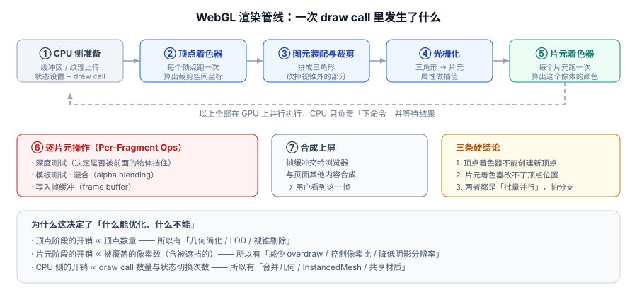
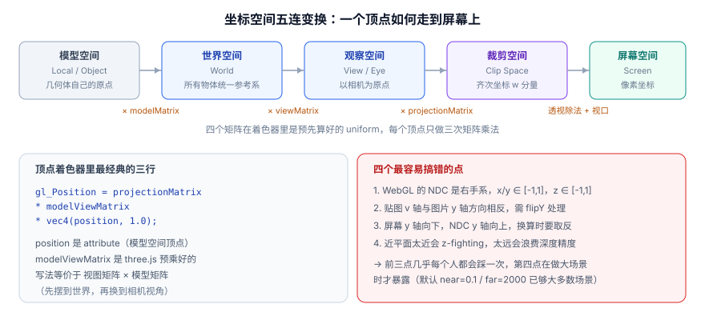

# WebGL 基础与渲染管线

GPU 和 CPU 是两台性格完全不同的机器。这一页把 **WebGL 到底把什么交给了 GPU、一次 draw call 在显卡里走了哪几步** 讲清楚——所有「为什么这样优化才有效」的问题，答案都在这一页。

一句话定位：这一页是**解释器**。它不教你怎么用 Three.js，但它决定了你后面看到任何一行 3D 代码时能不能立刻知道「这行在动什么」。

## 为什么需要 WebGL：GPU 与 CPU 的分工

CPU 擅长**串行逻辑**：分支多、依赖复杂、要读要写、每次处理几个数。GPU 完全相反，它擅长**批量并行**：同一段代码对几百万个数据各跑一遍，彼此不依赖。



这个差异直接决定了两者该干什么活：

| 关注点 | CPU | GPU |
| --- | --- | --- |
| 最擅长 | 分支、递归、业务逻辑、I/O | 同一运算 × 海量数据 |
| 核心数量 | 8~24 个（很聪明） | 数千个（很简单） |
| 一次处理 | 一个任务 | 同一运算的上百万份数据 |
| 怕什么 | 循环里做大量数值计算 | 分支跳转、数据依赖、频繁读回结果 |
| 在 3D 里的角色 | 算矩阵、遍历场景、下命令 | 变换顶点、填像素、算光照 |

**所以 WebGL 的设计哲学是「CPU 少说话、GPU 多干活」**：CPU 把数据一次性交上去、下一道命令，然后在 GPU 画这一帧的同时准备下一帧。一旦 CPU 每帧要说几千次话（几千次 draw call），GPU 再快也只能排队等——这是 3D 性能问题里最常见的一类。

:::tip 一句话区分瓶颈在哪
- 帧率随**物体数量**线性下降、GPU 利用率不高 → **CPU 侧瓶颈**（draw call 过多）。
- 帧率随**屏幕分辨率 / 像素比**下降、GPU 利用率打满 → **GPU 侧瓶颈**（填充率不足）。
:::

## WebGL 是什么：一台「状态机 + 两种程序」

WebGL 是 **OpenGL ES 2.0/3.0 的 JavaScript 绑定**（不是新设计的 API），它以一台**状态机**的形式暴露能力：

- 你通过 `gl.enable()` / `gl.bindBuffer()` / `gl.useProgram()` 之类的方法**设置状态**；
- 状态设置好之后调用 `gl.drawArrays()` / `gl.drawElements()` **下绘制命令**；
- GPU 按当前状态执行，**每次绘制都会读一遍当前状态**。

```javascript [webgl-context.js]
const canvas = document.querySelector('#c');
// 优先拿 webgl2；拿不到再退 webgl1（老设备兜底）
const gl = canvas.getContext('webgl2') || canvas.getContext('webgl');

if (!gl) {
  // 注意：这不只是「没装显卡」，驱动黑名单、远程桌面、隐私模式都可能返回 null
  throw new Error('当前环境不支持 WebGL，请降级到 Canvas 2D 渲染');
}

console.log('版本：', gl.getParameter(gl.VERSION));
console.log('着色器版本：', gl.getParameter(gl.SHADING_LANGUAGE_VERSION));
console.log('最大纹理尺寸：', gl.getParameter(gl.MAX_TEXTURE_SIZE));
```

真正干活的只有**两个程序**（在 WebGL 里叫 shader，用 GLSL ES 编写）：

- **顶点着色器（vertex shader）**：每个顶点执行一次，职责是**算出这个顶点在裁剪空间的坐标**（以及要传给片元的任何数据）。
- **片元着色器（fragment shader）**：每个片元（≈ 每个像素）执行一次，职责是**算出这个像素的最终颜色**。

:::danger 两条绝对不能违反的限制
1. **顶点着色器不能创建或删除顶点**。想增加顶点必须在 CPU 侧重新准备缓冲区——这就是「几何简化」只能减不能变的根本原因。
2. **片元着色器不能修改顶点位置**。像素级位移是假的，只是把颜色画到了别的地方。

这两条限制决定了所有 3D 优化的方向：减顶点数、减像素数、减 draw call。没有任何技巧能绕过它们。
:::

## 坐标空间：一个顶点的五次搬家

同一个顶点在不同阶段有不同的坐标含义，中间靠一串矩阵连起来。



| 空间 | 含义 | 变换 | 谁提供 |
| --- | --- | --- | --- |
| 模型空间（Local） | 几何体自身的坐标，原点在几何体自己的中心 | —— | 建模软件 / `BufferGeometry` |
| 世界空间（World） | 放进场景后的统一坐标系 | × `modelMatrix` | 物体的 `position` / `rotation` / `scale` |
| 观察空间（View） | 以相机为原点、相机朝 -Z 看 | × `viewMatrix` | 相机的位置与朝向 |
| 裁剪空间（Clip） | 齐次坐标，GPU 用它做裁剪 | × `projectionMatrix` | 相机的投影参数 |
| 屏幕空间（Screen） | 像素坐标，最终画在这里 | 透视除法 + 视口变换 | GPU 自动完成 |

在 Three.js 里这些矩阵**已经被算好并注入着色器**了，`modelViewMatrix` 就是「视图矩阵 × 世界矩阵」的预乘结果：

```glsl [顶点着色器里最经典的三行]
gl_Position = projectionMatrix * modelViewMatrix * vec4(position, 1.0);
```

:::danger 五个坐标约定，错一个就全歪
1. **WebGL 的 NDC（标准化设备坐标）是右手系**：x、y、z 都在 `[-1, 1]`，z 越大越靠近相机之外的远处（与 Direct3D 相反）。
2. **贴图的 v 轴与图片的 y 轴方向相反**：从图片加载纹理时默认需要 `flipY`；Three.js 的 `TextureLoader` 已经帮你打开，自己写裸 WebGL 时容易忘记，表现为**图片上下颠倒**。
3. **屏幕坐标 y 轴向下，NDC y 轴向上**：做拾取换算时必须取反（`ndc.y = -(y / height) * 2 + 1`）。
4. **旋转单位是弧度不是角度**：`Math.PI / 4` 是 45°，写 `45` 会转 2578°。
5. **`near` 不要设成 0**：投影矩阵会退化成不可逆，画面全黑；`near` 太小还会让远处出现深度冲突（z-fighting，表现为表面闪烁的条纹）。
:::

## 一次 draw call 里，GPU 走了哪六步

这是本页最该记住的内容。后面所有性能优化的手段，都能在这六步里找到归属。

| 阶段 | 位置 | 干什么 | 开销正比于 |
| --- | --- | --- | --- |
| ① 数据准备 | CPU | 准备缓冲区、上传纹理、设置状态、下达 draw call | **draw call 数量** |
| ② 顶点着色 | GPU 并行 | 每个顶点算出裁剪空间坐标 | **顶点数量** |
| ③ 图元装配与裁剪 | GPU 固定功能 | 把顶点拼成三角形、裁掉视锥外的部分 | 顶点数量 |
| ④ 光栅化 | GPU 固定功能 | 三角形 → 片元，属性自动插值 | **被覆盖的像素数** |
| ⑤ 片元着色 | GPU 并行 | 每个片元算出颜色 | **被覆盖的像素数（含被遮挡的）** |
| ⑥ 逐片元操作 | GPU 固定功能 | 深度测试、模板测试、混合、写入帧缓冲 | 被覆盖的像素数 |

把这张表和优化手段对上，逻辑就通顺了：

- ② 正比于顶点数 → **LOD（远处用低模）、几何简化、视锥剔除**
- ④⑤⑥ 正比于像素数 → **降低像素比、减少 overdraw（过度绘制）、降低阴影贴图分辨率、减少后处理链路**
- ① 正比于 draw call 数 → **合并几何、`InstancedMesh`、`BatchedMesh`、共享材质**

:::warning 「像素数」里包括看不见的像素
第 ⑤ 步的开销发生在**深度测试之前**——也就是说，一个被前面物体完全挡住的像素，**着色器照样跑了一遍**，只是在第 ⑥ 步被深度测试丢弃。这就是「过度绘制（overdraw）」：同一屏幕像素被画了 3 次，就只能拿到 1/3 的性能。解决办法有两个：从前到后排序（让近处的先画，远处被深度测试直接丢弃）、以及少画不必要的物体。
:::

## 着色器的三种数据通道

GLSL 里只有三种方式把数据送到 GPU：


| 通道 | 频率 | 可见范围 | 典型用途 |
| --- | --- | --- | --- |
| `attribute` | 每个顶点一份 | **仅顶点着色器** | 顶点位置、法线、UV、颜色 |
| `uniform` | 每次绘制共享一份 | 顶点 + 片元都可读 | 变换矩阵、光源参数、时间、贴图 |
| `varying` | 顶点算出、片元收到（自动插值） | 两个着色器（必须同名同类型） | UV 传递、逐像素光照需要的世界坐标/法线 |

```glsl [最小顶点着色器]
// attribute 由几何体的缓冲区分段喂入，每个顶点自动换一份
attribute vec3 position;
attribute vec2 uv;

// three.js 自动注入的内建 uniform，不需要自己声明
// uniform mat4 projectionMatrix;
// uniform mat4 modelViewMatrix;

// varying 把 UV 传给片元阶段，三角面内会被自动线性插值
varying vec2 vUv;

void main() {
  vUv = uv;
  gl_Position = projectionMatrix * modelViewMatrix * vec4(position, 1.0);
}
```

```glsl [最小片元着色器]
precision highp float;   // 精度限定符在移动端必须显式声明

uniform sampler2D map;   // 纹理以「采样器」形式传入
uniform float uOpacity;

varying vec2 vUv;

void main() {
  vec4 texel = texture2D(map, vUv);
  gl_FragColor = vec4(texel.rgb, texel.a * uOpacity);
}
```

:::tip 精度限定符为什么不能省
GLSL 允许省略精度，但**精度默认值在桌面与移动端不一致**（移动端片元着色器默认 `mediump`，只有 16 位）。同一段代码在 Mac 上正常、在手机上出现色带或黑块，往往就是这里。**片元着色器第一行显式写 `precision highp float;`** 是最省事的做法。
:::

## 最小可运行示例：手写一个裸 WebGL 三角形

下面这段代码**不依赖任何库**，是理解「WebGL 到底在干什么」最短的路径。把两个文件放到同一目录，用任意静态服务器打开。

```html [index.html]
<!DOCTYPE html>
<html lang="zh-CN">
  <head>
    <meta charset="UTF-8" />
    <title>裸 WebGL 三角形</title>
    <style>
      html, body { margin: 0; height: 100%; background: #0f172a; }
      canvas { display: block; width: 100vw; height: 100vh; }
    </style>
  </head>
  <body>
    <canvas id="c"></canvas>
    <script type="module" src="./main.js"></script>
  </body>
</html>
```

```javascript [main.js]
const canvas = document.querySelector('#c');
const gl = canvas.getContext('webgl2');
if (!gl) throw new Error('需要 WebGL 2');

// ---------- 1. 着色器源码 ----------
const VERT = `#version 300 es
in vec2 aPos;          // WebGL2 里用 in/out 取代 attribute/varying
in vec3 aColor;
out vec3 vColor;
void main() {
  vColor = aColor;
  gl_Position = vec4(aPos, 0.0, 1.0);   // 直接用 NDC 坐标，跳过矩阵
}`;

const FRAG = `#version 300 es
precision highp float;
in vec3 vColor;
out vec4 fragColor;    // WebGL2 里自己声明输出变量
void main() {
  fragColor = vec4(vColor, 1.0);
}`;

// ---------- 2. 编译并链接成 program ----------
function compile(type, src) {
  const s = gl.createShader(type);
  gl.shaderSource(s, src);
  gl.compileShader(s);
  if (!gl.getShaderParameter(s, gl.COMPILE_STATUS)) {
    // 编译失败一定要打印日志，否则只会看到一片黑
    throw new Error(gl.getShaderInfoLog(s));
  }
  return s;
}

const prog = gl.createProgram();
gl.attachShader(prog, compile(gl.VERTEX_SHADER, VERT));
gl.attachShader(prog, compile(gl.FRAGMENT_SHADER, FRAG));
gl.linkProgram(prog);
if (!gl.getProgramParameter(prog, gl.LINK_STATUS)) throw new Error(gl.getProgramInfoLog(prog));
gl.useProgram(prog);

// ---------- 3. 三个顶点：位置(2) + 颜色(3)，交错放在一个数组里 ----------
const data = new Float32Array([
  -0.6, -0.5,  1, 0, 0,   // 左下，红
   0.6, -0.5,  0, 1, 0,   // 右下，绿
   0.0,  0.6,  0, 0, 1,   // 顶点，蓝
]);

const vbo = gl.createBuffer();
gl.bindBuffer(gl.ARRAY_BUFFER, vbo);
gl.bufferData(gl.ARRAY_BUFFER, data, gl.STATIC_DRAW);

// ---------- 4. 告诉 GPU「缓冲区的哪几个字节是什么」 ----------
const stride = 5 * 4;   // 每个顶点 5 个 float，每个 4 字节
const aPos = gl.getAttribLocation(prog, 'aPos');
const aColor = gl.getAttribLocation(prog, 'aColor');
gl.enableVertexAttribArray(aPos);
gl.vertexAttribPointer(aPos, 2, gl.FLOAT, false, stride, 0);
gl.enableVertexAttribArray(aColor);
gl.vertexAttribPointer(aColor, 3, gl.FLOAT, false, stride, 2 * 4);

// ---------- 5. 处理高分屏：位图尺寸 = CSS 尺寸 × DPR ----------
function resize() {
  const dpr = Math.min(window.devicePixelRatio || 1, 2);   // 设上限，别用 3~4
  const w = Math.floor(canvas.clientWidth * dpr);
  const h = Math.floor(canvas.clientHeight * dpr);
  if (canvas.width !== w || canvas.height !== h) {
    canvas.width = w;
    canvas.height = h;
  }
  gl.viewport(0, 0, canvas.width, canvas.height);
}
window.addEventListener('resize', resize);

// ---------- 6. 绘制 ----------
function draw() {
  resize();
  gl.clearColor(0.06, 0.09, 0.16, 1);
  gl.clear(gl.COLOR_BUFFER_BIT);        // 不 clear 就会拖影
  gl.drawArrays(gl.TRIANGLES, 0, 3);    // 3 个顶点，一个三角形，一次 draw call
  requestAnimationFrame(draw);
}
draw();
```

**验证方式**：在该目录执行 `python3 -m http.server 8080`，浏览器访问 <http://localhost:8080/>。预期现象：

1. 深色背景上出现一个**红→绿→蓝渐变的三色三角形**（渐变是顶点颜色插值的结果，正好证明第 ④ 步光栅化确实在插值）；
2. 拖动窗口大小，三角形随画布等比变化且不模糊；
3. 控制台无报错。

## WebGL 1 与 WebGL 2 的差异

多数情况下用 WebGL 2，但需要知道差在哪：

| 能力 | WebGL 1 | WebGL 2 |
| --- | --- | --- |
| 基础依据 | OpenGL ES 2.0 | OpenGL ES 3.0 |
| 着色器语言 | GLSL ES 1.00（`attribute` / `varying` / `gl_FragColor`） | GLSL ES 3.00（`in` / `out` / 自定义输出变量） |
| 顶点数组对象 VAO | 需扩展 | **原生支持** |
| 实例化绘制 | 需 `ANGLE_instanced_arrays` 扩展 | **原生 `drawArraysInstanced`** |
| 3D 纹理 / 纹理数组 | 不支持 | 支持 |
| 多渲染目标 MRT | 不支持 | 支持 |
| 变换反馈 | 不支持 | 支持 |
| 非 2 的幂纹理 mipmap | 受限 | 基本解除 |
| 整数纹理与逐顶点整数 | 不支持 | 支持 |

Three.js 内部会**自动处理这些差异**（`WebGLRenderer` 优先创建 `webgl2` 上下文），所以只有在手写着色器或直接用裸 WebGL 时才需要关心。

## 上下文丢失：一定会遇到，必须处理

浏览器在显存紧张、驱动重启、系统休眠唤醒时会**直接回收你的 WebGL 上下文**。此时所有 GPU 资源（缓冲区、纹理、program）全部失效，继续调用 API 只会刷屏报错。

```javascript [context-loss.js]
canvas.addEventListener('webglcontextlost', (e) => {
  e.preventDefault();          // 必须阻止默认行为，否则不会触发恢复
  console.warn('WebGL 上下文丢失，暂停渲染循环');
  running = false;
});

canvas.addEventListener('webglcontextrestored', () => {
  console.info('WebGL 上下文已恢复，重建资源');
  initGLResources();           // 重新创建 program / buffer / texture
  running = true;
  requestAnimationFrame(draw);
});
```

:::tip Three.js 里怎么处理
`WebGLRenderer` 会转发这两个事件（`renderer.domElement` 上监听即可）。需要重建的只是**你自己创建的资源**：Three.js 会在下次渲染时自动重新上传几何与纹理，但要**重新调用一次 `renderer.setSize()` 与 `setPixelRatio()`**，并且自己维护的 `RenderTarget`、后处理链要重建。生产环境建议在丢失时暂停动画并显示降级提示，恢复后再继续。
:::

## 常用清单

**必记的 GL 调用**：

| 调用 | 作用 |
| --- | --- |
| `gl.createBuffer()` / `gl.bufferData()` | 创建缓冲区并把顶点数据交给 GPU |
| `gl.vertexAttribPointer(...)` | 描述「缓冲区里第 n 个属性怎么读」——**最容易写错的一步** |
| `gl.createShader()` / `compileShader()` / `linkProgram()` | 编译两个着色器并链接成可执行 program |
| `gl.getUniformLocation()` / `gl.uniformMatrix4fv()` | 找到 uniform 并写入值 |
| `gl.drawArrays(mode, first, count)` | 按顶点顺序绘制 |
| `gl.drawElements(mode, count, type, offset)` | 按索引绘制（**复用顶点，省显存与带宽**） |
| `gl.viewport(x, y, w, h)` | 设定绘制目标区域，尺寸变了必须调用 |
| `gl.clearColor()` / `gl.clear()` | 每帧先清屏，否则会拖影 |

**必记的 GL 常量**：

- `gl.STATIC_DRAW` / `gl.DYNAMIC_DRAW`：数据是否频繁更新，影响驱动的内存放置策略；
- `gl.TRIANGLES` / `gl.TRIANGLE_STRIP` / `gl.POINTS` / `gl.LINES`：图元类型；
- `gl.DEPTH_TEST` / `gl.BLEND` / `gl.CULL_FACE`：三种最常用的开关状态。

## 易错点

:::danger 手写 WebGL 最常踩的六个坑
1. **着色器编译失败但页面只是全黑**。`compileShader` 返回 `false` 时一定读 `gl.getShaderInfoLog(shader)`，否则你只会在「黑屏」和「代码看起来没错」之间反复横跳。
2. **`vertexAttribPointer` 的 stride 与 offset 写错**。它们单位是**字节**不是元素个数。正确做法是显式写出 `stride = 每顶点 float 数 * 4`，`offset = 前序 float 数 * 4`，并保证 CPU 侧数组顺序与之完全一致。
3. **忘记 `gl.viewport()`**。画布尺寸变了但视口没变，画面会被画在左下角一小块里，或直接被裁剪掉。
4. **每帧不清屏**。`gl.clear()` 不调用，上一帧的内容会一直叠加上去，表现为运动物体的「拖影」。
5. **画布尺寸为 0**。父容器 `display: none`、高度未设置、还没插入文档时，`clientWidth/clientHeight` 都是 0，此时设置 `canvas.width = 0` 会导致整个上下文处于无效状态。**先确保容器有尺寸再初始化渲染器。**
6. **像素比直接照用 `devicePixelRatio`**。在 3 倍屏上意味着要填充 9 倍的像素，填充率型场景直接掉到 1/3 帧率。写法应是 `Math.min(devicePixelRatio, 2)`（移动端甚至可以用 1.5）。
:::

## 参考资料

1. MDN · WebGL 基础概念：<https://developer.mozilla.org/zh-CN/docs/Web/API/WebGL_API/Tutorial>
2. WebGL 2.0 规范（Khronos）：<https://registry.khronos.org/webgl/specs/latest/2.0/>
3. WebGL2 Fundamentals（管线与坐标变换的图解教程）：<https://webgl2fundamentals.org/>
4. MDN · 处理 WebGL 上下文丢失：<https://developer.mozilla.org/zh-CN/docs/Web/API/WebGL_API/WebGL_best_practices>
5. three.js 对 WebGL 上下文的封装：<https://threejs.org/docs/#api/en/renderers/WebGLRenderer>
