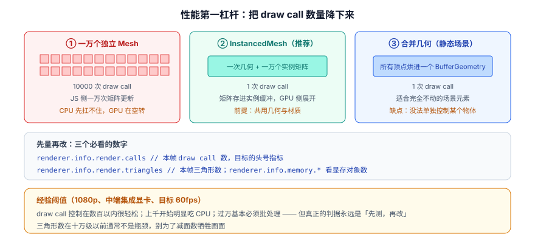
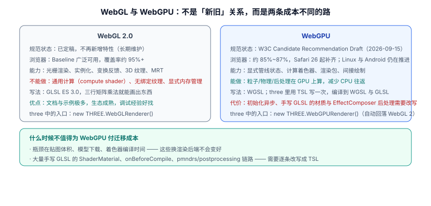

# 性能与 WebGPU 边界

3D 性能优化的第一步不是「改代码」，而是**算出这一帧有多少预算**。没有预算就没有「够不够快」的判据，也就无法判断一次优化到底有没有用。

一句话定位：这一页给出 **度量方法 → 三类瓶颈 → 对应手段 → 该不该迁 WebGPU** 的完整闭环。

## 先建预算：一帧只有十几毫秒

| 目标帧率 | 帧预算 | 实际可用 | 说明 |
| --- | --- | --- | --- |
| 60 fps | 16.7 ms | **约 10~12 ms** | 剩下的要留给浏览器合成、事件处理、你自己的业务逻辑 |
| 120 fps | 8.3 ms | 约 5~6 ms | 高刷屏设备；像素比上限要比 60fps 场景更保守 |
| 30 fps（降级档） | 33.3 ms | 约 20 ms | 低端设备/复杂场景的可接受兜底 |

:::warning 看平均帧率会骗人
平均 60fps 完全可能体验很差：如果每 20 帧卡一次 80ms，平均值仍然接近 60，但用户会明确感觉「一顿一顿」。

**最低要求**：度量时看 **P95 / P99 帧时间**，而不是平均 FPS。P99 超过 33ms 就意味着每秒至少有一次明显卡顿。用 `performance.mark` 把「逻辑更新」与「渲染」分开计时，能立刻区分是 CPU 侧还是 GPU 侧的问题。
:::

## 三个必看的度量入口

```javascript [metrics.js]
// ① 渲染统计：每帧都会重置（renderer.info.autoReset 默认 true）
renderer.setAnimationLoop(() => {
  controls.update();
  renderer.render(scene, camera);

  const { render, memory } = renderer.info;
  stats.calls = render.calls;             // draw call 数 —— 头号指标
  stats.triangles = render.triangles;     // 三角形数
  stats.geometries = memory.geometries;   // 显存中的几何对象数
  stats.textures = memory.textures;       // 显存中的纹理数
});

// ② 帧时间（含分布）
const samples = [];
let last = performance.now();
renderer.setAnimationLoop(() => {
  const now = performance.now();
  const dt = now - last;
  last = now;
  samples.push(dt);
  if (samples.length > 120) samples.shift();

  if (samples.length === 120) {
    const sorted = [...samples].sort((a, b) => a - b);
    const p = (q) => sorted[Math.min(sorted.length - 1, Math.floor(sorted.length * q))];
    console.log(`P50=${p(0.5).toFixed(1)}ms P95=${p(0.95).toFixed(1)}ms P99=${p(0.99).toFixed(1)}ms`);
  }
  // ...渲染
});

// ③ 分段计时：把「逻辑」与「渲染」拆开
const t0 = performance.now();
updateScene();                       // 你自己的业务更新
const t1 = performance.now();
renderer.render(scene, camera);
const t2 = performance.now();
console.log(`update=${(t1 - t0).toFixed(2)}ms render=${(t2 - t1).toFixed(2)}ms`);
```

| 工具 | 看什么 | 什么时候用 |
| --- | --- | --- |
| `renderer.info` | draw call、三角形数、显存对象数 | 每帧都在看，最常用 |
| DevTools Performance | 主线程活动、长任务、GC 尖刺 | 判断是 JS 侧还是渲染侧 |
| DevTools Memory | 堆快照、对象增长趋势 | 排查内存/显存泄漏 |
| Spector.js（浏览器扩展） | 逐 draw call 的状态与着色器 | 渲染结果不对、或怀疑状态切换过多 |

:::tip `renderer.info` 的一个开关值得注意的是
默认每调用一次 `render()` 就重置统计。如果你在一个帧里渲染了多个相机/多个 render target（比如主视图 + 小地图 + 阴影），统计会被覆盖。此时设 `renderer.info.autoReset = false`，并在每帧开头手动 `renderer.info.reset()`，就能拿到这一帧的**累计**数字。
:::

## 三类瓶颈与对应手段

把 [渲染管线](../Overview/index.md) 的开销公式反过来用，优化手段自然浮现。

### 一、CPU 侧：draw call 过多

**判断特征**：帧率随物体数量线性下降；`renderer.info.render.calls` 上千；降低分辨率几乎不改善帧率。



| 手段 | 做法 | 前提 | 适用 |
| --- | --- | --- | --- |
| **`InstancedMesh`** | 一次几何 + 每个实例一个矩阵 | 所有实例**共用几何与材质** | 粒子、柱子、树木、大规模相同物体 —— **首选** |
| **几何合并** | `mergeGeometries` 把多个几何拼成一个 | 静态、材质相同、不需要单独控制 | 建筑、场景装饰 |
| **`BatchedMesh`** | 多几何 + 多变体合批，仍可分别控制 | 材质相同、几何不同 | 「同一材质的不同零件」 |
| **共享材质** | 复用一个 material 实例 | 参数需要一致 | 顺带减少着色器程序数与状态切换 |
| **贴图集（atlas）** | 多张小图拼成一张大图，用 UV 偏移取 | 贴图尺寸相近 | 减少材质数量，从而允许更多合批 |

```javascript [instanced-mesh.js]
// 一万个立方体：一次 draw call
const count = 10000;
const geo = new THREE.BoxGeometry(0.3, 1, 0.3);
const mat = new THREE.MeshStandardMaterial({ roughness: 0.6 });
const inst = new THREE.InstancedMesh(geo, mat, count);
inst.instanceMatrix.setUsage(THREE.DynamicDrawUsage);   // 会频繁更新就声明动态

const dummy = new THREE.Object3D();     // 复用的临时对象，不要每帧 new
const color = new THREE.Color();

for (let i = 0; i < count; i++) {
  const grid = 100;
  dummy.position.set((i % grid) - grid / 2, 0.5, Math.floor(i / grid) - grid / 2);
  dummy.rotation.y = Math.random() * Math.PI;
  dummy.updateMatrix();
  inst.setMatrixAt(i, dummy.matrix);
  inst.setColorAt(i, color.setHSL(i / count, 0.6, 0.55));   // 逐实例颜色
}
inst.instanceMatrix.needsUpdate = true;
inst.instanceColor.needsUpdate = true;
scene.add(inst);

// 之后只改某几个实例
function updateOne(i, data) {
  dummy.position.set(data.x, data.height / 2, data.z);
  dummy.scale.set(1, data.height, 1);
  dummy.updateMatrix();
  inst.setMatrixAt(i, dummy.matrix);
  inst.instanceMatrix.needsUpdate = true;    // 少了这一行，改动不会生效
}
```

:::danger `InstancedMesh` 的四个必知点
1. **`instanceMatrix.needsUpdate = true` 必须设**，否则改了矩阵画面不动。这一条是最高频的「明明改了却没反应」。
2. **射线拾取返回的是 `instanceId`**，不是物体本身。用它去反查你的数据数组（见 [动画与交互](../Animation/index.md)）。
3. **所有实例共用一份几何与材质**。想让某几个实例「长相不同」，只能用逐实例颜色或**顶点属性的变体**，不能换几何。
4. **不适合少数物体**。实例数只有三五个时，直接建 `Mesh` 更简单可读，没有性能差别。
:::

### 二、GPU 侧：填充率不足

**判断特征**：帧率随**分辨率/像素比**明显下降；降低分辨率后立刻变好；GPU 占用打满。

| 手段 | 做法 | 收益 |
| --- | --- | --- |
| **限制像素比** | `renderer.setPixelRatio(Math.min(devicePixelRatio, 2))` | 3 倍屏上可省 55% 像素 |
| **减少 overdraw** | 不透明物体从前到后排序；避免大面积半透明叠加 | 每个被挡住的像素省一次着色 |
| **降低阴影开销** | 减少投影光源数、缩小 shadow camera 范围、降低 `mapSize` | 阴影是「额外渲染一遍场景」 |
| **静态阴影只算一次** | `renderer.shadowMap.autoUpdate = false` | 场景不动时直接免掉 |
| **简化后处理** | 减少 Pass、后处理用半分辨率 | 每个 Pass = 一次全屏绘制 |
| **合适的材质** | 能用 `MeshLambertMaterial` 就不用 `MeshStandardMaterial` | 着色器更短 |
| **mipmap + 各向异性** | 保持 `generateMipmaps: true`，设 `anisotropy` | 远处纹理不闪烁，采样更友好 |

```javascript [static-shadow.js]
// 静态场景：阴影只算一次，省下每帧一次「场景重绘」
renderer.shadowMap.autoUpdate = false;
renderer.shadowMap.needsUpdate = true;      // 需要更新时手动置一次，渲染一帧后自动回落

// 想更省：只在光源或场景真的变了时才更新
function onSceneChanged() {
  renderer.shadowMap.needsUpdate = true;
}
```

### 三、逻辑侧：每帧的 JS 开销

**判断特征**：帧时间尖刺呈**周期性**（GC 暂停），或 `update` 阶段耗时远大于 `render`。

```javascript [avoid-per-frame-alloc.js]
// ✗ 每帧新建对象 —— 制造 GC 压力，表现为周期性卡顿
renderer.setAnimationLoop(() => {
  const dir = new THREE.Vector3(0, 1, 0);       // 每帧 60 次分配
  const box = new THREE.Box3().setFromObject(mesh);
  mesh.position.add(dir.multiplyScalar(0.01));
});

// ✓ 复用模块级实例，只在必要时分配
const _dir = new THREE.Vector3();
const _box = new THREE.Box3();
const _v = new THREE.Vector3();
renderer.setAnimationLoop(() => {
  _v.set(0, 0.01, 0);
  mesh.position.add(_v);
});

// ✓ 静态物体关掉矩阵自动更新（省 CPU，不明显但免费）
staticGroup.traverse((o) => { o.matrixAutoUpdate = false; o.updateMatrix(); });
// 注意：关掉之后如果还要动它，必须自己调用 updateMatrix()
```

## 十项优化清单（按性价比排序）

1. **限制像素比到 2**（一行代码，收益常常最大）。
2. **降低阴影成本**：减少投影光源、缩小阴影相机范围、必要时改静态阴影。
3. **`InstancedMesh` 替换大量相同物体**。
4. **KTX2 / WebP 压缩贴图**，并把 4K 降到 1K/2K。
5. **删除每帧的对象分配**，复用临时对象。
6. **静态物体关掉 `matrixAutoUpdate`**。
7. **合并静态几何**（`mergeGeometries`）。
8. **后处理按需开启**，低端设备直接降级到无后处理。
9. **`LOD`**：远处换低模。
10. **按需渲染**：场景静止且无动画时，跳过 `render()`（配合脏标记）。

```javascript [on-demand-render.js]
// 按需渲染：场景静止且无动画时完全不渲染，省电又省 GPU
let needsRender = true;        // 初始化与 resize 后需要画一帧
let idleFrames = 0;
const IDLE_LIMIT = 120;        // 连续静止多少帧后进入「休眠」

// 任何会改变画面的操作都把 needsRender 置回 true
controls.addEventListener('change', () => { needsRender = true; idleFrames = 0; });
addEventListener('resize', () => { needsRender = true; idleFrames = 0; });

function hasActiveAnimation() {
  // 由业务决定：有正在播放的动作、正在收敛的补间，都算「还在动」
  return mixer && runningActions.length > 0;
}

renderer.setAnimationLoop(() => {
  controls.update();                       // 阻尼收敛本身会产生 change 事件
  if (hasActiveAnimation()) needsRender = true;

  if (needsRender || idleFrames < IDLE_LIMIT) {
    if (needsRender) {
      renderer.render(scene, camera);
      needsRender = false;
      idleFrames = 0;
    } else {
      idleFrames += 1;
    }
  }
  // idleFrames 达到上限后完全不调用 render()，GPU 占用降到接近 0
});
```

:::tip `LOD` 怎么用
```javascript
const lod = new THREE.LOD();
lod.addLevel(highPolyMesh, 0);      // 0~10 个单位距离内用高模
lod.addLevel(midPolyMesh, 10);      // 10~30 用中模
lod.addLevel(lowPolyMesh, 30);      // 30 以外用低模
scene.add(lod);
// 每帧更新（放在 render 之前）
lod.update(camera);
```
关键是**对每个层级都测一遍实际耗时**，确认低模真的省下了时间——有时候低模只是面数少了，但 draw call 一样、材质一样，收益接近于零。
:::

## WebGL 还是 WebGPU：迁移判据



| 判据 | 结论 |
| --- | --- |
| 需要**通用计算**（大规模粒子、GPU 物理、GPU 驱动的剔除） | **WebGPU**。WebGL 完全没有这个能力，无论多努力都做不到 |
| 瓶颈是 draw call / 对象数量（CPU 侧） | WebGPU 有优势（更低的上层开销），但**先把实例化与合批做掉**通常更划算 |
| 瓶颈是**贴图上传、模型体积、着色器编译时间** | **换 WebGPU 不会变好**，问题在资源管线 |
| 有大量手写 GLSL 的 `ShaderMaterial` / `EffectComposer` 后处理 | **迁移成本高**，需要逐条改写成 TSL；不建议为「未来」而重写 |
| 新项目、且预期会用到计算或 GPU 驱动渲染 | **从第一天就用 `three/webgpu` + TSL**，避免事后返工 |

:::warning 一个容易忽略的期望落差
**WebGPU 不一定更快。** 官方论坛上有多起「同一场景 `WebGPURenderer` 比 `WebGLRenderer` 慢」的报告——因为 WebGPU 的初始化（管线创建）开销更大，而小场景的瓶颈可能根本不在渲染后端。

**纪律**：如果你迁移的动机是「性能」，先在**自己的场景上**做一次 A/B 度量，拿到帧时间对比再决定。不要因为「WebGPU 是趋势」就迁移。
:::

## 版本迁移清单（r181 → r186）

如果你正在从旧版本升级，下面这些是真实会改坏代码的点：

| 版本 | 变更 | 处理动作 |
| --- | --- | --- |
| r181 | `renderAsync()` / `computeAsync()` 等 `*Async` 方法弃用 | 改用同步的 `render()` / `compute()`；用 `setAnimationLoop()` 或 `await renderer.init()` 处理初始化 |
| r182 | 渲染器选项 `colorBufferType` 更名为 `outputBufferType` | 改名 |
| r183 | `PostProcessing` 更名为 `RenderPipeline`；`Clock` 弃用 | 改用 `RenderPipeline` 与 `Timer` |
| r183 | `WebGLCubeRenderTarget` 不再适用于 `WebGPURenderer` | 改用 `CubeRenderTarget` |
| r185 | `WebGPURenderer` 的预乘 alpha 行为变化 | 混合结果不对时，给 `scene.background` 或清屏色设不透明值 |
| r185 | `positionNode` 中 `positionLocal` 不再更新蒙皮等内部变换 | 从未变换的 `positionGeometry` 出发 |
| r186 | **`PCFSoftShadowMap` 移除** | 改 `PCFShadowMap`（已自带软阴影） |
| r186 | `Source` → `TextureSource`；`LightProbeGrid` → `LightProbeGridWebGL` | 改名 |
| r186 | `Object3D` 新增 `dispose()`，自定义子类需 `super.dispose()` | 补上 super 调用 |
| r186 | `BufferGeometryUtils` 不再克隆几何体 | 自己处理克隆逻辑 |
| r186 | `SimplifyModifier.modify` 改为异步 | 加 `await` |
| r186 | TSL `viewportResolution` 移除（用 `screenSize`）、`rangeFog` 移除 | 替换 |
| r186 | **压缩构建不再提供** | 交给打包器压缩 |

:::danger 升级纪律：一次跨不超过 10 个 release
three.js 的弃用警告**只保留 10 个 release**，之后直接删除。所以从 r170 一步跨到 r186，你会发现中间那些「先告警、后移除」的过渡期全部错过了——控制台没有任何提示，代码直接坏掉。

正确做法：**每步跨 10 个以内**，每步升完都跑一次构建并肉眼对比光照与阴影，确认没问题再进下一步。
:::

## 易错点

:::danger 性能优化的六个常见误区
1. **凭感觉优化**。没有基线数据就动手，改完也不知道有没有变好、变好多少。「先量，再改，再量」是唯一纪律。
2. **只看平均 FPS**。见本页开头——分布比均值重要得多。
3. **把像素比设成 `devicePixelRatio`**。3 倍屏上多花 9 倍像素成本。
4. **以为三角形数总是瓶颈**。十万级以下通常不是问题；draw call 与填充率往往先出问题。
5. **为了减面数牺牲画质**。把模型从 8 万面减到 1 万面，可能只是省了 2ms，却让画面明显变糙——**先确认瓶颈在哪一侧再动手**。
6. **每帧 new 对象**。这是「周期性卡顿」最常见的元凶，而看平均 FPS 时完全看不出来。
:::

## 参考资料

1. three.js 手册 · 如何优化性能：<https://threejs.org/manual/#en/optimize-lots-of-objects>
2. three.js 文档 · `InstancedMesh`：<https://threejs.org/docs/#api/en/objects/InstancedMesh>
3. three.js 文档 · `BatchedMesh`：<https://threejs.org/docs/#api/en/objects/BatchedMesh>
4. three.js 文档 · `renderer.info`：<https://threejs.org/docs/#api/en/renderers/WebGLRenderer.info>
5. three.js 迁移指南（跨版本变更）：<https://github.com/mrdoob/three.js/wiki/Migration-Guide>
6. web.dev · 使用 requestAnimationFrame 做出流畅动画：<https://web.dev/articles/animations-guide>
