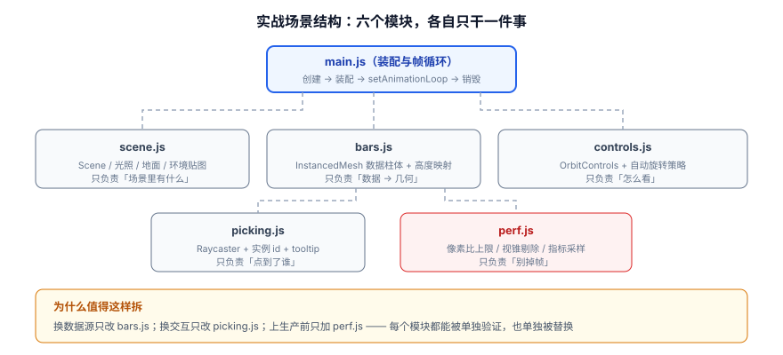

# 实战：可运行的数据可视化场景

把前面八页的内容串成一个能跑的完整场景：**机房设备状态 3D 看板**。它不大，但覆盖了真实项目里必然遇到的全部环节——数据驱动几何、实例化渲染、交互拾取、性能守卫、资源释放。

一句话定位：这一页是**交付物**。跟着做完，你会得到一个能本地跑起来、能被验证、能被改造的 3D 场景。

## 需求与验收标准

**需求**：用一个 3D 场景展示 400 台设备的状态。每台设备是一根柱体，柱高代表负载，颜色代表健康状态；鼠标悬停显示设备名与数值；支持轨道旋转缩放。

**验收标准（十项，全部可观察）**：

| # | 断言 | 判据 |
| --- | --- | --- |
| 1 | 页面能打开且无报错 | 控制台除自定义日志外无输出 |
| 2 | 400 根柱体全部渲染 | `renderer.info.render.calls` ≤ 20 |
| 3 | 柱高与数据对应 | 修改某条数据后，对应柱体高度随之变化 |
| 4 | 颜色区分状态 | 正常/告警/故障三色可辨 |
| 5 | 默认视角合适 | 首次打开能看到完整布局，无需手动调整 |
| 6 | 悬停有反馈 | 光标变手型，柱体抬起并显示标签 |
| 7 | 点击进入详情 | 控制台打印该设备数据 |
| 8 | 窗口缩放不变形 | 拖到任意宽高比，柱体不变形 |
| 9 | 静态时省电 | 相机静止且无数据更新时，帧循环停止渲染 |
| 10 | 可回收 | 提供 `teardown()`，调用后 `memory.geometries` 回落到基线 |

## 工程初始化

```shell [初始化]
pnpm create vite device-dashboard --template vanilla
cd device-dashboard
pnpm add three
pnpm add -D @types/three
pnpm dev
```

## 目录结构与模块划分



```text
device-dashboard/
├─ index.html
├─ src/
│  ├─ main.js        # 装配与帧循环：唯一持有 renderer / scene / camera 的地方
│  ├─ scene.js       # 场景内容：灯光、地面、环境贴图
│  ├─ bars.js        # 数据 → InstancedMesh 柱体
│  ├─ picking.js     # 射线拾取 + 悬停/点击
│  ├─ controls.js    # 相机与轨道控制
│  ├─ data.js        # 模拟数据源（真实项目里换成 WebSocket / API）
│  └─ perf.js        # 像素比、按需渲染、指标采样
└─ package.json
```

**为什么这样拆**：换数据源只动 `data.js`；把柱体换成热力块只动 `bars.js`；上生产前只调 `perf.js`。**每个模块都能被单独验证**，这是 3D 项目保持可维护的关键。

## 第 1 步：场景内容（`src/scene.js`）

```javascript [src/scene.js]
import * as THREE from 'three';
import { RoomEnvironment } from 'three/addons/environments/RoomEnvironment.js';

export function createScene(renderer) {
  const scene = new THREE.Scene();
  scene.background = new THREE.Color(0x0b1220);
  scene.fog = new THREE.Fog(0x0b1220, 30, 90);   // 远处淡出，掩盖布局边界

  // 环境贴图：让金属/粗糙材质有反射，画面立刻「有质感」
  const pmrem = new THREE.PMREMGenerator(renderer);
  scene.environment = pmrem.fromScene(new RoomEnvironment(), 0.04).texture;
  pmrem.dispose();                                 // 生成完就释放，别一直占着

  // 主光：平行光 + 阴影（阴影相机必须圈住整个布局）
  const sun = new THREE.DirectionalLight(0xffffff, 2.2);
  sun.position.set(14, 20, 12);
  sun.castShadow = true;
  sun.shadow.mapSize.set(1024, 1024);              // 看板场景 1024 足够
  const d = 16;
  Object.assign(sun.shadow.camera, {
    left: -d, right: d, top: d, bottom: -d, near: 1, far: 60,
  });
  sun.shadow.bias = -0.0008;
  scene.add(sun);

  scene.add(new THREE.HemisphereLight(0x93c5fd, 0x0f172a, 1.4));

  // 地面：只负责接影，所以用不受光的深色 + 低粗糙度让它像抛光地面
  const ground = new THREE.Mesh(
    new THREE.PlaneGeometry(60, 60),
    new THREE.MeshStandardMaterial({ color: 0x1e293b, roughness: 0.85, metalness: 0.1 })
  );
  ground.rotation.x = -Math.PI / 2;
  ground.receiveShadow = true;
  scene.add(ground);

  return { scene, sun, ground };
}
```

**本步验证**：先只加一个临时立方体，确认背景、地面、光照都正常（能看到地面上的投影），再去写数据层。**一次只让一个变量变化**，是 3D 开发里最省钱的习惯。

## 第 2 步：数据驱动的柱体（`src/data.js` + `src/bars.js`）

```javascript [src/data.js]
// 模拟 400 台设备；真实项目里换成 fetch 或 WebSocket
export function generateDevices(count = 400) {
  const grid = Math.ceil(Math.sqrt(count));
  const list = [];
  for (let i = 0; i < count; i++) {
    const r = Math.random();
    list.push({
      id: `server-${String(i + 1).padStart(4, '0')}`,
      rack: `A${String(Math.floor(i / 20) + 1).padStart(2, '0')}`,
      // 负载 0~1，柱高 = 1 + load * 4（保证最矮也有可见高度）
      load: Math.min(1, Math.max(0.02, 0.15 + Math.random() * 0.85)),
      // 状态决定颜色：正常 / 告警 / 故障
      status: r > 0.94 ? 'error' : r > 0.78 ? 'warn' : 'ok',
      x: (i % grid) - grid / 2,
      z: Math.floor(i / grid) - grid / 2,
    });
  }
  return list;
}

export const STATUS_COLOR = {
  ok: new THREE.Color(0x22c55e),
  warn: new THREE.Color(0xf59e0b),
  error: new THREE.Color(0xef4444),
};
```

```javascript [src/bars.js]
import * as THREE from 'three';
import { STATUS_COLOR } from './data.js';

const BAR_WIDTH = 0.5;
const MAX_HEIGHT = 5;

export function createBars(devices) {
  // 一次几何 + 一次材质 + 一次 draw call 画完 400 根柱体
  const geometry = new THREE.BoxGeometry(BAR_WIDTH, 1, BAR_WIDTH);
  geometry.translate(0, 0.5, 0);   // 把原点挪到柱体底部，方便用 scale.y 当高度
  const material = new THREE.MeshStandardMaterial({ roughness: 0.42, metalness: 0.25 });

  const mesh = new THREE.InstancedMesh(geometry, material, devices.length);
  mesh.instanceMatrix.setUsage(THREE.DynamicDrawUsage);
  mesh.castShadow = true;
  mesh.receiveShadow = true;

  const dummy = new THREE.Object3D();     // 复用，别每帧 new
  const color = new THREE.Color();
  let hovered = -1;                        // 当前悬停的实例序号，-1 表示没有

  function apply(i, dev) {
    const h = 1 + dev.load * MAX_HEIGHT;
    const lift = i === hovered ? 1.12 : 1; // 悬停时整体放大 12%
    dummy.position.set(dev.x, 0, dev.z);
    dummy.scale.set(lift, h * lift, lift);
    dummy.updateMatrix();
    mesh.setMatrixAt(i, dummy.matrix);
    color.copy(STATUS_COLOR[dev.status]);
    if (i === hovered) color.lerp(new THREE.Color(0xffffff), 0.35);  // 提亮
    mesh.setColorAt(i, color);
    dev._height = h;
  }

  function flush() {
    mesh.instanceMatrix.needsUpdate = true;
    mesh.instanceColor.needsUpdate = true;
  }

  devices.forEach((dev, i) => apply(i, dev));
  flush();

  // 对外只暴露「按数据更新」与「设置悬停」两件事，内部细节不外泄
  function updateAt(i, patch) {
    const dev = devices[i];
    Object.assign(dev, patch);
    apply(i, dev);
    flush();
  }

  // 悬停变化时只重算「旧的那个」与「新的那个」，不遍历全部
  function setHovered(next) {
    const prev = hovered;
    if (prev === next) return;
    hovered = next;
    if (prev >= 0) apply(prev, devices[prev]);
    if (next >= 0) apply(next, devices[next]);
    flush();
  }

  function dispose() {
    geometry.dispose();
    material.dispose();
  }

  return { mesh, updateAt, setHovered, dispose };
}
```

:::danger 两个「改了没反应」的元凶
1. **忘了 `instanceMatrix.needsUpdate = true`**。`setMatrixAt()` 只是写了 CPU 侧的数组，不上传 GPU 就不生效。
2. **几何原点不在底部**。`BoxGeometry` 的原点在几何中心，直接 `scale.y = h` 会让柱体**上下同时伸缩**（一半沉到地面下）。正确做法是 `geometry.translate(0, 0.5, 0)` 把原点移到柱底，之后 `scale.y = h` 就是「高度」。
:::

## 第 3 步：交互拾取（`src/picking.js`）

```javascript [src/picking.js]
import * as THREE from 'three';

export function createPicking({ renderer, camera, target, devices, onHover, onClick }) {
  const raycaster = new THREE.Raycaster();
  const pointer = new THREE.Vector2();
  let hoveredId = -1;

  function pick(event) {
    const rect = renderer.domElement.getBoundingClientRect();
    // ① 相对画布的坐标 → ② NDC（y 必须取反）→ ③ 生成射线
    pointer.x = ((event.clientX - rect.left) / rect.width) * 2 - 1;
    pointer.y = -((event.clientY - rect.top) / rect.height) * 2 + 1;
    raycaster.setFromCamera(pointer, camera);
    const hit = raycaster.intersectObject(target, false)[0];
    return hit?.instanceId ?? -1;      // InstancedMesh 返回实例序号
  }

  function onMove(event) {
    const id = pick(event);
    if (id === hoveredId) return;
    hoveredId = id;
    renderer.domElement.style.cursor = id >= 0 ? 'pointer' : 'default';
    onHover(id >= 0 ? { index: id, device: devices[id] } : null);
  }

  function onDown(event) {
    const id = pick(event);
    if (id >= 0) onClick({ index: id, device: devices[id] });
  }

  renderer.domElement.addEventListener('pointermove', onMove);
  renderer.domElement.addEventListener('pointerdown', onDown);

  return {
    dispose() {
      renderer.domElement.removeEventListener('pointermove', onMove);
      renderer.domElement.removeEventListener('pointerdown', onDown);
      renderer.domElement.style.cursor = 'default';
    },
  };
}
```

## 第 4 步：相机与控制器（`src/controls.js`）

```javascript [src/controls.js]
import * as THREE from 'three';
import { OrbitControls } from 'three/addons/controls/OrbitControls.js';

export function createCameraAndControls(renderer, aspect) {
  const camera = new THREE.PerspectiveCamera(45, aspect, 0.1, 300);
  camera.position.set(22, 17, 22);        // 45° 俯视，刚好装下 20×20 的布局
  camera.lookAt(0, 0, 0);

  const controls = new OrbitControls(camera, renderer.domElement);
  controls.target.set(0, 1.5, 0);
  controls.enableDamping = true;
  controls.dampingFactor = 0.06;
  controls.minDistance = 8;
  controls.maxDistance = 60;
  controls.maxPolarAngle = Math.PI / 2.1;  // 不允许钻到地面以下
  controls.autoRotate = false;             // 看板默认不转，避免用户读不清数据
  controls.update();

  return { camera, controls };
}
```

## 第 5 步：性能守卫（`src/perf.js`）

```javascript [src/perf.js]
import * as THREE from 'three';

export function createPerf(renderer) {
  // ① 像素比上限：这是收益最大的一行
  renderer.setPixelRatio(Math.min(window.devicePixelRatio, 2));
  renderer.shadowMap.enabled = true;
  renderer.shadowMap.type = THREE.PCFShadowMap;      // r186 起不要用 PCFSoftShadowMap
  renderer.toneMapping = THREE.ACESFilmicToneMapping;
  renderer.toneMappingExposure = 1.05;

  // ② 按需渲染：静态且无数据更新时完全不画
  let dirty = true;
  let idle = 0;
  const IDLE_LIMIT = 90;

  const stats = { calls: 0, triangles: 0, frameMs: 0, idle: false };
  const markDirty = () => { dirty = true; idle = 0; stats.idle = false; };

  function beginFrame() {
    // ③ 指标采样：每次渲染后读一次，用于验收与回归
    const { render } = renderer.info;
    stats.calls = render.calls;
    stats.triangles = render.triangles;
  }

  function shouldRender() {
    return dirty || idle < IDLE_LIMIT;
  }

  function afterRender() {
    if (dirty) { dirty = false; idle = 0; } else { idle += 1; }
    if (idle >= IDLE_LIMIT) stats.idle = true;
  }

  function report() {
    console.table({
      'draw calls': stats.calls,
      'triangles': stats.triangles,
      '帧时间(ms)': Number(stats.frameMs.toFixed(2)),
      '空闲停渲': stats.idle,
    });
  }

  return { markDirty, beginFrame, shouldRender, afterRender, report, stats };
}
```

## 第 6 步：装配（`src/main.js`）

```javascript [src/main.js]
import * as THREE from 'three';
import { createScene } from './scene.js';
import { generateDevices } from './data.js';
import { createBars } from './bars.js';
import { createPicking } from './picking.js';
import { createCameraAndControls } from './controls.js';
import { createPerf } from './perf.js';

// ---------- 渲染器 ----------
const renderer = new THREE.WebGLRenderer({ antialias: true });
const perf = createPerf(renderer);
renderer.setSize(innerWidth, innerHeight);
document.body.appendChild(renderer.domElement);

// ---------- 场景 / 相机 / 数据 ----------
const { scene } = createScene(renderer);
const { camera, controls } = createCameraAndControls(renderer, innerWidth / innerHeight);
const devices = generateDevices(400);
const bars = createBars(devices);
scene.add(bars.mesh);

// ---------- 悬停提示（用真实的 DOM，排版最省心） ----------
const tip = document.createElement('div');
Object.assign(tip.style, {
  position: 'fixed', pointerEvents: 'none', padding: '6px 10px',
  background: 'rgba(15,23,42,.92)', color: '#e2e8f0', fontSize: '12px',
  borderRadius: '6px', display: 'none', whiteSpace: 'nowrap', zIndex: '10',
});
document.body.appendChild(tip);

let hoveredIndex = -1;
const picking = createPicking({
  renderer, camera, target: bars.mesh, devices,
  onHover(info) {
    hoveredIndex = info ? info.index : -1;
    bars.setHovered(hoveredIndex);        // 悬停效果交给数据层处理
    if (info) {
      tip.style.display = 'block';
      tip.textContent = `${info.device.id} · 机柜 ${info.device.rack} · 负载 ${(info.device.load * 100).toFixed(1)}% · ${info.device.status}`;
    } else {
      tip.style.display = 'none';
    }
    perf.markDirty();
  },
  onClick({ device }) {
    console.log('点击设备：', device);
  },
});

renderer.domElement.addEventListener('pointermove', (e) => {
  if (tip.style.display === 'block') {
    tip.style.left = `${e.clientX + 14}px`;
    tip.style.top = `${e.clientY + 14}px`;
  }
});

// ---------- 帧循环 ----------
// 注意：事件监听只在初始化阶段挂一次，绝不能写在帧循环里（否则每帧新增一个监听器）
controls.addEventListener('change', () => perf.markDirty());

const timer = new THREE.Timer();
let last = performance.now();

renderer.setAnimationLoop(() => {
  const now = performance.now();
  perf.stats.frameMs = now - last;
  last = now;

  controls.update();          // 阻尼收敛会触发 change 事件，进而 markDirty

  if (!perf.shouldRender()) return;   // 空闲时直接返回，一次 render 都不调

  renderer.render(scene, camera);
  perf.beginFrame();
  perf.afterRender();
});

// ---------- 窗口自适应 ----------
addEventListener('resize', () => {
  camera.aspect = innerWidth / innerHeight;
  camera.updateProjectionMatrix();
  renderer.setSize(innerWidth, innerHeight);
  perf.markDirty();
});

// ---------- 模拟数据推送：每 2 秒随机更新 5 台设备 ----------
const dataTimer = setInterval(() => {
  for (let k = 0; k < 5; k++) {
    const i = Math.floor(Math.random() * devices.length);
    bars.updateAt(i, {
      load: Math.min(1, Math.max(0.02, devices[i].load + (Math.random() - 0.5) * 0.3)),
      status: Math.random() > 0.97 ? 'error' : Math.random() > 0.85 ? 'warn' : 'ok',
    });
  }
  perf.markDirty();
}, 2000);

// ---------- 清理（验收第 10 项） ----------
export function teardown() {
  clearInterval(dataTimer);
  renderer.setAnimationLoop(null);
  picking.dispose();
  controls.dispose();
  bars.dispose();
  scene.traverse((o) => {
    if (o.isMesh && o !== bars.mesh) {
      o.geometry?.dispose();
      const mats = Array.isArray(o.material) ? o.material : [o.material];
      mats.filter(Boolean).forEach((m) => {
        Object.values(m).forEach((v) => { if (v && v.isTexture) v.dispose(); });
        m.dispose();
      });
    }
  });
  renderer.dispose();
  console.log('清理完成：', renderer.info.memory);
}
```

:::tip 悬停效果为什么放在 `bars.js` 而不是 `main.js`
`InstancedMesh` 的矩阵只能通过 `setMatrixAt()` 写、`getMatrixAt()` 读。如果把它交给帧循环去「读一个、改一个、写回去」，就会带来两个问题：**每帧都要读写矩阵缓冲**（CPU 开销），以及**状态不一致**（数据更新与悬停更新互相覆盖）。

正确做法是把「哪个实例被悬停」当成**数据层的一个状态**，交给 `bars.setHovered()` 维护。它只在悬停**发生变化**时重算两个实例（旧的还原、新的抬起）并上传一次缓冲——成本与实例总数无关，400 个和 4 万个都一样快。
:::

## 验收清单

按十项断言逐条验证：

| # | 操作 | 预期结果 |
| --- | --- | --- |
| 1 | `pnpm dev` 后打开页面 | 深色背景下出现一片绿色为主、夹杂黄/红的柱状阵列，控制台无报错 |
| 2 | 控制台执行 `__perf.report()`（或直接读 `renderer.info.render.calls`） | **≤ 20**（400 根柱体只花了 1 次 draw call，其余是地面与阴影） |
| 3 | 控制台执行 `bars.updateAt(0, { load: 1 })` | 第 0 根柱体立刻变到最高 |
| 4 | 观察画面 | 绿（正常）、黄（告警）、红（故障）三色可辨 |
| 5 | 首次打开 | 不需要拖动就能看到完整阵列，四周留有余量 |
| 6 | 鼠标移到柱体上 | 光标变手型，左上角浮出黑色提示框显示设备 ID、机柜、负载与状态 |
| 7 | 点击柱体 | 控制台打印完整设备对象 |
| 8 | 把窗口拖成很窄的竖条 | 柱体不变形（只改变可见范围） |
| 9 | 等 10 秒不做任何操作、且数据推送停止 | `perf.stats.idle === true`，GPU 占用接近 0 |
| 10 | 控制台执行 `teardown()` | 打印 `memory.geometries` 与 `textures` 数量显著回落 |

:::tip 第 9 项与第 10 项才是这个实战真正的价值
大部分教程到「画面出来了」就结束。但**能停、能收**才是生产可用的标志：

- 看板页面经常被长时间挂在大屏上，**空闲不渲染**能显著降低设备功耗与发热；
- 单页应用里反复进出这个页面，**不 `dispose` 就会稳定泄漏显存**，几小时后崩溃。

这两项也最容易在验收时被跳过——**别跳**。
:::

## 可以继续做的三件事

1. **换成真实数据**：`data.js` 换成 WebSocket 订阅，注意**批量更新 + 每帧只置一次 `needsUpdate`**，避免每来一条消息就上传一次缓冲。
2. **加一个 2D 图层**：用 `CSS2DRenderer` 给告警设备挂常驻标签（比 tooltip 更适合大屏）。
3. **引入真实设备模型**：用 [模型与资源管线](../AssetPipeline/index.md) 的方法加载 glTF，把「柱体」换成「机柜模型 + `InstancedMesh`」。注意实例化要求**共用几何与材质**，所以机柜要能共用。

## 参考资料

1. three.js 官方示例 · 实例化：<https://threejs.org/examples/#webgl_instancing_performance>
2. three.js 官方示例 · 交互拾取：<https://threejs.org/examples/#webgl_interactive_cubes>
3. three.js 手册 · 优化大量对象：<https://threejs.org/manual/#en/optimize-lots-of-objects>
4. 本库 [数据可视化 · 数据大屏工程](../../DataVisualization/Dashboard/index.md)（2D 大屏的工程要点，与 3D 看板互补）
5. 本库 [数据可视化 · 实战：实时监控大屏](../../DataVisualization/Practice/index.md)（同一业务场景的 2D 实现，可对比取舍）
