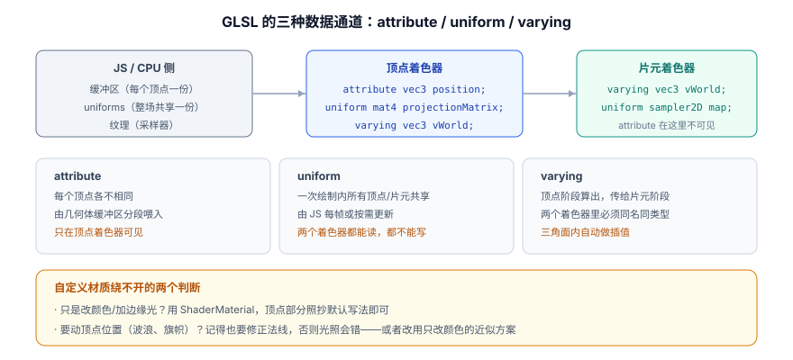

# 着色器与自定义材质

内置材质能覆盖 80% 的需求。剩下 20%——扫光、描边、溶解、波浪、自定义光照模型——只能自己写着色器。

一句话定位：这一页讲 **什么时候该写着色器、怎么写最不容易出错、以及手写 GLSL 与 TSL 该怎么选**。

## 什么时候真的需要自定义着色器

先劝退一轮。下面这些情况**不需要**写着色器：

| 需求 | 更省事的做法 |
| --- | --- |
| 换颜色、调粗糙度/金属度 | `MeshStandardMaterial` 的参数 |
| 贴图 | `map` / `normalMap` / `roughnessMap` 等槽位 |
| 发光 | `emissive` + `emissiveMap` |
| 简单的菲涅尔边缘光 | `MeshPhysicalMaterial` 的 `sheen` / `clearcoat`，或 `onBeforeCompile` 小改 |
| 透明度控制 | `transparent` + `opacity` + alpha 贴图 |
| 顶点微微起伏 | 先考虑用骨骼动画或位移贴图 `displacementMap` |

真正需要手写的典型场景：

- **屏幕上没有对应材质模型的效果**：扫光条、能量护盾、全息投影、溶解消散、水波、热浪。
- **顶点级几何变换**：旗帜飘动、草地摆动、GPU 粒子。
- **自定义光照**：非物理的风格化渲染（卡通分级、像素化光照）。
- **数据驱动的逐顶点/逐片元计算**：把业务数据编码进顶点属性直接算颜色。

:::tip 先试 `onBeforeCompile`
如果只是想在内置材质上「插一小段代码」（比如在标准 PBR 结果上加一层扫描线），`material.onBeforeCompile = (shader) => { ... }` 能复用全部 PBR 逻辑，只替换/追加几行——**比从零写 ShaderMaterial 少写两百行**。代价是它依赖 three.js 内部 shader chunk 的名字（如 `#include <dithering_fragment>`），**跨版本升级可能失效**，需要跟着升级回归。
:::

## GLSL 速成：只需要记住这些

GLSL 是类 C 语言，跑在 GPU 上。它有严格类型、没有隐式转换、没有动态内存。

```glsl [glsl-cheatsheet.glsl]
// ---------- 类型 ----------
float f = 1.0;              // 注意：必须写 1.0，写 1 是 int，会编译报错
int i = 1;
bool b = true;
vec2 v2 = vec2(1.0, 2.0);
vec3 v3 = vec3(0.5);        // 三个分量都是 0.5
vec4 v4 = vec4(v3, 1.0);    // 用 vec3 拼 vec4 很常见
mat3 m3;
mat4 m4;
sampler2D tex;              // 纹理采样器，只能声明为 uniform

// ---------- 分量访问（swizzle）----------
vec3 c = v4.rgb;            // 取前三
vec3 c2 = v4.xyz;           // 同上（rgba 是颜色的别名）
vec2 xy = v4.xy;
vec4 rev = v4.wzyx;         // 任意重排

// ---------- 内建函数（都在性能敏感路径上，放心用）----------
float a = dot(normal, lightDir);          // 点积：光照的基础
vec3  r = reflect(incident, normal);       // 反射
vec3  rr = refract(incident, normal, 1.5); // 折射
float l = length(v3);                      // 长度
vec3  n = normalize(v3);                   // 归一化
float x = mix(0.0, 1.0, t);                // 线性插值（等价 lerp）
float s = smoothstep(0.0, 1.0, t);         // 平滑过渡
float cl = clamp(x, 0.0, 1.0);             // 钳制
float p = pow(x, 2.2);                     // 幂
vec3  d = texture2D(tex, uv).rgb;          // 采样纹理（WebGL2 里也叫 texture()）
```

:::danger GLSL 与 JavaScript 的四个差异，每个都让人编译报错
1. **`1` 和 `1.0` 是不同类型**，`float x = 1;` 直接编译失败。所有浮点字面量都要带小数点。
2. **循环次数必须是编译期常量**（WebGL 1 的硬限制）：`for (int i = 0; i < 10; i++)` 可以，`for (int i = 0; i < n; i++)`（`n` 是 uniform）不行。WebGL 2 放宽了，但为兼容性仍建议写成常量上限 + `break`。
3. **没有 `console.log`**。调试只能靠「把值当颜色输出」：`gl_FragColor = vec4(变量, 0.0, 0.0, 1.0);` 然后看红色通道，这是唯一的 printf。
4. **`if` 分支代价高**。GPU 是 SIMD 架构，一个 warp 内的分支会**两条路都走**（预测执行），所以片元着色器里的复杂分支会显著拖慢。能用 `mix` / `step` / `smoothstep` 表达的，不要用 `if`。
:::

## 三种数据通道与 three.js 的自动注入



用 `ShaderMaterial` 时，three.js 会在你的代码前面**自动拼上一大段内置声明**，所以下面这些可以直接用、不用自己写：

| 类别 | 名字 | 说明 |
| --- | --- | --- |
| 内建 attribute | `position` / `normal` / `uv` | 来自几何体 |
| 内建 uniform | `projectionMatrix` / `modelViewMatrix` / `viewMatrix` / `modelMatrix` | 四个变换矩阵 |
| | `normalMatrix` | 法线的变换矩阵（已处理非等比缩放） |
| | `cameraPosition` | 相机世界坐标，做视角相关效果必备 |
| | `isOrthographic` | 是否正交相机 |

```javascript [shader-material.js]
const material = new THREE.ShaderMaterial({
  uniforms: {
    uTime: { value: 0 },
    uColorA: { value: new THREE.Color(0x2563eb) },
    uColorB: { value: new THREE.Color(0x0d9488) },
    uIntensity: { value: 1.0 },
  },
  vertexShader: `
    varying vec3 vNormal;
    varying vec3 vViewDir;
    void main() {
      vNormal = normalize(normalMatrix * normal);
      // 从顶点指向相机的方向（观察空间）
      vec4 mvPos = modelViewMatrix * vec4(position, 1.0);
      vViewDir = normalize(-mvPos.xyz);
      gl_Position = projectionMatrix * mvPos;
    }
  `,
  fragmentShader: `
    precision highp float;
    uniform float uTime;
    uniform vec3 uColorA;
    uniform vec3 uColorB;
    uniform float uIntensity;
    varying vec3 vNormal;
    varying vec3 vViewDir;
    void main() {
      // 菲涅尔：视线越贴近表面，权重越高 —— 做边缘光/护盾的标准做法
      float fres = pow(1.0 - clamp(dot(vNormal, vViewDir), 0.0, 1.0), 2.5);
      // 沿 Y 轴流动的条纹
      float stripe = 0.5 + 0.5 * sin(vNormal.y * 40.0 - uTime * 3.0);
      vec3 color = mix(uColorA, uColorB, stripe) * (0.25 + fres * 1.75) * uIntensity;
      gl_FragColor = vec4(color, 1.0);
    }
  `,
  // 不需要光照相关注入，省一点编译开销与体积
});
```

写完之后，别忘了在帧循环里推动时间：

```javascript [drive-uniforms.js]
renderer.setAnimationLoop(() => {
  timer.update();
  material.uniforms.uTime.value = timer.getElapsed();   // 用「累计秒数」而不是 delta
  renderer.render(scene, camera);
});
```

## 顶点位移：让几何动起来

顶点着色器改 `gl_Position` 就是实时改几何——这是 CPU 侧无法企及的能力。

```javascript [wave-vertex.glsl]
// 波浪：按 XZ 位置 + 时间扰动 Y，做出水面/旗帜效果
uniform float uTime;
uniform float uAmplitude;

varying vec3 vNormal;
varying float vWave;

void main() {
  vec3 pos = position;

  // 两个不同频率的正弦叠加，避免规整的「搓板」感
  float w1 = sin(pos.x * 1.6 + uTime * 1.2) * 0.5;
  float w2 = sin(pos.z * 2.3 - uTime * 0.9) * 0.3;
  float wave = (w1 + w2) * uAmplitude;

  pos.y += wave;
  vWave = wave;

  // 用有限差分近似新的法线：采样相邻两点的斜率，再叉乘
  float eps = 0.1;
  float hx = (sin((pos.x + eps) * 1.6 + uTime * 1.2) * 0.5 + w2) * uAmplitude;
  float hz = (w1 + sin((pos.z + eps) * 2.3 - uTime * 0.9) * 0.3) * uAmplitude;
  vec3 tx = vec3(eps, hx - wave, 0.0);
  vec3 tz = vec3(0.0, hz - wave, eps);
  vNormal = normalize(normalMatrix * normalize(cross(tz, tx)));

  gl_Position = projectionMatrix * modelViewMatrix * vec4(pos, 1.0);
}
```

:::danger 顶点位移必须同时修法线
只改 `pos.y` 而不重算法线，水面会变成一块**光照完全不对的塑料板**——所有像素的法线都指向原来的方向，看起来又平又假。

正确做法有两种：① 如上面那样用**有限差分**在着色器里重算法线（精度够、成本低）；② 在 CPU 侧预先烘焙好法线贴图配合使用。**没有第三种。**
:::

## `ShaderMaterial` 与 `RawShaderMaterial`

| 对比项 | `ShaderMaterial` | `RawShaderMaterial` |
| --- | --- | --- |
| 是否自动注入内建声明 | **是** | 否，全部自己写 |
| 能否直接用 `projectionMatrix` 等 | 能 | 需自己 `uniform mat4 projectionMatrix;` |
| 与 three.js 特性的集成 | 支持灯光、雾、蒙皮等 `#include` 注入 | 完全隔离 |
| 适用场景 | 90% 的自定义材质 | 移植现成 GLSL、需要完全控制源码 |
| 出错时的调试 | 报错行号会被注入代码「污染」，需要减去偏移 | 行号与你写的完全一致 |

:::tip 什么时候才该用 `RawShaderMaterial`
只有两种：① 你在移植一段**现成的、完整的** GLSL（如 Shadertoy 上的作品），它自己声明了所有 uniform；② 你要精确控制第一行（比如自己写 `#version 300 es`）。其余情况都用 `ShaderMaterial`——白白丢掉 three.js 注入的矩阵与灯光，是纯粹的负收益。
:::

## GLSL 还是 TSL：2026 年的选择

这是本页最需要「面向未来」做决定的地方。

| 对比项 | 手写 GLSL（`ShaderMaterial`） | TSL（`three/tsl`） |
| --- | --- | --- |
| 写在哪 | 字符串形式的 GLSL 源码 | JavaScript 函数式节点图 |
| 编译目标 | 只编译到 GLSL（WebGL 用） | **一次编写，编译到 WGSL 与 GLSL** |
| WebGLRenderer | 完全支持 | 支持（走 WebGL 后端） |
| WebGPURenderer | **原生路径不支持**，只能强制回落 WebGL 2 后端 | **原生支持** |
| 现有资料量 | 极多（十年的教程与示例） | 较少，但官方示例已全面 TSL 化 |
| 迁移成本 | —— | 每一段手写 GLSL 都要改写成 `Fn()` 节点语法，**没有 shim** |

:::warning 选型判据：你的项目会不会用到 WebGPU 的能力
- **只做常规 3D（模型展示、看板、交互）**：继续用 `ShaderMaterial`。生态成熟、资料多，而且 WebGPURenderer 会自动回落到 WebGL 2 运行你的 GLSL 材质（代价是「浏览器支持 WebGPU，但你没用上」）。
- **需要计算着色器（大规模粒子、GPU 物理、后处理链）**：**从第一天就用 TSL**。手写 GLSL 在 WebGPU 原生路径下无法运行，事后改写的成本远高于一开始就写对。
- **已经有一大堆 GLSL 的在跑项目**：不要为了「未来」而重写。等真有了非 WebGPU 不可的需求再逐个模块迁移，优先迁新增功能。

**r186 的两个提醒**：TSL 的 `rangeFog` 与 `viewportResolution` 已被移除（后者改用 `screenSize`）；r185 起，在 `positionNode` 里 `positionLocal` 不再更新蒙皮等内部变换，需要从未变换的 `positionGeometry` 出发。
:::

## 后处理：两种路线不要混用

后处理（辉光、景深、描边、色彩分级）是在「场景渲染完的那张图」上再加工。

| 路线 | 入口 | 适合 | 关键点 |
| --- | --- | --- | --- |
| **WebGL 路线** | `three/addons/postprocessing/` 下的 `EffectComposer` + `RenderPass` + 各种 Pass | 现有项目、大量现成 Pass | 通常最后一个 Pass 要用 `OutputPass` 来收口色彩空间与色调映射 |
| **WebGPU 路线** | `RenderPipeline`（r183 起由 `PostProcessing` 更名） | 新项目的 WebGPU 原生路径 | 节点式，能自动合并多个效果减少渲染遍数 |

```javascript [postprocessing-webgl.js]
import { EffectComposer } from 'three/addons/postprocessing/EffectComposer.js';
import { RenderPass } from 'three/addons/postprocessing/RenderPass.js';
import { UnrealBloomPass } from 'three/addons/postprocessing/UnrealBloomPass.js';
import { OutputPass } from 'three/addons/postprocessing/OutputPass.js';

const composer = new EffectComposer(renderer);
composer.addPass(new RenderPass(scene, camera));
composer.addPass(new UnrealBloomPass(new THREE.Vector2(innerWidth, innerHeight), 0.6, 0.4, 0.85));
composer.addPass(new OutputPass());     // 放在最后，负责色彩空间与色调映射

// 帧循环里用 composer.render() 代替 renderer.render()
renderer.setAnimationLoop(() => {
  timer.update();
  material.uniforms.uTime.value = timer.getElapsed();
  composer.render();
});

// 窗口缩放时后处理链也要跟着改尺寸
addEventListener('resize', () => {
  camera.aspect = innerWidth / innerHeight;
  camera.updateProjectionMatrix();
  renderer.setSize(innerWidth, innerHeight);
  composer.setSize(innerWidth, innerHeight);
});
```

:::danger 后处理是性能的重灾区
每个 Pass 都是**一趟全屏绘制**：1920×1080 下一个 Pass 就要为 200 万像素跑一遍着色器。链条上挂 4 个 Pass，等于把像素成本翻了 4 倍。

三条纪律：① **默认别开后处理**，需要时才加；② 每个 Pass 都要问「它在低配机器上值多少帧」，必要时按设备能力降级（低端机直接走 `renderer.render()`）；③ `EffectComposer` 的渲染目标尺寸**不要用满分辨率**（半分辨率做辉光通常看不出来，成本降到 1/4）。
:::

## 易错点

:::danger 着色器相关的六个坑
1. **编译失败但只看到黑屏**。打开 `renderer.debug.checkShaderErrors = true`，让 three.js 把完整的着色器源码与错误行号打到控制台——**这是排查 GLSL 问题的唯一有效入口**。
2. **报错行号对不上**。用 `ShaderMaterial` 时行号包含了 three.js 注入的前缀，实际错误行 ≈ 报错行 − 注入行数。改用 `RawShaderMaterial` 或直接看控制台打印的完整源码。
3. **颜色偏暗或偏亮**。手写 `gl_FragColor` 时，输出值处于**线性空间**，最终还要经过色调映射与 sRGB 编码。所以「明明设了 `vec3(0.5)` 却看起来是 0.21 的亮度」是正常的——要直观的话，先把 `uColor` 的 `THREE.Color` 用 `setHex(value, THREE.SRGBColorSpace)` 之类的方式声明清楚。
4. **移动端出现色带或黑块**。片元着色器没写 `precision highp float;`，默认降级成 `mediump`（16 位）。
5. **`uniform` 改了不生效**。`ShaderMaterial` 的 uniform 必须**通过对象改 `value`**：`material.uniforms.uTime.value = t`。直接 `material.uniforms.uTime = t` 会把 uniform 描述对象整个替换掉，材质直接失效。
6. **`transparent` / `depthWrite` 忘配**。自定义透明效果（护盾、光晕）要设 `transparent: true`；纯叠加效果还应设 `depthWrite: false` 并配 `blending: THREE.AdditiveBlending`，否则会出现自遮挡的黑色块。
:::

:::tip 调试着色器的三个实用手段
1. **把中间变量当颜色输出**：`gl_FragColor = vec4(vec3(vUv, 0.0), 1.0);` 看 UV 是否正确；`vec4(vec3(fresnel), 1.0)` 看菲涅尔权重。
2. **用 Spector.js 这类 WebGL 抓帧工具**：能看到每一次 draw call 的状态、着色器源码、以及**每一张纹理的预览**，比自己猜快得多。
3. **先写常量、再加 uniform**：确认「恒定版本」显示正确后再把参数接到 uniform 上，能把「着色器逻辑错」与「传值错」两类问题彻底分开。
:::

## 参考资料

1. three.js 文档 · `ShaderMaterial`：<https://threejs.org/docs/#api/en/materials/ShaderMaterial>
2. three.js 文档 · TSL（Three Shading Language）：<https://threejs.org/docs/#api/en/nodes/TSL>
3. three.js 手册 · 着色器与自定义材质：<https://threejs.org/manual/#en/shadertoy>
4. three.js 官方示例 · WebGL / 自定义着色器合集：<https://threejs.org/examples/?q=shader>
5. The Book of Shaders（GLSL 入门最好的免费教材）：<https://thebookofshaders.com/?lan=ch>
6. Khronos · GLSL ES 规范：<https://registry.khronos.org/OpenGL/specs/es/3.0/GLSL_ES_Specification_3.00.pdf>
