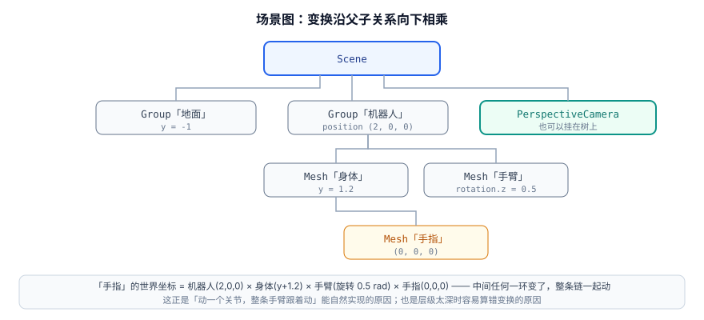
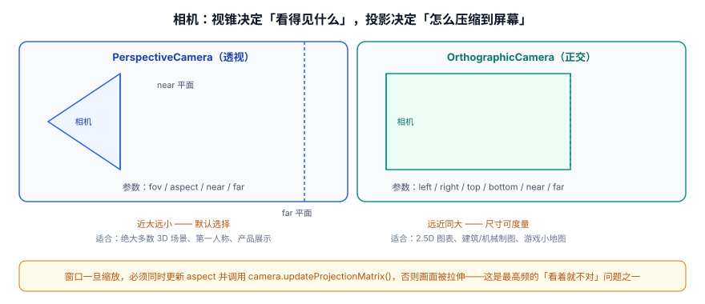

# 场景与对象模型

Three.js 的核心只有四样东西：**场景（Scene）、相机（Camera）、渲染器（Renderer）、物体（Object3D）**。前三样各一个，第四样组成一棵树。

一句话定位：这一页讲清 **Three.js 怎么描述一个 3D 场景**。看完你应该能：不查文档就写出一段能跑的代码，并知道每一行在改什么。

## 四件套与最小可运行工程

```shell [初始化工程]
# 1. 建工程（Node 20+，pnpm 或 npm 均可）
pnpm create vite my-3d-scene --template vanilla
cd my-3d-scene

# 2. 装 three 与它的类型声明
pnpm add three
pnpm add -D @types/three

# 3. 启动
pnpm dev
```

```html [index.html]
<!DOCTYPE html>
<html lang="zh-CN">
  <head>
    <meta charset="UTF-8" />
    <meta name="viewport" content="width=device-width, initial-scale=1.0" />
    <title>Three.js 最小场景</title>
    <style>
      html, body { margin: 0; height: 100%; overflow: hidden; }
      /* 关键：容器必须有尺寸，否则画布宽高会是 0 */
      #app { width: 100vw; height: 100vh; display: block; }
    </style>
  </head>
  <body>
    <canvas id="app"></canvas>
    <script type="module" src="/main.js"></script>
  </body>
</html>
```

```javascript [main.js]
import * as THREE from 'three';
import { OrbitControls } from 'three/addons/controls/OrbitControls.js';

// ---------- 1. 渲染器：决定「用什么后端、画在哪儿」 ----------
const renderer = new THREE.WebGLRenderer({
  canvas: document.querySelector('#app'),
  antialias: true,              // 开抗锯齿；代价是显存与带宽，不是所有场景都值得
});
renderer.setPixelRatio(Math.min(window.devicePixelRatio, 2));  // 必须设上限
renderer.setSize(window.innerWidth, window.innerHeight);

// ---------- 2. 场景：一棵树的根 ----------
const scene = new THREE.Scene();
scene.background = new THREE.Color(0x0f172a);

// ---------- 3. 相机：站在哪、看向哪 ----------
const camera = new THREE.PerspectiveCamera(
  50,                                        // fov：垂直视场角（度）
  window.innerWidth / window.innerHeight,    // aspect：宽高比，必须与画布一致
  0.1,                                       // near：不要设 0
  1000                                       // far：够用就好，太远浪费深度精度
);
camera.position.set(3, 2, 5);
camera.lookAt(0, 0, 0);

// ---------- 4. 物体：几何 + 材质 = 网格 ----------
const geometry = new THREE.BoxGeometry(1, 1, 1);   // 单位立方体
const material = new THREE.MeshStandardMaterial({
  color: 0x2563eb,
  roughness: 0.35,
  metalness: 0.1,
});
const cube = new THREE.Mesh(geometry, material);
cube.name = 'demo-cube';       // 起名字，后面能用 getObjectByName 找到它
scene.add(cube);

// ---------- 5. 光照：Standard 材质没有光源就是全黑 ----------
scene.add(new THREE.AmbientLight(0xffffff, 0.6));
const key = new THREE.DirectionalLight(0xffffff, 2.5);
key.position.set(5, 8, 6);
scene.add(key);

// ---------- 6. 交互与帧循环 ----------
const controls = new OrbitControls(camera, renderer.domElement);
controls.enableDamping = true;        // 阻尼手感，需要每帧 update()

const timer = new THREE.Timer();      // r183 起推荐 Timer（Clock 已弃用）
renderer.setAnimationLoop(() => {
  timer.update();
  const dt = Math.min(timer.getDelta(), 0.1);   // 夹住 delta，切标签页回来不跳帧
  cube.rotation.y += 0.6 * dt;                  // 帧率无关的旋转
  controls.update();                            // 有 damping 就必须每帧调
  renderer.render(scene, camera);
});

// ---------- 7. 窗口自适应 ----------
window.addEventListener('resize', () => {
  camera.aspect = window.innerWidth / window.innerHeight;
  camera.updateProjectionMatrix();              // 少了这一行画面会被拉伸
  renderer.setSize(window.innerWidth, window.innerHeight);
});

console.log('three.js revision =', THREE.REVISION);
```

**验证方式**：`pnpm dev` 后访问 <http://localhost:5173/>。预期现象：

1. 深蓝背景上出现一个**亮蓝色立方体**，正持续绕 Y 轴旋转；
2. 鼠标左键拖动可旋转视角、滚轮可缩放（说明 `OrbitControls` 生效）；
3. 缩放浏览器窗口，立方体不变形（说明 `aspect` 与 `updateProjectionMatrix()` 生效）；
4. 控制台打印 `three.js revision = 186` 之类的数字（与 `package.json` 里的版本对应）；
5. 控制台无报错。

## 对象树：变换沿父子关系向下相乘

`Object3D` 是 Three.js 里所有可视与非可视对象的基类（`Mesh`、`Light`、`Camera`、`Group` 都是它的子类）。它最重要的设计是**父子关系**：子对象的最终变换 = 父对象变换 × 自己的局部变换。



```javascript [transform-chain.js]
const robot = new THREE.Group();       // Group 本身不可见，只提供变换与分组
robot.position.set(2, 0, 0);
scene.add(robot);

const body = new THREE.Mesh(bodyGeo, bodyMat);
body.position.y = 1.2;
robot.add(body);

const arm = new THREE.Mesh(armGeo, armMat);
arm.position.set(0.8, 0.4, 0);
arm.rotation.z = -0.5;                 // 弧度
body.add(arm);                          // 手臂挂在身体上

// 动一个关节，整条手臂跟着动 —— 不需要手动算任何坐标
arm.rotation.z += 0.01;
```

| 属性 / 方法 | 作用 | 注意 |
| --- | --- | --- |
| `position` | 相对父对象的位移 | 单位是「世界单位」，没有默认米/厘米含义，自己统一即可 |
| `rotation` | 欧拉角旋转 | **单位是弧度**；顺序默认 `XYZ`，遇到万向锁时用 `quaternion` |
| `quaternion` | 四元数旋转 | 与 `rotation` 同步，改一个另一个自动更新 |
| `scale` | 缩放 | 非等比缩放会**破坏法线**，需要重算法线或调整材质 |
| `add(child)` | 挂到当前对象下 | 保留子对象的局部变换 |
| `attach(child)` | 挂到当前对象下 | **保持世界变换不变**（换父级时更有用） |
| `getObjectByName(name)` | 按名字查找 | 从当前节点往下递归找，适合小场景 |
| `traverse(fn)` | 遍历整棵子树 | 做批量操作（如统一 `dispose()`）最常用 |
| `matrixAutoUpdate` | 是否每帧自动重算矩阵 | 静态物体设为 `false` 可省 CPU |
| `layers` | 图层掩码 | 用来做「某相机只看得见某些物体」 |

:::danger 三个关于变换的高频错误
1. **把度数当弧度**。`obj.rotation.x = 90` 不是转 90°，而是 5156°。要么用 `THREE.MathUtils.degToRad(90)`，要么直接用 `Math.PI / 2`。
2. **position 加了两遍导致物体飞走**。常见于在 `add()` 之后又按世界坐标重新设一遍——`add()` 不改变局部变换，所以「想把它挪到世界坐标某点」应该用 `attach()`，或者手动换算。
3. **以为 `scene.remove(obj)` 会释放显存**。它只是把节点从树上摘下来，**几何与材质仍在显存里**，必须显式 `dispose()`（见 [模型与资源管线](../AssetPipeline/index.md)）。
:::

## 几何：`BufferGeometry` 到底装了什么

现代 Three.js 里的几何体**只有一种**——`BufferGeometry`。它本质是一组**顶点属性数组**（`Float32Array` 等）加上可选的索引数组。

```javascript [buffer-geometry.js]
// 方式一：用内置几何体（最常见）
const sphere = new THREE.SphereGeometry(1, 32, 16);   // 半径、经线数、纬线数
const plane  = new THREE.PlaneGeometry(10, 10, 1, 1);
const torus  = new THREE.TorusKnotGeometry(0.6, 0.2, 128, 16);

// 方式二：自己造（做数据驱动图形时用）
const geo = new THREE.BufferGeometry();
// 四个顶点的位置，两个三角形（用索引复用顶点）
geo.setAttribute('position', new THREE.Float32BufferAttribute([
  -1, -1, 0,
   1, -1, 0,
   1,  1, 0,
  -1,  1, 0,
], 3));                     // 3 = 每个顶点 3 个数
geo.setIndex([0, 1, 2, 0, 2, 3]);   // 复用顶点：4 个顶点就能拼 2 个三角形
geo.computeVertexNormals();         // 让光照算得对，必须调用
geo.computeBoundingSphere();        // 视锥剔除依赖包围球
```

| 常用顶点属性 | 分量数 | 作用 | 缺失时的表现 |
| --- | --- | --- | --- |
| `position` | 3 | 顶点坐标 | 什么都画不出来 |
| `normal` | 3 | 法线方向 | 光照全黑或全平 |
| `uv` | 2 | 纹理坐标 | 贴图塌陷成一个颜色 |
| `color` | 3 或 4 | 逐顶点颜色 | 需材质 `vertexColors: true` |
| `tangent` | 4 | 切线（法线贴图需要） | 法线贴图方向错乱 |

:::tip 索引（index）为什么重要
不用索引时，两个相邻三角形要写 6 个顶点，其中 2 个是重复的；用索引后只需 4 个。对于几十万面的模型，这直接省下**约 1/3 的顶点数据与带宽**，并且让 GPU 的顶点缓存（post-transform cache）能真正命中。**模型导出的几何体几乎总是带索引的；自己手搓几何时别忘了 `setIndex()`。**
:::

## 相机：视锥决定「看得见什么」



```javascript [cameras.js]
// 透视相机：近大远小，绝大多数场景的选择
const persp = new THREE.PerspectiveCamera(50, w / h, 0.1, 1000);
persp.position.set(3, 2, 5);
persp.lookAt(0, 0, 0);

// 正交相机：远近同大，尺寸可度量
const frustum = 5;   // 半高，代表「竖向能看到 10 个世界单位」
const ortho = new THREE.OrthographicCamera(
  -frustum * (w / h), frustum * (w / h),   // left / right
   frustum,          -frustum,              // top / bottom
   0.1, 1000                                // near / far
);
```

| 参数 | 含义 | 怎么选 |
| --- | --- | --- |
| `fov` | 垂直视场角（度） | 45~60 接近人眼；做第一人称可用 70~80 换更宽的视野 |
| `aspect` | 宽 / 高 | **必须等于画布宽高比**，窗口变化时同步更新 |
| `near` | 近平面距离 | 不要设 0；太小（如 0.001）会引发远处深度冲突 |
| `far` | 远平面距离 | 略大于「最远可见物体距离」即可；太大浪费深度精度 |
| `zoom` | 缩放系数 | 正交通常用它做缩放，比改 frustum 方便 |

:::warning 视锥剔除是免费的，也是有限的
Three.js 每帧会拿相机的视锥与每个物体的**包围球**做一次快速相交测试，完全在视锥外的物体直接跳过——这是默认行为，**不需要你做任何事**。但它的粒度是「一个物体」，所以：如果一个巨大模型里只有一小部分可见，剔除不会生效（因为它的包围球仍然相交）。这也是「大场景要按区域拆分模型」的原因之一。
:::

## 对象树的批量操作模式

真实项目里最常写的三种遍历：

```javascript [traverse-patterns.js]
// 1. 批量开关阴影
scene.traverse((obj) => {
  if (obj.isMesh) {
    obj.castShadow = true;
    obj.receiveShadow = true;
  }
});

// 2. 统计规模（上线前用它确认模型没引入冗余节点）
let meshes = 0, vertices = 0;
scene.traverse((obj) => {
  if (obj.isMesh) {
    meshes += 1;
    const pos = obj.geometry.attributes.position;
    vertices += pos ? pos.count : 0;
  }
});
console.log({ meshes, vertices });

// 3. 彻底清理一棵子树（顺序很重要：先从树上摘，再释放）
function disposeSubtree(root) {
  root.parent?.remove(root);
  root.traverse((obj) => {
    if (obj.isMesh) {
      obj.geometry?.dispose();
      (Array.isArray(obj.material) ? obj.material : [obj.material])
        .filter(Boolean)
        .forEach((m) => {
          // 材质上的贴图也要单独释放
          ['map', 'normalMap', 'roughnessMap', 'metalnessMap', 'aoMap', 'emissiveMap']
            .forEach((k) => m[k]?.dispose());
          m.dispose();
        });
    }
  });
}
```

## 常用清单

**四件套的必用方法**：

| 对象 | 方法 | 说明 |
| --- | --- | --- |
| `WebGLRenderer` | `setSize(w, h)` | 设置画布 CSS 尺寸并同步位图尺寸 |
| | `setPixelRatio(n)` | 设像素比，**一定要设上限** |
| | `setAnimationLoop(fn)` | 官方推荐的帧循环入口（WebXR/WebGPU 必需） |
| | `render(scene, camera)` | 渲染一帧 |
| | `dispose()` | 释放渲染器持有的全部 GPU 资源 |
| `Scene` | `background` / `environment` / `fog` | 背景色、环境贴图、雾 |
| | `add()` / `remove()` / `traverse()` | 树操作 |
| `Camera` | `updateProjectionMatrix()` | 改完 `fov`/`aspect`/`near`/`far` 必须调用 |
| | `lookAt(v)` | 让相机朝向某点 |
| `Object3D` | `name` / `userData` | 挂名字与自定义数据（拾取时常靠 `userData` 带回业务信息） |

## 易错点

:::danger 场景跑不起来的六个原因（按排查顺序）
1. **画布尺寸为 0**。容器没有高度、`display: none`、或 `canvas` 还没进 DOM，都会导致什么都看不到。先确保 `clientWidth/clientHeight` 大于 0。
2. **物体不在视锥里**。相机在原点、物体也在原点时，物体可能在相机「背后」。最快验证方法：`camera.position.set(0, 0, 5)` 后再看。
3. **用了 `MeshStandardMaterial` 却没有任何光源**。Standard 是 PBR 材质，**没有光就是纯黑**；此时换成 `MeshBasicMaterial` 能立刻看到物体，从而确认是光照问题而不是几何问题。
4. **`aspect` 与画布不一致**。表现为物体被横向或纵向拉伸，通常是漏了 `updateProjectionMatrix()`。
5. **几何体没有法线**。自己 `setAttribute` 造几何时忘了 `computeVertexNormals()`，光照会全黑或像被压平。
6. **`near` 设成 0 或负数**。投影矩阵退化，整屏全黑且没有任何报错。
:::

:::tip 调试时先用 MeshBasicMaterial 排除光照因素
「黑屏」的排查顺序应该是：**先把材质换成 `MeshBasicMaterial`**。如果这时能看到物体，问题在光照（光源缺失、强度不够、或材质不受光）；如果仍然是黑的，问题在相机、几何或画布尺寸。这一步能省下大量时间。
:::

## 参考资料

1. three.js 文档 · 场景图与 `Object3D`：<https://threejs.org/docs/#api/en/core/Object3D>
2. three.js 文档 · `BufferGeometry`：<https://threejs.org/docs/#api/en/core/BufferGeometry>
3. three.js 手册 · 场景、相机与渲染器：<https://threejs.org/manual/#en/fundamentals>
4. three.js 示例 · 相机与控制器：<https://threejs.org/examples/#webgl_geometry_cube>
5. 本库 [WebGL 基础与渲染管线](../Overview/index.md)（理解 `modelViewMatrix` 从哪来）
