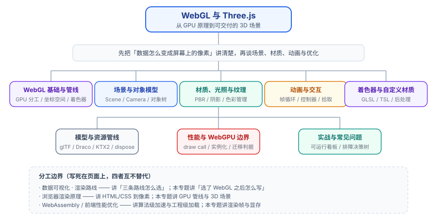

# WebGL 与 Three.js

**WebGL**（Web Graphics Library）是浏览器暴露给 JavaScript 的一套 **GPU 绘图接口**——它把 OpenGL ES 的能力搬进网页，让你能直接操作显卡画三角形。**Three.js** 是建立在这层接口之上的**场景图封装**：你不再手写着色器和缓冲区，只描述「场景里有什么、从哪看、长什么样」。

一句话记住本专题的定位：**WebGL 是「怎么用 GPU」，Three.js 是「怎么把 3D 场景说清楚」**。前者决定你的能力上限，后者决定你的开发效率。

参考基线（截至 **2026-10 核对**）：

- **three.js**：npm 最新稳定版 **`three@0.186.1`（2026-09-24 发布）**，对应 **r186**（`0.186.0`，2026-09-08）；r185 为 `0.185.0` / `0.185.1`（2026-06-25 / 2026-07-01）。版本号规则是 `0.<revision>.<patch>`，所以**不会出现 `3.x`**，`THREE.REVISION` 只给到 revision 号。
- **WebGL**：WebGL 2.0 规范**已经定稿**（基于 OpenGL ES 3.0），**不再新增特性**，进入长期维护状态；Can I Use 口径覆盖率约 **95%+**，是当前兼容性最好的 3D 方案。
- **WebGPU**：W3C 官方规范状态为 **Candidate Recommendation Draft**（候选推荐草案，最新版 **2026-09-15**），**尚未成为正式 Recommendation**；浏览器覆盖率约 **85%~87%**（Safari 26 起补齐 macOS/iOS/iPadOS/visionOS，Firefox 141+ 起在 Windows 与 Apple Silicon macOS 默认开启，Linux 与 Android 仍在推进）。three.js 自 **r163** 引入 `WebGPURenderer`、**r171（2025-09）起生产可用**，并**自动回落到 WebGL 2**。

:::info 关于版本口径
本专题所有版本事实均标注核对时间，并优先引用官方来源（npm registry、threejs.org、W3C 规范页）。three.js **每两周左右发一次版本**，请以 `npm view three version` 的实际输出与你项目的锁文件为准，**不要照抄本文写作时的数字**。
:::

## 专题地图

## 页面导航

1. [WebGL 基础与渲染管线](Overview/index.md) —— GPU 与 CPU 的分工、坐标空间五连变换、管线六阶段、着色器三种数据通道、可运行的裸 WebGL 示例
2. [场景与对象模型](ThreeCore/index.md) —— Scene / Camera / Renderer 四件套、Object3D 树的变换继承、BufferGeometry、透视与正交相机
3. [材质、光照与纹理](Material/index.md) —— PBR 的 metalness/roughness、五类光源与阴影排查顺序、纹理参数、色彩管理管线
4. [动画与交互](Animation/index.md) —— 帧循环与 `setAnimationLoop`、delta 时间、关键帧动画、轨道控制器、射线拾取
5. [着色器与自定义材质](Shader/index.md) —— GLSL ES 基础、`ShaderMaterial` 与 `RawShaderMaterial`、内建 uniform、后处理的两种路线
6. [模型与资源管线](AssetPipeline/index.md) —— 为什么主线是 glTF、Draco 与 KTX2 压缩、加载管理、`dispose()` 与显存回收
7. [性能与 WebGPU 边界](Performance/index.md) —— 帧时间预算、draw call 三大降法、填充率与过度绘制、WebGPU 该不该迁
8. [实战：可运行的数据可视化场景](Practice/index.md) —— 从零搭一个 3D 设备状态看板，六个模块、十项验收断言
9. [常见问题与最佳实践](FAQ/index.md) —— 按「黑屏 / 掉帧 / 画面不对 / 加载失败」四类分诊的排障决策树

## 建议的阅读顺序

- **完全没碰过 3D**：从 [WebGL 基础与渲染管线](Overview/index.md) 读起，重点看「管线六阶段」和「为什么这决定了什么能优化」，这两段是后面所有内容的解释器。
- **只要赶紧把场景跑起来**：直接跳到 [场景与对象模型](ThreeCore/index.md)，照抄最小示例，再回头补原理。
- **画面「就是不对」**：先看 [材质、光照与纹理](Material/index.md) 的色彩管理一节，再看 [常见问题与最佳实践](FAQ/index.md) 的决策树。
- **上线前卡在帧率**：[性能与 WebGPU 边界](Performance/index.md) 是唯一入口，先量 `renderer.info.render.calls`，再改。
- **要交付一个真实场景**：[实战：可运行的数据可视化场景](Practice/index.md) 走完整流程，六个模块逐个验证。

## 本专题与相邻专题的分工

这几处边界**写死在页面上**，四者互不替代：

- **[数据可视化 · 渲染路线](../DataVisualization/Rendering/index.md)**：负责**选型**——Canvas 2D / SVG / WebGL 三条路各自适合什么、多少数据量该换路线。本专题接手它的下半段：**已经确定用 WebGL/3D 之后，代码怎么写**。它讲「要不要上」，本专题讲「上了之后怎么做好」。
- **[数据可视化 · 大数据量下的性能工程](../DataVisualization/LargeData/index.md)**：负责**数据侧**的降载手段（采样、聚合、分片、渐进渲染）。本专题负责**渲染侧**（draw call、实例化、填充率、显存）。两边都会谈「性能」，但一个动数据，一个动管线。
- **[浏览器渲染原理](../Basic/Browser/Rendering/index.md)**：负责 **HTML/CSS 到像素**的整条链路（解析、样式、布局、绘制、合成）。WebGL 的 canvas 在它眼里只是**一个合成层**；本专题只讲 canvas 内部那台「GPU 小机器」怎么运转。
- **[前端性能优化](../Others/PerformanceOptimization/index.md) / [运行时优化](../Others/PerformanceOptimization/Runtime/index.md)**：负责**工程级**指标与手段（加载、体积、Core Web Vitals、长任务切分）。3D 场景的帧率是**帧预算**问题，归本专题；3D 资源的包体积与懒加载策略，可以两边对着看。
- **[WebAssembly](../WebAssembly/index.md)**：负责**算法级加速**（把 C/Rust 编译进浏览器）。3D 场景里的物理引擎、几何算法确实常用 Wasm 加速，但那是「把计算搬进 Wasm」，不是「把画面画出来」。
- **[CSS3 3D 变换](../Basic/CSS/CSS3/3D/index.md)**：负责 **DOM 元素的 3D 变换**。它的适用边界是「几十个平面卡片做翻转」，没有光照、没有模型、没有着色器；需要真 3D 时就该换到本专题。

## 本专题讲什么、不讲什么

| 会讲 | 不讲（去对应专题） |
| --- | --- |
| GPU 管线六阶段、坐标空间变换、着色器数据通道 | Canvas / SVG / WebGL 该选哪条 → [渲染路线](../DataVisualization/Rendering/index.md) |
| three.js 的场景图、几何、材质、光照、纹理、色彩管理 | HTML/CSS 渲染链路与合成层 → [浏览器渲染原理](../Basic/Browser/Rendering/index.md) |
| 帧循环、delta 时间、控制器、射线拾取 | Core Web Vitals 与性能预算 → [前端性能优化](../Others/PerformanceOptimization/index.md) |
| draw call 治理、实例化、填充率、显存回收 | 数据采样与聚合策略 → [大数据量下的性能工程](../DataVisualization/LargeData/index.md) |
| glTF / Draco / KTX2 资源管线与体积优化 | 包体积与代码分割 → [构建优化](../Others/FrontendEngineering/BuildOptimization/index.md) |
| GLSL ES 与 TSL 的取舍、后处理的两种路线 | 信号处理 / 图像算法本身 → [WebAssembly](../WebAssembly/index.md) |
| 3D 场景的拾取与交互事件 | 页面级事件与 DOM 事件模型 → [事件处理](../Basic/JavaScript/Events/index.md) |

## 版本基线与状态表

| 项目 | 当前基线 | 状态 | 对使用者的影响 |
| --- | --- | --- | --- |
| **three.js** | `0.186.1`（2026-09-24） | 主线 | 每两周一版；升级建议**一次跨不超过 10 个 release**（弃用警告只保留 10 个 release） |
| **three.js WebGLRenderer** | `three` 默认导出 | 稳定，仍长期支持 | 通用性最好，文档与示例最多；`PCFSoftShadowMap` 在 r186 已移除 |
| **three.js WebGPURenderer** | `three/webgpu` 入口，r171 起生产可用 | 生产可用 + 自动回落 WebGL 2 | 需 `await renderer.init()` 或 `setAnimationLoop` 处理异步初始化 |
| **TSL（Three Shading Language）** | `three/tsl`，一次编写编译到 WGSL 与 GLSL | 推荐新代码使用 | 手写 GLSL 的 `ShaderMaterial` 在 WebGPU 原生路径下需改写 |
| **WebGL 2.0** | 规范已定稿 | 长期维护，不再新增特性 | 覆盖率约 95%+，可放心作为兼容底线 |
| **WebGPU** | W3C CR Draft（2026-09-15） | 草案，尚未成为正式 Recommendation | 覆盖率约 85%~87%，**必须保留回落路径** |
| **`@types/three`** | `0.186.0`（2026-09-11） | 与主版本号对齐 | TypeScript 项目需与 three 版本同步升级 |

:::warning r186 的破坏性变更要提前知道
从 r185 升到 r186，以下几点会真实改坏代码，**升级前先扫一遍**：

1. `PCFSoftShadowMap` 被移除（`WebGPURenderer` 不再支持，`WebGLRenderer` 侧使用时会告警并回落到 `PCFShadowMap`，后者本身已具备软阴影效果）；
2. `Source` 类**统一更名为 `TextureSource`**；
3. `Object3D` 新增 `dispose()`，**自定义子类必须调用 `super.dispose()`**；
4. `BufferGeometryUtils` 不再克隆几何体，改为直接修改索引，需要自己处理克隆逻辑；
5. `SimplifyModifier.modify` **改为异步**（内部改用 meshoptimizer）；
6. `LightProbeGrid` 更名为 `LightProbeGridWebGL`；
7. TSL 的 `viewportResolution` 被移除（改用 `screenSize`），`rangeFog` 也被移除；
8. **压缩构建（`three.min.js` 等）不再提供**，交给你的打包器处理。

更早版本的迁移要点（r181~r185）见 [性能与 WebGPU 边界](Performance/index.md) 的升级清单。
:::

## 学习路径

按「先看到、再理解、最后交付」三段走，每段都有可验证的收尾：

1. **第一段：看到东西（约半天）** —— 读 [场景与对象模型](ThreeCore/index.md)，用 Vite 起一个工程，页面上出现一个会随窗口缩放的立方体。**验收**：`pnpm dev` 后访问 `http://localhost:5173/`，画面出现立方体、缩放窗口不拉伸、控制台无报错。
2. **第二段：理解为什么（约一天）** —— 读 [WebGL 基础与渲染管线](Overview/index.md) 与 [材质、光照与纹理](Material/index.md)，把立方体换成带阴影的金属球；再读 [动画与交互](Animation/index.md)，加上轨道控制器与点击高亮。**验收**：能口头解释「贴图为什么会发灰」「阴影为什么不出现」，并能在页面上复现。
3. **第三段：交付一个场景（约两到三天）** —— 读 [模型与资源管线](AssetPipeline/index.md) 与 [着色器与自定义材质](Shader/index.md)，最后走完 [实战](Practice/index.md)。**验收**：实战页的十项断言全部通过，且 `renderer.info.render.calls` 在你承诺的数字以内。

全程建议把 **[常见问题与最佳实践](FAQ/index.md)** 的决策树开着——3D 调试的绝大多数时间花在「定位问题属于哪一类」上，而不是花在修问题上。

## 参考资料

1. three.js 官方站点与文档：<https://threejs.org/>｜<https://threejs.org/docs/>
2. three.js 版本变更与迁移指南：<https://threejs.org/changelog>｜<https://github.com/mrdoob/three.js/wiki/Migration-Guide>
3. three.js 官方示例库（最值得反复翻的源码）：<https://threejs.org/examples/>
4. WebGL 规范（Khronos）：<https://registry.khronos.org/webgl/>
5. MDN · WebGL API 指南：<https://developer.mozilla.org/zh-CN/docs/Web/API/WebGL_API>
6. WebGPU 规范（W3C，Candidate Recommendation Draft）：<https://www.w3.org/TR/webgpu/>
7. WebGL2 Fundamentals（从原理讲起的免费长教程）：<https://webgl2fundamentals.org/>
8. glTF 2.0 规范（Khronos）：<https://registry.khronos.org/glTF/>
