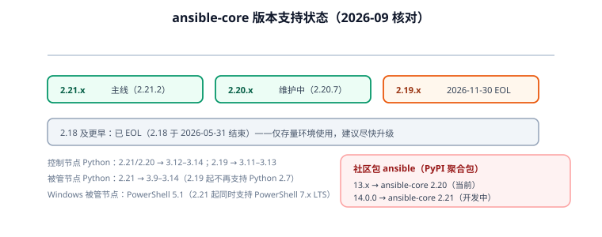

# 常见问题与最佳实践

本页汇总 Ansible 在**安装、清单、变量、模块、Playbook、角色、性能、安全**八类场景的高频疑问，给出可直接落地的结论，并集中列出最容易踩的坑与版本迁移注意事项。



## 安装与版本

### `ansible` 和 `ansible-core` 到底装哪个？

生产装 **ansible-core**（引擎 + 内置模块，版本 `2.21.x`），按需装集合。只有"想开箱即用大量社区模块、不在乎体积"时才装社区包 `ansible`（版本 `13.x`）。

### ansible-core、Ansible 社区包、AAP 三者的版本怎么对应？

| 名称 | 版本形态 | 说明 |
| --- | --- | --- |
| ansible-core | `2.21.x` | 引擎，社区与 Red Hat 共用同一份代码 |
| ansible（社区包） | `13.x` | 打包了 ansible-core 2.20 + 数百个集合 |
| AAP（红帽订阅产品） | `2.x` | 企业版，含 Web UI、RBAC、执行环境 |

### 控制节点和被管节点的 Python 要求？

| ansible-core | 控制节点 | 被管节点 |
| --- | --- | --- |
| 2.21.x / 2.20.x | 3.12 – 3.14 | 3.9 – 3.14 |
| 2.19.x | 3.11 – 3.13 | 3.8 – 3.13 |

被管节点没有 Python 时，用 `raw` 模块先装一个，或改用 `ansible.netcommon` 系列处理网络设备。

## 清单与变量

### 变量明明写了却不生效，怎么排查？

按顺序查三件事：

1. **位置对不对**：`group_vars/`、`host_vars/` 必须与**清单文件同级**。
2. **名字对不对**：拼写、大小写、前缀是否与模板里一致。
3. **被谁覆盖了**：用 `ansible-inventory --host <host>` 打印最终值。

```shell
ansible-inventory -i inventory.ini --host web-01 | grep -E 'nginx_port|worker'
```

### 为什么 `host_vars` 改不动角色里的值？

角色把该变量写在了 `vars/main.yml`（优先级高于 `host_vars`）。可配置项应放在 `defaults/main.yml`。详见[角色、Galaxy 与 Collections](Role/index.md)。

### 主机名和 IP 不一致怎么处理？

`web-01` 是 Ansible 内部标识，`ansible_host` 才是真实地址：

```ini
web-01 ansible_host=192.168.10.11 ansible_port=2222
```

## 模块

### 什么时候可以用 `shell`？

**能不用就不用**。优先级：专用模块 → `command` → `shell`。非用 `shell` 不可时，必须补幂等语义：

```yaml
- name: 初始化数据库（只在标记文件不存在时执行）
  ansible.builtin.shell:
    cmd: /opt/app/bin/init-db.sh
    creates: /var/lib/app/.db_initialized
```

### `command` 和 `shell` 的区别？

| | `command` | `shell` |
| --- | --- | --- |
| 是否经过 shell | 否 | 是（`/bin/sh -c`） |
| 支持管道/重定向/通配 | 否 | 是 |
| 命令注入风险 | 低 | 高 |
| 推荐度 | 兜底首选 | 最后手段 |

### 怎么让任务"只在需要时才变更"？

让模块自己判断（专用模块天然如此）；对命令类任务用 `creates` / `removes` / `changed_when: false`。

## Playbook

### handler 为什么不执行？

三个原因：任务本身 `skipped`（`when` 为假）、跑了 `--check`、或者你在期待它"立刻"执行（handler 默认在 play 末尾统一执行）。需要立刻执行就加 `- meta: flush_handlers`。

### 想让某台机器只在第一台执行一次，怎么做？

```yaml
- name: 只在任意一台主机执行一次（如调一次 LB API）
  ansible.builtin.uri:
    url: http://lb.internal/api/refresh
  run_once: true
  delegate_to: localhost
```

### 怎么做灰度发布？

用 `serial` 分批 + 健康检查 + `max_fail_percentage`：

```yaml
- hosts: web
  serial: 1
  max_fail_percentage: 0
```

## 角色与集合

### 集合装到哪了？为什么 playbook 找不到？

默认路径 `~/.ansible/collections`。装到项目内时要在 `ansible.cfg` 里指定：

```ini
[defaults]
collections_path = ./collections
```

### 升级 ansible-core 后某些集合装不上？

ansible-core **2.21** 起，`ansible-galaxy` 默认**跳过**声明了不兼容 `requires_ansible` 的集合。优先升级集合到兼容版本；确需绕过时设 `COLLECTIONS_ON_ANSIBLE_VERSION_MISMATCH=ignore`。

## 性能

### 跑几百台机器很慢，怎么优化？

| 手段 | 效果 | 做法 |
| --- | --- | --- |
| 提高并发 | 显著 | `forks = 50`（注意控制节点资源） |
| 开启 pipelining | 明显 | `pipelining = True`（需目标机无 `requiretty`） |
| SSH 连接复用 | 明显 | `ControlMaster` + `ControlPersist` |
| fact 缓存 | 明显 | `gathering = smart` + `fact_caching = jsonfile` |
| 关闭 facts | 明显 | `gather_facts: false`，或 `gather_subset: min` |
| 减少 `loop` | 中等 | 用模块原生的列表参数 |

```ini [ansible.cfg]
[defaults]
gathering     = smart
fact_caching  = jsonfile
fact_caching_connection = /tmp/ansible_facts
fact_caching_timeout    = 3600
forks         = 50
```

### 怎么避免"每次跑都很慢"？

`gathering = smart` 让同一主机在多次 play 间只采集一次 facts；配合 fact 缓存可跨执行复用。

## 安全

### 敏感信息怎么管？

用 `ansible-vault`（单文件或多密码 `vault-id`），机密变量文件整体加密或 `encrypt_string` 单值加密；含机密的落地文件 `mode: "0600"`；相关任务加 `no_log: true`。详见[实战第四步](Practice/index.md)。

### 怎么防止同事手改配置文件？

在模板头部写上 `ansible_managed` 变量，并在 `ansible.cfg` 自定义提示文案，例如"本文件由 Ansible 生成，手工修改将在下次执行时被覆盖"。

### `become` 的密码怎么安全处理？

优先在目标机配免密 sudo（受限命令白名单）；必须输密码时用 `--ask-become-pass`（`-K`）交互输入或 `become_password_file`，**不要**把密码写进 inventory。

## 踩坑清单

::: danger Ansible 十五个常见错误
1. **用 `shell` 代替专用模块** → 永不幂等、`changed` 永远不为 0。
2. **`group_vars`/`host_vars` 放错目录** → 变量"悄悄不存在"，无任何报错。
3. **`when` 用非布尔值** → 2.19 起直接报错。改 `inventory_hostname | length > 0`。
4. **`user` 模块漏 `append: true`** → 清空用户原有组，应用起不来。
5. **改配置不写 `validate`** → 语法错误直接落地，服务重启失败。
6. **没写 `no_log: true`** → 密码进日志与 CI 输出。
7. **handler 期望立即执行** → 其实在 play 末尾统一跑，需 `flush_handlers`。
8. **`ignore_errors: true` 兜底** → 制造"跑完但服务起不来"的假成功。
9. **模板变量未定义** → 静默渲染成空，配置少一行。开 `error_on_undefined_vars`。
10. **`loop` 打大包** → 输出刷屏、性能差；用模块原生列表参数或 `loop_control.label`。
11. **`requirements.yml` 不锁版本** → 上游一改，你的部署就崩。
12. **`.vault_pass` 提交进 Git** → 加密形同虚设。
13. **`string` 形式的八进制权限**（`mode: 0644` 不加引号）→ YAML 可能按十进制解析。统一写 `mode: "0644"`。
14. **忘了 `become` 的作用域** → 单个任务需要提权却只在 play 级设了 `become: false`，或反之。
15. **`--check` 当成充分验证** → check 模式不覆盖所有模块与 handler 行为，仍需单机灰度实跑。
:::

## 最佳实践速查

::: tip 十二句话用好 Ansible
1. 专用模块优先，`shell` 是最后手段。
2. 每个 task 都要有 `name`，日志才可读。
3. `state` 描述目标状态，不描述动作。
4. 可配置项进 `defaults`，实现细节进 `vars`。
5. 变量放对目录（`group_vars`/`host_vars` 与清单同级）。
6. 改配置必带 `validate`，机密必带 `no_log`。
7. handler 负责"重启/重载"，别在 task 里写 restart。
8. 用 `block/rescue` 处理错误，别用 `ignore_errors`。
9. 上线先 `--check --diff`，再 `--limit` 单机灰度，最后全量。
10. 幂等是验收标准：第二次执行必须 `changed=0`。
11. 角色与集合版本全部固定，`requirements.yml` 进仓库。
12. 机密用 Vault，密码文件进 `.gitignore`。
:::

## 版本演进与迁移

### ansible-core 2.19：Data Tagging（最大的一次破坏性变更）

2.19 重写了模板引擎并引入 **Data Tagging（数据标签）**，目的是阻止"不可信数据的双重模板化"这一安全风险。带来三类需要改代码的行为变化：

**① 条件必须是布尔**

```yaml
# 旧写法（2.18 及以前能过，2.19 起报错）
when: inventory_hostname
when: some_string_var
when: my_list

# 正确写法
when: inventory_hostname | length > 0
when: some_string_var | length > 0
when: my_list | length > 0
```

报错样例：

```text
Conditional result was 'localhost' of type 'str', which evaluates to True.
Conditionals must have a boolean result.
```

迁移期可用 `ALLOW_BROKEN_CONDITIONALS=warn` 降级为警告，但**必须排期修**。

**② 必须使用原生 Jinja 模式**

`ANSIBLE_JINJA2_NATIVE` 的"非原生"兼容路径已移除，依赖旧行为的模板会失效。

**③ 类型相关的 API 变更**

`AnsibleVaultEncryptedUnicode` 被 `EncryptedString` 取代；`dict` 的非字符串键不再做隐式转换。自定义过滤插件/动作插件若引用了这些类型需要同步修改。

### ansible-core 2.20：`INJECT_FACTS_AS_VARS` 弃用

facts 注入为顶层变量（`ansible_distribution`）的方式被标记弃用，未来会移除。新代码统一用：

```yaml
{{ ansible_facts['distribution'] }}
{{ ansible_facts['default_ipv4']['address'] }}
```

### ansible-core 2.21：`ansible-galaxy` 行为变更 + 安全修复

- 声明了不兼容 `requires_ansible` 的集合**默认被跳过安装**（旧行为是装完再报错）。
- 2.21.1 修复了角色依赖被当作位置参数传给 `git clone` 导致可注入 git 配置的问题（**CVE-2026-11332**）——建议 2.21.x 用户保持在 2.21.1 及以上。
- Windows 被管节点在 2.21 起同时支持 PowerShell 7.x LTS。

### 升级检查清单

- [ ] 确认控制节点 Python 在目标 core 版本的支持区间内。
- [ ] 确认被管节点 Python 满足最低要求（2.19 起不再支持 Python 2.7）。
- [ ] 全量扫描 `when` 表达式，改成显式布尔谓词。
- [ ] 检查自定义插件中是否引用 `AnsibleVaultEncryptedUnicode`。
- [ ] 把 facts 引用改为 `ansible_facts[...]`。
- [ ] 在**预发环境**先跑一遍 `--check --diff` 与一次完整实跑。
- [ ] 核对 `requirements.yml` 里的集合与 `requires_ansible` 是否兼容。
- [ ] 用 `ansible-lint` 扫一遍潜在问题。

## 参考资料

- 2.19 移植指南：[Porting Guide 2.19（Data Tagging）](https://docs.ansible.com/ansible/latest/porting_guides/porting_guide_core_2.19.html)
- 版本维护策略：[Releases and maintenance](https://docs.ansible.com/ansible/latest/release_and_maintenance.html)
- 版本 EOL 总览：[endoflife.date · ansible-core](https://endoflife.date/ansible-core)
- 最佳实践：[Ansible Tips and Tricks](https://docs.ansible.com/ansible/latest/tips_tricks/index.html)
- 配置项全集：[Configuration Settings](https://docs.ansible.com/ansible/latest/reference_appendices/config.html)
- 相关文档：[概述与选型](Overview/index.md) / [安装与环境准备](Install/index.md) / [实战：批量交付生产 Web 服务器](Practice/index.md)
- 延伸阅读：[CI/CD · 流水线设计](../../../Tools/CICD/PipelineDesign/index.md) / [Linux 进阶 · 安全加固](../../Linux/Advanced/SecurityHardening/index.md)
