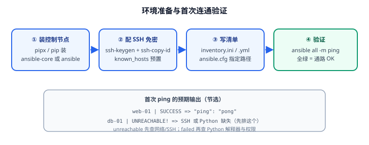

# 安装与环境准备

Ansible 的安装只有一步（装 Python 包），真正花时间的是**打通 SSH 通道**和**把 `ansible.cfg` 配对**。本页给出可直接复制的安装与初始化流程，以及一次就能验通的检查清单。



## 先分清装哪个包

| 包名 | 内容 | PyPI 版本形态 | 体积 | 建议 |
| --- | --- | --- | --- | --- |
| `ansible-core` | 引擎 + 内置模块（约 100 个） | `2.21.2` | 小 | **生产推荐**，依赖可控 |
| `ansible` | ansible-core + 数百个社区集合 | `13.x` | 大（数百 MB） | 想开箱即用大量模块时选它 |

::: warning 装了 `ansible` 不代表能用所有模块
社区包 `ansible` 只打包了主流集合，遇到冷门模块仍要单独安装集合：

```shell
ansible-galaxy collection install community.general
```

而 `ansible-core` 想用社区模块就必须显式装集合。**先装 ansible-core，按需装集合**是更干净的路线。
:::

## 控制节点：安装

**方式一：pipx（推荐，隔离环境）**

```shell
# pipx 让每个 CLI 工具有独立虚拟环境，避免污染系统 Python
python3 -m pip install --user pipx
python3 -m pipx ensurepath

pipx install ansible-core
ansible --version
```

**方式二：pip（虚拟环境内）**

```shell
python3 -m venv ~/.venv/ansible
source ~/.venv/ansible/bin/activate
python -m pip install --upgrade pip
pip install ansible-core
ansible --version
```

**方式三：系统包管理器**

```shell
# Debian / Ubuntu
sudo apt update && sudo apt install -y ansible

# RHEL / Rocky / AlmaLinux
sudo dnf install -y ansible-core

# macOS
brew install ansible
```

::: danger 别用 `sudo pip install ansible`
用 root 的 pip 装会把包写进系统 Python 的 `site-packages`，与发行版包管理器争抢文件，后续 `apt upgrade` 可能直接破坏 Ansible。**要么用 pipx，要么用虚拟环境，要么用系统包。**
:::

## 控制节点 Python 版本要求

| ansible-core | 控制节点 Python | 被管节点 Python |
| --- | --- | --- |
| 2.21.x | 3.12 – 3.14 | 3.9 – 3.14 |
| 2.20.x | 3.12 – 3.14 | 3.9 – 3.14 |
| 2.19.x | 3.11 – 3.13 | 3.8 – 3.13 |

被管节点的 Python 是**执行模块**用的：不满足时任务会报 `MODULE FAILURE` 或提示找不到解释器。

```shell
# 查看被管节点有哪些可用解释器
ansible all -m raw -a 'ls /usr/bin/python3*' -b
```

::: tip 被管节点只有 python3，没有 python
老模块或自定义脚本可能写死 `#!/usr/bin/python`。用 `ansible_python_interpreter` 显式指定即可，不必去装软链接：

```yaml
# group_vars/all.yml
ansible_python_interpreter: /usr/bin/python3
```
:::

## 打通 SSH

Ansible 默认走 SSH，所以**先让 ssh 命令自己能免密登录**，Ansible 才可能通。

```shell
# 1. 生成密钥（无口令便于自动化；生产建议用 ssh-agent 托管带口令的密钥）
ssh-keygen -t ed25519 -C "ansible@control" -f ~/.ssh/id_ed25519 -N ""

# 2. 分发公钥到目标机（需要输入一次目标机密码）
ssh-copy-id -i ~/.ssh/id_ed25519.pub ops@web-01

# 3. 验证免密
ssh -o BatchMode=yes ops@web-01 'echo ssh-ok && python3 -V'
# 预期：ssh-ok 与 Python 3.x 版本号

# 4. 预置 known_hosts，避免首次连接卡在 yes/no 提问
ssh-keyscan -H web-01 web-02 db-01 >> ~/.ssh/known_hosts 2>/dev/null
```

```ini [~/.ssh/config]
# 关键：开启连接复用，大幅降低多任务场景的建连开销
Host web-* db-*
    User ops
    IdentityFile ~/.ssh/id_ed25519
    ControlMaster auto
    ControlPath ~/.ssh/cm-%r@%h:%p
    ControlPersist 60s
    ServerAliveInterval 30
```

::: warning 首次连接的主机指纹会卡住自动化
没预置 `known_hosts` 时，SSH 会交互式询问是否信任指纹，在自动化里表现为**任务长时间卡住**或 `Host key verification failed`。两种解法：预置 `known_hosts`（推荐），或临时设置 `ANSIBLE_HOST_KEY_CHECKING=False`（只在受控环境用）。
:::

## ansible.cfg

Ansible 会按以下顺序找配置，**找到第一个就停**：

1. `ANSIBLE_CONFIG` 环境变量指定的文件
2. 当前工作目录的 `ansible.cfg`
3. `~/.ansible.cfg`
4. `/etc/ansible/ansible.cfg`

推荐在**项目根目录**放一份 `ansible.cfg` 并纳入版本控制：

```ini [ansible.cfg]
[defaults]
# 清单路径（相对本文件所在目录）
inventory       = ./inventory.ini
# 角色搜索路径
roles_path      = ./roles
# 主机指纹校验：生产建议保持 True 并预置 known_hosts
host_key_checking = True
# 并发进程数：默认 5 偏保守，按控制节点与网络情况调大
forks           = 20
# 关闭隐式 localhost，避免误操作本机
localhost_warning = False
# 输出更易读
stdout_callback = yaml
# 关闭 cowsay 之类的干扰（部分发行版包自带）
nocows          = 1
# 重试与超时
timeout         = 30
# 日志留存，便于事后追溯
log_path        = ./ansible.log

[privilege_escalation]
# 需要 root 操作时自动提权（等价于每处都加 -b）
become          = True
become_method   = sudo
become_user     = root
# 免密 sudo 时设为 False；需要输密码则设为 True 并用 -K 提供
become_ask_pass = False

[ssh_connection]
# 开启 SSH 管道，减少一次文件传输往返
pipelining      = True
# 复用已有 SSH 连接（需配合 ~/.ssh/config 的 ControlPersist）
ssh_args        = -o ControlMaster=auto -o ControlPersist=60s
```

::: danger 打开 `pipelining` 前先确认 `requiretty`
`pipelining=True` 会少传一次文件、明显提速，但它要求目标机的 sudoers **没有** `Defaults requiretty`。若目标机开了 `requiretty`，任务会报 `sudo: sorry, you must have a tty to run sudo`。要么去掉该配置，要么把 `pipelining` 关掉。
:::

## 首次连通验证

```shell
# 1. 检查清单解析出的主机（不实际连接）
ansible-inventory --list

# 2. 连通性测试：走完整 SSH + Python 链路
ansible all -m ping
# 预期：每台主机返回  "ping": "pong"，且显示 SUCCESS

# 3. 采集基础信息，确认 facts 可用
ansible all -m setup -a 'filter=ansible_distribution*,ansible_python*'

# 4. 确认提权可用
ansible all -m command -a 'id' -b
# 预期：输出 uid=0(root) ...
```

三种典型报错的定位：

| 报错 | 含义 | 处理 |
| --- | --- | --- |
| `UNREACHABLE` | SSH 不通（网络/端口/密钥/指纹） | 先用 `ssh -v` 手工连一次 |
| `MODULE FAILURE` | Python 缺依赖或版本不符 | 检查 `ansible_python_interpreter` |
| `Missing sudo password` | 提权需要密码 | 加 `-K` 交互输入，或配免密 sudo |

## 验证清单

- [ ] `ansible --version` 显示的 core 版本为 2.20 或 2.21（受支持版本）。
- [ ] `ssh -o BatchMode=yes <host> echo ok` 对全部目标机成功。
- [ ] `ansible-inventory --list` 能列出预期的主机与组。
- [ ] `ansible all -m ping` 全部 SUCCESS，无 UNREACHABLE。
- [ ] `ansible all -m command -a id -b` 能拿到 root 身份。

## 参考资料

- Ansible 安装指南：[Installation Guide](https://docs.ansible.com/ansible/latest/installation_guide/intro_installation.html)
- 配置文件说明：[ansible.cfg](https://docs.ansible.com/ansible/latest/reference_appendices/config.html)
- SSH 连接插件：[ssh connection plugin](https://docs.ansible.com/ansible/latest/collections/ansible/builtin/ssh_connection.html)
- 相关文档：[概述与选型](Overview/index.md) / [清单与变量作用域](Inventory/index.md)
- 延伸阅读：[Linux 进阶 · 安全加固](../../Linux/Advanced/SecurityHardening/index.md)
