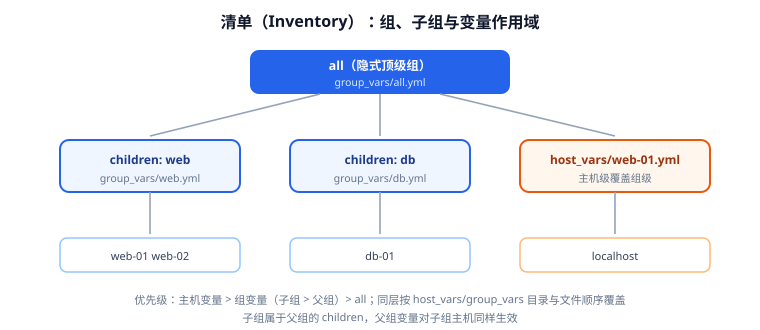

# 清单与变量作用域

清单（Inventory）回答一个问题：**这次操作要对哪些机器做，它们各自有什么差异**。它是 Ansible 的"通讯录"，也是变量分层的第一站。清单写得好，Playbook 才能真正复用；清单写成一堆硬编码 IP，后面每加一台机器都要改剧本。



## 最小可用清单

```ini [inventory.ini]
# 主机可以分组，组名自定义
[web]
web-01 ansible_host=192.168.10.11
web-02 ansible_host=192.168.10.12

[db]
db-01 ansible_host=192.168.10.21

# 组内主机可直接写行内变量
[all:vars]
ansible_user=ops
ansible_python_interpreter=/usr/bin/python3
```

要点：

- **主机名（`web-01`）是 Ansible 内部的标识**，`ansible_host` 才是真实地址（IP 或域名）。两者相同时可省略 `ansible_host`。
- `[all:vars]` 是内置顶级组的变量，对所有主机生效。
- `[group:children]` 定义子组，`[group:vars]` 定义组变量。

## 主机范围简写

```ini [inventory.ini]
# 连续数字：web-01, web-02, web-03
[web]
web-[01:03]

# 多段范围：node-a1, node-a2, node-b1, node-b2
[compute]
node-[a:b][1:2]

# 字母范围：web-a, web-b, web-c
[edge]
web-[a:c]
```

::: warning 范围简写不支持补零以外的花活
`web-[01:03]` 会展开成 `web-01`、`web-02`、`web-03`（保留前导零）。但 `web-[1:3]` 展开成 `web-1`，**不会**自动补零成 `web-01`。用哪个写法，取决于你的主机名实际长什么样——建议用 `ansible-inventory --list` 确认展开结果。
:::

## 组与子组：层级怎么建

```ini [inventory.ini]
[web]
web-01
web-02

[db]
db-01

# 用 children 把 web/db 收进 prod，prod 的变量对两者都生效
[prod:children]
web
db

[prod:vars]
env=production
ntp_server=ntp.internal
```

```shell
# 查看组结构（树状）
ansible-inventory --graph
# 预期：
# @all
#  |--@prod
#  |  |--@db
#  |  |  |--db-01
#  |  |--@web
#  |  |  |--web-01
#  |  |  |--web-02
```

::: tip 一台主机可以同时属于多个组
`web-01` 同时在 `web` 与 `prod` 组里是常态。变量冲突时按优先级解析（见下节）。**组不是互斥的分类，而是不同维度的标签**（按角色分、按环境分、按机房分）。
:::

## 变量放哪里

清单里能直接写变量，但变量一多就该搬到目录：

```text
inventory/
├─ inventory.ini            # 或 hosts.yml
├─ group_vars/
│  ├─ all.yml               # 所有主机
│  ├─ prod.yml              # prod 组
│  └─ web.yml               # web 组
└─ host_vars/
   ├─ web-01.yml            # 仅 web-01
   └─ db-01.yml
```

```yaml [group_vars/all.yml]
ansible_user: ops
ansible_python_interpreter: /usr/bin/python3
timezone: Asia/Shanghai
```

```yaml [group_vars/web.yml]
nginx_port: 80
worker_processes: 2
```

```yaml [host_vars/web-01.yml]
# 主机级覆盖：web-01 跑 4 个 worker
worker_processes: 4
```

**优先级（同层内）**：`host_vars/<host>` > `group_vars/<子组>` > `group_vars/<父组>` > `group_vars/all`。

::: danger 变量不生效？先看目录位置
`group_vars/` 和 `host_vars/` 必须与**清单文件同级**（或与 playbook 同级）。把清单放在 `inventory/` 下，`group_vars` 就要放 `inventory/group_vars/`。位置放错时 Ansible 不会报错，变量就是"悄悄不存在"——这是最浪费时间的一类问题。

排查命令：

```shell
ansible-inventory --host web-01
# 输出该主机最终解析到的全部变量，一眼看出哪个变量没被加载
```
:::

## 动态清单

主机数量大或环境随时变化（云主机、容器）时，手工维护清单不现实。Ansible 支持**动态清单插件**，从云 API 或本地数据源实时生成主机列表。

**内置插件示例（从云平台拉取）**：

```yaml [inventory.aws_ec2.yml]
plugin: amazon.aws.aws_ec2
regions:
  - cn-north-1
# 用标签自动分组
keyed_groups:
  - key: tags.Environment
    prefix: env
  - key: tags.Role
    prefix: role
# 只纳管运行中的实例
filters:
  instance-state-name: running
# 用 IP 或私有 DNS 作为连接地址
hostnames:
  - private-ip-address
```

```shell
# 用 -i 直接指向插件配置文件
ansible-inventory -i inventory.aws_ec2.yml --graph
```

**脚本清单（最通用的自定义方式）**：任何能输出规定 JSON 的可执行脚本都能当清单。

```python [inventory/dynamic.py]
#!/usr/bin/env python3
"""最小动态清单：输出 <cwd>/hosts.json 里的主机。"""
import json
import pathlib
import sys

data = json.loads((pathlib.Path(__file__).parent / "hosts.json").read_text())

if "--list" in sys.argv:
    print(json.dumps(data, ensure_ascii=False))
elif "--host" in sys.argv:
    # 支持 --host <name> 单机查询（可选实现）
    print(json.dumps({}))
```

```json [inventory/hosts.json]
{
  "_meta": { "hostvars": { "web-01": { "ansible_host": "192.168.10.11" } } },
  "web": { "hosts": ["web-01"], "vars": { "nginx_port": 80 } },
  "all": { "children": ["web"] }
}
```

```shell
chmod +x inventory/dynamic.py
ansible-inventory -i inventory/dynamic.py --graph
# 预期：打印出与 JSON 一致的组结构
```

::: tip `_meta.hostvars` 一次返回全部主机变量
清单脚本如果对每台主机都等一次 `--host` 调用，在大规模下会非常慢。在 `--list` 输出里带上 `_meta.hostvars`，Ansible 就不会再逐台调用 `--host`。
:::

## 临时主机与批量筛选

```shell
# 临时指定单台主机（末尾逗号表示这是主机列表，不是清单文件）
ansible -i 'web-09,' all -m ping

# 用 --limit 把执行范围收窄（对故障机/灰度特别有用）
ansible-playbook -i inventory.ini site.yml --limit web-01
ansible-playbook -i inventory.ini site.yml --limit 'web:&prod'   # 交集
ansible-playbook -i inventory.ini site.yml --limit 'all:!db'     # 排除
```

## 验证方式

```shell
# 1. 清单能被解析
ansible-inventory -i inventory.ini --list >/dev/null && echo "parse ok"

# 2. 组结构符合预期
ansible-inventory -i inventory.ini --graph

# 3. 单主机变量解析正确（重点看 group_vars/host_vars 是否生效）
ansible-inventory -i inventory.ini --host web-01

# 4. 范围简写展开正确
ansible -i inventory.ini web --list-hosts
```

## 验证清单

- [ ] `--graph` 输出的组层级与设计一致（父子组关系正确）。
- [ ] `--host <host>` 能看到预期的高优先级变量。
- [ ] 范围简写展开出的主机名与真实主机名完全一致。
- [ ] 动态清单至少能 `--list` 出正确 JSON。
- [ ] `--limit` 的交集/排除语法验证通过。

## 参考资料

- Ansible 清单指南：[How to build your inventory](https://docs.ansible.com/ansible/latest/inventory_guide/index.html)
- 动态清单插件列表：[Inventory plugins](https://docs.ansible.com/ansible/latest/plugins/inventory.html)
- 变量优先级：[Variable precedence](https://docs.ansible.com/ansible/latest/playbook_guide/playbooks_variables.html#variable-precedence-where-should-i-put-a-variable)
- 相关文档：[安装与环境准备](Install/index.md) / [变量、Facts 与模板](Variable/index.md)
- 延伸阅读：[Kubernetes · 概述](../../Kubernetes/Overview/index.md)
