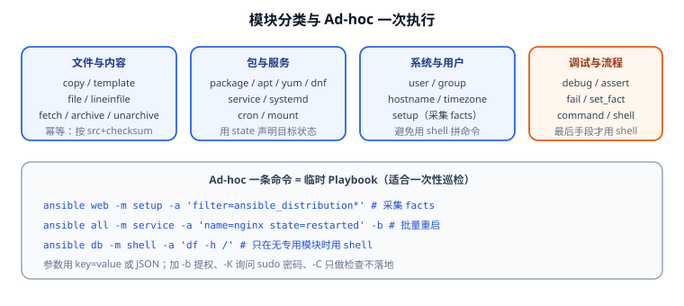

# 常用模块与 Ad-hoc

模块（Module）是 Ansible 真正"干活"的部分——每个模块是一段被推送到目标机执行的 Python 程序。用 Ansible 的核心能力之一，就是**知道该用哪个模块**：能用专用模块解决的，绝不用 `shell` 拼命令，因为专用模块自带幂等与错误处理。



## 模块的两条铁律

1. **优先用专用模块**：`copy`、`template`、`service` 都内置了"先检查再变更"的逻辑；`shell` 每次都执行。
2. **`state` 描述目标状态，不是动作**：写 `state: present`（要存在），而不是先 `present` 再改 `absent`。

```yaml
# 好的写法：声明目标状态
- name: 确保 nginx 已安装
  ansible.builtin.package:
    name: nginx
    state: present

# 不好的写法：把动作写进命令
- name: 装 nginx
  ansible.builtin.shell: apt-get install -y nginx
```

::: danger `shell` 的四个隐形地雷
1. **永远不是幂等的**：每次运行都返回 `changed`，让你的 `changed=0` 验收永远失败。
2. **不经过参数校验**：变量里带空格或引号就会拼坏命令，甚至变成命令注入。
3. **拿不到结构化结果**：只能靠解析 stdout 判断成功与否。
4. **`command` 也不解析 shell 语法**：管道、重定向、`&&` 都无效，必须用 `shell`；但一旦用 `shell` 就回到前三个问题。

**正确顺序**：先找有没有专用模块 → 没有则用 `command` → 确实需要 shell 特性（管道/重定向/通配）才用 `shell`，并配 `creates`/`removes`/`changed_when` 让它具备幂等语义。
:::

## 模块分类速查

| 类别 | 常用模块 | 说明 |
| --- | --- | --- |
| 文件与内容 | `copy`、`template`、`file`、`lineinfile`、`blockinfile`、`stat`、`fetch`、`synchronize` | 分发文件、改配置、检查存在性 |
| 压缩归档 | `archive`、`unarchive` | 打包与解包，`unarchive` 可 `remote_src` |
| 包管理 | `package`（通用）、`apt`、`yum`/`dnf`、`pip`、`gem` | `package` 自动适配发行版 |
| 服务管理 | `service`（通用）、`systemd` | 启停、开机自启、`daemon_reload` |
| 系统与用户 | `user`、`group`、`hostname`、`timezone`、`mount`、`cron`、`authorized_key` | 基线配置 |
| 网络与下载 | `get_url`、`uri` | 下载文件、调用 HTTP 接口 |
| 事实与调试 | `setup`、`debug`、`assert`、`fail`、`set_fact` | 采集信息、断言、临时变量 |
| 命令执行 | `command`、`shell`、`raw`、`script` | 兜底方案，谨慎使用 |
| 数据库/云 | `community.mysql`、`community.postgresql`、`amazon.aws.*` 等 | 需装对应集合 |

## 文件类：四个最常用

### copy：分发静态文件

```yaml
- name: 分发静态首页
  ansible.builtin.copy:
    src: files/index.html          # 控制节点上的相对路径（相对 playbook）
    dest: /var/www/html/index.html
    owner: root
    group: root
    mode: "0644"                   # 注意加引号，否则会当成八进制歧义
    backup: true                   # 覆盖前备份，便于回滚
```

### template：渲染带变量的配置

```yaml
- name: 渲染 nginx 主配置
  ansible.builtin.template:
    src: templates/nginx.conf.j2
    dest: /etc/nginx/nginx.conf
    mode: "0644"
    validate: "nginx -t -c %s"     # 语法校验通过才落地，关键安全网
  notify: restart nginx            # 只有内容变化时才触发 handler
```

::: tip `validate` 是改配置的保命符
`validate: "nginx -t -c %s"` 让 Ansible 先把新配置写到临时文件并校验，**校验失败就不覆盖原文件**。`sshd -t -f %s`、`httpd -t -f %s`、`visudo -cf %s` 同理。改这类"改错就服务起不来"的配置，务必加上。
:::

### file：管理权限与目录

```yaml
- name: 创建应用目录
  ansible.builtin.file:
    path: /opt/app/releases
    state: directory
    owner: app
    group: app
    mode: "0755"

- name: 删除废弃文件
  ansible.builtin.file:
    path: /etc/nginx/conf.d/default.conf
    state: absent
```

### lineinfile：精确改一行

```yaml
- name: 确保 SSH 禁止 root 登录
  ansible.builtin.lineinfile:
    path: /etc/ssh/sshd_config
    regexp: '^#?PermitRootLogin'
    line: "PermitRootLogin no"
    validate: "sshd -t -f %s"
  notify: restart sshd
```

## 包与服务

```yaml
- name: 安装基础软件包
  ansible.builtin.package:
    name:
      - curl
      - rsync
      - chrony
    state: present

- name: 确保 nginx 运行且开机自启
  ansible.builtin.systemd:
    name: nginx
    state: started
    enabled: true
    daemon_reload: true      # 改了 unit 文件后必须 reload
```

## 用户与基线

```yaml
- name: 创建部署用户
  ansible.builtin.user:
    name: deploy
    groups: [sudo, docker]
    append: true             # 追加而非覆盖已有组，务必显式声明
    shell: /bin/bash
    create_home: true

- name: 分发运维公钥
  ansible.builtin.authorized_key:
    user: deploy
    key: "{{ lookup('file', 'files/ops_ed25519.pub') }}"
    state: present

- name: 设置时区
  community.general.timezone:
    name: Asia/Shanghai
```

::: danger `append` 不写会移除用户的其他组
`user` 模块默认 `append: false`，即 `groups` 是**完整覆盖**。给已有用户加组时如果漏了 `append: true`，用户在原有组里的成员关系会被清掉（例如把 `deploy` 从 `docker` 组里踢出去导致容器跑不起来）。**给存量用户改组，永远显式写 `append: true`。**
:::

## 事实、调试与断言

```yaml
- name: 采集系统信息
  ansible.builtin.setup:
    filter: ansible_os_family

- name: 断言内存满足要求
  ansible.builtin.assert:
    that:
      - ansible_memtotal_mb >= 2048
      - ansible_distribution_major_version is version('22.04', '>=')
    fail_msg: "主机 {{ inventory_hostname }} 不满足最低配置"
    success_msg: "配置检查通过"

- name: 打印磁盘情况
  ansible.builtin.debug:
    msg: "根分区可用 {{ ansible_mounts | selectattr('mount','equalto','/') | map(attribute='size_available') | first | filesizeformat }}"
```

## Ad-hoc：临时命令

Ad-hoc 是"一次性 Playbook"，适合巡检、临时变更、验证连通性。

```shell
# 语法：ansible <模式> -m <模块> -a <参数> [选项]

# 1. 巡检：各主机磁盘使用率
ansible all -m shell -a 'df -h / | tail -1' -b

# 2. 批量重启服务
ansible web -m systemd -a 'name=nginx state=restarted' -b

# 3. 查看已安装的 Java 版本
ansible all -m command -a 'java -version'

# 4. 分发一个文件到所有 Web 主机
ansible web -m copy -a 'src=/tmp/motd dest=/etc/motd mode=0644' -b

# 5. 只做检查，不真正变更
ansible web -m systemd -a 'name=nginx state=restarted' -b --check --diff
```

常用选项：

| 选项 | 作用 |
| --- | --- |
| `-m <module>` | 指定模块，默认 `command` |
| `-a '<args>'` | 模块参数，`key=value` 或 JSON |
| `-b` / `--become` | 提权（sudo） |
| `-K` / `--ask-become-pass` | 交互输入提权密码 |
| `-C` / `--check` | 只检查不落地 |
| `-D` / `--diff` | 显示文件差异 |
| `--limit <pattern>` | 限制主机范围 |
| `-f <N>` | 并发数 |
| `-o` | 单行输出，便于 `grep` |

::: warning Ad-hoc 的变更不可复用
Ad-hoc 适合"看一眼"和"一次性救火"，**不适合作为变更记录**。任何需要重复执行的变更都应该写进 Playbook 或角色——否则下次换个人、换台机器，同样的操作就要重新"考古"一遍你的终端历史。
:::

## 验证方式

```shell
# 1. 查看模块文档（离线可用）
ansible-doc copy | sed -n '1,15p'
ansible-doc -s template      # 只看参数骨架

# 2. 用 check 模式预演（不会真的改）
ansible-playbook -i inventory.ini site.yml --check --diff

# 3. 幂等验证：连跑两遍，第二遍应无 changed
ansible-playbook -i inventory.ini site.yml | tail -3
ansible-playbook -i inventory.ini site.yml | tail -3
# 预期第二次：changed=0

# 4. 单模块 Ad-hoc 快速验证
ansible all -m package -a 'name=rsync state=present' -b --check
```

## 验证清单

- [ ] 所有变更类任务都有专用模块，无裸 `shell`（或 `shell` 已配 `creates`/`changed_when`）。
- [ ] 改配置类任务都带 `validate`。
- [ ] `--check --diff` 输出符合预期且无报错。
- [ ] 连续两次执行，第二次 `changed=0`。

## 参考资料

- 内置模块索引：[ansible.builtin modules](https://docs.ansible.com/ansible/latest/collections/ansible/builtin/index.html)
- Ad-hoc 命令：[Introduction to ad hoc commands](https://docs.ansible.com/ansible/latest/command_guide/intro_adhoc.html)
- 模块返回值：[Return Values](https://docs.ansible.com/ansible/latest/reference_appendices/common_return_values.html)
- 相关文档：[Playbook 编写](Playbook/index.md) / [角色、Galaxy 与 Collections](Role/index.md)
- 延伸阅读：[Linux 进阶 · systemd 服务管理](../../Linux/Advanced/Systemd/index.md)
