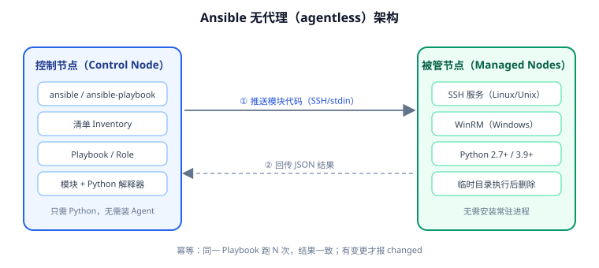

# 概述与选型

Ansible 是 Red Hat 维护的开源自动化工具，用于**配置管理、应用部署、编排与任务自动化**。它的最大特点是**无代理**：不需要在被管节点上安装任何常驻客户端，只要有 SSH 和 Python 就能被管理。

本页讲清三件事：它凭什么能做到无代理、它适合管什么、它和 Shell 脚本及其他配置管理工具到底差在哪。



## 一句话定位

| 维度 | 说明 |
| --- | --- |
| 是什么 | 声明式的自动化引擎，用 YAML 描述"目标状态"，由引擎计算并达成 |
| 解决什么问题 | 批量机器上的重复操作（装包、发版、改配置、重启服务）无法可靠复现 |
| 谁适合用 | 运维/后端/测试工程师，管理 10 台以上 Linux/Unix 主机，或需要可复现的交付流程 |
| 不适合谁 | 只有 1~2 台机器且变更极少（直接 SSH 更快）；需要毫秒级实时状态收敛的大规模集群（那是 Puppet/Chef 的强项） |

## 无代理是怎么做到的

传统配置管理工具（Puppet、Chef、SaltStack 的 minion 模式）需要被管节点常驻一个 agent 进程，定期拉取或接收指令。Ansible 走的是另一条路：

1. **连接复用 SSH**：控制节点通过标准 SSH 登录被管节点，不引入新端口、新协议。
2. **模块临时下发**：把要执行的模块打包成一个自包含的 Python 脚本，通过 stdin 或临时文件送过去。
3. **执行后销毁**：模块在被管节点本地执行，回传 JSON 结果，临时文件随即删除。
4. **无需常驻**：被管节点平时"Hibernate"，只在被调用时醒来——因此新机器开箱即可纳管。

::: danger 无代理的三个代价
1. **性能依赖 SSH 与并发**：每次任务都要建连（虽然有 ControlPersist 复用），大规模主机要用 `forks` 调并发。
2. **被管节点必须有 Python**：网络设备、嵌入式系统、极简容器镜像可能没有 Python，需要用 `raw` 模块或 `ansible.netcommon` 处理。
3. **状态不做持续收敛**：Ansible 只在"你运行它的那一刻"把状态拉齐；有人手工改坏了配置，它不会自动纠正，直到你下次运行。（这是设计取向，不是缺陷。）
:::

## 执行模型

一次 `ansible-playbook` 的宏观流程：

```text
解析 Playbook(YAML)
   ↓
加载清单(Inventory) → 确定目标主机集合
   ↓
按 play 顺序执行：
   ① 收集 facts（如未关闭 gather_facts）
   ② 加载变量（role defaults → group_vars → host_vars → play vars …）
   ③ 逐个 task 分发到目标主机并执行模块
   ④ task 报 changed 时通知对应 handler
   ⑤ play 结束时统一执行被通知的 handler
   ↓
汇总：ok / changed / unreachable / failed / skipped
```

关键机制是**幂等（idempotency）**：模块会先检查当前状态，只在需要时才变更。所以同一份 Playbook 跑第二遍，`changed` 数应该是 0——这一点在[实战](Practice/index.md)里会作为验收项。

## 与同类工具对比

| 工具 | 架构 | 语言 | 学习曲线 | 适用场景 |
| --- | --- | --- | --- | --- |
| **Shell 脚本** | 无 | Bash | 低 | 一次性任务、极简环境；**不可幂等、难复用、难测试** |
| **Ansible** | 无代理（SSH） | YAML | 低~中 | 配置管理、批量部署、编排；上手快、生态大 |
| **Puppet** | 有代理 | 自研 DSL | 高 | 超大规模、强状态收敛（金融/运营商） |
| **Chef** | 有代理 | Ruby DSL | 高 | 复杂逻辑、需要编程能力的场景 |
| **SaltStack** | 有代理（也支持无代理） | YAML + Python | 中~高 | 大规模实时执行、事件驱动 |
| **Terraform** | 无代理（API） | HCL | 中 | **基础设施供给**（创建机器/网络/云资源），与 Ansible 互补 |

::: tip Ansible 与 Terraform 的分工
**Terraform 负责"把机器造出来"（provision），Ansible 负责"把机器配置好"（configure）**。常见组合：Terraform 创建云主机并输出 IP → 动态清单交给 Ansible 做初始化与部署。两者不是替代关系。
:::

## 适用边界

**适合**：

- 批量初始化新服务器（用户、时区、内核参数、基础软件包）。
- 应用部署与滚动发布（配合 `serial` 做灰度）。
- 配置文件的模板化分发与变更（`template` + `handler`）。
- 跨环境的一致性巡检（只读任务 + `--check`）。
- 与 CI/CD 集成，做发布后的后置动作。

**不适合**：

- **实时状态收敛**：要求"任何时刻配置都必须符合预期"，Ansible 做不到（没有常驻守护进程）。
- **强顺序依赖的跨主机编排**，且要求极高吞吐（数千节点秒级）——此时要考虑 SaltStack 或专门的编排系统。
- **管理没有 Python 的古董设备**（需要用 `raw` 或 `network_cli` 特殊处理）。
- **代替容器编排**：K8s 里跑的应用用 K8s 自身机制管理更合适，Ansible 适合管理"K8s 集群本身"。

## 核心术语

| 术语 | 英文 | 含义 |
| --- | --- | --- |
| 控制节点 | Control Node | 运行 ansible 命令的机器，需要 Python |
| 被管节点 | Managed Node | 被管理的主机，需要 SSH 与 Python |
| 清单 | Inventory | 主机与组的定义文件（INI/YAML/动态） |
| 剧本 | Playbook | YAML 文件，描述要执行的一系列 play |
| 剧幕 | Play | 一次"面向某组主机执行一组任务"的单元 |
| 任务 | Task | 调用一个模块的最小执行单元 |
| 模块 | Module | 实际干活的 Python 程序（如 `copy`、`service`） |
| 处理器 | Handler | 只在被 `notify` 时才执行的任务（如重启服务） |
| 角色 | Role | 可复用的任务/变量/模板打包单元 |
| 事实 | Facts | 自动采集的被管节点信息（IP、OS、内存等） |
| 集合 | Collection | 模块/角色/插件的分发格式（Galaxy 上的包） |
| 幂等 | Idempotency | 重复执行结果一致，无变更时报告 `changed=0` |

## 验证方式

```shell
# 1. 确认版本与解释器
ansible --version
# 预期输出包含 ansible [core 2.21.x]、config file、python version

# 2. 确认内置模块可用
ansible-doc -l | wc -l
# 预期：列出数百个内置模块

# 3. 看一个模块的文档（离线，不需要网络）
ansible-doc copy | head -20
# 预期：显示 copy 模块的参数说明
```

## 参考资料

- Ansible 官方文档：[Ansible Documentation](https://docs.ansible.com/)
- 架构与工作原理：[How Ansible works](https://www.ansible.com/how-ansible-works)
- 模块索引：[Collection Index](https://docs.ansible.com/ansible/latest/collections/index_module.html)
- 相关文档：[安装与环境准备](Install/index.md) / [Playbook 编写](Playbook/index.md)
- 延伸阅读：[Linux 进阶 · Shell 脚本编程](../../Linux/Advanced/ShellScripting/index.md) / [Linux 进阶 · 进阶总览](../../Linux/Advanced/index.md)
