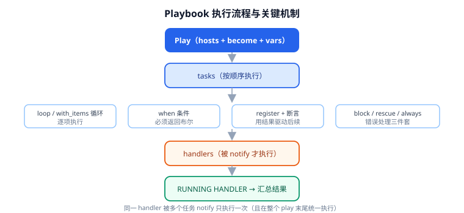

# Playbook 编写

Playbook 是 Ansible 的核心交付物：一个 YAML 文件，用"哪个组、按什么顺序、做什么"描述一次完整变更。本页覆盖结构、处理器、循环、条件、错误处理与灰度执行，并给出一份可以直接跑的完整示例。



## 骨架

```yaml [site.yml]
---
- name: 配置 Web 服务器          # play 名（必写，日志里靠它定位）
  hosts: web                    # 目标主机模式
  become: true                  # 本 play 内提权
  gather_facts: true            # 默认就采集 facts，显式写出来更清楚
  vars:
    nginx_port: 80
  tasks:
    - name: 确保 nginx 已安装
      ansible.builtin.package:
        name: nginx
        state: present

    - name: 渲染配置
      ansible.builtin.template:
        src: templates/nginx.conf.j2
        dest: /etc/nginx/nginx.conf
        validate: "nginx -t -c %s"
      notify: restart nginx

  handlers:
    - name: restart nginx
      ansible.builtin.systemd:
        name: nginx
        state: restarted
```

要点：

- 文件以 `---` 开头；顶层是 **play 的列表**（`-` 开头）。
- **每个 task 都要有 `name`**：没名字的任务在输出里只显示模块名，几十个任务时根本认不出是哪个。
- `hosts` 支持模式匹配与集合运算：`web`、`web:db`、`web:&prod`、`all:!db`。

## 处理器（handlers）

handler 是"**被通知才执行**"的特殊任务，典型用途是重启服务：

```yaml
tasks:
  - name: 更新配置
    ansible.builtin.template:
      src: nginx.conf.j2
      dest: /etc/nginx/nginx.conf
    notify: restart nginx

  - name: 更新 systemd unit
    ansible.builtin.template:
      src: app.service.j2
      dest: /etc/systemd/system/app.service
    notify:
      - daemon-reload
      - restart app

handlers:
  - name: restart nginx
    ansible.builtin.systemd:
      name: nginx
      state: restarted

  # listen 让多个 handler 响应同一个事件
  - name: daemon-reload
    ansible.builtin.systemd:
      daemon_reload: true
    listen: reload systemd
```

::: danger handler 的三个反直觉行为
1. **不会立即执行**：handler 在**整个 play 的任务都跑完之后**才统一执行。想让它在中间立刻跑，要显式 `- meta: flush_handlers`。
2. **多个任务 notify 同一个 handler 只执行一次**：即使 5 个配置都变了，重启也只会发生一次（这是优点，不是 bug）。
3. **任务被跳过（skipped）时不触发**：`when` 为假时任务不执行，`notify` 自然失效；`--check` 模式下 handler 也不会真正执行。
:::

## 循环

```yaml
- name: 安装一批软件包（推荐写法：模块原生支持列表）
  ansible.builtin.package:
    name:
      - curl
      - git
      - rsync
    state: present

- name: 批量创建用户（loop 写法）
  ansible.builtin.user:
    name: "{{ item.name }}"
    groups: "{{ item.groups }}"
    append: true
  loop:
    - { name: deploy, groups: sudo }
    - { name: app, groups: app }
  loop_control:
    label: "{{ item.name }}"     # 输出里只显示用户名，不刷屏整条 dict
```

::: tip 能用列表参数就别用 loop
`package`、`user`、`file` 等模块的 `name` 支持列表，一次调用批量处理，比 `loop` 快得多也更好读。`loop` 适合"每项的其它参数不同"或"需要逐项收集结果"的场景。
:::

## 条件（when）

```yaml
- name: 仅在 Debian 系安装
  ansible.builtin.package:
    name: nginx
    state: present
  when: ansible_os_family == "Debian"

- name: 多条件组合
  ansible.builtin.service:
    name: firewalld
    state: stopped
  when:
    - ansible_distribution_major_version | int >= 8
    - not ansible_check_mode
```

::: danger 2.19 起 `when` 必须是布尔表达式
旧版本里写 `when: inventory_hostname` 这种"非空即真"的写法能跑通，**ansible-core 2.19 起会直接报错**：

```text
Conditional result was 'localhost' of type 'str', which evaluates to True.
Conditionals must have a boolean result.
```

正确写法是给出显式布尔谓词：

```yaml
when: inventory_hostname | length > 0
when: some_list | length > 0
when: my_var is defined
```

临时降级为警告（仅用于迁移期）：`ALLOW_BROKEN_CONDITIONALS=warn`。详见 [常见问题与最佳实践](FAQ/index.md)。
:::

## 错误处理：block / rescue / always

```yaml
tasks:
  - block:
      - name: 备份当前版本
        ansible.builtin.command:
          cmd: /opt/app/bin/backup.sh
        changed_when: true

      - name: 部署新版本
        ansible.builtin.unarchive:
          src: "{{ artifact_url }}"
          dest: /opt/app/releases/{{ version }}
          remote_src: true

      - name: 切换软链
        ansible.builtin.file:
          src: /opt/app/releases/{{ version }}
          dest: /opt/app/current
          state: link

    rescue:
      - name: 部署失败，回滚到上一版本
        ansible.builtin.command:
          cmd: /opt/app/bin/rollback.sh
        changed_when: true

      - name: 显式失败，让整次执行如实报错
        ansible.builtin.fail:
          msg: "部署 {{ version }} 失败，已回滚"

    always:
      - name: 无论成败都清理临时目录
        ansible.builtin.file:
          path: /tmp/deploy-staging
          state: absent
```

## 标签（tags）

标签让"只跑一部分"成为可能，CI 里很实用：

```yaml
- name: 安装基础包
  ansible.builtin.package:
    name: nginx
    state: present
  tags: [packages, nginx]

- name: 渲染配置
  ansible.builtin.template:
    src: nginx.conf.j2
    dest: /etc/nginx/nginx.conf
  tags: [config, nginx]
```

```shell
ansible-playbook site.yml --tags config        # 只跑 config
ansible-playbook site.yml --skip-tags packages # 跳过 packages
ansible-playbook site.yml --list-tags          # 查看全部标签
ansible-playbook site.yml --list-tasks         # 查看将要执行的任务
```

::: warning 用 `import_tasks` + `tags`，别给整个 role 打标签
给 `roles:` 整体加 `tags` 会让角色内**所有**任务都带上该标签，粒度太粗，且 `--skip-tags` 很难精细控制。推荐在任务级别打标签，或在 `import_tasks` 上打标签（静态导入会继承标签）。
:::

## 灰度与并发控制

```yaml
- name: 滚动发布
  hosts: web
  serial: 1                 # 一次只处理 1 台；也可写 "30%" 或 [1, 2, 5]
  max_fail_percentage: 0    # 任何一台失败就整体停止
  order: shuffle            # 打乱顺序，避免总是先打同一台
  tasks:
    - name: 从负载均衡摘除
      ansible.builtin.uri:
        url: "http://lb.internal/api/remove?host={{ inventory_hostname }}"
        method: POST
      delegate_to: localhost

    - name: 部署
      ansible.builtin.include_role:
        name: app

    - name: 健康检查
      ansible.builtin.uri:
        url: "http://{{ inventory_hostname }}/healthz"
        status_code: 200
      register: uri_result
      retries: 10            # 共重试 10 次（合计 11 次），每次间隔 delay
      delay: 3
      until: uri_result.status == 200

    - name: 重新挂回负载均衡
      ansible.builtin.uri:
        url: "http://lb.internal/api/add?host={{ inventory_hostname }}"
        method: POST
      delegate_to: localhost
```

| 关键字 | 作用 |
| --- | --- |
| `serial` | 分批大小（数字、百分比或列表） |
| `max_fail_percentage` | 失败比例超过阈值就停止后续批次 |
| `order` | 主机处理顺序（`inventory`/`reverse_inventory`/`sorted`/`shuffle`） |
| `strategy` | `linear`（默认，全部主机同步推进）/ `free`（各主机各自跑完） |
| `any_errors_fatal` | 任一主机失败即终止整个 play |
| `delegate_to` | 把任务委托给另一台主机执行 |
| `run_once` | 只在一台主机上执行一次（适合调一次负载均衡 API） |

## 幂等与检查

| 关键字 | 用途 |
| --- | --- |
| `changed_when` | 修正模块误报的 changed |
| `failed_when` | 自定义失败条件 |
| `ignore_errors` | 忽略失败继续（**慎用**，会掩盖真问题） |
| `check_mode: false` | 让某任务在 `--check` 时也真实执行（如只读查询） |
| `no_log` | 不记录该任务输出（含密码时必写） |

```yaml
- name: 检查服务是否已注册（只读，check 模式下也执行）
  ansible.builtin.command:
    cmd: /opt/app/bin/is-registered.sh
  register: reg
  changed_when: false
  check_mode: false
  failed_when: reg.rc not in [0, 1]
```

::: danger `ignore_errors: true` 是技术债的温床
它让任务失败后继续，但**不会让后续依赖该结果的任务变正确**——通常是制造"跑完了但服务起不来"的假成功。需要容错时优先用 `block/rescue` + `failed_when`，把错误显式处理掉。
:::

## 验证方式

```shell
# 1. 语法检查（不连接主机，最快）
ansible-playbook -i inventory.ini site.yml --syntax-check

# 2. 查看将执行的任务与标签
ansible-playbook -i inventory.ini site.yml --list-tasks
ansible-playbook -i inventory.ini site.yml --list-tags

# 3. 演练：只检查差异，不落地
ansible-playbook -i inventory.ini site.yml --check --diff

# 4. 灰度到单机
ansible-playbook -i inventory.ini site.yml --limit web-01

# 5. 幂等验收：第二遍应无 changed
ansible-playbook -i inventory.ini site.yml | tail -5
# 预期：changed=0, failed=0, unreachable=0
```

## 验证清单

- [ ] `--syntax-check` 通过。
- [ ] 所有任务都有 `name`。
- [ ] `--check --diff` 输出符合预期。
- [ ] 第二次执行 `changed=0`。
- [ ] 失败路径用 `block/rescue` 覆盖，不依赖 `ignore_errors`。

## 参考资料

- Playbook 指南：[Ansible Playbooks](https://docs.ansible.com/ansible/latest/playbook_guide/index.html)
- 处理器：[Handlers](https://docs.ansible.com/ansible/latest/playbook_guide/playbooks_handlers.html)
- 错误处理：[Blocks](https://docs.ansible.com/ansible/latest/playbook_guide/playbooks_blocks.html)
- 2.19 移植指南：[Porting Guide 2.19](https://docs.ansible.com/ansible/latest/porting_guides/porting_guide_core_2.19.html)
- 相关文档：[常用模块与 Ad-hoc](Module/index.md) / [变量、Facts 与模板](Variable/index.md)
