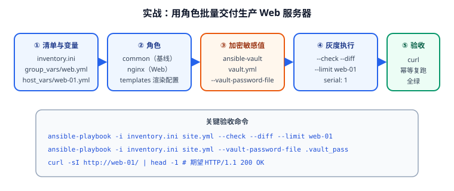

# 实战：批量交付生产 Web 服务器

本页把前面所有知识串成一条可执行链路：**清单 → 角色 → 加密变量 → 灰度执行 → 幂等验收**。目标是从零把 3 台新买的机器变成一组配置一致、可直接接流量的 Nginx 集群。



## 需求与验收指标

业务需求：

1. 3 台新机器（web-01/02/03）需要统一基线：时区、软件源、基础包、SSH 加固。
2. 安装并配置 Nginx，站点根目录与端口按环境区分，配置文件由模板生成。
3. 证书私钥等敏感信息不能明文进 Git。
4. 首次上线要能灰度：先做 1 台，验证通过再全量。
5. 任何一次执行都不能"重复变更"，便于 CI 里判断是否需要发布。

验收指标（可量化）：

| 指标 | 目标 | 验证方式 |
| --- | --- | --- |
| 全部主机连通 | 3/3 SUCCESS | `ansible all -m ping` |
| 配置一致性 | 3 台 nginx.conf 内容一致 | 按 checksum 分组比对 |
| 幂等性 | 第二次执行 `changed=0` | 连续执行两次比对统计行 |
| 服务可用 | HTTP 返回 200 | `curl -sI` |
| 配置安全网 | 语法错误时不落地 | 故意写错模板后 `--check` 应报错 |
| 机密不泄露 | Git 里无明文私钥 | `git grep` 检查 |

## 第一步：目录结构与清单

```text
ansible-web/
├─ ansible.cfg
├─ inventory.ini
├─ group_vars/
│  ├─ all.yml
│  ├─ all/
│  │  └─ vault.yml          # 加密文件（后面生成）
│  └─ web.yml
├─ host_vars/
│  └─ web-01.yml
├─ roles/
│  ├─ common/
│  └─ nginx/
├─ collections/
│  └─ requirements.yml
├─ site.yml
└─ .vault_pass               # 密码文件（必须 .gitignore）
```

```ini [ansible.cfg]
[defaults]
inventory         = ./inventory.ini
roles_path        = ./roles
collections_path  = ./collections
host_key_checking = True
forks             = 20
stdout_callback   = yaml
log_path          = ./ansible.log
# 未定义变量直接失败，避免模板静默生成空配置
error_on_undefined_vars = True

[privilege_escalation]
become          = True
become_method   = sudo
become_user     = root
become_ask_pass = False

[ssh_connection]
pipelining = True
```

```ini [inventory.ini]
[web]
web-01 ansible_host=192.168.10.11
web-02 ansible_host=192.168.10.12
web-03 ansible_host=192.168.10.13

[web:vars]
ansible_user=ops
ansible_python_interpreter=/usr/bin/python3

[prod:children]
web

[prod:vars]
env=production
```

```yaml [group_vars/all.yml]
timezone: Asia/Shanghai
extra_packages:
  - curl
  - rsync
  - chrony
  - vim
```

```yaml [group_vars/web.yml]
nginx_port: 80
nginx_worker_processes: 2
nginx_worker_connections: 2048
nginx_server_name: "{{ ansible_facts['hostname'] }}"
nginx_root: /var/www/html
site_title: "生产环境站点"
```

```yaml [host_vars/web-01.yml]
# web-01 承担更多流量，单独调大 worker
nginx_worker_processes: 4
```

::: warning `.vault_pass` 和 `*.log` 必须进 `.gitignore`
``` text
.vault_pass
*.log
collections/
```
密码文件一旦提交，加密就形同虚设。**先写 `.gitignore` 再生成密码文件**，顺序反了很容易顺手 commit 进去。
:::

## 第二步：角色 common（基线）

```shell
ansible-galaxy init --init-path roles common
ansible-galaxy init --init-path roles nginx
```

```yaml [roles/common/defaults/main.yml]
common_ntp_enabled: true
```

```yaml [roles/common/tasks/main.yml]
---
- name: 设置时区
  community.general.timezone:
    name: "{{ timezone }}"

- name: 安装基础软件包
  ansible.builtin.package:
    name: "{{ extra_packages }}"
    state: present

- name: 确保 chrony 运行且开机自启
  ansible.builtin.systemd:
    name: chrony
    state: started
    enabled: "{{ common_ntp_enabled }}"

- name: 加固 SSH —— 禁止 root 直接登录
  ansible.builtin.lineinfile:
    path: /etc/ssh/sshd_config
    regexp: '^#?PermitRootLogin'
    line: "PermitRootLogin no"
    validate: "sshd -t -f %s"
  notify: restart sshd

- name: 加固 SSH —— 禁止空密码
  ansible.builtin.lineinfile:
    path: /etc/ssh/sshd_config
    regexp: '^#?PermitEmptyPasswords'
    line: "PermitEmptyPasswords no"
    validate: "sshd -t -f %s"
  notify: restart sshd
```

```yaml [roles/common/handlers/main.yml]
---
- name: restart sshd
  ansible.builtin.systemd:
    name: sshd
    state: restarted
```

## 第三步：角色 nginx

```yaml [roles/nginx/defaults/main.yml]
nginx_port: 80
nginx_worker_processes: 2
nginx_worker_connections: 1024
nginx_server_name: "{{ ansible_facts['hostname'] }}"
nginx_root: /var/www/html
site_title: "Welcome"
```

```yaml [roles/nginx/vars/main.yml]
# 实现细节，不允许被外部覆盖
nginx_package_name: nginx
nginx_service_name: nginx
nginx_conf_path: /etc/nginx/nginx.conf
nginx_site_conf: /etc/nginx/conf.d/site.conf
```

```yaml [roles/nginx/tasks/main.yml]
---
- name: 安装 Nginx
  ansible.builtin.package:
    name: "{{ nginx_package_name }}"
    state: present

- name: 渲染 nginx 主配置（含语法校验）
  ansible.builtin.template:
    src: nginx.conf.j2
    dest: "{{ nginx_conf_path }}"
    owner: root
    group: root
    mode: "0644"
    validate: "nginx -t -c %s"
    backup: true
  notify: reload nginx

- name: 渲染站点配置
  ansible.builtin.template:
    src: site.conf.j2
    dest: "{{ nginx_site_conf }}"
    mode: "0644"
    validate: "nginx -t -c %s"
    backup: true
  notify: reload nginx

- name: 创建站点根目录
  ansible.builtin.file:
    path: "{{ nginx_root }}"
    state: directory
    owner: root
    group: root
    mode: "0755"

- name: 渲染首页
  ansible.builtin.template:
    src: index.html.j2
    dest: "{{ nginx_root }}/index.html"
    mode: "0644"

- name: 确保 Nginx 运行且开机自启
  ansible.builtin.systemd:
    name: "{{ nginx_service_name }}"
    state: started
    enabled: true
```

```yaml [roles/nginx/handlers/main.yml]
---
- name: reload nginx
  ansible.builtin.systemd:
    name: "{{ nginx_service_name }}"
    state: reloaded
```

``` jinja [roles/nginx/templates/nginx.conf.j2]
# {{ ansible_managed }}
worker_processes  {{ nginx_worker_processes }};

events {
    worker_connections  {{ nginx_worker_connections }};
}

http {
    include           /etc/nginx/mime.types;
    default_type      application/octet-stream;
    sendfile          on;
    keepalive_timeout 65;

    include /etc/nginx/conf.d/*.conf;
}
```

``` jinja [roles/nginx/templates/site.conf.j2]
# {{ ansible_managed }}
server {
    listen       {{ nginx_port }};
    server_name  {{ nginx_server_name }};
    root         {{ nginx_root }};
    index        index.html;

    location /healthz {
        access_log off;
        return 200 "ok\n";
    }
}
```

``` jinja [roles/nginx/templates/index.html.j2]
<!DOCTYPE html>
<html lang="zh-CN">
<head>
  <meta charset="utf-8">
  <title>{{ site_title }}</title>
</head>
<body>
  <h1>{{ site_title }}</h1>
  <p>主机：{{ ansible_facts['hostname'] }}</p>
  <p>环境：{{ env | default('unknown') }}</p>
</body>
</html>
```

::: tip `reload` 而不是 `restart`
改 Nginx 配置用 `state: reloaded`，它做平滑重载、不断连接；`restarted` 会断开现有连接。**只有在改了监听端口或 systemd unit 时才需要 restart**。
:::

## 第四步：用 Vault 加密敏感变量

证书私钥不能明文进 Git。用 `ansible-vault` 加密单个变量文件：

```shell
# 1. 生成密码文件（先确保 .gitignore 已包含 .vault_pass）
openssl rand -base64 32 > .vault_pass
chmod 600 .vault_pass

# 2. 创建加密文件（会打开 $EDITOR 让你写内容）
ansible-vault create group_vars/all/vault.yml \
  --vault-password-file .vault_pass
```

在编辑器里写：

```yaml
# group_vars/all/vault.yml（加密后整体不可读）
vault_db_password: "S3cr3t!2026"
vault_tls_key_b64: "LS0tLS1CRUdJTiBQUklWQVRFIEtFWS0tLS0t..."
```

常用命令：

| 命令 | 作用 |
| --- | --- |
| `ansible-vault create <file>` | 新建并加密 |
| `ansible-vault edit <file>` | 解密编辑后重新加密 |
| `ansible-vault view <file>` | 只读查看（不落盘明文） |
| `ansible-vault encrypt <file>` | 加密已有明文文件 |
| `ansible-vault decrypt <file>` | 解密（**慎用**，容易误提交） |
| `ansible-vault rekey <file>` | 更换密码 |
| `ansible-vault encrypt_string '<value>' --name '<var>'` | 只加密一个值，适合内联 |

**只加密单个值**（更细粒度，便于 diff）：

```shell
ansible-vault encrypt_string 'S3cr3t!2026' --name 'vault_db_password' \
  --vault-password-file .vault_pass
# 输出形如：
# vault_db_password: !vault |
#           $ANSIBLE_VAULT;1.1;AES256
#           62313364...
```

在 Playbook 里引用加密变量：

```yaml
- name: 渲染含密码的应用配置
  ansible.builtin.template:
    src: app.env.j2
    dest: /etc/app/app.env
    mode: "0600"          # 含机密的文件权限必须收紧
  no_log: true            # 不把变量值打进日志
```

```shell
# 运行：指定密码文件
ansible-playbook -i inventory.ini site.yml --vault-password-file .vault_pass

# 交互式输入密码
ansible-playbook -i inventory.ini site.yml --ask-vault-pass
```

::: danger Vault 的四个高频事故
1. **密钥文件被提交**：`.vault_pass` 忘了进 `.gitignore`。加密等于白做。
2. **忘了 `no_log: true`**：含密码的模块参数会被写进 `ansible.log` 和终端输出。
3. **`decrypt` 后忘记重新加密**：明文文件留在磁盘上，下次 commit 直接泄露。
4. **`--vault-id` 多密码场景搞混**：一个项目存在多套密码（dev/prod）时，必须用 `--vault-id dev@.vault_pass_dev --vault-id prod@.vault_pass_prod` 显式指定，否则会报 `no vault secrets found`。

**权限收紧**：含机密的落地文件用 `mode: "0600"`，并把密码文件权限设为 `600`。
:::

## 第五步：串联与灰度

```yaml [site.yml]
---
- name: 应用基线配置
  hosts: prod
  become: true
  roles:
    - common

- name: 部署 Web 服务
  hosts: web
  become: true
  serial: 1                  # 一次一台，配合负载均衡做灰度
  max_fail_percentage: 0     # 任何一台失败立即停止
  roles:
    - role: nginx
      vars:
        site_title: "生产环境站点"
```

```shell
# 1. 语法检查
ansible-playbook -i inventory.ini site.yml --syntax-check

# 2. 演练：看将发生什么变更（不落地）
ansible-playbook -i inventory.ini site.yml \
  --vault-password-file .vault_pass --check --diff

# 3. 灰度第一批：只做 web-01
ansible-playbook -i inventory.ini site.yml \
  --vault-password-file .vault_pass --limit web-01

# 4. 验证 web-01 正常后再全量
ansible-playbook -i inventory.ini site.yml \
  --vault-password-file .vault_pass
```

## 第六步：验收

```shell
# 1. 全量连通
ansible all -m ping
# 预期：3/3 SUCCESS，无 UNREACHABLE

# 2. 服务可用性
curl -sI http://192.168.10.11/ | head -1
# 预期：HTTP/1.1 200 OK

# 3. 健康检查端点
curl -s http://192.168.10.11/healthz
# 预期：ok

# 4. 配置一致性：按 checksum 分组，应当只有一组
ansible web -m stat -a 'path=/etc/nginx/nginx.conf get_checksum=true' -b \
  | grep -E 'checksum|SUCCESS' | sort -u

# 5. 幂等验收：第二次执行必须 changed=0
ansible-playbook -i inventory.ini site.yml \
  --vault-password-file .vault_pass | tail -4
# 预期：changed=0  failed=0  unreachable=0

# 6. 机密未泄露检查
git grep -n -E 'S3cr3t|BEGIN (RSA|OPENSSH|PRIVATE)' -- . && echo "发现明文机密！" || echo "未发现明文机密"
```

## 验收清单

- [ ] `ansible all -m ping` 全部 SUCCESS。
- [ ] `--check --diff` 无报错、变更范围符合预期。
- [ ] 灰度先单机、验证通过再全量。
- [ ] 3 台机器 `nginx.conf` checksum 一致。
- [ ] 第二次执行 `changed=0`。
- [ ] `curl` 首页与 `/healthz` 均返回正常。
- [ ] 故意写错模板语法，`--check` 因 `validate` 失败而报错（安全网有效）。
- [ ] `git grep` 未发现明文机密；`.vault_pass` 未被跟踪。
- [ ] `ansible-vault view` 能正常读出加密变量。

## 参考资料

- Vault 指南：[Encrypting content with Ansible Vault](https://docs.ansible.com/ansible/latest/vault_guide/index.html)
- 角色最佳实践：[Roles best practices](https://docs.ansible.com/ansible/latest/tips_tricks/ansible_tips_tricks.html)
- 滚动更新：[Rolling update batch size](https://docs.ansible.com/ansible/latest/playbook_guide/playbooks_delegation.html)
- 相关文档：[角色、Galaxy 与 Collections](Role/index.md) / [Playbook 编写](Playbook/index.md)
- 延伸阅读：[Linux 进阶 · 安全加固](../../Linux/Advanced/SecurityHardening/index.md) / [Linux 进阶 · 定时任务](../../Linux/Advanced/CronTasks/index.md)
