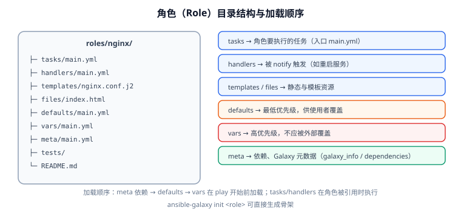

# 角色、Galaxy 与 Collections

当 Playbook 超过 200 行、或者同一套逻辑要在多个项目复用时，就该抽成**角色（Role）**。角色是 Ansible 的模块化单元：把任务、变量、模板、处理器按固定目录结构打包，对外只暴露"变量接口"。



## 为什么要角色

| 没有角色 | 有了角色 |
| --- | --- |
| 所有 task 堆在 `site.yml`，几百行看不出结构 | 每个能力一个目录（nginx / postgres / app） |
| 变量、模板散落各处 | 变量集中在 `defaults`（可覆盖）与 `vars`（受保护） |
| 复制粘贴到新项目 | `requirements.yml` 一行拉起 |
| 无法单测 | 可用 `molecule` 之类工具独立测试 |

## 目录结构

```text
roles/nginx/
├─ tasks/
│  └─ main.yml          # 入口，按顺序执行
├─ handlers/
│  └─ main.yml          # 被 notify 触发
├─ templates/
│  └─ nginx.conf.j2     # 渲染后分发
├─ files/
│  └─ index.html        # 原样分发
├─ defaults/
│  └─ main.yml          # 最低优先级，供使用者覆盖
├─ vars/
│  └─ main.yml          # 高优先级，角色内部固定值
├─ meta/
│  └─ main.yml          # 依赖声明 + Galaxy 元信息（作者、许可证、平台）
├─ tests/
│  └─ test.yml          # 角色自身的测试 playbook
└─ README.md            # 变量说明（对外接口文档）
```

::: tip 只创建你需要的目录
`ansible-galaxy init` 会生成全套目录（含 `tests/`、`.travis.yml` 等模板文件）。实际项目里常见的做法是**只保留用到的目录**——空目录会让阅读者困惑"这里是不是漏了内容"。
:::

## 创建骨架

```shell
# 1. 生成角色骨架
ansible-galaxy init --init-path roles nginx
# 预期：创建 roles/nginx/ 及标准子目录

# 2. 查看结果
find roles/nginx -type d | sort
```

## defaults 与 vars 的分工

这是角色设计里最关键的一条约定：

```yaml [roles/nginx/defaults/main.yml]
# 使用者的"配置接口"：允许被 group_vars / host_vars / -e 覆盖
nginx_port: 80
nginx_worker_processes: 2
nginx_worker_connections: 1024
nginx_server_name: "{{ ansible_facts['hostname'] }}"
nginx_root: /var/www/html
```

```yaml [roles/nginx/vars/main.yml]
# 角色内部的实现细节：不应被外部覆盖
nginx_package_name: nginx
nginx_service_name: nginx
nginx_config_dir: /etc/nginx
nginx_conf_path: /etc/nginx/nginx.conf
```

::: danger 把"可配置项"写进 `vars/` 是个常见事故
`vars/` 的优先级高于 `group_vars` 和 `host_vars`，只有 `-e` 能压过它。结果就是：使用者在 `host_vars` 里改了 `nginx_port: 8080`，**却完全不生效**，排查半天才发现角色把它写死在 `vars/` 里了。

**判断标准**：这个值会因环境/主机而不同吗？会 → 放 `defaults/`；不会（是角色的实现细节） → 放 `vars/`。
:::

## meta：依赖与元信息

```yaml [roles/nginx/meta/main.yml]
galaxy_info:
  role_name: nginx
  author: ops-team
  description: 安装并配置 Nginx
  license: MIT
  min_ansible_version: "2.20"
  platforms:
    - name: Ubuntu
      versions: [jammy, noble]
    - name: EL
      versions: ["9"]
  galaxy_tags: [nginx, web]

# 依赖：被引用时先自动执行
dependencies:
  - role: common
    vars:
      common_timezone: Asia/Shanghai
```

::: warning `dependencies` 里的 `vars` 优先级很高
`meta/main.yml` 的 `dependencies` 中传的 `vars` 会以较高优先级注入被依赖角色，**可能压过 `group_vars`**。若发现"依赖角色的变量改不动"，先检查这里。
:::

## 在 Playbook 中使用角色

三种方式，用途不同：

```yaml
# 方式一：roles 关键字（静态，最简单，适合固定顺序）
- hosts: web
  become: true
  roles:
    - common
    - role: nginx
      vars:
        nginx_port: 8080        # 角色参数，覆盖 defaults
    - role: app
      when: enable_app | bool    # 角色级条件

# 方式二：import_role（静态导入，编译期展开，标签会继承）
- hosts: web
  tasks:
    - name: 导入 nginx 角色
      ansible.builtin.import_role:
        name: nginx
      vars:
        nginx_port: 8080
      tags: [nginx]

# 方式三：include_role（动态，运行期解析，支持 loop 与动态 name）
- hosts: web
  tasks:
    - name: 按列表逐个应用角色
      ansible.builtin.include_role:
        name: "{{ item }}"
      loop:
        - common
        - nginx
```

| 特性 | `roles:` | `import_role` | `include_role` |
| --- | --- | --- | --- |
| 解析时机 | 静态 | 静态（预编译） | 动态（运行时） |
| 支持 `loop` | 否 | 否 | **是** |
| `name` 可用变量 | 否 | 否 | **是** |
| `--list-tasks` 可见 | 是 | 是 | 否 |
| 与 `tags` 交互 | 任务级标签有效 | 继承导入处标签 | 只响应 `always`/动态 |

::: tip 优先用 `import_role`，需要动态才用 `include_role`
`import_role` 在编译期展开，`--list-tasks` / `--list-tags` 都能看到真实任务，`tags` 行为也更符合直觉。`include_role` 虽然灵活，但会让 `--list-tasks` 变成一个"include_role"占位，调试体验差，且标签行为反直觉。
:::

## Galaxy：安装现成角色

```yaml [requirements.yml]
---
roles:
  - name: geerlingguy.nginx
    version: "3.1.4"

  # 私有 Git 仓库
  - name: internal.baseline
    src: git@git.internal:ops/ansible-role-baseline.git
    scm: git
    version: v2.3.0

  # tarball
  - name: custom.monitoring
    src: https://artifacts.internal/ansible/role-monitoring-1.4.2.tar.gz
```

```shell
# 安装到 roles/ 目录
ansible-galaxy role install -r requirements.yml -p roles

# 查看已安装
ansible-galaxy role list -p roles

# 更新（会按 version 重新拉取）
ansible-galaxy role install -r requirements.yml -p roles --force
```

## Collections：现代模块的分发单位

ansible-core 2.10 起，社区模块从"内置"迁移到**集合（Collection）**。集合是比角色更大的包，可以同时含模块、插件、角色。

```yaml [collections/requirements.yml]
---
collections:
  - name: community.general
    version: ">=11.0.0"
  - name: ansible.posix
    version: "2.1.0"
  - name: community.mysql
    version: "3.14.0"
```

```shell
# 安装集合（默认装到 ~/.ansible/collections）
ansible-galaxy collection install -r collections/requirements.yml

# 装到项目内（推荐，便于版本固定与隔离）
ansible-galaxy collection install -r collections/requirements.yml -p ./collections

# 列出已安装
ansible-galaxy collection list | head -20
```

**用 FQCN 引用模块**（推荐，避免重名歧义）：

```yaml
- name: 设置时区（来自 community.general 集合）
  community.general.timezone:
    name: Asia/Shanghai
```

::: danger ansible-core 2.21 起，`ansible-galaxy` 会拒绝"不兼容"的集合
2.21.0 的行为变更：`ansible-galaxy role install` / `collection install|download` 遇到声明了 `requires_ansible` 且**与当前 core 版本不兼容**的集合时，**默认直接跳过不安装**（旧版本是装上去、加载时才报错）。

这会导致升级 core 后"某些集合突然装不上"。处理方式：

- 优先升级集合到支持新 core 的版本；
- 确实需要绕过时，设 `COLLECTIONS_ON_ANSIBLE_VERSION_MISMATCH=ignore`（恢复旧行为，但加载时仍会失败）。

另外 2.21.1 修复了 `ansible-galaxy` 安装角色时把依赖作为参数传给 `git clone` 的安全问题（CVE-2026-11332），涉及该版本的建议尽快升级到 2.21.1+。
:::

## 角色命名与复用约定

| 约定 | 说明 |
| --- | --- |
| 一个角色只做一件事 | `nginx`、`postgresql`、`app-deploy`，而非 `web-stack` |
| 对外接口写进 README | 列出所有 `defaults` 变量及其含义、默认值 |
| 变量加角色前缀 | `nginx_port` 而不是 `port`，避免与其它角色冲突 |
| 不在角色里写机密 | 机密用 Vault 注入（见[实战](Practice/index.md)） |
| 版本固定 | `requirements.yml` 里写明确版本号，不写 `latest` |

## 验证方式

```shell
# 1. 角色骨架与语法
ansible-playbook -i inventory.ini site.yml --syntax-check

# 2. 确认角色被正确加载（能列出角色内任务）
ansible-playbook -i inventory.ini site.yml --list-tasks | grep -A2 nginx

# 3. 角色依赖已满足
ansible-galaxy role list -p roles
ansible-galaxy collection list -p ./collections

# 4. 单独跑某个角色（用角色自带 tests 或 --tags）
ansible-playbook -i inventory.ini site.yml --tags nginx --check --diff

# 5. 变量接口是否符合预期
ansible-inventory -i inventory.ini --host web-01 | grep nginx_
```

## 验证清单

- [ ] `--list-tasks` 能看到角色内部任务（说明用了静态导入）。
- [ ] 所有可配置项都在 `defaults/`，`host_vars` 覆盖生效。
- [ ] `requirements.yml` 中角色与集合版本都固定。
- [ ] 角色对外接口在 README 中有说明。
- [ ] `ansible-galaxy collection list` 无 `requires_ansible` 不兼容告警。

## 参考资料

- 角色指南：[Roles](https://docs.ansible.com/ansible/latest/playbook_guide/playbooks_reuse_roles.html)
- Galaxy 用户指南：[Galaxy User Guide](https://docs.ansible.com/ansible/latest/galaxy/user_guide.html)
- 集合索引：[Ansible Collections](https://docs.ansible.com/ansible/latest/collections/index.html)
- 2.21 移植指南：[Porting Guide 2.21](https://docs.ansible.com/ansible/latest/porting_guides/porting_guide_core_2.21.html)
- 相关文档：[Playbook 编写](Playbook/index.md) / [实战：批量交付生产 Web 服务器](Practice/index.md)
