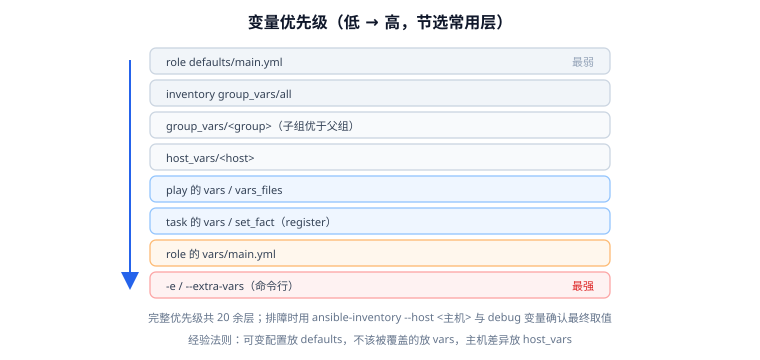

# 变量、Facts 与模板

Ansible 里最容易翻车的地方不是语法，而是**变量从哪来、谁覆盖谁**。本页把变量来源、优先级、facts 采集与 Jinja2 模板一次讲清，目标是让你能在 30 秒内定位"这个变量为什么取到了这个值"。



## 变量从哪来

| 来源 | 写法 | 典型用途 | 优先级 |
| --- | --- | --- | --- |
| 角色默认值 | `roles/x/defaults/main.yml` | 可被使用者覆盖的默认配置 | 最低 |
| 清单组变量 | `group_vars/all.yml`、`group_vars/web.yml` | 按环境/角色的公共配置 | 低 |
| 主机变量 | `host_vars/web-01.yml` | 单机差异 | 中 |
| play 变量 | `vars:` / `vars_files:` | 本次执行专属 | 中高 |
| 任务变量 | task 的 `vars:` | 只对该任务生效 | 高 |
| register / set_fact | `register:` / `set_fact:` | 运行时计算结果 | 高 |
| 角色变量 | `roles/x/vars/main.yml` | 角色强约束（不应被覆盖） | 高 |
| 命令行 | `-e` / `--extra-vars` | 临时覆盖一切 | 最高 |

完整优先级有 20 多层，**记忆法**：`defaults` < 清单 < play < task < 角色 vars < `-e`。

## 变量命名与类型

```yaml
# 命名：字母/数字/下划线，不能以数字开头，推荐全小写蛇形
app_name: myapp
app_port: 8080
app_debug: false

# 列表
region_list:
  - cn-north
  - cn-east

# 字典
app_db:
  host: db-01
  port: 3306
  name: appdb
```

```yaml
# 访问方式：点号 或 方括号（键含特殊字符时必须用方括号）
- ansible.builtin.debug:
    msg:
      - "{{ app_db.host }}"
      - "{{ app_db['port'] }}"
      - "{{ region_list[0] }}"
```

::: danger 变量名不要和 Python/Jinja 关键字撞车
`type`、`items`、`values`、`keys`、`list`、`dict`、`print`、`int`、`str`、`range` 这些名字与 Jinja2 内置过滤器/方法同名，会导致"变量取到了方法对象"这类诡异现象。**用带前缀的名字规避**：`app_type`、`db_items`、`user_list`。
:::

## register 与 set_fact

```yaml
- name: 查询当前版本
  ansible.builtin.command:
    cmd: /opt/app/bin/app --version
  register: app_ver          # 把结果存进寄存器变量
  changed_when: false

- name: 打印版本
  ansible.builtin.debug:
    msg: "stdout={{ app_ver.stdout }} rc={{ app_ver.rc }}"

- name: 计算部署目录
  ansible.builtin.set_fact:
    release_dir: "/opt/app/releases/{{ app_ver.stdout }}"
    # cacheable: true 会把该变量写入 facts 缓存，跨 play 可用（需开启缓存）
    cacheable: true
```

`register` 的常用字段：

| 字段 | 含义 |
| --- | --- |
| `stdout` / `stderr` | 标准输出/错误（字符串） |
| `stdout_lines` | 按行切分后的列表 |
| `rc` | 返回码 |
| `changed` | 是否报告变更 |
| `failed` / `skipped` | 是否失败/跳过 |
| `results` | `loop` 时每项的结果列表 |

::: warning `register` 变量不能跨主机直接读
`register` 只绑定到**执行该任务的那台主机**。想读别的主机的结果，要用 `hostvars`：

```yaml
- ansible.builtin.debug:
    msg: "web-01 的版本是 {{ hostvars['web-01'].app_ver.stdout }}"
```

想全局共享一个值，用 `set_fact` + `run_once: true`，或写成 `-e`。
:::

## Facts：自动采集的主机信息

`gather_facts: true`（默认）时，play 开始前会执行等效于 `setup` 模块的采集：

```yaml
- name: 常用 facts
  ansible.builtin.debug:
    msg:
      - "主机名: {{ ansible_facts['hostname'] }}"
      - "发行版: {{ ansible_facts['distribution'] }} {{ ansible_facts['distribution_version'] }}"
      - "内存MB: {{ ansible_facts['memtotal_mb'] }}"
      - "Python: {{ ansible_facts['python']['version']['major'] }}.{{ ansible_facts['python']['version']['minor'] }}"
```

::: danger 2.20 起 `ansible_distribution` 这种写法已被弃用
历史上 facts 会**同时**注入为顶层变量（`ansible_distribution`）与 `ansible_facts` 字典（`ansible_facts.distribution`）。ansible-core 2.20 起，`INJECT_FACTS_AS_VARS` 被标记弃用，顶层注入形式会在未来版本移除。

**新代码统一用字典形式**：

```yaml
# 推荐
when: ansible_facts['distribution'] == 'Ubuntu'
msg: "{{ ansible_facts['default_ipv4']['address'] }}"

# 已弃用（未来会失效）
when: ansible_distribution == 'Ubuntu'
msg: "{{ ansible_default_ipv4.address }}"
```

若存量 playbook 大量使用顶层形式，迁移期可先设置 `INJECT_FACTS_AS_VARS=True` 保持兼容并逐步改写。
:::

**关闭 facts 提速**：不需要 facts 的 play 关掉采集，能省下可观时间。

```yaml
- hosts: web
  gather_facts: false    # 或只采集需要的子集
  tasks:
    - ansible.builtin.setup:
        filter: ansible_distribution*
        gather_subset: min
```

## Jinja2 模板

`template` 模块会把 `.j2` 文件在控制节点渲染后再传过去。模板里可以用完整的 Jinja2 语法。

```jinja2 [templates/nginx.conf.j2]
# {{ ansible_managed }}
# 由 Ansible 生成于 {{ ansible_facts['date_time']['iso8601'] }}，手工修改会被覆盖

user  nginx;
worker_processes  {{ worker_processes | default(2) }};

events {
    worker_connections  {{ worker_connections | default(1024) }};
}

http {
    include       /etc/nginx/mime.types;
    default_type  application/octet-stream;
    access_log    /var/log/nginx/access.log;


    server {
        listen       {{ nginx_port | default(80) }};
        server_name  {{ vhost.name }};
        root         {{ vhost.root }};

        ssl_certificate     {{ vhost.cert }};
        ssl_certificate_key {{ vhost.key }};

    }

}
```

::: tip 用 `ansible_managed` 提示"不要手改"
该变量默认值为 `Ansible managed`，可在 `ansible.cfg` 的 `[defaults] ansible_managed` 中改成你自己的告警文案（例如带上"请联系运维，修改会被覆盖"）。**这是防止同事手改配置文件的最便宜的一招。**
:::

### 常用过滤器

| 过滤器 | 作用 |
| --- | --- |
| `default(x)` | 变量未定义时兜底 |
| `default(x, true)` | 未定义**或为空**时兜底 |
| `bool` | 转布尔 |
| `int` / `float` | 转数字 |
| `length` | 长度 |
| `join(',')` | 拼字符串 |
| `upper` / `lower` | 大小写 |
| `map(attribute=...)` | 取字段 |
| `selectattr` / `rejectattr` | 按属性筛选 |
| `combine(d)` | 合并字典 |
| `to_json` / `to_yaml` | 序列化 |
| `filesizeformat` | 人类可读大小 |
| `b64encode` / `b64decode` | 编解码 |
| `regex_replace(a, b)` | 正则替换 |
| `hash('sha256')` | 摘要 |
| `password_hash('sha512')` | 生成密码哈希 |
| `dict2items` / `items2dict` | 字典与列表互转 |

对应写法（Jinja2 表达式里的管道符表示"把左边的值交给右边的过滤器"）：

```jinja2
{{ port  | default(80) }}                        # 未定义时兜底
{{ list  | default([], true) }}                  # 未定义或为空时兜底
{{ "yes" | bool }}                               # 转布尔
{{ ver   | int + 1 }}                            # 转数字
{{ users | length }}                             # 长度
{{ ips   | join(',') }}                          # 拼字符串
{{ env   | upper }}                              # 大小写
{{ users | map(attribute='name') | list }}        # 取字段
{{ svcs  | selectattr('enabled') | list }}        # 按属性筛选
{{ base  | combine(extra) }}                     # 合并字典
{{ cfg   | to_json }}                            # 序列化为 JSON
{{ bytes | filesizeformat }}                     # 人类可读大小
{{ secret | b64encode }}                         # Base64 编码
{{ ver   | regex_replace('^v','') }}             # 正则替换
{{ pwd   | hash('sha256') }}                     # 摘要
{{ pwd   | password_hash('sha512') }}            # 生成密码哈希
{{ d     | dict2items }}                         # 字典转列表
```

### lookup：读取外部数据

```jinja2
# 读控制节点上的文件
{{ lookup('file', 'files/ops_ed25519.pub') }}

# 读环境变量
{{ lookup('env', 'HOME') }}

# 从模板渲染一段字符串
{{ lookup('template', 'templates/fragment.j2') }}

# 首行/多行
{{ lookup('file', 'files/ca.crt') }}
```

::: warning 模板里的"未定义变量"不会报错，只会留下空字符串
Jinja2 默认把未定义变量渲染成空。这会导致**配置文件静静地少了一行**，直到服务启动失败才暴露。

两种防护：

```yaml
# 1. 渲染前先断言关键变量存在
- ansible.builtin.assert:
    that:
      - vhosts is defined
      - vhosts | length > 0

# 2. 让未定义变量直接失败（全局严格模式）
```

```ini [ansible.cfg]
[defaults]
# 未定义变量直接报错，而不是静默变空
error_on_undefined_vars = True
```
:::

## 调试变量

```shell
# 1. 看某台主机最终解析出的全部变量
ansible-inventory -i inventory.ini --host web-01

# 2. 看组变量
ansible-inventory -i inventory.ini --list

# 3. 在 playbook 里打点
ansible-playbook -i inventory.ini site.yml -e 'debug_all=true'
```

```yaml
- name: 打印变量（临时排查用）
  ansible.builtin.debug:
    var: app_db        # var 会保留原始类型，msg 会转成字符串

- name: 打印主机变量优先级最高的几项
  ansible.builtin.debug:
    msg: "{{ hostvars[inventory_hostname] | dict2items | selectattr('key','search','^ansible_user') | list }}"
```

## 验证方式

```shell
# 1. 变量解析正确
ansible-inventory -i inventory.ini --host web-01 | grep -E 'nginx_port|worker_processes'
# 预期：worker_processes=4（host_vars 覆盖了 group_vars 的 2）

# 2. 模板渲染预检（不落地，只看差异）
ansible-playbook -i inventory.ini site.yml --check --diff --tags config

# 3. 严格模式下未定义变量应报错
ANSIBLE_ERROR_ON_UNDEFINED_VARS=True ansible-playbook -i inventory.ini site.yml -e 'vhosts=' 
# 预期：明确报出未定义/为空，而不是静默生成空配置

# 4. 渲染结果与实际落地文件一致
ansible web -m slurp -a 'src=/etc/nginx/nginx.conf' -b | head -5
```

## 验证清单

- [ ] `--host <host>` 输出的变量符合优先级预期。
- [ ] 模板中所有变量都来自清单/角色/register 之一，无"魔法变量"。
- [ ] 关键变量有 `assert` 保护，或已开启 `error_on_undefined_vars`。
- [ ] `--check --diff` 能看出模板渲染结果符合预期。
- [ ] facts 引用使用 `ansible_facts[...]` 形式（不用已弃用的顶层注入）。

## 参考资料

- 变量指南：[Using Variables](https://docs.ansible.com/ansible/latest/playbook_guide/playbooks_variables.html)
- Facts 与魔法变量：[Discovering variables](https://docs.ansible.com/ansible/latest/playbook_guide/playbooks_vars_facts.html)
- Jinja2 模板：[Templating](https://docs.ansible.com/ansible/latest/playbook_guide/playbooks_templating.html)
- Jinja2 官方文档：[Jinja Template Designer](https://jinja.palletsprojects.com/en/stable/templates/)
- 相关文档：[清单与变量作用域](Inventory/index.md) / [角色、Galaxy 与 Collections](Role/index.md)
