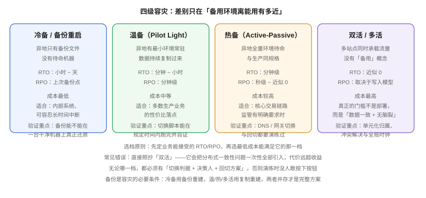

# 容灾架构：冷备、温备、热备与多活

**容灾不是「再买一套机器」，而是「让业务在场地级灾难面前还能继续」。** 它和备份的分工很明确：备份负责把数据带回来，容灾负责把**服务**带回来——包括机器、网络、配置、证书、密钥，以及一个能在规定时间内把流量切过去的过程。本页给出容灾的四个档位、数据复制与 RPO 的对应关系、切换/回切的决策设计，以及一套可演练的验收标准。



## 1. 四个档位：从「只有备份」到「多活」

| 档位 | 备用环境的状态 | 数据如何过去 | RTO | RPO | 成本 |
| --- | --- | --- | --- | --- | --- |
| **冷备** | 不存在，只有备份文件 | 备份文件运过去再重建 | 小时 ~ 天 | 上次备份点 | 最低 |
| **温备（Pilot Light）** | 最小环境常驻（数据库 + 少量节点） | 持续复制数据 | 分钟 ~ 小时 | 分钟级 | 中 |
| **热备（Active-Passive）** | 与生产同规格全量待命 | 同步/半同步复制 | 分钟级 | 秒级 ~ ≈0 | 高 |
| **双活 / 多活** | 多站点同时承载流量 | 双向或单元化复制 | ≈0 | 取决于写入模型 | 最高 |

:::danger 不要直接跳到「多活」
「多活」听起来最高级，但它把分布式系统最难的几个问题**一次性全部引入**：跨站点数据一致性、写入冲突解决、全局时钟、单元化归属、跨站调用延迟。没有明确的业务压力与对应的团队能力时，**温备 + 定期演练** 通常比一个「部署了但不敢用」的多活架构更可靠。
:::

### 1.1 选档判据：三个问题

1. **业务能停多久？**（RTO）→ 决定档位的下限。停不了（分钟级）才需要热备起步。
2. **业务能丢多少？**（RPO）→ 决定复制方式（见第 2 节）。
3. **团队能维护哪种复杂度？** → 决定档位的上限。多活需要专门的团队与工具，否则它是一颗定时炸弹。

## 2. 数据复制与 RPO 的对应关系

RPO 由复制方式决定，与容灾档位的「贵不贵」无关：

| 复制方式 | 提交语义 | 典型 RPO | 代价 |
| --- | --- | --- | --- |
| **异步复制** | 主库提交即返回，日志异步传 | 秒 ~ 分钟（取决于延迟与积压） | 写入延迟最低 |
| **半同步复制** | 至少一个备库**收到并落盘**才返回 | 秒级 / ≈0 | 写入延迟受备库影响 |
| **同步复制** | 所有（或指定仲裁数）副本确认才返回 | = 0 | 任一备库慢/挂，主库写入被拖住甚至不可用 |
| **共享存储 / 同城双活存储** | 存储层双写 | ≈0 | 需低延迟专线，距离受限 |

:::warning 同步复制的代价经常被低估
同步复制不是「免费获得 RPO = 0」。当备库网络抖动或磁盘变慢时，**主库会被卡住**——一个本来只影响备库的问题会升级成生产不可写。所以：
- 使用同步复制时，务必配置**超时降级为异步**（如 MySQL 的 `rpl_semi_sync_source_timeout`）并**配套告警**，让「降级」这件事被看见，而不是静默发生；
- 「至少一个副本确认」比「所有副本确认」更适合有多副本的场景（任一可用即可，避免单点拖死）。
:::

### 2.1 「复制延迟」是一个必须被监控的一等指标

容灾的真实 RPO 不等于配置的 RPO。**它等于「故障瞬间的复制延迟」**。所以复制延迟必须进入监控，并设定阈值告警：

```shell
# MySQL：查看备库延迟（Seconds_Behind_Source 在高并发下可能失真，需结合 GTID 差值判断）
mysql -h 127.0.0.1 -u root -p -e "SHOW REPLICA STATUS\G" | grep -E 'Seconds_Behind_Source|Replica_SQL_Running|Last_Error'

# PostgreSQL：查看备库回放延迟
psql -U postgres -c "SELECT client_addr, state, replay_lag FROM pg_stat_replication;"
# 期望：replay_lag 长期在低位（如 < 1s）；若持续增长说明备库跟不上

# MongoDB：查看副本集延迟
mongosh --eval 'rs.printSecondaryReplicationInfo()'
```

## 3. 切换与回切：真正的难点不是技术

### 3.1 Switchover vs Failover

| 动作 | 触发方式 | 风险 | 前置条件 |
| --- | --- | --- | --- |
| **Switchover（计划内切换）** | 人工发起，主动停写再切 | 低 | 演练过、有窗口 |
| **Failover（计划外切换）** | 故障触发或人工在故障时决定 | 高 | 需自动或半自动判据 |

:::danger 三类最危险的情况
1. **脑裂（Split-Brain）**：两个站点都认为自己是主库，同时接受写入，最后数据无法合并。防护手段是**仲裁（witness / quorum / fencing）**：多数派同意才能提升。没有仲裁的自动 Failover 是危险配置。
2. **无人敢按按钮**：`Failover` 的决策权不明确时，故障期间会出现「所有人都在等别人拍板」，RTO 直接失控。**必须提前指定决策人（含备份决策人）与判据。**
3. **切得过去、切不回来**：只演练了故障切换，没演练回切。回切往往比切过去更复杂（数据要反向同步回去）。**回切方案与切换方案同等重要。**
:::

### 3.2 切换判据：把「该切了」写成可执行的规则

| 判据类型 | 示例 | 说明 |
| --- | --- | --- |
| 时间阈值 | 主站不可用持续 > 5 分钟 | 简单但可能误判（短抖动） |
| 多点探测 | 3 个探测源中 ≥2 个失败 | 避免单点探测误报 |
| 业务指标 | 核心接口成功率 < 50% 持续 3 分钟 | 贴近业务，但需区分「主站挂了」与「下游挂了」 |
| 数据安全 | 备站复制延迟 < 10s 且位点确认 | **数据落后太多时不应切换**（切过去会丢大量数据） |

### 3.3 流量调度

切换的最后一公里是「让流量过去」。常见手段与生效时间：

| 手段 | 生效速度 | 注意 |
| --- | --- | --- |
| DNS 切换 / GSLB | 受 TTL 影响（秒 ~ 分钟），客户端缓存不可控 | 把 TTL 调小（如 60s）以缩短切换时间 |
| 云厂商负载均衡 / 全球加速 | 较快，可脚本化 | 需提前配置好备站后端 |
| 网关层切换（如 Nginx / API 网关） | 秒级 | 需要网关本身不是单点 |
| 客户端多活（内置故障转移） | 由客户端决定 | 需要客户端支持 |

配合方法见 [Nginx 负载均衡](../../Nginx/LoadBalance/index.md) 与 [网络基础 · DNS](../../Network/Dns/index.md)。

## 4. 演练：容灾唯一的验收方式

容灾与备份最大的共同点是：**没演练过就等于不存在**。

### 4.1 演练类型

| 类型 | 做法 | 目的 |
| --- | --- | --- |
| **桌面推演（Tabletop）** | 不碰系统，按故障剧本走一遍决策流程 | 校准判据与决策人 |
| **单组件演练** | 只切换数据库 / 只切流量 | 验证组件级切换脚本 |
| **全链路演练** | 生产级切换 + 观察 + 回切 | 验证端到端 RTO/RPO |
| **混沌注入** | 主动杀掉主站组件 | 验证自动 Failover（慎用，需有回滚开关） |

### 4.2 演练记录模板：把「实际 RTO」变成可改进的数据

```text [dr-drill-record.md]
# 容灾演练记录

- 日期：2026-10-05 02:00 - 04:10（UTC+8）
- 类型：全链路切换 + 回切
- 场景：主可用区网络隔离

| 阶段 | 计划 | 实际 | 偏差 | 原因 |
| --- | --- | --- | --- | --- |
| 故障发现 | ≤2min | 4min10s | +2min10s | 告警抑制规则过宽，首条告警被吞 |
| 决策 | ≤5min | 7min | +2min | 决策人不在线，电话联系耗时 |
| 数据位点确认 | ≤2min | 1min30s | — | — |
| 切换执行 | ≤10min | 22min | +12min | 备站数据库需重建索引，未预热 |
| 业务验证 | ≤10min | 8min | — | — |
| **合计 RTO** | **≤29min** | **42min40s** | **+13min40s** | 超出 RTO，需整改 |
| 数据丢失（RPO） | ≤10s | 3s | — | 达标 |

整改项：
1. 收窄告警抑制规则，主站不可用类告警不得被抑制（owner: oncall）。
2. 备站增加关键索引预热任务（owner: dba）。
3. 明确第二决策人，并写进值班表（owner: 团队负责人）。

回切：03:30 发起，03:45 完成，数据反向同步耗时 12min（正常）。
```

这份记录的价值在于**每个偏差都有归因和 owner**。演练的意义不是「证明我们能切」，而是「把 RTO 从 42 分钟压到 29 分钟」。

## 5. 成本：怎么在预算内把档位提上去

| 手段 | 效果 | 代价 |
| --- | --- | --- |
| 备站用更小规格（降配待命） | 显著降本 | 切换后需扩容，RTO 变长 |
| 备站只保留核心链路 | 显著降本 | 非核心功能在切换后不可用（需业务确认可接受） |
| 计算资源按需启动（只在演练与故障时开） | 大降本 | RTO 变长，需验证启动时间 |
| 存储用低频/归档层存备份 | 降本 | 恢复时间变长 |
| 定期做「用备份重建」演练代替热备 | 大幅降本 | RTO 从分钟级降到小时级 |

:::tip 一条实用的降本判据
**把「容灾档位」按业务链路分级，而不是按系统分级。** 同一个系统里，下单链路可能必须热备，而「帮助中心」用备份重建（冷备）完全可以接受。按链路而不是按系统定档，通常能省掉大量预算而不降低业务的实际保障水平。
:::

## 6. 验证方式

容灾的验证分两层：**配置层**（切换能力是否真的存在）与**流程层**（人是否知道怎么用）。

```shell
# ① 复制健康：确认备站真的在实时跟随
psql -U postgres -c "SELECT client_addr, state, sync_state, replay_lag FROM pg_stat_replication;"
# 期望：state=streaming；sync_state 至少有一条为 sync（若承诺 RPO≈0）；
#       replay_lag 处于秒级以内

# ② 仲裁配置：确认没有「两个主库都能被提升」的配置
kubectl get lease -n kube-system | grep -i leader        # 示例：确认租约只有一个持有者
etcdctl endpoint status --cluster -w table                # 期望：仅一个 IS LEADER=true

# ③ 备站可写性预检：确认备站不是「看着在、其实起不来」
#    在演练环境执行：把备站提升为可写并跑一次写入
psql -U postgres -c "SELECT pg_is_in_recovery();"          # 提升前期望 t
mongo --eval 'db.hello().isWritablePrimary'                # MongoDB 期望 false（备节点）

# ④ DNS / 网关切换的 TTL 是否满足 RTO
dig +nocmd blog.example.com +noall +answer | awk '{print $2}'
# 期望：TTL ≤ RTO 中允许的切换时间（例如 60）
```

**预期结果**：第 ① 项复制的 `replay_lag` 稳定在秒级；第 ② 项不存在两个持锁者；第 ③ 项备站能在演练中成功提升；第 ④ 项 TTL 与承诺的 RTO 自洽。任一项不满足，都要作为整改项记入演练记录。

## 7. 与相邻专题的分工

- **主流可用性架构（主从、哨兵、集群）讲的是「同机房/同城的高可用」**：见 [微服务](../../../Backend/Microservices/index.md)、[Kubernetes 监控与运维](../../Kubernetes/Monitoring/index.md)。
- **跨集群的容灾与联邦**：见 [多集群：联邦、MCS 与容灾](../../ContainerOrchestration/MultiCluster/index.md)。
- **容器应用的跨站点交付**：见 [容器编排进阶](../../ContainerOrchestration/index.md) 与 [GitOps](../../ContainerOrchestration/GitOps/index.md)。
- **流量层切换的具体配置**：见 [Nginx 负载均衡](../../Nginx/LoadBalance/index.md)。
- **切完怎么发现「切得不对」**：见 [监控告警](../../Monitoring/index.md)。

## 参考资料

- Google SRE Workbook · Disaster Recovery（RTO/RPO 与演练）：https://sre.google/workbook/disaster-recovery/
- AWS Well-Architected · Reliability Pillar（DR 四种策略与选型）：https://docs.aws.amazon.com/wellarchitected/latest/reliability-pillar/rel_planning_for_recovery_disaster_recovery.html
- PostgreSQL 官方 · Log-Shipping Standby Servers（`synchronous_commit` 与同步复制语义）：https://www.postgresql.org/docs/current/warm-standby.html
- MySQL 官方 · Semisynchronous Replication（含超时降级）：https://dev.mysql.com/doc/refman/8.4/en/replication-semisync.html
- MongoDB 手册 · Replica Set Read/Write Semantics 与 Write Concern `majority`：https://www.mongodb.com/docs/manual/replication/
- CNCF · Disaster Recovery 指引（Kubernetes 场景）：https://www.cncf.io/
- 本专题其余章节：[体系概述](../Overview/index.md) ｜ [恢复与演练](../Recovery/index.md) ｜ [实战](../Practice/index.md)
