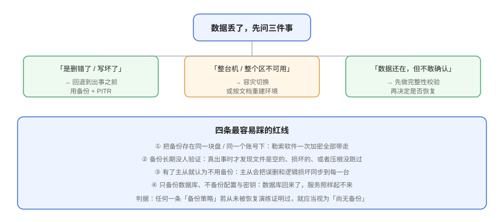

# 常见问题与最佳实践

本页把备份与容灾落地过程中最高频的疑问集中回答，并在最后给出一份可以贴在团队规范里的最佳实践清单。

## 一、概念与边界

### Q1：我们有主从复制，还需要备份吗？

**需要，而且是必需的。** 复制解决的是「机器坏了」，备份解决的是「数据坏了」。复制会把你的 `DELETE`、错误的 `UPDATE`、程序 bug 写出的脏数据**忠实同步到每一台副本**；勒索软件加密主库后，复制也会把加密后的页同步过去。判据很简单：**问自己「能不能回到出事前的那个时间点」——复制答不了这个问题，只有备份能。**

### Q2：高可用、备份、容灾，只需要做哪个？

三者回答不同问题，投入顺序建议是：

1. **先做备份**（成本最低、收益最直接，且是容灾的必要条件）；
2. **再做容灾**（与备份一起满足「场地级失效」，两者常共用同一套复制/存档通道）；
3. **最后按需做高可用**（成本最高，只对有明确可用性指标的服务投入）。

### Q3：RTO 和 RPO 到底怎么定？

- **RPO**：问业务「最坏情况下能丢多少数据」，然后把它换算成**备份/复制频率**；
- **RTO**：问业务「能停多久」，然后把它拆成「发现 + 决策 + 执行」三段分别设计。

两个数字一旦定下，**方案就被约束住了**。例如 RPO ≤ 5 分钟直接排除「每天一次全量」；RTO ≤ 5 分钟直接排除「靠备份重建」。反过来，如果你说不出数字，说明业务还没想清楚，此时任何方案都无法验收。

### Q4：RPO = 0 是不是必须的？

不是。RPO = 0 要求同步复制，代价是**备站/备库的任何抖动都会拖慢或卡死主库的写入**。多数业务「秒级 RPO」已经足够，用半同步或异步复制即可。只有在监管或资金类场景，才值得为 RPO = 0 支付这个代价——而且必须配置**超时降级为异步并告警**，让降级这件事被看见。

## 二、策略与工具

### Q5：「全量 + 增量」还是「全量 + 差异」？

默认选**全量 + 差异**。恢复只需两步（全量 + 最新差异），任何环节出问题都好排查；增量链一长，恢复复杂度与失败概率都陡增。只有备份窗口极窄、变化量极小（如每天只改几 MB）时，纯增量才划算。

### Q6：备份窗口不够怎么办？

按代价从低到高：

1. **加压缩**（`zstd -3`）——省带宽与时间，几乎无副作用；
2. **开并行/多线程**（`-T4`、`--parallel`）——受 I/O 与网络上限约束；
3. **改物理备份**（XtraBackup / pg_basebackup）——大库提升最明显；
4. **从只读副本备份**——完全不占用主库，但需确认副本延迟与延迟对 RPO 的影响。

### Q7：备份文件放在哪里？

遵守 **3-2-1-1-0**：至少 3 份、2 种介质、1 份异地、1 份离线/不可变、0 个未验证。
**最低成本的正确做法**：本地一份（快速恢复）+ 对象存储一份（开启版本控制与对象锁）。绝对不要把备份与生产放同一个账号、同一块盘、同一台机器。

### Q8：备份要不要加密？

要，而且要**客户端加密**。原因有两个：备份文件本质上是全量数据导出，落盘与传输都必须按敏感数据对待；用客户端加密（restic / borg）后，即使存储桶被拖走，攻击者拿到的也只是密文。
**配套要求：加密密钥必须另存一份离线副本，并确保有人知道它在哪。** 密钥丢失 = 数据丢失，且不可逆。

### Q9：mysqlpump 为什么跑不起来？

因为 **`mysqlpump` 在 MySQL 8.0.34 被弃用、8.4.0 被移除**（连带 `lz4_decompress` / `zlib_decompress` 一起删除）。MySQL 8.4 及以后的替代品是 `mysqldump` 或 MySQL Shell 的 dump 工具（`util.dumpInstance()` 等）。照抄旧教程会直接 `command not found`。

### Q10：XtraBackup 装好了，能备份 MySQL 8.0 吗？

**不能。** Percona XtraBackup **8.4 线明确不支持 MySQL 8.0 与 9.x 服务端**，只能用于 8.4 系列（含 Percona Server 8.4 / PXC 8.4）。工具大版本必须与服务端大版本对齐，否则往往**在恢复时才暴露**。

### Q11：restic 和 borg 选哪个？

两者都能满足工程要求。**要「单二进制、直连对象存储」选 restic**（0.19.1 / 2026-07-05，注意 0.19.0 起源码构建需 Go 1.25+）；**已有 Python 生态、预算敏感选 borg**（1.4.5 / 2026-07-19，已修复 CVE-2026-62268；2.0 仍在 beta，不要上生产）。不要为了选型纠结：**先有备份，再谈更好的备份。**

### Q12：Kubernetes 的 YAML 都在 Git 里，还需要 Velero 吗？

需要。**Git 里没有集群的运行期状态**：Service Account 生成的 token、cert-manager 签发的证书、Operator 管理的 CR 状态、动态产生的 Secret，都不在 Git 里。Velero 的价值是把「资源对象 + 卷数据」一起快照到对象存储，并能在**另一个集群**里恢复。当前主线 v1.18.3（2026-09-21），仓库已迁移到 `velero-io/velero`。

## 三、恢复与演练

### Q13：多久演练一次？

| 类型 | 频率 |
| --- | --- |
| 冒烟恢复（抽样一个数据源） | 每周 |
| 完整演练（全部资产 + 记录 RTO/RPO） | 每季度 |
| PITR 演练（模拟误删） | 每半年 |
| 容灾切换 + 回切 | 每半年 ~ 每年 |

**没演练过的备份等于没有备份。** 唯一的例外是你刚做完演练，还没到下一次周期。

### Q14：演练时怎么才算「真的验证了」？

四个条件缺一不可：

1. **真的删掉现场**再恢复（「另存一份」验证的是复制）；
2. **在干净环境**恢复（不是在生产旁边蹭环境）；
3. **断言数据内容**（行数、关键字段、校验和），而不是只看「进程起来了」；
4. **记录实际耗时**并对照 RTO，产出整改项。

### Q15：怎么保证「校验」不是走过场？

用**变异测试**：故意破坏一份备份（翻转一个字节、截断文件、删掉中间一个日志），看你的校验流程会不会报错。如果恢复「成功」但数据是错的，那比恢复失败更危险。
参考做法：像[实战页](../Practice/index.md)第 7 节那样的恢复演练脚本，以及项目侧各道门禁，都提供 `--selftest`——用一次「故意改坏、必须报红」来证明断言不是恒真的。

### Q16：误删了几行数据，要恢复整库吗？

**不要。** 整库回滚会把之后所有正常写入一起丢掉。正确做法是把备份恢复到**临时实例**，从里面把这几行捞出来补回生产。因此你的备份方案必须保证「能随时起一个临时实例」。

### Q17：PITR 恢复时，时间点应该设在哪里？

设在**故障发生前一刻**，而不是「刚刚好」。比如误删发生在 14:07:12，目标时间应设为 14:05:00。设得太精确很可能**把那条误删语句一起重放回来**。宁可少回放几分钟的数据，也不要重放故障。

### Q18：为什么 PITR 突然做不了了？

按顺序检查：

1. **binlog 是否被 PURGE**：`SHOW BINARY LOGS;` 看最旧日志时间是否覆盖你的恢复窗口；
2. **`binlog_expire_logs_seconds` 是否小于备份保留期**；
3. **WAL 归档是否失败**：`SELECT * FROM pg_stat_archiver;` 看 `failed_count` 是否增长；
4. **起点坐标是否对齐**：逻辑备份必须带 `--source-data`（或 PG 的备份标签），才能从正确位置重放。

任何一条断链，都会让「有备份」变成「只能恢复到上一次全量」。

## 四、容灾与治理

### Q19：要不要上「双活」？

**先问三个问题，再说要不要。** 业务是不是真的停不了（RTO ≈ 0）？团队有没有能力维护跨站点数据一致性？有没有预算承担双份基础设施？三个问题里有一个否定，就应当停在**温备**。多活会把分布式一致性、写入冲突、全局时钟、单元化归属这些问题一次性全部引入——**一个「部署了但不敢切」的多活，不如一个演练过的温备**。

### Q20：容灾切换最容易出什么问题？

三件事，按发生频率排序：

1. **脑裂**：没有仲裁（quorum / witness / fencing），两个站点都自认为主库。防护靠「多数派同意才能提升」；
2. **无人敢按按钮**：决策权不明确导致 RTO 失控。必须提前指定**决策人与备份决策人**，并把判据写成规则；
3. **切得过去、切不回来**：只演练了故障切换，没演练回切。回切方案与切换方案同等重要。

### Q21：备份数据要不要纳入合规与审计？

要。至少做到三点：**删除操作可用独立凭据执行并留审计日志**（备份凭据只写不删）、**保留期与法规要求对齐**（不同数据的留存年限可能不同）、**演练记录与整改项可追溯**（谁在什么时候发现了什么问题、谁负责改）。

## 五、最佳实践清单

可以直接贴进团队规范：

1. **每个「不可重算」的数据资产都要有备份**，并在文档里写明保留多久；
2. **备份与删除使用不同凭据**，删除走独立审批流程；
3. **备份必须异地 + 不可变**（对象锁 / 追加写 / 离线介质），至少满足一位；
4. **每个备份任务都要有「最近成功时间」监控与新鲜度告警**，而不是只看退出码；
5. **每次备份后做校验**（校验和 / `check` / `verify`），失败即告警；
6. **备份文件用 `.incomplete` + 原子改名**，杜绝半截文件被当成有效备份；
7. **命名统一 UTC**，并带上类型与依赖信息；
8. **定期演练，且必须真的删现场**；
9. **记录实际 RTO / RPO**，与目标值比对并产出整改项（带 owner）；
10. **加密密钥离线备份**，并确认能被取回；
11. **配置与密钥纳入备份范围**——它们不在任何数据库里；
12. **切换预案必须包含判据、决策人、回切**，否则演练时没人敢按按钮。

:::tip 三条「一句话」总结
- **没有演练过的备份，不算备份。**
- **没有告警的备份任务，会在最需要它的时候发现自己早就停了。**
- **备份的敌人不是磁盘坏了，是你的 `DELETE` 语句和勒索软件——所以备份必须离线和不可变。**
:::

## 参考资料

- CISA · Data Backups（3-2-1 与勒索软件防护）：https://www.cisa.gov/stopransomware/data-backups
- NIST SP 800-34 Rev.1 · Contingency Planning Guide：https://csrc.nist.gov/pubs/sp/800/34/r1/upd1/final
- MySQL 官方 · 8.4 相较 8.0 的移除项（`mysqlpump`）：https://dev.mysql.com/doc/refman/8.4/en/mysql-nutshell.html
- Percona XtraBackup 8.4 · 支持的服务端范围：https://docs.percona.com/percona-xtrabackup/8.4/
- restic / BorgBackup / pgBackRest / Velero 官方文档（见 [备份工具矩阵](../Toolchain/index.md) 的参考资料）
- 本专题其余章节：[体系概述](../Overview/index.md) ｜ [备份策略设计](../Strategy/index.md) ｜ [恢复与演练](../Recovery/index.md) ｜ [容灾架构](../DisasterRecovery/index.md) ｜ [实战](../Practice/index.md)
