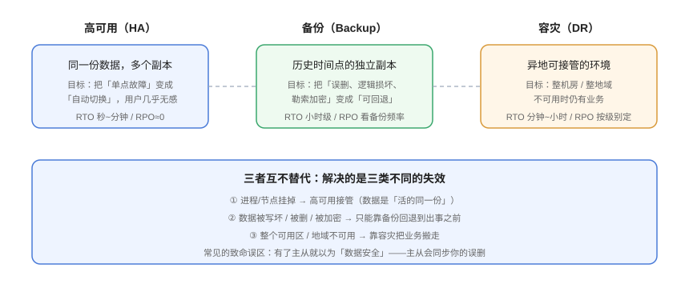
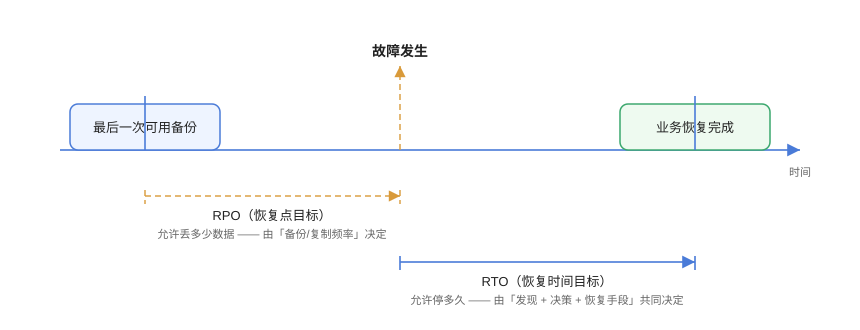

# 体系概述：备份、高可用与容灾的边界

**先分清「三类失效」，再谈「三种能力」。** 备份、高可用（HA）与容灾（DR）经常被混为一谈，但它们回应的是完全不同的失效场景；把三者混在一起谈，最后一定会得到「我们做了主从，所以数据很安全」这种自欺欺人的结论。



## 1. 三类失效，三种能力

| 失效类型 | 典型表现 | 由谁负责 | 为什么另外两者救不了 |
| --- | --- | --- | --- |
| **单点故障** | 进程崩溃、单机宕机、网卡故障 | **高可用** | 备份里没有「刚才那 3 秒的数据」，容灾的切换成本远高于重启一台机器 |
| **数据损坏 / 误操作** | `DELETE` 忘写 `WHERE`、程序把字段写成空、勒索软件加密 | **备份** | 高可用会把坏数据**同步到所有副本**；容灾切换后读到的还是同一份坏数据 |
| **场地级灾难** | 机房断电、可用区网络隔离、云地域故障 | **容灾** | 高可用通常只在同机房内；备份恢复往往要数小时到数天，业务停不起 |

:::tip 一句话理解
**高可用解决「机器坏了」，备份解决「数据坏了」，容灾解决「地方坏了」。**
:::

这三者的成本结构也完全不同：

- 高可用的成本是**常态化的冗余**（多一台机器一直闲着或分担流量）；
- 备份的成本是**存储与时间**（保留多少历史、备份窗口多长）；
- 容灾的成本是**一整套环境的闲置或半闲置**，通常是三者中最贵的。

所以正确的顺序是：**先量化业务能承受什么，再决定买到哪一档**，而不是「先上一套最贵的方案」。

## 2. RTO 与 RPO：把「能忍多久」变成数字

谈容灾绕不开两个指标，它们是**唯一能把「业务要求」翻译成「技术方案」的接口**：



| 指标 | 全称 | 含义 | 由什么决定 |
| --- | --- | --- | --- |
| **RPO** | Recovery Point Objective<br/>恢复点目标 | 最多允许丢**多少数据**（以时间衡量） | 备份 / 复制的**频率** |
| **RTO** | Recovery Time Objective<br/>恢复时间目标 | 最多允许停**多久** | 发现时间 + 决策时间 + 恢复手段的速度 |

:::danger 两个最常见的算错法
1. **把 RTO 当成「技术恢复耗时」**：真实 RTO 从「故障发生」算起，包含**发现（监控延迟）+ 判断与决策（谁拍板）+ 执行（恢复或切换）**三段。只优化最后一段，往往只占整个 RTO 的一小部分。
2. **把 RPO 说成「0」却没有任何同步复制**：异步复制在故障瞬间必然丢最后一段未同步的数据。写下 RPO = 0 之前，先确认链路是不是**同步提交**，以及同步是否会让写入延迟不可接受。
:::

### 2.1 分级参考（不是标准，是可用的起点）

| 业务级别 | 典型场景 | RTO | RPO | 常见落点 |
| --- | --- | --- | --- | --- |
| 核心交易 | 支付、下单 | 分钟级 | 秒级 / ≈0 | 热备 + 同步或半同步复制 |
| 重要业务 | 内容、用户中心 | 小时级 | 分钟级 | 温备 + 异步复制 + 高频备份 |
| 一般业务 | 内部后台、报表 | 天级 | 小时级 | 冷备 + 每日备份 |
| 归档数据 | 审计日志、历史库 | 数天 | 天级 | 对象存储归档层 + 冷备份 |

这张表的使用方式是**自上而下加成本**：只有当上一档确实满足不了业务，才升级到下一档。

## 3. 3-2-1 原则：备份的「最小可用红线」

> **3** 份拷贝、**2** 种不同介质、**1** 份异地存放。

后来这个原则被扩展成 **3-2-1-1-0**，多出来的两位针对的是当前最现实的威胁（勒索软件）：

| 位 | 含义 | 针对的威胁 |
| --- | --- | --- |
| **3** | 至少 3 份拷贝（1 生产 + 2 备份） | 单份备份文件损坏 |
| **2** | 至少 2 种介质 / 技术（如本地磁盘 + 对象存储） | 同一种介质的系统性故障 |
| **1** | 至少 1 份异地 | 场地级灾难 |
| **1** | 至少 1 份**离线或不可变**（Offline / Immutable / 对象锁） | 勒索软件把备份一起加密或删除 |
| **0** | **0 个未验证的备份**（定期恢复演练并断言数据） | 「以为有备份，其实恢复不出来」 |

:::warning 关于第 4 位
「离线或不可变」是这套原则里最容易省掉、也最致命的一位。如果备份目录与生产环境用**同一套凭据**可写可删，那么攻击者拿到生产权限的那一刻，你的备份就等于不存在。最低成本的做法是给备份仓库开启**只允写不可删（append-only / 对象锁 / 保留策略）**。
:::

## 4. 备份的四种「看起来有，其实没有」

以下四种情况在故障发生前与「有备份」完全无法区分：

| 症状 | 真实原因 | 检验手段 |
| --- | --- | --- |
| 备份任务从未成功过 | 定时任务静默失败、凭据过期、磁盘写满 | 备份任务必须有**成功/失败告警**，且在监控上有「最近成功时间」面板 |
| 备份文件存在但不可用 | 备份中途失败留下残文件、压缩包损坏 | 备份后做 `check` 或校验和；残文件要有明确的 `.incomplete` 标记 |
| 备份是空的 / 只备了结构 | 导出命令漏了数据参数、权限不足只看得到部分对象 | 恢复演练后在**干净环境**里断言行数、抽样内容 |
| 恢复不出来 | 依赖的事务日志链断了（binlog 被 `PURGE`、WAL 归档失败） | 定期检查日志归档连续性，把「断链」当成一级告警 |

:::danger 一条必须写进规范的判据
**任何「备份策略」若从未被一次真实的恢复演练证明过，就应当被视为「尚无备份」。**
「备份任务每天返回 0」只证明命令跑完了，不证明文件可用。
:::

## 5. 备份的生命周期：五步闭环

一套能用的备份不是「一条命令」，而是一条**闭环流水线**：

```text
造数据 → 备份 → 校验 → 异地/不可变 → 恢复演练 → 记录实际 RTO/RPO → 回到策略调整
```

| 阶段 | 关键动作 | 常见漏项 |
| --- | --- | --- |
| **备份** | 按策略执行全量/增量，写 `.incomplete` 标记，完成后改名 | 没做互斥锁，两个备份进程互相踩 |
| **校验** | 校验和 / 仓库一致性检查（如 `restic check`、`pgbackrest check`） | 只校验「文件存在」，不校验内容 |
| **异地 / 不可变** | 同步到第二介质；开启对象锁或 append-only | 备份与生产共用凭据 |
| **恢复演练** | **删掉现场**再恢复，断言数据 | 只验证「进程起来了」 |
| **记录与调优** | 记下实际耗时，对照 RTO/RPO 决定扩容还是加密频率 | 演练完不留数据，下次从零开始 |

第 4、5 步的完整做法见 [恢复与演练](../Recovery/index.md)。

## 6. 一个具体例子：把三件事装在同一个业务上

以本仓库的 [全栈博客平台](../../../../project/Complete/BlogPlatform/index.md) 为例，它的数据至少分布在四个地方，各自的风险与对策完全不同：

| 数据 | 丢了会怎样 | 关键点 |
| --- | --- | --- |
| MySQL 中的文章、评论、分类标签 | 内容永久丢失，不可重算 | 需要 PITR 能力，必须连续归档 binlog |
| Redis 中的热点缓存、点赞计数 | 部分不可重算（点赞是真实数据） | 需区分「可重算」与「不可丢」，见下 |
| 上传的图片等文件 | 文件本体丢失，无法从数据库恢复 | 走文件级去重备份 + 对象存储版本化 |
| 环境配置、密钥、DDL | 数据库回来了但服务起不来 | 属于「备份盲区」，单独管理 |

:::tip 一条分类判据
**「可重算的」和「不可重算的」要分开对待。** 缓存里由数据库算出来的部分可以丢；但用户点赞、浏览计数这类「只存在于缓存」的写入属于业务数据，必须落到持久化通道里。把这一条判据应用到你自己的系统上，往往能立刻发现几个「以为有备份其实没有」的角落。
:::

## 7. 与相邻专题的分工

本页建立的是**判断框架**，具体落地进入相邻专题：

- **每个数据库自己的备份命令与参数**：看 [PostgreSQL 备份恢复](../../../DB/Relational/PostgreSQL/BackupRestore/index.md)、[MongoDB 备份恢复](../../../DB/NoRelational/MongoDB/BackupRestore/index.md)、[Redis 持久化](../../../DB/NoRelational/Redis/Persistence/index.md)。
- **怎么让备份定时跑起来、失败了怎么重试**：看 [定时任务](../../Linux/Advanced/CronTasks/index.md)。
- **备份写到哪里、目录怎么规划**：看 [Docker 数据卷](../../Docker/Volumes/index.md) 与 [Kubernetes 存储](../../Kubernetes/Storage/index.md)。
- **备份失败怎么被告知**：看 [监控告警](../../Monitoring/index.md)。
- **整体容器/集群的备份与跨集群迁移**：看 [多集群容灾](../../ContainerOrchestration/MultiCluster/index.md)。

## 8. 验证方式：为自己的系统填出一张「防护矩阵」

本页不需要部署任何东西，用一张表自检即可。把系统的每个数据资产填进去，任何一行为空的格子都是缺口：

```text
| 数据资产 | 可重算? | 高可用手段 | 备份频率 | 备份介质 | 异地位 | 不可变 | 上次演练 | RTO 实测 | RPO 实测 |
| --- | --- | --- | --- | --- | --- | --- | --- | --- | --- |
| MySQL 文章/评论 | 否 | 主从 + 半同步 | 每日全量 + binlog 连续 | SSD + 对象存储 | 是 | 是 | 2026-09-20 | 38min | <1min |
| Redis 点赞计数 | 否 | 哨兵 | 每日 RDB | 本地 + 对象存储 | 是 | 否 | — | 待演练 | 待测 |
| 上传图片 | 否 | 无 | 每日增量 | 对象存储版本化 | 是 | 是 | — | 待演练 | 24h |
| 环境配置/密钥 | 否 | — | 变更时 | Git 私有仓库 | 是 | — | — | — | — |
```

**预期结果**：不存在「可重算 = 否」且「备份频率 = 空」的行；不存在「不可变 = 否」且「介质 = 与生产同账号」的行；「上次演练」为空的行必须列入下一次演练计划。

## 参考资料

- NIST SP 800-34（Contingency Planning Guide for Federal Information Systems）：https://csrc.nist.gov/pubs/sp/800/34/r1/upd1/final
- CISA「3-2-1 备份原则」说明与勒索软件防护建议：https://www.cisa.gov/stopransomware/data-backups
- AWS Well-Architected Framework · Reliability Pillar（备份与灾备章节）：https://docs.aws.amazon.com/wellarchitected/latest/reliability-pillar/welcome.html
- Google SRE Book · Data Integrity：What You Read Is What You Wrote：https://sre.google/sre-book/data-integrity/
- 本专题其余章节：[备份策略设计](../Strategy/index.md) ｜ [备份工具矩阵](../Toolchain/index.md) ｜ [恢复与演练](../Recovery/index.md) ｜ [容灾架构](../DisasterRecovery/index.md)
