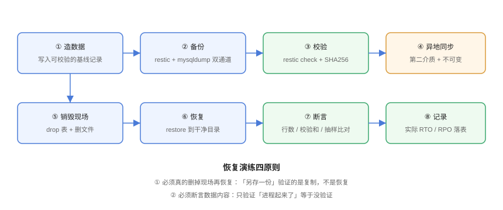

# 实战：给博客平台做一套备份与容灾方案

**把前几页的框架落到一个具体系统上。** 本页以本仓库的 [全栈博客平台](../../../../project/Complete/BlogPlatform/index.md) 为对象——它已经具备真实的数据形态（MySQL + Redis + 上传文件 + 配置），正好能暴露「只备份数据库是不够的」这个问题。目标不是给你一份照抄的脚本，而是走完一遍「定目标 → 盘点资产 → 设计通道 → 落地脚本 → 演练验证 → 接监控」的完整决策链。



## 1. 先定目标：RTO 与 RPO 从业务来

在做任何技术选型之前，先把数字写下来（数字来自 [需求页](../../../../project/Complete/BlogPlatform/Requirements/index.md) 的非功能需求口径）：

| 数据资产 | 可重算? | RTO 目标 | RPO 目标 | 依据 |
| --- | --- | --- | --- | --- |
| 文章 / 评论 / 分类标签 | 否 | ≤ 4 小时 | ≤ 5 分钟 | 内容丢失不可逆，但个人博客可接受数小时停机 |
| 点赞 / 浏览计数 | 否 | ≤ 24 小时 | ≤ 1 小时 | 有真实业务价值，但丢失影响有限 |
| 上传图片文件 | 否 | ≤ 8 小时 | ≤ 24 小时 | 可由作者重新上传，但成本高 |
| 环境配置 / 密钥 / DDL | 否 | ≤ 1 小时 | 0（变更即入库） | 没有它，数据回来了服务也起不来 |

:::tip 为什么个人博客也要写 RPO = 5 分钟
「RPO ≤ 5 分钟」这个数字直接决定了下一节的设计：它**排除了「每天一次全量、不做日志归档」的方案**（那种方案 RPO = 24 小时）。**目标数字不是形式，它是在替你排除方案。** 反过来说，如果你并不在意丢掉一天的评论，把 RPO 放松到 24 小时可以省掉一整套 binlog 归档。
:::

## 2. 资产盘点：四个角落，四套处理方式

| 资产 | 物理位置 | 备份通道 | 为什么不能共用一套 |
| --- | --- | --- | --- |
| MySQL（`blog` 库） | 容器卷 `/var/lib/mysql` | 逻辑全量 + 差异 + **binlog 连续归档** | 需要 PITR，必须同时管备份与日志 |
| Redis（计数类数据） | 容器卷 `/data` | RDB 每日 + AOF 归档（仅对不可重算的键空间） | 快照间隔内写入会丢，RPO 不够 |
| 上传文件 | 卷 `/data/uploads` | `restic` 去重增量 + 对象存储版本化 | 文件多且小，逻辑导出不适用 |
| 配置 / 密钥 / DDL | Git + 部署脚本 | Git 私有仓库 + 密钥单独保管 | 不属于任何数据库，容易被漏掉 |

:::danger 最容易漏掉的一行是最后一行
「配置和密钥」几乎是所有备份方案的第一盲区。它不出问题时毫无存在感，出问题时表现为——**数据恢复成功了，但服务起不来**。正确做法是把「环境相关的一切」当成一等公民：DDL 进 Git（本项目已在 `db/mysql/V1__blog_init.sql` 落地）、部署配置进 Git、密钥进独立的密钥管理系统并**在演练中验证能被取回**。
:::

## 3. 方案总览

```text
                  ┌──────────── 每日 ────────────┐
生产环境 ──┬──> 逻辑全量/差异  ──> 本地备份盘 ──┐
           │                                    ├──> 对象存储（开启对象锁 30 天）
           ├──> binlog 连续归档 ────────────────┤
           ├──> 上传文件 restic 增量 ───────────┤
           └──> 配置/密钥 ──> Git 私有仓库 ──────┘

演练：从对象存储取回 → 干净环境恢复 → 断言数据 → 记录实际 RTO/RPO
```

- **本地备份盘**：满足「快速恢复」（本地读取快），对应 3-2-1 中的第 1、2 位；
- **对象存储 + 对象锁**：满足「异地」与「不可变」，对应第 3、4 位；
- **演练**：满足第 5 位「0 个未验证备份」。

## 4. 落地一：数据库备份脚本

```bash [project/Complete/BlogPlatform/ops/backup_mysql.sh]
#!/usr/bin/env bash
set -Eeuo pipefail

BACKUP_ROOT="${BACKUP_ROOT:-/backup/blog}"
STAMP="$(date -u +%Y%m%dT%H%M%SZ)"
TYP="${1:-full}"                       # full | diff
DEST="${BACKUP_ROOT}/${TYP}"
mkdir -p "${DEST}"

TMP="${DEST}/blog_${TYP}_${STAMP}.sql.zst.incomplete"
FINAL="${DEST}/blog_${TYP}_${STAMP}.sql.zst"
trap 'rm -f "${TMP}" "${TMP}.sha256"' EXIT

# --single-transaction：一致性快照不锁表
# --source-data=2   ：写入 binlog 坐标，PITR 的起点就靠它
# --routines/--triggers：存储过程与触发器一并导出
# 密码从环境变量注入，绝不写在命令行（会进 history 与 ps）
mysqldump --single-transaction --quick --routines --triggers --events \
          --source-data=2 --set-gtid-purged=OFF \
          -h "${DB_HOST}" -P "${DB_PORT:-3306}" -u "${DB_USER}" -p"${DB_PASS}" blog \
  | zstd -3 -T4 > "${TMP}"

shasum -a 256 "${TMP}" > "${TMP}.sha256"
mv "${TMP}" "${FINAL}"                 # 原子改名：要么完整，要么不存在
mv "${TMP}.sha256" "${FINAL}.sha256"
trap - EXIT

# 落一个「最近成功时间」给监控采集
echo "backup_blog_last_success_timestamp $(date +%s)" \
  > /var/lib/node_exporter/textfile/backup_blog.prom
echo "OK ${FINAL} ($(du -h "${FINAL}" | cut -f1))"
```

配合 **cron**：每周日全量、其余每天差异（差异以「上一次全量」为基准）。

```text
# 每天 03:10 UTC 差异备份
10 3 * * 1-6  DB_HOST=mysql DB_USER=backup DB_PASS_FILE=/etc/blog/db.pass \
              /opt/blog/backup_mysql.sh diff  >> /var/log/blog-backup.log 2>&1
# 每周日 03:00 UTC 全量备份
0  3 * * 0    DB_HOST=mysql DB_USER=backup DB_PASS_FILE=/etc/blog/db.pass \
              /opt/blog/backup_mysql.sh full  >> /var/log/blog-backup.log 2>&1
```

:::warning 定时任务只是「跑起来」的一半
cron 的静默失败是备份领域最经典的坑：条目写错、`PATH` 不对、凭据过期，都会让任务悄悄不跑，而你只能在下一次真的需要恢复时才知道。**必须给备份配「新鲜度」告警**（见第 7 节），而不是只依赖脚本返回值。运行环境与排错见 [定时任务](../../Linux/Advanced/CronTasks/index.md)。
:::

## 5. 落地二：文件与配置备份

上传文件用 `restic` 做去重增量，一次备份同时满足加密与增量：

```bash
#!/usr/bin/env bash
# project/Complete/BlogPlatform/ops/backup_files.sh
set -Eeuo pipefail

export RESTIC_REPOSITORY="s3:https://s3.ap-east-1.amazonaws.com/blog-backups/restic"
export RESTIC_PASSWORD_FILE="/etc/blog/restic.pass"
export AWS_ACCESS_KEY_ID="$(cat /etc/blog/s3.key)"
export AWS_SECRET_ACCESS_KEY="$(cat /etc/blog/s3.secret)"

# 1) 备份（自动去重、客户端加密）
restic backup /data/uploads --tag uploads --exclude-caches

# 2) 结构校验（快，每次跑）
restic check

# 3) 深度校验（慢，每周一次；只抽查 5% 数据，平衡时间与覆盖）
if [[ "$(date -u +%u)" == "7" ]]; then
  restic check --read-data-subset=5%
fi

# 4) 按 GFS 淘汰（先 dry-run 确认，再真删）
restic forget --keep-daily 7 --keep-weekly 8 --keep-monthly 12 --dry-run
restic forget --keep-daily 7 --keep-weekly 8 --keep-monthly 12 --prune

echo "backup_files_last_success_timestamp $(date +%s)" \
  > /var/lib/node_exporter/textfile/backup_files.prom
```

## 6. 落地三：异地与不可变

```shell
# 给备份桶开启版本控制（误覆盖可回滚）
aws s3api put-bucket-versioning \
  --bucket blog-backups \
  --versioning-configuration Status=Enabled

# 开启对象锁：30 天内任何账号都删不掉（含 root）
aws s3api put-object-lock-configuration \
  --bucket blog-backups \
  --object-lock-configuration \
  'ObjectLockEnabled=Enabled,Rule={DefaultRetention={Mode=COMPLIANCE,Days=30}}'

# 校验配置是否真的生效
aws s3api get-object-lock-configuration --bucket blog-backups
# 期望：ObjectLockEnabled: Enabled，且默认保留规则为 COMPLIANCE / 30 天
```

:::danger 关于 COMPLIANCE 模式的一个必须知道的副作用
`COMPLIANCE` 模式下，保留期内的对象**任何人都删不掉**，包括你本人和云厂商的 root 账号。这意味着：如果备份脚本因为 bug 每天往桶里写垃圾，你**只能等它过期**，桶的容量只增不减。所以先用 `GOVERNANCE` 模式跑一周确认存储量与成本可接受，再切 `COMPLIANCE`。
:::

## 7. 落地四：恢复演练（一个零依赖的自检脚本）

演练脚本按下面的闭环自己实现一个：`ops/backup_drill.py`。它**只用 Python 标准库**，不依赖 MySQL、Redis 或 restic，因此在任何机器上都能跑通，适合放进 CI 做「每日冒烟演练」。

脚本实现的闭环：

| 步骤 | 动作 | 对应原则 |
| --- | --- | --- |
| ① 造数据 | 生成 SQLite 库（50 篇文章）+ 8 个上传文件 + 1 份配置 | 基线可校验 |
| ② 备份 | `tar.gz` 打包 + 逐文件 SHA256 清单 + `meta.json`；先写 `.incomplete` 再原子改名 | 半截文件不可用 |
| ③ 校验 | 解包后逐文件比对校验和 | 0 个未验证备份 |
| ④ 销毁现场 | **真的删掉源目录** | 验证的是恢复，不是复制 |
| ⑤ 恢复 | 从归档解包到干净目录 | — |
| ⑥ 断言 | 文件数 / 逐文件校验和 / SQLite `integrity_check` / 行数 | 只验证「进程起来了」等于没验证 |
| ⑦ 变异测试 | 翻转归档中一个字节，校验必须报错 | 校验不能是恒真的 |

```shell
cd your-project/ops
python3 backup_drill.py --selftest
```

**按此实现后的实测输出**（编写环境 Python 3.13，退出码 0）：

```text
== ① 造数据 ==
  PASS  基线文章数
  PASS  基线源文件总数

== ② 备份 + ③ 校验 ==
  PASS  备份目录里没有残留 .incomplete
  PASS  备份物可独立校验通过
  PASS  MANIFEST 条目数与源文件一致

== ④ 销毁现场 ==
  PASS  源目录已被真正删除

== ⑤ 恢复 ==

== ⑥ 断言数据 ==
  PASS  恢复后文件数与备份一致
  PASS  逐文件校验和完全一致
  PASS  SQLite 完整性检查
  PASS  文章行数一致
  PASS  已发布文章数一致

== ⑦ 变异测试 ==
  PASS  损坏的备份能被校验发现

== 结果 ==
drill: checks=12 passed=12 failed=0
```

:::tip 为什么把「变异测试」做进脚本
前 11 项只证明「正常路径可用」；第 12 项用 `--selftest` 证明「异常路径也能被抓住」。这与项目侧那几道门禁（[工程骨架](../../../../project/Complete/BlogPlatform/Skeleton/index.md) 的 `skeleton_check.py`、[写入链路](../../../../project/Complete/BlogPlatform/WritePath/index.md) 的 `admin_smoke.py`）采用同一套方法论：**一个从不失败的门禁，等价于没有门禁。**
:::

## 8. 落地五：接监控（备份年龄告警）

备份是否成功，最终由监控回答。两条规则即可覆盖绝大多数故障：

| 告警 | 表达式（Prometheus） | 覆盖的故障 |
| --- | --- | --- |
| 备份过期 | `time() - backup_blog_last_success_timestamp > 36 * 3600` | 任务没跑、脚本失败、机器关机 |
| 备份体积异常 | `backup_blog_last_size_bytes < 0.5 * avg_over_time(backup_blog_last_size_bytes[14d])` | 备份到空库、导出被截断 |

第 2 条很容易被忽略但价值很高：**「备份文件突然变小一半」几乎总是意味着数据没备全**，而这类故障不会让脚本返回非零。告警配置细节见 [监控告警](../../Monitoring/index.md)，日志落盘见 [日志体系](../../LogSystem/index.md)。

## 9. 容灾档位与切换预案

按 [第 1 节](#1-先定目标rto-与-rpo-从业务来) 定的 RTO：

| 数据 | RTO 目标 | 选择的档位 | 依据 |
| --- | --- | --- | --- |
| MySQL | ≤ 4 小时 | **温备**：异地一个最小实例 + 异步复制 | 4 小时足够「取备份 + 恢复 + 校验」，不需要热备的成本 |
| Redis / 上传文件 | ≤ 8 小时 | **冷备**：只保留备份，故障时重建 | 数据重建成本可接受 |
| 应用服务 | ≤ 1 小时 | **冷备**：镜像 + 编排文件在 Git，随时可拉起 | 无状态，重建即恢复 |

**切换预案**（写下来，并在演练中走一遍）：

1. **判据**：主站不可用持续 > 30 分钟，且 3 个探测源中 ≥ 2 个失败；
2. **决策人**：本人（含一位备份决策人）；决策记录写入值班日志；
3. **执行**：先停写（摘流量）→ 确认异地数据位点 → 提升异地实例 → 切换 DNS（TTL 60s）→ 验证核心链路；
4. **回切**：主站恢复后，反向同步数据 → 停写 → 切回 → 校验；
5. **禁止项**：**未确认数据位点前不允许提升备库**（避免用落后几小时的数据对外服务）。

## 10. 验证方式（完整命令序列）

```shell
# ① 演练脚本：正常路径 + 变异测试
cd your-project/ops
python3 backup_drill.py --selftest
# 期望：drill: checks=12 passed=12 failed=0（退出码 0）

# ② 数据库备份脚本语法检查
bash -n backup_mysql.sh
# 期望：无输出

# ③ 备份产物校验和
cd /backup/blog/full && shasum -a 256 -c blog_full_*.sql.zst.sha256
# 期望：<文件名>: OK

# ④ 确认没有残留的半截文件
find /backup/blog -name '*.incomplete' -print
# 期望：无输出

# ⑤ restic 仓库健康
restic check
# 期望：no errors were found

# ⑥ 验证 PITR 的可用窗口与承诺的 RPO 自洽
mysql -h 127.0.0.1 -u root -p -e "SHOW BINARY LOGS;"
# 期望：最旧 binlog 的时间覆盖 ≥ 你承诺的恢复窗口（本项目 5 分钟以内不适用，
#       但若配置了 24 小时保留，则必须能在 24 小时内任意回退）

# ⑦ 异地桶的对象锁确实生效
aws s3api get-object-lock-configuration --bucket blog-backups
# 期望：Enabled，且保留期与策略一致
```

**验收判据**：①②③④ 必须全绿；⑤⑥⑦ 用于证明「异地与不可变」不是纸面配置。任何一项不达标，作为整改项记入演练记录（模板见 [容灾架构 · 演练记录模板](../DisasterRecovery/index.md)）。

## 11. 成本与取舍

| 项 | 选择 | 说明 |
| --- | --- | --- |
| 备份保留 | 日 7 / 周 8 / 月 12 | 约 30 份，覆盖 1 年，成本远低于「每天一份存一年」 |
| 压缩 | `zstd -3` / restic 默认 | 级别 3 在压缩率与 CPU 间最平衡 |
| 异地存储 | 对象存储低频层 | 只在恢复时读取，低频层成本约为标准层的一半 |
| 容灾档位 | 温备（仅数据库） | 按链路分级定档是本方案最省的一笔钱 |

:::warning 成本优化的红线
可以降的是**保留时长、存储层级、备站规格**；不能降的是**校验、异地、不可变、演练**。前三个是花钱多的项，后四个是不花钱但决定成败的项。把后者省掉，等于买了一份永远不会理赔的保险。
:::

## 12. 可复现清单

照着做一遍需要的东西，全部列在这里：

1. 一个能跑 `mysqldump` 的备份账号（只读 + `RELOAD` + `REPLICATION CLIENT`）；
2. 一个 `restic` 仓库（本地目录即可起步，后续换 S3）；
3. 一个开启版本控制与对象锁的对象存储桶；
4. 一份 `cron` / `systemd timer` 计划；
5. `ops/backup_drill.py`（按第 7 节的闭环自己实现）放进 CI 每日执行；
6. 两条 Prometheus 告警规则；
7. 一份切换预案，且演练过一次。

## 参考资料

- MySQL 官方 · Point-in-Time Recovery Using Binary Log：https://dev.mysql.com/doc/refman/8.4/en/point-in-time-recovery-binlog.html
- restic 文档 · 备份、`check`、`forget` 保留策略：https://restic.readthedocs.io/en/stable/
- AWS S3 · Object Lock 与版本控制：https://docs.aws.amazon.com/AmazonS3/latest/userguide/object-lock.html
- Prometheus 官方 · 告警规则与 `time()` 函数：https://prometheus.io/docs/prometheus/latest/configuration/alerting_rules/
- 本仓库相关页面：[全栈博客平台](../../../../project/Complete/BlogPlatform/index.md) ｜ [工程骨架与门禁](../../../../project/Complete/BlogPlatform/Skeleton/index.md) ｜ [完整项目交付](../../../Others/ProjectDelivery/index.md)
- 本专题其余章节：[备份策略设计](../Strategy/index.md) ｜ [备份工具矩阵](../Toolchain/index.md) ｜ [恢复与演练](../Recovery/index.md) ｜ [容灾架构](../DisasterRecovery/index.md)
