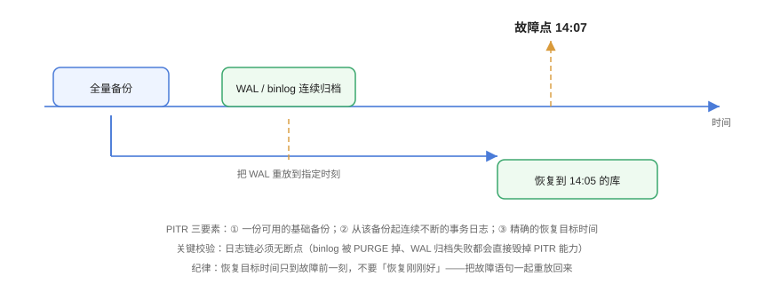

# 恢复与演练：PITR、校验与演练设计

**备份的价值不由「备份成功」定义，而由「恢复成功」定义。** 恢复是备份体系里最容易长期不做、也最容易在真出事那天暴露问题的环节：命令没练过、依赖链断了、权限不够、目标环境装不下——任何一个都足以让一次本该 30 分钟完成的恢复变成 10 小时。本页讲 PITR 的原理与流程、恢复粒度的取舍，以及一套可以「真的删了再恢复」的演练设计。



## 1. 恢复粒度：先决定「恢复多少」

| 粒度 | 手段 | 耗时量级 | 适用场景 | 代价 |
| --- | --- | --- | --- | --- |
| **全实例** | 物理备份恢复 + 日志重放 | 小时级 | 整库损坏、机房重建 | 需要停机、需要同等容量 |
| **单库 / 单表** | 逻辑恢复（`pg_restore -t`、`mysql < table.sql`） | 分钟级 | 误删一张表、单模块数据坏了 | 需有逻辑备份；外键依赖要处理 |
| **单行少量数据** | 把备份恢复到**临时实例**，再 `INSERT ... SELECT` 迁回 | 分钟~小时 | 「误删了 3 条记录」 | 需要临时实例与容量 |
| **文件 / 对象** | 文件级备份 restore 到指定路径 | 分钟级 | 上传文件丢失、配置被覆盖 | 需确认版本与路径映射 |

:::tip 一个高频场景的正确做法
「**误删 3 行数据**」是最常见的生产事故，但它**不应该**触发全库恢复——全库回滚会把之后所有的正常写入一起丢掉。正确做法是：把备份恢复到**一个临时实例**（或 `pg_restore` 到临时库），从里面把这几行捞出来补回去，生产实例不动。所以你的备份策略必须保证「能随时起一个临时实例来做局部捞取」。
:::

## 2. PITR：把数据库拨回任意一刻

**PITR（Point-In-Time Recovery，时间点恢复）** 是关系型数据库最重要的恢复能力：把数据库恢复到**任意一个指定时刻**，而不是只能回到某次备份的时间点。

### 2.1 三要素

1. **一份基础备份**（物理全量或逻辑全量，且必须是可用的）；
2. **从该备份起点开始、连续不断的事务日志**（MySQL binlog / PostgreSQL WAL）；
3. **一个精确的恢复目标时刻**（`--stop-datetime` / `recovery_target_time`）。

三者缺一不可。第 2 条最脆弱：**只要日志链中间断了一次，后面所有日志都用不上了**。这直接决定了两个运维动作的必要性：

- MySQL：**不要把 `binlog_expire_logs_seconds` 设得比你的备份保留期短**，也不要在定时任务里随手 `PURGE BINARY LOGS`；
- PostgreSQL：**`archive_command` / `archive_library` 失败必须告警**，因为归档失败意味着 WAL 在被回收前没能进仓库。

### 2.2 MySQL PITR 流程

```shell
# ① 恢复基础全量备份（假设已有 blog_full_20261001T030000Z.sql.zst）
mysql -h 127.0.0.1 -u root -p -e "DROP DATABASE blog; CREATE DATABASE blog DEFAULT CHARSET utf8mb4;"
zstd -d -c /backup/posts/prod/full/blog_full_20261001T030000Z.sql.zst \
  | mysql -h 127.0.0.1 -u root -p blog

# ② 确认基础备份里记录的 binlog 坐标（--source-data=2 写下的注释）
zstd -d -c /backup/posts/prod/full/blog_full_20261001T030000Z.sql.zst | grep -m1 'CHANGE REPLICATION SOURCE TO'
# 形如：CHANGE REPLICATION SOURCE TO SOURCE_LOG_FILE='mysql-bin.000123', SOURCE_LOG_POS=456789;

# ③ 找出误操作对应的位置：按时间过滤 binlog
mysqlbinlog --start-datetime='2026-10-01 03:00:00' \
            --stop-datetime='2026-10-01 14:05:00' \
            /backup/posts/prod/binlog/mysql-bin.000123 > /tmp/replay.sql

# ④ 重放到故障发生前一刻（注意：停在 14:05，不是 14:07）
mysql -h 127.0.0.1 -u root -p < /tmp/replay.sql

# ⑤ 断言：确认数据回到了正确状态
mysql -h 127.0.0.1 -u root -p -e "SELECT COUNT(*) FROM blog.t_post;"
```

:::danger PITR 四个必踩的坑
1. **恢复目标时间设到「刚刚好」**：故障发生在 14:07:12，如果你把目标设成 14:07:12，很可能**把那条误删语句也重放回来**。正确做法是停在故障发生前一刻（如 14:05:00），宁可少回放几分钟。
2. **binlog 格式不是 ROW**：`binlog_format=STATEMENT` 下时间过滤粒度粗、重放行为不确定（`NOW()`、`UUID()` 等函数会重新求值）。生产建议 `binlog_format=ROW` + `binlog_row_image=FULL`。
3. **用 `--start-datetime` 但没对齐备份起点**：正确做法是从**基础备份记录的坐标**开始重放，而不是随便挑一对时间。坐标对不上会重放出错或数据重复。
4. **重放过程中不校验**：重放完必须断言行数、关键业务字段或校验和，而不是只看「命令没报错」。
:::

### 2.3 PostgreSQL PITR 流程

```shell
# ① 从备份恢复数据目录（pgBackRest 示例）
pgbackrest --stanza=blog --type=time \
           --target="2026-10-01 14:05:00+08" \
           --target-action=promote restore

# ② 启动实例，确认恢复到了目标时间点
psql -U postgres -d blog -c "SELECT pg_is_in_recovery();"
# 期望：f（已提升为主库，恢复完成）

# ③ 断言数据内容
psql -U postgres -d blog -c "SELECT count(*) FROM t_post;"

# ④ 事后纪律：新时间线（timeline）已产生，不要试图「回切」到旧时间线
psql -U postgres -c "SELECT timeline_id FROM pg_control_checkpoint();"
```

pgBackRest 的 `--target-action` 有三个取值，选错会导致恢复后行为不符预期：

| 取值 | 恢复后的行为 | 何时用 |
| --- | --- | --- |
| `pause` | 停在目标点等待人工提升 | 需要先检查数据再决定（**最安全，推荐演练时用**） |
| `promote` | 到达目标点自动提升为可写 | 流程自动化、你已经很确定 |
| `shutdown` | 到达目标点后关闭实例 | 用于「只取数据、稍后手工处理」 |

## 3. 恢复流程：六步固定动作

任何恢复都按这六步走，不要跳步：

1. **止损**：先切断继续写入/继续损坏的来源（摘流量、停应用、断开复制）。**在止损之前做恢复，等于在流动的河里挖坑。**
2. **定目标**：确定恢复点（哪一刻）、恢复粒度（全库还是单表）、恢复到哪儿（原环境还是新环境）。
3. **找料**：定位基础备份 + 日志区间，检查链条完整性与校验和。
4. **预检**：确认目标环境容量、版本、权限、端口。**这一步能提前消灭 80% 的「恢复到一半失败」。**
5. **执行**：按预检过的脚本执行，全程留日志与耗时。
6. **断言**：断言行数、关键字段、业务可用性；记录实际 RTO / RPO，回填到文档。

:::warning 「先止损」经常被跳过
实践中常见的一幕是：发现误删后立刻开始恢复，而应用仍在写入——结果恢复过程中新写入的数据和恢复的数据互相覆盖，最后既丢了新数据也没救回旧数据。**摘流量永远是第一个动作**，哪怕只花 10 秒。
:::

## 4. 演练设计：不做演练等于没有备份

### 4.1 演练频率与范围

| 类型 | 频率 | 范围 | 目的 |
| --- | --- | --- | --- |
| **冒烟恢复** | 每周 | 抽样 1 个数据源，恢复到临时环境 | 证明「文件可用、流程能走通」 |
| **完整演练** | 每季度 | 覆盖全部数据资产 + 记录 RTO/RPO | 证明「SLA 达标」 |
| **PITR 演练** | 每半年 | 模拟误删，恢复到指定时刻 | 证明「时间点恢复真的能做」 |
| **容灾切换演练** | 每半年 / 一年 | 切换 + 回切全流程 | 见 [容灾架构](../DisasterRecovery/index.md) |

### 4.2 场景矩阵：演练要覆盖「会真的发生的事」

| 场景 | 模拟方式 | 断言重点 |
| --- | --- | --- |
| 误删表 | `DROP TABLE` 后恢复 | 表结构 + 行数 + 外键完整 |
| 误更新字段 | `UPDATE ... SET col=NULL` 后 PITR | 字段值回到更新前 |
| 备份文件损坏 | 手动截断一个备份文件 | **校验环节必须发现**（若能静默通过，说明校验形同虚设） |
| 日志链断裂 | 删除中间一个 binlog | 恢复流程必须**提前报错**，而不是恢复出一份错数据 |
| 密钥丢失 | 用错误密码尝试解包 | 流程中有明确的「密钥找回」路径 |
| 目标环境容量不足 | 造一个比目标盘更大的备份 | 预检必须拦下 |

:::danger 「校验形同虚设」是演练最该抓出来的问题
第 3 行那个场景非常重要：**手动破坏一个备份文件，然后看你的流程会不会发现问题。** 如果恢复「成功」了但数据是错的，那比恢复失败更危险——失败的恢复你会立刻知道，静默的错误数据你会在两周后才发现。这就是 `restic check --read-data`、`pgbackrest check`、`sha256sum -c` 存在的意义。
:::

## 5. 一个可运行的演练脚本

下面这段脚本实现「造数据 → 备份 → 销毁现场 → 恢复 → 断言」的完整闭环，可以直接在本地跑（需要 `restic` 与一个本地仓库路径）。

```bash [drill.sh]
#!/usr/bin/env bash
set -Eeuo pipefail

WORK="$(mktemp -d)"
export RESTIC_REPOSITORY="${WORK}/repo"
export RESTIC_PASSWORD="drill-only-password"     # 演练用固定密码，真实环境改用文件注入
DATA="${WORK}/data"
mkdir -p "${DATA}"

pass=0; fail=0
assert() {                                       # assert <描述> <期望> <实际>
  if [[ "$2" == "$3" ]]; then
    echo "  PASS  $1"; pass=$((pass+1))
  else
    echo "  FAIL  $1 (期望=${2} 实际=${3})"; fail=$((fail+1))
  fi
}

echo "== ① 造数据 =="
for i in $(seq 1 50); do echo "post-${i}" > "${DATA}/post_${i}.md"; done
BEFORE_SUM=$(find "${DATA}" -type f | sort | xargs cat | sha256sum | cut -d' ' -f1)
assert "基线文件数" 50 "$(find "${DATA}" -type f | wc -l | tr -d ' ')"

echo "== ② 备份 + 校验 =="
restic init >/dev/null
restic backup "${DATA}" --tag drill >/dev/null
restic check >/dev/null
assert "仓库校验" 0 "$?"

echo "== ③ 销毁现场（必须真的删掉） =="
rm -rf "${DATA}"
assert "现场已清空" 0 "$([[ -e "${DATA}" ]] && echo 1 || echo 0)"

echo "== ④ 恢复 =="
restic restore latest --target "${WORK}/restore" >/dev/null
RESTORED="${WORK}/restore${DATA}"
assert "恢复后文件数" 50 "$(find "${RESTORED}" -type f | wc -l | tr -d ' ')"

echo "== ⑤ 断言内容一致 =="
AFTER_SUM=$(find "${RESTORED}" -type f | sort | xargs cat | sha256sum | cut -d' ' -f1)
assert "内容校验和一致" "${BEFORE_SUM}" "${AFTER_SUM}"

echo "== ⑥ 破坏性校验：截断一个备份对象，看能否被发现 =="
OBJ=$(find "${RESTIC_REPOSITORY}/data" -type f | head -1)
printf 'x' >> "${OBJ}"
if restic check >/dev/null 2>&1; then
  echo "  FAIL  损坏未被检出（校验形同虚设）"; fail=$((fail+1))
else
  echo "  PASS  损坏被检出"; pass=$((pass+1))
fi

echo
echo "drill: pass=${pass} fail=${fail}"
[[ ${fail} -eq 0 ]]
```

:::tip 第 ⑥ 步是整段脚本里最有价值的一步
前五步只证明「正常路径可用」；第 ⑥ 步用**变异测试**证明「异常路径也能被抓住」。这一思路与本仓库项目侧门禁脚本的 `--selftest` 完全一致：**一个从不失败的校验，等价于没有校验。**
:::

## 6. 验证方式

```shell
# ① 运行演练脚本
bash drill.sh
# 期望：drill: pass=6 fail=0（退出码 0）

# ② 单独验证「恢复出来的是数据，不是空壳」
restic snapshots --json | head -c 400
# 期望：包含 snapshot id、time、paths，而不是空数组

# ③ 验证 PITR 的可恢复窗口（MySQL）
mysql -h 127.0.0.1 -u root -p -e "SHOW BINARY LOGS;"
# 期望：最旧的 binlog 时间 ≥ 你承诺的 RPO 窗口；若更早的日志已被 PURGE，
#       说明承诺的恢复窗口无法兑现 —— 要么延长日志保留，要么下调承诺

# ④ 验证日志归档是否连续（PostgreSQL）
psql -U postgres -c "SELECT * FROM pg_stat_archiver;"
# 期望：failed_count 不增长；last_archived_time 是最近的时间
```

## 7. 恢复失败模式速查

| 现象 | 根因 | 前置检查 |
| --- | --- | --- |
| 恢复后表结构缺索引/触发器 | 逻辑导出漏了 `--routines` / `--triggers` | 备份参数清单 |
| 恢复到一半报磁盘满 | 预检没算容量；备份是压缩的，解压后更大 | 预检目标盘可用空间 ≥ 备份体积 × 预估膨胀比 |
| 恢复后应用报「字段不存在」 | 备份是旧版本 schema，应用已升级 | 恢复前确认 schema 版本 |
| PITR 重放报重复键 | 起点坐标不对，重放了已包含在基础备份里的日志 | 用基础备份记录的坐标作为起点 |
| `restic restore` 报缺对象 | 仓库对象被删除或损坏 | 定期 `restic check`；开启不可变存储 |
| 恢复耗时远超 RTO | 从未测过；并行度未开；网络为瓶颈 | 演练时必须记录实际耗时并回填 |

## 参考资料

- MySQL 官方 · Point-in-Time Recovery Using Binary Log：https://dev.mysql.com/doc/refman/8.4/en/point-in-time-recovery-binlog.html
- MySQL 官方 · `mysqlbinlog` 时间过滤选项：https://dev.mysql.com/doc/refman/8.4/en/mysqlbinlog.html
- PostgreSQL 官方 · Continuous Archiving and Point-in-Time Recovery：https://www.postgresql.org/docs/current/continuous-archiving.html
- pgBackRest 用户指南 · Restore（`--type=time` / `--target-action`）：https://pgbackrest.org/user-guide.html
- restic 文档 · `restore` / `check` / `--read-data-subset`：https://restic.readthedocs.io/en/stable/
- Google SRE Workbook · Disaster Recovery（演练与 RTO/RPO 校准）：https://sre.google/workbook/disaster-recovery/
- 本专题其余章节：[备份策略设计](../Strategy/index.md) ｜ [容灾架构](../DisasterRecovery/index.md) ｜ [实战](../Practice/index.md)
