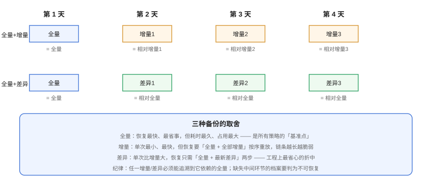
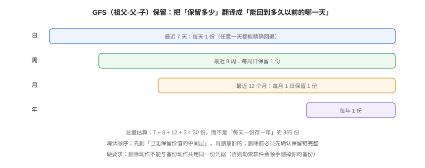

# 备份策略设计：全量、增量与保留轮转

**备份策略要回答四个问题：备份什么、多久备一次、备成什么形态、留多久。** 这四个问题彼此牵制——越想留得久、越频繁，成本越高；越想备得快，恢复就越麻烦。本页把它们拆开逐个给出可落地的取值方法，并给出一套可直接运行的目录规划与校验脚本。

## 1. 备份类型：全量、增量、差异



| 类型 | 每次备份的内容 | 单次耗时/体积 | 恢复需要的文件 | 适合 |
| --- | --- | --- | --- | --- |
| **全量（Full）** | 全部数据 | 最大 | 仅这 1 份 | 基准点、周期归档、迁移前 |
| **增量（Incremental）** | 自**上一次任意备份**以来的变化 | 最小 | 全量 + **全部**增量，按序重放 | 变化少、备份窗口极窄 |
| **差异（Differential）** | 自**上一次全量**以来的变化 | 中等 | 全量 + **最新**差异 | 大多数场景的性价比最优解 |

:::tip 工程上的默认选择
**「每周全量 + 每日差异」是绝大多数系统最稳的折中**：恢复只需两步，任何一环出问题都能快速定位；而纯增量的恢复链条一旦超过四五环，出错的概率和排查成本会陡增。
:::

:::danger 三个必须避开的坑
1. **增量链断裂后仍继续备份**：中间少一份增量，后面所有增量都恢复不了。正确做法是备份工具必须能识别并**拒绝**在不完整链上追加，恢复前先做链完整性检查。
2. **用时间戳判断「变化」而不是用真实差异**：`rsync` 类工具按 mtime + size 判断，在 NFS / 容器卷 / 快照场景下会出现「文件变了但时间没变」，造成静默漏备。正确做法是关键数据用**校验和或内容寻址**（如 restic / borg / pgBackRest 的 manifest 校验）。
3. **把差异当成增量**：差异相对的是**上一次全量**，增量相对的是**上一次任意备份**。两者的保留与淘汰规则不同，混用会导致「删掉一个差异，链就断了」。
:::

## 2. 备份窗口：先量出来，再谈压缩

备份窗口（Backup Window）指「可以在不影响业务的前提下跑备份的时间段」。它由三个量共同决定：

```text
窗口 ≥ 备份耗时 + 校验耗时 + 上传/异地同步耗时
```

| 手段 | 对窗口的影响 | 代价 |
| --- | --- | --- |
| 物理备份代替逻辑导出 | 大幅缩短（不逐行生成 SQL） | 需要与数据库大版本严格对齐 |
| 并行/多线程 | 线性缩短（受 I/O 与网络上限约束） | CPU、I/O 抖动，需限速 |
| 从**只读副本**上备份 | 完全不影响主库 | 需要额外副本，且要确认复制延迟 |
| 压缩（lz4 / zstd） | 缩短上传时间，略微增加 CPU | 压缩级别越高，CPU 越贵 |
| 增量/差异代替全量 | 单次耗时骤降 | 恢复变复杂 |

:::warning 不要用「业务低谷期」猜窗口
「凌晨 3 点业务少」是一个假设，不是一个数据。正确做法是从监控里取**真实 QPS 曲线**，找出真正的低谷；对全球用户的产品，可能根本不存在全球低谷，此时应当选择**从只读副本备份**，而不是硬找窗口。
:::

## 3. 一致性：崩溃一致性 vs 应用一致性

| 级别 | 含义 | 怎么得到 | 恢复后的状态 |
| --- | --- | --- | --- |
| **崩溃一致性** | 文件系统/存储层一致，相当于「断电瞬间」的状态 | 快照、物理卷拷贝 | 数据库能自行恢复（走 redo/undo），但可能有未提交事务 |
| **应用一致性** | 应用层已把所有数据落盘、事务边界干净 | 备份前执行 `FLUSH TABLES WITH READ LOCK` / `pg_start_backup()` / 应用配合 quiet 模式 | 无需额外恢复，可直接使用 |
| **逻辑一致性** | 导出为 SQL/JSON 等逻辑格式 | `mysqldump --single-transaction`、`pg_dump` | 跨版本/跨平台可恢复，但慢 |

:::info 热备为什么也需要「一致性」概念
物理热备工具（XtraBackup、pg_basebackup）在备份过程中数据库仍在写。它们靠**额外的日志（redo / WAL）**在恢复时把备份"补"到一个一致点。所以严格来说，热备的产物**不是**一致状态，而是「不一致的文件 + 足以补齐的日志」。这意味着：日志丢了，这份热备也就废了。
:::

## 4. 命名与目录规划：让「哪份是哪份」不用猜

备份文件的可发现性经常被忽略，但它决定了出事那天你能不能**在 60 秒内找到该用哪一份**。推荐固定结构：

```text
/backup/<service>/<env>/
├── posts/                          # 逻辑备份
│   ├── full/  posts_full_20261001T0300.sql.zst
│   ├── diff/  posts_diff_20261002T0300.sql.zst
│   └── incr/  posts_incr_20261002T1500.sql.zst
├── binlog/                         # 事务日志归档（PITR 依赖）
│   └── mysql-bin.000123
└── repo/                           # 去重仓库（restic/borg）
    └── (由工具自己管理)
```

命名规则：`<对象>_<类型>_<UTC 时间戳><扩展名>`，**只用 UTC**。

:::danger 命名里最容易犯的两个错
1. **用本地时间且不写时区**：跨地区机器上同名文件互相覆盖，或恢复时把 08:00 的备份当成 00:00 的用。正确做法是一律 UTC（`date -u +%Y%m%dT%H%M%SZ`）。
2. **增量不打上父链标识**：只看文件名无法判断它依赖谁。正确做法是把父备份名写进元数据（如 `parent=<文件名>`），或直接交给自带链管理的工具（pgBackRest / restic）。
:::

## 5. 保留策略与轮转：GFS



**GFS（Grandfather-Father-Son）** 把保留目标翻译成「能回到多久以前的哪一天」：

| 层级 | 保留 | 覆盖能力 | 估算份数 |
| --- | --- | --- | --- |
| 日（Son） | 最近 7 天每天 1 份 | 任一天都能精确回退 | 7 |
| 周（Father） | 最近 8 周每周 1 份 | 回到 2 个月内任意一周 | 8 |
| 月（Grandfather） | 最近 12 个月每月 1 份 | 回到 1 年内任意一月 | 12 |
| 年 | 每年 1 份 | 长期归档 | 3~7 |

合计约 30 份即可覆盖 1 年，而不是 365 份。

### 5.1 淘汰顺序与硬约束

淘汰（Expire / Prune）比备份更容易出事，规则要写死：

1. **先确认保留链完整**，再删任何文件——`restic forget` 之前先 `restic check`；`pgbackrest expire` 依赖 manifest 的依赖关系。
2. **删除顺序：最旧的先删，且不删仍在被引用的中间层**。差异/增量链上被依赖的基准备份不能删。
3. **删除动作与备份动作使用不同凭据**。备份账号只写不删，删除由单独的高权限流程执行——这是防勒索软件的最低成本手段。
4. **删除操作必须留审计日志**（删了什么、何时、谁触发）。

## 6. 加密与凭据

| 环节 | 做法 | 说明 |
| --- | --- | --- |
| 传输 | TLS / SSH | 备份文件本质上是全量数据导出，明文传输等于把数据放在网线上 |
| 静态加密 | 客户端加密（restic/borg）或对象存储 SSE | **客户端加密优先**：密文上传后，存储方与攻击者都拿不到明文 |
| 密钥保管 | 密钥与备份分离存放 | 密钥和备份放一起，等于没加密 |
| 凭据隔离 | 备份账号权限最小化（只写目标前缀） | 见上节「删除动作单独凭据」 |

:::warning 加密密钥丢失 = 数据丢失
客户端加密是不可逆的。**恢复密钥（Recovery Key）必须有一份在离线介质上、且有人知道它放在哪**。这不是形式主义：现实中最常见的「备份无法恢复」事故中，密钥丢失占了相当比例。
:::

## 7. 自动化：一个可运行的备份脚本骨架

下面这段脚本把上面几节的规则落成可执行代码。它演示三个要点：**UTC 命名、写临时文件后原子改名、失败即报警**。

```bash [backup-posts.sh]
#!/usr/bin/env bash
set -Eeuo pipefail

BACKUP_ROOT="/backup/posts/prod"
STAMP="$(date -u +%Y%m%dT%H%M%SZ)"          # 统一 UTC，避免跨地区同名
KEEP_DAYS=7
TARGET_DIR="${BACKUP_ROOT}/full"
mkdir -p "${TARGET_DIR}"

# 1) 先写 .incomplete，完成后原子改名 —— 让「半截文件」永不被误用
TMP="${TARGET_DIR}/posts_full_${STAMP}.sql.zst.incomplete"
FINAL="${TARGET_DIR}/posts_full_${STAMP}.sql.zst"

cleanup() { [[ -f "${TMP}" ]] && rm -f "${TMP}"; }
trap cleanup EXIT                            # 任何异常退出都不留残文件

# 2) 逻辑导出：--single-transaction 保证一致性，不打锁
#    凭据从环境变量注入（禁止写在命令行，避免进 history 和 ps）
mysqldump --single-transaction --quick --routines --triggers \
          --source-data=2 \
          -h "${DB_HOST}" -u "${DB_USER}" -p"${DB_PASS}" blog \
  | zstd -3 -T4 > "${TMP}"

# 3) 生成本地校验和（恢复时比对用）
sha256sum "${TMP}" > "${TMP}.sha256"

# 4) 全部成功后才改名 —— 改名是原子的
mv "${TMP}" "${FINAL}"
mv "${TMP}.sha256" "${FINAL}.sha256"
trap - EXIT

# 5) 留痕：把「最近成功时间」写进监控文本文件（node_exporter textfile 可采集）
echo "backup_posts_last_success_timestamp $(date +%s)" \
  > /var/lib/node_exporter/textfile/backup_posts.prom
echo "OK ${FINAL}"
```

脚本里两个反直觉但关键的点：

- **`trap cleanup EXIT`**：备份中断最常见的后果不是失败，而是**留下一个看起来正常的半截文件**。用 `.incomplete` 后缀 + trap 清理，从机制上杜绝。
- **`--source-data=2`**：把 binlog 坐标以注释形式写进 dump。没有这个坐标，逻辑备份就无法和日志归档对齐，PITR 也就无从做起。

## 8. 验证方式

备份脚本「跑通」不等于策略可用。按下面三步验证：

```shell
# ① 语法与干跑：确认脚本本身没问题
bash -n backup-posts.sh                 # 期望：无输出（语法通过）

# ② 产物完整性：校验和必须对得上
sha256sum -c /backup/posts/prod/full/posts_full_*.sql.zst.sha256
# 期望：<文件名>: OK

# ③ 结构自检：目录里不应当残留任何 .incomplete
find /backup/posts/prod -name '*.incomplete' -print
# 期望：无输出。若有输出，说明上次备份异常终止且清理失败

# ④ 保留策略自检：统计各层份数是否符合 GFS 设定
find /backup/posts/prod/full -name 'posts_full_*.sql.zst' | wc -l
# 期望：≤ 保留上限（本配置 7 天日备，理论上不应长期超过该值）
```

:::tip 加上「备份年龄」告警
仅靠脚本返回值不够——如果 cron 根本没触发，脚本连「失败」都不会报。务必加一条**基于新鲜度的告警**：`time() - backup_posts_last_success_timestamp > 86400` 即告警。这条规则能覆盖「任务没跑」这类静默故障，具体做法见 [监控告警](../../Monitoring/index.md)。
:::

## 9. 策略自检清单

在把策略写进文档前，逐条对照：

1. 每个「不可重算」的数据资产都有备份，且**明确了保留多久**；
2. 备份类型的选择（全量/差异/增量）与恢复步骤已在文档中写清；
3. 备份窗口有**实测数据**支撑，而不是猜的；
4. 命名统一 UTC，且能一眼看出类型与依赖关系；
5. 淘汰规则写死，且删除凭据与备份凭据分离；
6. 加密密钥有离线副本，且保管人明确；
7. 备份后**有校验**，失败有告警；
8. 存在「最近成功时间」监控指标；
9. 上述每一条都能在下一次恢复演练中被验证。

## 参考资料

- MySQL 官方 · Backup and Recovery（`mysqldump --single-transaction` / `--source-data`）：https://dev.mysql.com/doc/refman/8.4/en/backup-and-recovery.html
- PostgreSQL 官方 · Backup and Restore（`pg_dump` / 连续归档）：https://www.postgresql.org/docs/current/backup.html
- restic 用户手册（快照、保留策略 `forget`）：https://restic.readthedocs.io/en/stable/
- BorgBackup 文档（归档、`prune` 保留规则）：https://borgbackup.readthedocs.io/en/stable/
- pgBackRest 用户指南（保留策略与归档过期）：https://pgbackrest.org/user-guide.html
- 本专题其余章节：[备份工具矩阵](../Toolchain/index.md) ｜ [恢复与演练](../Recovery/index.md) ｜ [常见问题](../FAQ/index.md)
