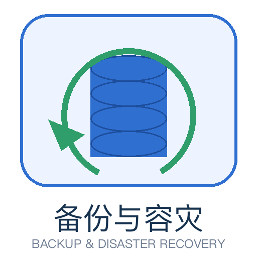

# 备份与容灾

备份与容灾是一对**买保险的工程能力**：备份回答「数据被写坏了、删错了、被加密了，能不能回到出事之前」，容灾回答「这台机器、这个机房、这个地域整体不可用了，业务还能不能继续」。它们都不提升日常性能，只在最坏的那一天决定生死——也正因如此，最容易被长期忽略。

本专题从「备份 / 高可用 / 容灾三者的边界」讲起，覆盖**策略设计 → 工具落地 → 恢复与演练 → 容灾架构 → 实战闭环**，面向需要独立对「数据不丢、业务不停」负责的运维、后端与 SRE。

- [体系概述：备份、高可用与容灾的边界](Overview/index.md)
- [备份策略设计：全量、增量与保留轮转](Strategy/index.md)
- [备份工具矩阵：从 mysqldump 到 Velero](Toolchain/index.md)
- [恢复与演练：PITR、校验与演练设计](Recovery/index.md)
- [容灾架构：冷备、温备、热备与多活](DisasterRecovery/index.md)
- [实战：给博客平台做一套备份与容灾方案](Practice/index.md)
- [常见问题与最佳实践](FAQ/index.md)

## 本专题与相邻专题的分工

「备份」是一个很容易重复讲述的话题——几乎每个存储组件都会在自己的文档里讲一遍怎么导出。本专题**只讲跨组件的那一层**，各组件的具体命令回到各自专题：

| 你想要的 | 去哪里 |
| --- | --- |
| 备份与容灾的**体系、策略、RTO/RPO、演练、容灾档位** | 本专题 |
| MySQL / PostgreSQL / MongoDB / Redis **各自**的备份命令与参数 | [PostgreSQL 备份恢复](../../DB/Relational/PostgreSQL/BackupRestore/index.md)、[MongoDB 备份恢复](../../DB/NoRelational/MongoDB/BackupRestore/index.md)、[Redis 持久化](../../DB/NoRelational/Redis/Persistence/index.md)、[MySQL 常见问题](../../DB/Relational/MySQL/FAQ/index.md) |
| 用 **cron / systemd timer** 把备份跑起来 | [定时任务](../../Ops/Linux/Advanced/CronTasks/index.md) |
| 备份文件**放哪里、怎么放** | [Docker 数据卷](../../Ops/Docker/Volumes/index.md)、[Kubernetes 存储](../../Ops/Kubernetes/Storage/index.md) |
| 备份**失败了怎么知道** | [监控告警](../../Ops/Monitoring/index.md)、[日志体系](../../Ops/LogSystem/index.md) |
| **容器 / 集群**整体备份与迁移 | [Kubernetes 存储](../../Ops/Kubernetes/Storage/index.md)、[多集群容灾](../../Ops/ContainerOrchestration/MultiCluster/index.md) |
| **一键部署 + 上线验收**里怎么放备份项 | [完整项目交付](../../Others/ProjectDelivery/Delivery/index.md) |

:::tip 一句话理解
**高可用解决「机器坏了」，备份解决「数据坏了」，容灾解决「机房坏了」。** 三件事互相不可替代，用一句话记住它们的差异：主从复制会把你的 `DELETE` 语句忠实同步到所有副本，而备份不会。
:::

## 版本口径

本专题涉及的工具较多，文中所有版本事实**统一按 2026-10 官方渠道核对**，并在各页标注「主线 / 旧版本」状态。工具版本变化快，落地前请以官方发布页为准：

| 工具 | 核对结论（2026-10） |
| --- | --- |
| Percona XtraBackup | 8.4.0-7（2026-09-17）；**8.4 线不支持 MySQL 8.0 或 9.x 服务端**，须与数据库大版本对齐 |
| pgBackRest | 2.59.2（2026-09-27）；2.59 线已支持 PostgreSQL 19 beta |
| restic | 0.19.1（2026-07-05）；0.19.0 起源码构建要求 Go 1.25+ |
| BorgBackup | 1.4.5（2026-07-19，修复 CVE-2026-62268）；1.2.9 为 oldstable；2.0 仍在 beta，**不要用于生产** |
| Velero | v1.18.3（2026-09-21）；已进入 CNCF Sandbox，仓库由 `vmware-tanzu/velero` 迁至 `velero-io/velero` |

:::info 本页的定位
本页是专题入口，只给结论与分工。选型论证、命令细节、演练设计分别见 Overview / Strategy / Toolchain / Recovery / DisasterRecovery / Practice / FAQ 各页。
:::
