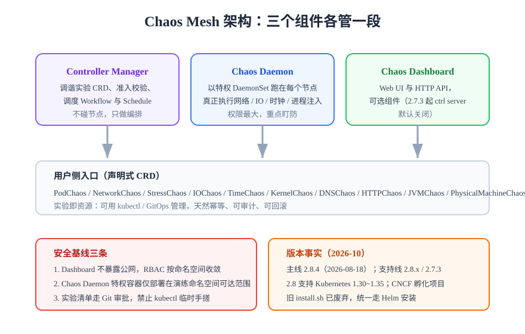

# Chaos Mesh 深入

Chaos Mesh 是 CNCF 孵化的 Kubernetes 原生混沌工程平台，实验以 CRD 声明、可被 kubectl / GitOps / Dashboard 管理。如果你的工作负载在 K8s 上，它通常是默认选项。

## 版本与兼容（2026-10 核对）

| 项 | 事实 |
| --- | --- |
| 主线版本 | **2.8.4**（2026-08-18 发布，补丁版） |
| 支持线 | 2.8.x 与 2.7.3 维护中；2.6.7 已停止支持 |
| Kubernetes 兼容 | 2.8 支持 K8s **1.30~1.35**（2.7 支持 1.26~1.28） |
| 安装方式 | 旧 `install.sh` **已废弃**，统一走 Helm |
| 默认变更 | 2.7.3 起 `enableCtrlServer` 默认为 `false` |
| 治理归属 | CNCF 孵化项目（Incubating） |

:::info 升级注意
升级顺序：先应用新版 CRD，再升级 controller；Webhook 证书依赖 cert-manager 时注意证书续期。跨多个 minor 升级前先看官方版本支持页确认目标 K8s 版本兼容性。
:::

## 架构：三个组件各管一段



| 组件 | 职责 | 安全关注点 |
| --- | --- | --- |
| Chaos Controller Manager | 调谐实验 CRD、准入校验（Webhook）、调度 Schedule 与 Workflow | 编排层，常规 RBAC 即可 |
| Chaos Daemon | 特权 DaemonSet，真正执行网络 / IO / 时钟 / 进程注入 | **权限最大**，重点盯防；仅部署在必要节点 |
| Chaos Dashboard | Web UI 与 HTTP API，可选组件 | **不暴露公网**，开 RBAC Token 管理 |

## 实验类型速查

| CRD | 注入内容 | 常用场景 |
| --- | --- | --- |
| PodChaos | Pod Kill / 容器 Kill / 暂停 | 验证自愈与健康检查 |
| NetworkChaos | 延迟、丢包、分区、带宽 | 验证超时、重试、降级 |
| StressChaos | CPU / 内存压力 | 验证限流与扩缩容 |
| IOChaos | 文件系统延迟与错误 | 验证存储容错 |
| DNSChaos | DNS 解析错误 | 验证本地缓存与降级路由 |
| HTTPChaos | HTTP 请求篡改 / 中断 | 验证 API 层容错 |
| TimeChaos | 容器时钟偏移 | 验证时间敏感逻辑（高风险，最后做） |
| JVMChaos | JVM 方法级延迟与异常 | 验证 Java 应用兜底逻辑 |
| PhysicalMachineChaos | 物理机级注入 | 混合部署环境 |

## 快速上手：安装与第一个实验

```shell
# ① 添加 Helm 仓库并安装（namespace 混沌默认 chaos-mesh）
helm repo add chaos-mesh https://charts.chaos-mesh.org
helm repo update
helm install chaos-mesh chaos-mesh/chaos-mesh \
  --namespace chaos-mesh --create-namespace \
  --version 2.8.4 \
  --set dashboard.create=true

# ② 确认三个组件就绪
kubectl get pods -n chaos-mesh
# 期望：chaos-controller-manager、chaos-daemon（每节点一个）、chaos-dashboard 均 Running
```

一个最小 PodChaos 实验（在 target 命名空间杀 default 前缀的 Pod）：

```yaml
apiVersion: chaos-mesh.org/v1alpha1
kind: PodChaos
metadata:
  name: kill-blog-server
  namespace: chaos-testing
spec:
  action: pod-kill
  mode: one
  selector:
    namespaces: [blog]
    labelSelectors:
      app: blog-server
  duration: "30s"
  scheduler:
    cron: "@every 10m"
```

```shell
kubectl apply -f podkill.yaml
kubectl get podchaos -n chaos-testing   # 观察 EXPERIMENT 状态
kubectl delete podchaos kill-blog-server -n chaos-testing   # 立即恢复
```

## 三个编排资源

| 资源 | 用途 | 要点 |
| --- | --- | --- |
| Schedule | 定时循环执行单个实验 | 固化回归实验的第一选择；注意 `concurrencyPolicy` 防重入 |
| Workflow | 串行 / 并行编排多个实验步骤 | 模拟级联故障（先杀依赖再限流）；节点类型含 `suspend` 可做人工确认点 |
| StatusCheck | 对外部端点做健康检查 | 与稳态指标联动实现**自动中止**：检查失败即终止实验 |

:::tip 声明式优于命令式
实验清单全部走 YAML 入库（Git 审批），不要在 Dashboard 上手搓临时实验。声明式带来三样东西：幂等（apply 多次结果一致）、可审计（Git 历史就是实验史）、可回滚（delete 实验即恢复）。
:::

## 安全基线

:::danger 四条红线
1. **Dashboard 不暴露公网**：只经内部 ingress 访问，改默认口令、启用 Token 校验（2.8.4 已修复 Token 验证相关的多个缺陷，务必保持版本最新）；
2. **Chaos Daemon 特权容器**：能用 nodeSelector 收窄部署节点就收窄，避免全集群特权；
3. **RBAC 按命名空间收敛**：演练执行者只授权目标命名空间的 chaos 资源，不给 cluster-admin；
4. **禁止在生产集群直接调试实验参数**：参数变更先在预发验证，再走 Git 评审同步到生产。
:::

## Chaos Mesh 还是 Litmus？

两者都是 CNCF 孵化的 K8s 原生平台，能力高度重叠。判据：

| 你的情况 | 推荐 |
| --- | --- |
| 团队主语言 Go / 已用 TiDB 生态，要最小依赖 | Chaos Mesh（单 chart 部署轻） |
| 要控制面门户、实验市场（ChaosHub）、多团队用门户编排 | LitmusChaos（ChaosCenter 更完整） |
| 要 JVM 方法级注入 | Chaos Mesh 的 JVMChaos 或 ChaosBlade |

## 验证方式

```shell
# 实验生效验证：注入期间 Pod 确实被 kill 又恢复
kubectl get events -n blog --sort-by=.lastTimestamp | grep -i kill
# 恢复验证：delete 实验后 60s 内无新的 kill 事件，服务探针恢复 Passing
```

## 深入阅读

- [工具全景：Chaos Mesh 在版图中的位置](../Platforms/index.md)
- [Kubernetes 专题：平台基础](../../Kubernetes/index.md)
- [GitOps 落地：实验清单的 Git 管控](../../ContainerOrchestration/GitOps/index.md)
