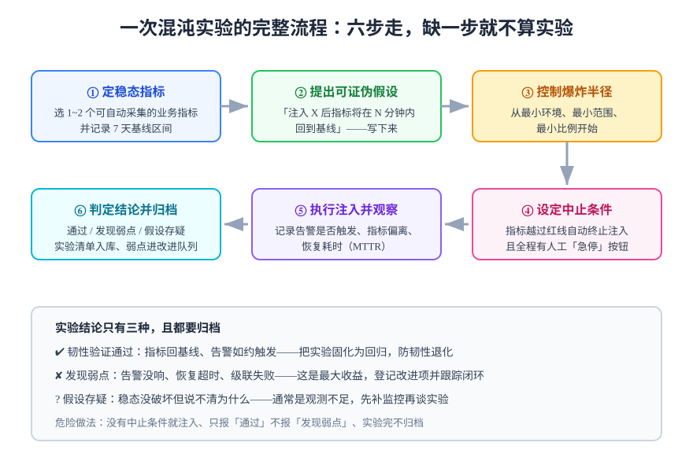

# 实验设计方法

实验设计是混沌工程区别于「随机搞破坏」的核心纪律。一次合格的实验 = **稳态指标 + 可证伪假设 + 受控注入 + 明确的中止条件 + 归档结论**，五者缺一不可。

## 实验六步流程



### 第一步：定稳态指标

- 选 **1~2 个**指标就够，贪多是新手通病；
- 必须能**自动采集**（Prometheus 查询、日志聚合），人工看图不算；
- 记录至少 7 天的基线区间（如 P95 在 180~260ms 之间波动），实验结论对照基线而不是对照「感觉」。

### 第二步：提出可证伪假设

写成完整句子，包含环境、故障、预期恢复时间：

> 「在预发环境对 MySQL 注入 2 秒延迟 5 分钟，博客接口 P95 将升至 2~3 秒但成功率保持 100%，注入停止后 **2 分钟内**回到基线。」

预期恢复时间是假设里最常被漏掉、也最有价值的部分——它逼你回答「系统该多快自愈」。

### 第三步：控制爆炸半径

五个杠杆，按顺序收紧：

| 杠杆 | 做法 |
| --- | --- |
| 环境选择 | 测试环境 → 预发 → 生产灰度，逐级推进 |
| 范围缩小 | 注入单个实例而非整个服务、单条依赖路径而非全部 |
| 比例缩减 | 生产实验先对 1% 流量 / 1 个副本生效 |
| 时间收窄 | 首次实验注入时长 ≤ 5 分钟 |
| 自动中止 | 稳态指标越过红线立即终止注入（工具的 abort / StatusCheck） |

### 第四步：设定中止条件

每个实验必须同时有**自动中止**和**人工急停**：

- 自动中止：指标红线（错误率 > 5%、P95 > 5s、成功率跌破 99%）触发工具终止；
- 人工急停：演练中任何角色都有权喊停，喊停后**先恢复再讨论**。

### 第五步：执行并观察

全程记录：注入开始时间戳、指标偏离曲线、告警是否触发（及其延迟）、注入停止时间、恢复耗时。这些数据决定第六步的结论。

### 第六步：判定结论并归档

| 结论 | 判据 | 后续动作 |
| --- | --- | --- |
| ✔ 韧性验证通过 | 指标回基线、告警如约触发 | 固化为定期回归实验 |
| ✘ 发现弱点 | 告警没响 / 恢复超时 / 级联失败 | 登记改进项，指派负责人，跟踪闭环 |
| ? 假设存疑 | 稳态没破坏但说不清为什么 | 先补观测手段，再重做实验 |

## 实验记录模板

每个实验归档一份，字段固定：

```markdown
## 实验：MySQL 延迟注入（EXP-2026-014）

- 环境与范围：预发，blog-server 单实例 → mysql 容器链路
- 稳态指标：GET /api/v1/posts 成功率；P95 延迟（基线 180~260ms）
- 假设：注入 2s 延迟 5 分钟，成功率 100%，停止后 2 分钟回基线
- 注入方法：toxiproxy latency 2000ms（JITTER 100）
- 中止条件：成功率 < 99% 或 P95 > 5s 自动终止
- 观察记录：告警 14:32 触发（注入后 1 分钟）；停止后 95s 回基线
- 结论：发现弱点——慢查询告警阈值 3s 过松，DB 延迟 2s 未触发数据库侧告警
- 改进项：ISSUE-88 调整慢 SQL 告警阈值并补连接池 pending 指标
```

## 高频易错点

:::danger 五个让实验作废的写法
1. **一次注入多个故障**——偏离了无法归因，一次只改一个变量；
2. **没有基线就开跑**——对照「感觉」的结论不可信，先攒 7 天基线；
3. **只记录通过的实验**——「发现弱点」的实验才是高价值的，藏起来等于白做；
4. **没有中止条件**——第一次实验就体验级联失败是真实发生过的事故；
5. **实验完不归档**——三个月后同样的问题换个新人再踩一遍。
:::

:::tip 从回归实验开始自动化
第一个实验通过后，立刻把它固化成定时回归（Chaos Mesh Schedule 或 CI 里的 Chaos Toolkit 调用）。韧性和代码一样会「腐化」——三个月前验证过的降级逻辑，可能已经在新版本里被顺手删掉了。
:::

## 验证方式

- 手里有一份字段齐全的实验记录（照上面的模板）；
- 每个实验能回答：注入了什么、指标怎么动、告警响没响、多久恢复、结论是什么；
- 至少一个通过实验已被固化为定期回归。

## 深入阅读

- [演练中的可观测：实验数据从哪来](../Observability/index.md)
- [演练日组织：把实验变成团队活动](../GameDays/index.md)
- [实战：博客平台三个注入实验（含完整命令）](../Practice/index.md)
