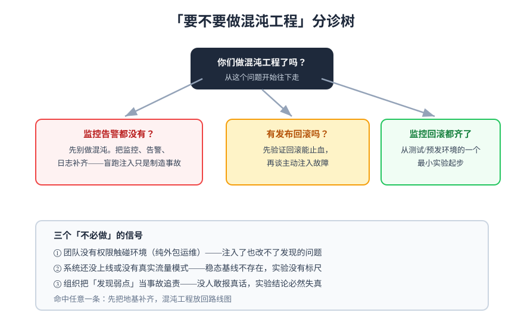

# 常见问题与最佳实践

## 分诊决策树：要不要做、卡住了怎么办

## 高频问答

### 入门阶段

**Q1：混沌工程和压测有什么区别？**
压测问「流量大 10 倍会怎样」，混沌问「依赖挂了会怎样」。压测不注入故障、混沌不制造流量高峰。两者互补：压测暴露容量上限，混沌暴露故障路径上的设计缺陷。

**Q2：测试环境做过了，还有必要在生产做吗？**
有必要，但分级推进。测试环境验证「代码逻辑对」，生产验证「真实拓扑、真实流量、真实数据量下的行为」。前提是爆炸半径控制（灰度比例、自动中止）全部就位，连续三场预发演练全绿再上生产。

**Q3：小团队没有 SRE，做得了吗？**
做得了最小版本：一个轻量工具（toxiproxy）、一条核心链路、月度一次 30 分钟实验。混沌工程的主要投入是**纪律**（实验记录、改进项闭环）而不是人力。

**Q4：第一步到底做什么？**
给核心接口定稳态指标并攒 7 天基线。这一步不动任何环境、零风险，且是后续一切实验的前提。

### 实施阶段

**Q5：注入后指标没变化，实验白做了吗？**
不一定，先分诊：① 注入真的生效了吗（查工具状态、事件日志）？② 那条依赖真的被用到了吗（trace / 连接数确认）？③ 系统真的稳（有降级 / 多副本兜底）？三种情况对应三种结论——只有第 ③ 种才是「韧性验证通过」。

**Q6：告警在演练中没响，但事后看指标确实异常了，什么问题？**
典型告警缺陷三选一：阈值过松（异常幅度没到阈值）、`for` 时长过长（异常持续时间短于触发窗口）、路由配置错误（规则触发了但通知没发对渠道）。逐项排查，这类发现是演练最高价值的产出之一。

**Q7：实验中发现了 bug，算事故要写报告吗？**
不算事故，算产出。演练发现弱点的处置走改进项队列（issue + 负责人 + 截止时间），不进事故流程——前提是演练有「标记」，通信员的工作就是保证这个标记对全公司可见。

**Q8：怎么说服管理层投入？**
用损失语言而不是工具语言：「上季度 X 事故根因是依赖超时缺失，这类问题一次 30 分钟的注入实验就能暴露」。再用演练实测数据（MTTD / MTTR、告警缺失数）持续证明投入产出。

### 进阶阶段

**Q9：实验要不要自动化进 CI？**
通过预发的实验**应该**固化为定期回归（防止韧性随版本退化），但首次实验不要——首次重在观察与记录，自动化是验证通过之后的固化动作。

**Q10：多服务级联故障怎么验？**
先用 Workflow / 编排把两个单点实验串起来（先杀依赖再限流），确认各自通过后再组合。级联实验的爆炸半径控制更严：只在预发做，自动中止阈值收紧一档。

**Q11：数据库可以做混沌实验吗？**
运行时行为可以（连接池耗尽、慢查询注入、主从延迟），**数据本身**的故障（误删、损坏）走备份恢复演练——验证 PITR 能恢复到指定时间点，两者分工明确。

**Q12：演练记录应该包含什么才不算白做？**
最少五样：稳态指标与基线、假设原文、注入命令与时间线、告警实测结果、结论三分类 + 改进项编号。三个月后任何人拿这份记录能复现同一场实验。

## 上线前自查清单

:::info 十二项自查（第一场演练前逐项打勾）
- [ ] 核心接口的稳态指标已定义且有 7 天基线
- [ ] 指标有面板且面板按服务分格
- [ ] 告警规则存在且路由到有人值守的渠道
- [ ] 回滚 / 急停命令写在实验清单首屏
- [ ] 注入范围（实例 / 流量比例）已明确且为最小
- [ ] 自动中止条件已配置并测试过触发
- [ ] 相关团队已收到演练通知
- [ ] 告警带「演练」标记，与真实事故可区分
- [ ] 实验记录模板已准备好
- [ ] 注入员只执行清单内动作的纪律已宣贯
- [ ] 改进项登记处（issue 队列）可用
- [ ] 演练时间避开业务高峰与变更窗口
:::

## 最佳实践

1. **从真实事故选故障**：历史事故清单是最好的场景库；
2. **一次一个变量**：多故障组合留给通过单点验证之后；
3. **假设写完整**：环境、故障、预期恢复时间缺一不可；
4. **先预发后生产**：连续三场全绿再逐级推进；
5. **发现弱点不追责**：文化塌了数据就是假的；
6. **通过实验固化回归**：韧性会随版本退化；
7. **改进项闭环率优先于演练场次**：只演练不修复等于定期演戏；
8. **可观测先行**：没面板没告警的实验不做；
9. **记录可复现**：三个月后能照着重跑一遍的记录才算归档；
10. **节奏高于强度**：月度小演练优于年度大演练。

## 术语表

| 术语 | 英文 | 含义 |
| --- | --- | --- |
| 稳态 | Steady State | 系统正常运行的可量化描述（业务指标区间） |
| 假设 | Hypothesis | 对注入故障后系统行为的可证伪预测 |
| 爆炸半径 | Blast Radius | 实验故障影响的范围，必须可控可终止 |
| 故障注入 | Fault Injection | 受控制造故障的手段，是混沌工程的子集 |
| 演练日 | GameDay | 团队级的故障注入演练活动 |
| 中止条件 | Abort Condition | 触发实验自动终止的指标红线 |
| MTTD / MTTR | — | 发现偏离耗时 / 恢复到稳态耗时 |
| 韧性退化 | Resilience Regression | 版本演进中丢失既有容错能力，靠回归实验发现 |
