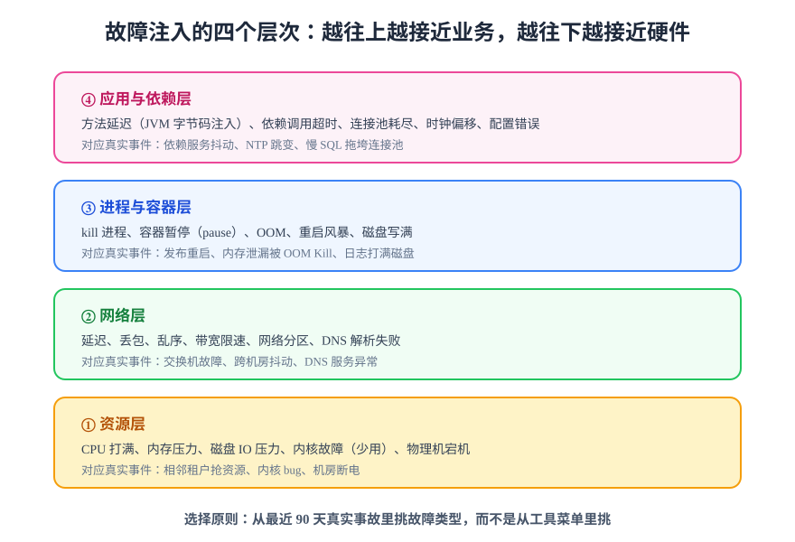

# 故障注入分类

设计实验的第一步不是打开工具，而是回答：**注入什么故障？** 判据只有一条——从最近 90 天真实事故里挑故障类型，而不是从工具菜单里挑。工具能注入什么不重要，系统**会真的遭遇什么**才重要。

## 四个层次

故障按「离业务远近」分四层，越往下越接近硬件、越通用：

### ① 资源层

| 故障 | 模拟的真实事件 | 典型工具/命令 | 风险 |
| --- | --- | --- | --- |
| CPU 打满 | 邻居租户抢资源、慢查询风暴 | `stress-ng`、Chaos Mesh StressChaos | 中 |
| 内存压力 | 内存泄漏、缓存膨胀 | `stress-ng --vm`、memStress | 中（易触发 OOM 波及） |
| 磁盘 IO 压力 | 备份任务挤占、日志风暴 | `fio`、IOChaos | 中 |
| 磁盘写满 | 日志打满磁盘 | `fallocate` 占位 | 高（可能拖垮同盘组件） |

### ② 网络层

这是**使用频率最高**的一层，因为网络故障是分布式系统最常见的不确定性来源：

| 故障 | 模拟的真实事件 | 典型工具 | 验证的韧性机制 |
| --- | --- | --- | --- |
| 延迟（latency） | 跨机房抖动、慢 SQL | `tc netem`、toxiproxy、NetworkChaos | 超时与降级 |
| 丢包 / 乱序 | 弱网、交换机故障 | 同上 | 重试与幂等 |
| 连接中断 | 依赖服务重启 | toxiproxy timeout、NetworkChaos | 连接池恢复 |
| 网络分区 | 机房级故障 | NetworkChaos（分区模式） | 脑裂防护、仲裁机制 |
| DNS 解析失败 | DNS 服务异常 | DNSChaos | 本地缓存、降级路由 |

### ③ 进程与容器层

| 故障 | 模拟的真实事件 | 典型工具 | 验证的韧性机制 |
| --- | --- | --- | --- |
| kill 进程 / 容器 | 发布重启、崩溃 | `docker kill`、PodChaos | 自动重启、流量摘除 |
| 容器暂停（pause） | 进程假死、GC 长停顿 | `docker pause`、PodChaos（duration） | 健康检查摘流量 |
| OOM Kill | 内存泄漏 | 内存压力间接诱发 | 重启后预热恢复 |
| 重启风暴 | 配置错误循环崩溃 | PodChaos（kill） | 退避策略、告警 |

### ④ 应用与依赖层

| 故障 | 模拟的真实事件 | 典型工具 | 验证的韧性机制 |
| --- | --- | --- | --- |
| 方法级延迟 / 异常 | 代码路径劣化 | ChaosBlade JVM 注入、Byteman | 方法内重试、兜底逻辑 |
| 连接池耗尽 | 慢 SQL 拖垮连接池 | 应用参数 + 压力组合 | 隔离舱（bulkhead）、快速失败 |
| 时钟偏移 | NTP 跳变、闰秒 | TimeChaos | 缓存过期、Token 校验逻辑 |
| 配置错误 | 误发布配置 | 直接下发错误配置 | 配置校验、回滚流程 |

:::tip JVM 方法级注入是稀缺能力
开源工具里 ChaosBlade 的 JVM 注入几乎独一份——它能**深入运行中的 Java 应用**，让指定方法抛异常或延迟，不需要改代码。验证「方法内 catch 了异常但没打日志」这类问题只有这一层能做到。
:::

## 选择故障的三个判据

1. **频次对齐历史**：近 90 天发生过的事故优先（发生过 ≈ 未来还会发生）；
2. **后果可承受**：先挑「挂了也只影响一个实例」的故障，分区、时钟这类全局性故障放最后；
3. **恢复手段明确**：注入前必须知道怎么恢复（停注入、删实验、重启容器），说不出恢复手段就不要注入。

:::danger 高风险故障清单（新手禁入）
- **时钟偏移（TimeChaos）**：会影响 TLS 证书校验、分布式锁、缓存过期等大量逻辑，且恢复后部分状态**不会自动回滚**；
- **内核故障（KernelChaos）**：直接影响宿主机，只在专用实验集群使用；
- **生产环境网络分区**：可能触发未知的集群仲裁行为，必须先在预发完整走一遍。
:::

## 验证方式

对项目环境列出一份「候选故障清单」：每行包含故障类型、对应历史事故（或「无历史、预防性」）、注入工具、恢复手段、风险等级。能列出来，说明你已经过了「从工具菜单挑故障」的阶段。

## 深入阅读

- [实验设计方法：把故障变成实验](../ExperimentDesign/index.md)
- [Chaos Mesh：各层故障的 K8s 落地](../ChaosMesh/index.md)
- [实战：博客平台三个注入实验](../Practice/index.md)
