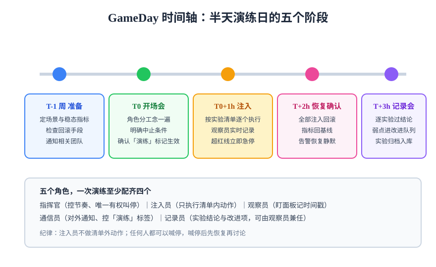

# 演练日组织（GameDay）

单个人跑实验只能验证技术，**演练日（GameDay）** 验证的是「人 + 流程 + 系统」的整体韧性：值班同学能不能发现、能不能按手册处置、通信有没有断。它把混沌实验从个人行为升级为团队例行活动。

## GameDay 是什么

由 Netflix 推广的实践：**定期召集团队，按预设场景注入真实故障**，观察系统与人的反应，产出改进项。与单人实验的区别：

| 维度 | 单人实验 | GameDay |
| --- | --- | --- |
| 目的 | 验证某个技术假设 | 验证「检测 → 响应 → 恢复」整条链 |
| 范围 | 一个实验 | 一组场景（含组合故障） |
| 产出 | 实验记录 | 演练记录 + 改进项队列 + 手册更新 |
| 频率 | 随时可做 | 建议月度或双周，半天一场 |

## 时间轴：半天演练日



### T-1 周：准备

- 定 2~3 个场景（新场景 + 上次演练遗留弱点的复验）；
- 每个场景写清稳态指标、注入步骤、**回滚步骤**；
- 检查中止手段可用（自动中止规则 + 人工急停命令贴在文档首屏）；
- 通知所有相关团队（包括「我们只是顺便路过的下游团队」）。

### T0：开场会（15 分钟）

- 角色分工念一遍（见下表）；
- 全员确认中止条件与急停命令；
- 确认「演练标记」已生效（告警带标签、状态页横幅、值班表备注）。

### 注入阶段（1~2 小时）

- 注入员**只执行清单内动作**，清单外的问题记下来不现场加戏；
- 观察员实时记时间戳：偏离开始、告警触发、处置动作、恢复完成；
- 任何指标越红线 → 指挥官叫停 → 先恢复再讨论。

### 恢复确认（30 分钟）

- 全部注入回滚，指标回基线，告警恢复静默；
- 确认没有「演练残留」（临时配置、被 kill 后未重启的实例、忘删的实验资源）。

### 记录会（30 分钟）

- 逐个实验过结论（通过 / 发现弱点 / 假设存疑）；
- 弱点当场登记改进项并**指派负责人与截止时间**；
- 实验记录归档，通过的可固化为定期回归。

## 角色分工

| 角色 | 职责 | 唯一性 |
| --- | --- | --- |
| 指挥官 | 控节奏、叫停、裁决分歧 | **唯一**有权叫停与恢复注入的人 |
| 注入员 | 执行清单内注入动作 | 只照清单执行，不即兴 |
| 观察员 | 盯面板，记录时间戳与曲线 | 可兼任记录员 |
| 通信员 | 对外通知、维护「演练」标记 | 防止下游团队误报事故 |
| 记录员 | 实验结论与改进项登记 | 记录会的主导者 |

:::danger 三条纪律
1. **任何人都可以喊停**——但喊停后先恢复、再讨论，不许边注入边争论；
2. **注入员不做清单外动作**——临场灵感登记到改进队列，下次演练再验；
3. **发现弱点不追责**——GameDay 的价值在于弱点越早暴露越便宜，追责文化会杀死全部真实结论。
:::

## 演练记录模板

```markdown
## GameDay 2026-10（第 4 场）

- 参与者：指挥官 @x / 注入 @y / 观察 @z / 通信 @w
- 场景清单：G-1 依赖超时、G-2 实例被杀、G-3 缓存不可达
- 结果概览：G-1 通过（告警 1 分钟内触发）；G-2 发现弱点（重启后 5 分钟预热抖动未告警）
- 改进项：
  - [ ] ISSUE-92 补重启预热期 QPS 告警（负责人 @y，截止 10-13）
  - [ ] ISSUE-93 值班手册补充「缓存恢复回源风暴」处置段（@z，10-20）
- 手册变更：无 / 有（列出页码）
```

## 常态化的节奏建议

1. **月度起步**：每场半天，2~3 个场景，一年 12 场足够覆盖核心依赖；
2. **场景轮换**：三分之一新场景、三分之一上次弱点复验、三分之一历史场景回归；
3. **环境逐级推进**：预发连续三场全绿后，再把同场景搬到生产灰度；
4. **改进项闭环率是真正的 KPI**：演练场次多但改进项没人修，等于定期花半天演戏。

## 验证方式

- 一份字段齐全的演练记录（含改进项与负责人）；
- 上一场的改进项在本场开场前核销过半（否则节奏该降频）；
- 参与者能说出「下次故障发生时我该看哪个面板、执行哪条命令」。

## 深入阅读

- [实验设计方法：场景从哪来](../ExperimentDesign/index.md)
- [演练中的可观测：观察员看什么](../Observability/index.md)
- [备份与容灾：恢复侧的专项演练](../../BackupDR/index.md)
