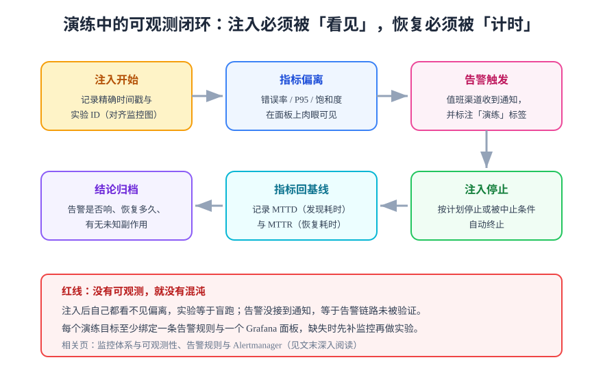

# 演练中的可观测

混沌实验的价值完全取决于你**能看见多少**。注入开始后指标看不见偏离、告警不响、恢复时间记不下来——实验就等于盲跑，甚至比不做更糟（制造了事故却没换来信息）。

## 闭环：注入必须被看见，恢复必须被计时



| 环节 | 必须记录的数据 | 来源 |
| --- | --- | --- |
| 注入开始 | 精确时间戳 + 实验 ID | 实验记录（对齐监控图横轴） |
| 指标偏离 | 错误率、P95/P99、饱和度的偏离曲线 | Grafana 面板截图或导出 |
| 告警触发 | 响没响、延迟多久、是否带「演练」标注 | Alertmanager 通知记录 |
| 注入停止 | 计划停止还是中止条件触发 | 实验状态 |
| 恢复 | MTTD（发现偏离耗时）、MTTR（回到基线耗时） | 面板时间差 |

:::danger 红线：没有可观测，就没有混沌
动手注入前逐项检查：这个实验对应的指标**有没有面板**？对应的告警规则**存在且路由到值班渠道**吗？两个问题任何一个答不上来，先补监控再做实验——这一步的花费远小于一次盲跑的代价。
:::

## 演练要验证的三类可观测能力

### ① 告警真的会响吗

这是混沌工程**性价比最高**的用途：大部分团队的告警配置从未被端到端验证过，规则写对了但 `for` 时长过长、路由配错、值班渠道静默——只有真实故障注入能一次性暴露整条链路的问题。

验收判据：注入开始后 N 分钟内（N = 该告警的设计触发时间 + 容差）值班渠道收到通知，且通知能关联到正在进行的实验。

### ② 面板能定位问题吗

注入期间让不在现场的同学只看面板回答：「哪个服务在异常？」答不上来说明面板按**技术组件**组织而不是按**用户路径**组织，改进方向是把黄金指标（延迟、流量、错误、饱和度）按服务分格。

### ③ 恢复时间与预期一致吗

「注入停止后恢复」是很多隐藏问题的暴露点：连接池不自动恢复、缓存被击穿后回源风暴、断路器半开状态卡住。**恢复耗时必须对照假设里写的预期值**，超了就是弱点。

## 与 SLO / 错误预算联动

演练数据直接喂给 SLO 体系：

| 演练产物 | 喂给 SLO 什么 |
| --- | --- |
| 注入期间的错误率曲线 | 验证错误预算告警的多窗口规则真实生效 |
| MTTD / MTTR | 校准 SLO 文档里的恢复目标承诺 |
| 演练发现的观测盲区 | 登记为 SLI 缺失，补指标定义 |

## 最小面板配置（配合实验）

一次演练至少准备三格面板 + 一条告警：

```text
面板 1：接口成功率（按服务分格）—— 判定「稳态是否被破坏」
面板 2：P95 / P99 延迟（按路由模板）—— 判定降级是否生效
面板 3：依赖健康（DB 连接池 pending、缓存命中率）—— 判定偏离根源
告警：成功率 < 99% 持续 1 分钟 → 值班渠道（演练时实测它）
```

:::tip 告警「演练」标签纪律
演练期间的告警必须能一眼区分于真实故障：Alertmanager 通知里带上 `chaos=true` 标签，或在演练窗口静默非目标告警。混在一起的结果是演练期间真出了事没人发现——这是真实发生过的二次事故形态。
:::

## 验证方式

- 每个实验对应的面板与告警在注入前完成检查（列出清单逐项打勾）；
- 演练记录里 MTTD / MTTR 有实测数值，不写「很快恢复」；
- 至少一条告警链路被演练实测触达过一次。

## 深入阅读

- [监控体系与可观测性：地基](../../Monitoring/Overview/index.md)
- [告警规则与 Alertmanager：链路配置](../../Monitoring/Alerting/index.md)
- [Grafana 可视化：面板组织方式](../../Monitoring/Grafana/index.md)
