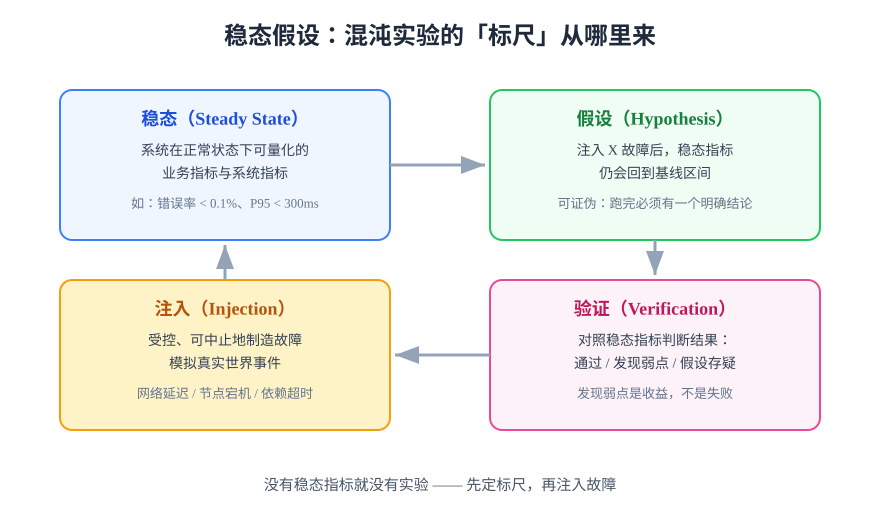

# 混沌工程概述与稳态假设

混沌工程不是「搞破坏」，而是一门**实验学科**：对系统注入受控的真实世界故障，观察它是否仍能维持预期的服务质量，从而在用户受影响之前发现韧性弱点。

## 先说清楚它不是什么

| 容易混淆的实践 | 它验证什么 | 与混沌工程的区别 |
| --- | --- | --- |
| 功能测试 | 代码在预期输入下是否正确 | 不注入故障，只走正常路径 |
| 故障注入测试（FIT） | 单个依赖挂掉时这段代码的行为 | 混沌工程是它的**超集**：加稳态指标、爆炸半径与实验流程 |
| 监控告警 | 出问题后**事后**被发现 | 混沌工程**主动制造**问题，顺带验证监控告警真的会响 |
| 容灾演练 | 恢复流程（备份、切换）能否走通 | 验证的是「恢复能力」；混沌验证的是「运行中扛住的能力」，两者互补 |

:::tip 一句话定位
混沌工程 = 故障注入（手段）+ 稳态假设（标尺）+ 实验流程（纪律）。
只有故障注入没有稳态假设，那叫「随机搞破坏」。
:::

## 稳态假设：整个学科的支点

**稳态（Steady State）** 指系统在正常运行时可以用数据描述的状态。**稳态指标必须是业务向的**——「CPU 使用率正常」不算稳态，「读写请求成功率高于 99.9%、P95 延迟低于 300ms」才算。

混沌实验的标准句式：

> 「当我在（环境）注入（故障）后，稳态指标将在（时间）内回到基线区间，且（告警）会如约触发。」

这句话必须**可证伪**：实验跑完只能得到「假设成立」或「假设被推翻」两种结论之一。推翻了假设不是坏事——那正是你花钱买到的韧性弱点清单。

## 混沌工程五条原则

来自 [Principles of Chaos](https://principlesofchaos.org/)，逐条解释：

| 原则 | 一句话解释 | 落地动作 |
| --- | --- | --- |
| 围绕稳态构建假设 | 先定标尺再注入 | 每个实验绑定 1~2 个可自动采集的业务指标 |
| 模拟真实世界事件 | 注入「会真的发生」的故障 | 从近 90 天事故清单挑故障类型，不从工具菜单挑 |
| 在生产环境运行实验 | 测试环境的韧性 ≠ 生产的韧性 | 前提是监控、回滚、爆炸半径控制全部就位；新手先从预发开始 |
| 持续自动化运行 | 韧性会随代码变更退化 | 通过的实验固化为定期回归（Schedule / CI 触发） |
| 控制爆炸半径 | 实验造成的损失必须可承受且可立刻终止 | 最小环境起步、红线自动中止、人工急停按钮 |

## 什么时候不该做混沌工程

混沌工程有**前置条件**，不满足时先补地基：

1. **监控告警不存在或不被信任**——注入后自己都看不见，等于盲跑；
2. **没有回滚与止血手段**——出问题只能眼睁睁看着；
3. **没有真实流量与稳态基线**——实验没有标尺，结论无意义；
4. **组织文化不允许暴露弱点**——发现弱点被当事故追责，实验必然流于形式。

:::danger 最常见的错误顺序
先上工具、后补监控。正确顺序是：**可观测 → 回滚能力 → 稳态指标 → 第一个实验**。工具（Chaos Mesh、ChaosBlade）只是最后一步的执行器，前面任何一环缺失，工具都只会放大风险。
:::

## 最小起步三步

1. **挑一个低风险服务**：选无状态、可快速重启的服务（如博客平台的渲染层）；
2. **在预发环境做第一个实验**：`docker compose pause mysql` 30 秒，观察错误率与告警；
3. **写一份实验记录**：稳态指标、假设、注入命令、观察结果、结论三分类（通过 / 发现弱点 / 假设存疑）。

## 验证方式

- 能对一个明确服务说出它的稳态指标与基线区间（有数据支撑）；
- 至少完成一次完整实验并归档记录，结论落在三种分类之一；
- 实验中告警链路被实测触发至少一次（或发现告警缺失并登记改进项）。

## 深入阅读

- [故障注入分类：注入什么故障](../FaultInjection/index.md)
- [实验设计方法：怎么设计一次实验](../ExperimentDesign/index.md)
- [监控体系与可观测性（前置条件）](../../Monitoring/Overview/index.md)
