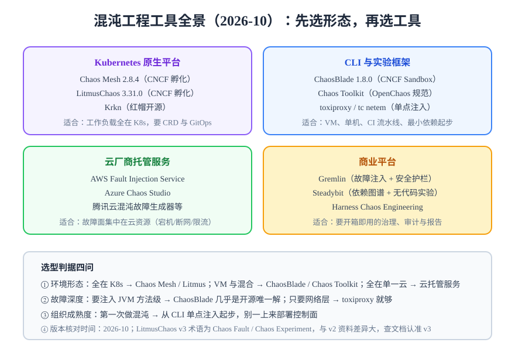

# 工具全景与选型

混沌工具没有「最好」，只有「形态最匹配」。先选**形态**（K8s 平台 / CLI 框架 / 云托管 / 商业平台），再在形态内选工具。

## 工具全景（2026-10 核对）



| 工具 | 形态 | 最新版本 | 核心特点 | 适用边界 |
| --- | --- | --- | --- | --- |
| [Chaos Mesh](../ChaosMesh/index.md) | K8s 原生平台 | 2.8.4（2026-08-18） | 故障类型最全（含 JVM / 内核 / 物理机），CRD 声明式 | 工作负载在 K8s；CNCF 孵化 |
| LitmusChaos | K8s 原生平台 | 3.31.0（2026-07） | ChaosCenter 门户 + ChaosHub 实验市场，Prometheus 指标 | 多团队需要门户编排；CNCF 孵化 |
| Krkn | K8s 插件 | 开源（红帽） | 面向集群级场景（节点宕机、云中断），自带 SLO 检查 | 集群韧性、与 OpenShift 亲和 |
| ChaosBlade | CLI 工具箱 | CLI 1.8.0（2025-10）+ Blade AI 0.7.0（2026-08） | **JVM 方法级注入**独有；OS / K8s / Docker / C++ 全覆盖 | VM 与混合环境；CNCF Sandbox，节奏放缓 |
| Chaos Toolkit | CLI 框架 | 持续发布（pip） | 声明式实验 JSON，稳态假设一等公民，驱动插件化 | CI 流水线、跨环境复用实验；OpenChaos 规范 |
| AWS Fault Injection Service | 云托管 | GA | 原生注入 AWS 资源（宕机、断网、限流），IAM 集成 | AWS 资源故障面；按动作分钟计费 |
| Azure Chaos Studio | 云托管 | GA | Azure 资源 + AKS 注入 | Azure 体系 |
| Gremlin | 商业 SaaS | — | 安全护栏最成熟（halts、范围控制） | 预算充足、要开箱治理 |
| Steadybit | 商业 | — | 依赖图谱自动发现 + 无代码实验 | 平台团队持续验证 |
| Harness CE | 商业 | — | 与 CI/CD 流水线深度集成 | Harness 用户 |
| toxiproxy / tc netem | 单点工具 | 开源 | 一个代理搞定延迟 / 断连，零平台依赖 | **第一次实验的最优选**；单链路注入 |

## 选型判据四问

1. **环境形态是什么？**
   全在 K8s → Chaos Mesh / Litmus；VM 与混合 → ChaosBlade / Chaos Toolkit；故障面集中在单一云 → 云托管服务；只有一条链路要验证 → toxiproxy。

2. **要注入多深？**
   只验证网络层 → toxiproxy / netem 足够；要进 JVM 方法级 → ChaosBlade（开源里几乎唯一解）；要集群级云资源故障 → 云托管或 Krkn。

3. **组织成熟到哪一步？**
   第一次做混沌 → **不要部署控制面**，从 CLI 单点注入起步，先建立实验纪律；已有固定演练节奏、多团队参与 → 再上 Chaos Mesh / Litmus 平台化。

4. **实验怎么管？**
   要 Git 审批与 GitOps → 选 CRD 系（Chaos Mesh / Litmus）；要在 CI 里跑 → Chaos Toolkit 的实验文件可进仓库、可版本化。

## Chaos Toolkit：实验即代码的最小框架

适合把实验写进仓库、在 CI 里执行：

```json
{
  "version": "1.0",
  "title": "MySQL 延迟注入",
  "description": "注入 2s 延迟，验证博客接口降级与告警",
  "steady-state-hypothesis": {
    "title": "列表接口可用",
    "probes": [
      {
        "type": "http",
        "url": "http://127.0.0.1/api/v1/posts",
        "timeout": 5,
        "expected_status": 200,
        "severity": "critical"
      }
    ]
  },
  "method": [
    {
      "type": "action",
      "name": "add-latency",
      "provider": {
        "type": "python",
        "module": "your.driver.module.action_name",
        "arguments": { "proxy": "mysql", "latency_ms": 2000 }
      },
      "pauses": { "after": 300 }
    }
  ],
  "rollbacks": [
    { "type": "action", "name": "disable-toxic", "provider": { "type": "python", "module": "your.driver.module.rollback_name" } }
  ]
}
```

:::info 关于示例
`module` 字段必须填**实际安装的 driver 包里的函数**（社区按工具维护了 toxiproxy、Kubernetes、AWS 等 driver），占位写法跑不通；上面的参数结构是 Chaos Toolkit 的通用格式，**建议先本地跑通再入库**。核心是三个概念：`steady-state-hypothesis`（跑前跑后都探测，失败即实验失败）、`method`（注入动作序列）、`rollbacks`（无论成败都执行恢复）。
:::

```shell
pip install chaostoolkit chaostoolkit-kit
chaos run experiment.json     # 偏离稳态时退出码非 0，CI 可直接拦截
```

:::info 版本节奏提示
ChaosBlade 与 Chaos Toolkit 的社区节奏都在放缓（ChaosBlade CLI 1.8.0 停留于 2025-10，2026 年的主要更新在 Blade AI 侧）。选型时把「维护活跃度」纳入权重，关键链路不要绑定单一停更工具。
:::

## 验证方式

- 能对当前环境说出：环境形态、候选工具、首选与备选、放弃理由各一条；
- 选型结论落地为第一个实验（工具装上了、实验跑通了、记录归档了）。

## 深入阅读

- [Chaos Mesh 深入（K8s 主力选项）](../ChaosMesh/index.md)
- [实验设计：无论选哪个工具都适用](../ExperimentDesign/index.md)
- [接口调试工具：toxiproxy 的上游基础](../../../Tools/APITools/index.md)
