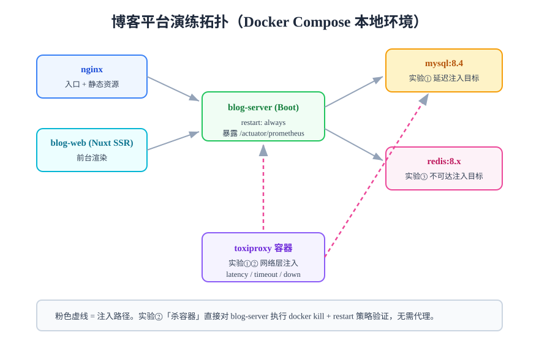

# 实战：博客平台故障注入演练

本页在[当月项目：全栈博客平台](../../../../project/Complete/BlogPlatform/index.md)的 **Docker Compose 本地环境**上完成三个真实的故障注入实验。项目第 112 天已完成一键部署（五服务：nginx / blog-web / blog-server / mysql / redis）、第 113 天已接入监控（六项指标 + 告警阈值）——这正是混沌实验需要的地基：**部署可复现 + 指标可见 + 告警在线**。



## 环境与稳态基线

```shell
# 环境就绪检查（与项目部署页判据一致）
cd deploy && docker compose up -d
docker compose ps --format 'table {{.Service}}\t{{.Status}}'   # 全部 Up / healthy
curl -s -o /dev/null -w '%{http_code}\n' http://127.0.0.1/api/v1/posts   # 期望 200

# 稳态基线：静置 10 分钟后记录
curl -s http://127.0.0.1/actuator/prometheus | grep http_server_requests_seconds_count
# 连续三次间隔 1 分钟采样，成功率恒为 100%，即视为稳态
```

:::info 本地环境的工具选择
K8s 平台类工具（Chaos Mesh / Litmus）需要集群，本项目是 Compose 环境，因此实战用两类轻量工具：**toxiproxy**（网络层注入）与 **docker 原生命令**（进程层注入）。方法与判据和 K8s 平台完全同构，迁移到 Chaos Mesh 只是把命令换成 CRD。
:::

网络注入统一经 toxiproxy：blog-server 访问 MySQL / Redis 的流量改为走代理端口，注入时对代理加 toxic，回滚时移除。

```shell
# 启动 toxiproxy 并注册两条链路（一次性准备）
docker run -d --name toxiproxy --network deploy_default -p 8474:8474 ghcr.io/shopify/toxiproxy:2.x
# mysql 代理：容器内 3306 → 暴露 13306
curl -s -X POST http://127.0.0.1:8474/proxies -d '{
  "name": "mysql", "listen": "0.0.0.0:13306", "upstream": "mysql:3306", "enabled": true
}'
# redis 代理：容器内 6379 → 暴露 16379
curl -s -X POST http://127.0.0.1:8474/proxies -d '{
  "name": "redis", "listen": "0.0.0.0:16379", "upstream": "redis:6379", "enabled": true
}'
# blog-server 的 spring.datasource.url / redis host 改指 13306 / 16379 后重启一次
```

## 实验①：MySQL 延迟注入（网络层）

| 要素 | 内容 |
| --- | --- |
| 稳态指标 | `GET /api/v1/posts` 成功率 100%；P95 基线 180~260ms |
| 假设 | 注入 2s 延迟 5 分钟：接口超时与降级生效，错误率不超 5%；注入停止后 2 分钟回基线；**慢查询告警触发** |
| 中止条件 | 成功率 < 95% 立即回滚（删 toxic） |

```shell
# 注入：mysql 链路加 2000ms 延迟
curl -s -X POST http://127.0.0.1:8474/proxies/mysql/toxics \
  -d '{"name":"latency","type":"latency","stream":"downstream","attributes":{"latency":2000,"jitter":100}}'

# 观察 5 分钟（面板成功率 / P95 / DB 连接池 pending 三格），然后回滚
curl -s -X DELETE http://127.0.0.1:8474/proxies/mysql/toxics/latency
```

判定要点：延迟期间连接池 pending 上升 → 超时与重试参数生效 → 告警按阈值触发；**回滚后 2 分钟内 P95 回基线**，若连接池长时间不恢复即发现弱点（连接池回收配置问题）。

## 实验②：实例被杀（进程层）

| 要素 | 内容 |
| --- | --- |
| 稳态指标 | 同上 |
| 假设 | `docker kill blog-server` 后，`restart: always` 自动拉起，**60 秒内**接口恢复 200，重启期间 nginx 返回 502 而非挂死 |

```shell
docker kill blog-server
# 循环观察（另开终端）
watch -n 5 "curl -s -o /dev/null -w '%{http_code}' http://127.0.0.1/api/v1/posts"
# 期望序列：502 ... 502 → 200（60s 内）
```

判定要点：恢复时间是否兑现「60 秒」承诺；JVM 冷启动后的**预热期**（缓存空、连接池未热）P95 是否明显抖动——若抖动剧烈且无任何告警，登记弱点「补预热期告警或启动预热机制」。

## 实验③：Redis 不可达（网络层）

| 要素 | 内容 |
| --- | --- |
| 稳态指标 | 同上 |
| 假设 | 断开 Redis 链路后缓存降级为直查 DB，**成功率保持 100%**（P95 允许升高）；恢复后命中率 5 分钟内回到基线 |

```shell
# 注入：redis 链路整体断开
curl -s -X POST http://127.0.0.1:8474/proxies/redis/toxics \
  -d '{"name":"down","type":"timeout","stream":"downstream","attributes":{"timeout":0}}'
# 观察 3 分钟后回滚
curl -s -X DELETE http://127.0.0.1:8474/proxies/redis/toxics/down
```

判定要点：命中率面板（项目监控页第 4 格）掉到 0、直查 DB 时连接池是否被打满（第 5 格）、缓存恢复后**回源风暴**是否造成二次抖动。三个观察点分别对应「缓存防护」经典三问。

## 断言清单

| 编号 | 断言 | 验证方法 |
| --- | --- | --- |
| C1 | 实验①期间成功率 ≥ 95% | 面板 / `curl` 循环 |
| C2 | 实验①回滚后 120s 内 P95 回基线 | 面板时间差 |
| C3 | 实验①触发至少一条告警通知 | Alertmanager 记录 |
| C4 | 实验②恢复 ≤ 60s 且期间 nginx 返回 502 | watch 序列 |
| C5 | 实验②恢复后接口持续 200 ≥ 5 分钟 | curl 循环 |
| C6 | 实验③期间成功率 100%、P95 升高但可控 | 面板 |
| C7 | 实验③回滚后 300s 内命中率回基线 | 面板 |
| C8 | 三个实验全部有归档记录与结论 | 实验记录文件 |

:::tip 实验记录归档位置
按项目纪律，实验记录写进项目文档（当日进展页引用），不提交可执行脚本。每个实验归档：假设、命令、观察时间线、结论三分类、改进项。
:::

## 与项目其他章节的关系

- [监控接入](../../../../project/Complete/BlogPlatform/Monitoring/index.md)：本页全部面板与阈值来自该页，演练实测验证其有效性；
- [一键部署](../../../../project/Complete/BlogPlatform/Deployment/index.md)：环境就绪判据直接复用；
- [备份恢复演练](../../../../project/Complete/BlogPlatform/BackupDrill/index.md)：数据侧故障（误删、损坏）的恢复验证由备份演练覆盖，本页只管运行时故障——两页分工见项目总览。

## 验证方式

三个实验各产出一份归档记录；C1~C8 断言在记录中逐条给出「通过 / 未通过 + 实测数据」；发现弱点全部登记进改进队列并指派负责人。

## 深入阅读

- [故障注入分类：实验①③属于网络层、实验②属于进程层](../FaultInjection/index.md)
- [演练中的可观测：面板与告警的检查清单](../Observability/index.md)
- [Chaos Mesh：同样的实验在 K8s 上怎么写](../ChaosMesh/index.md)
