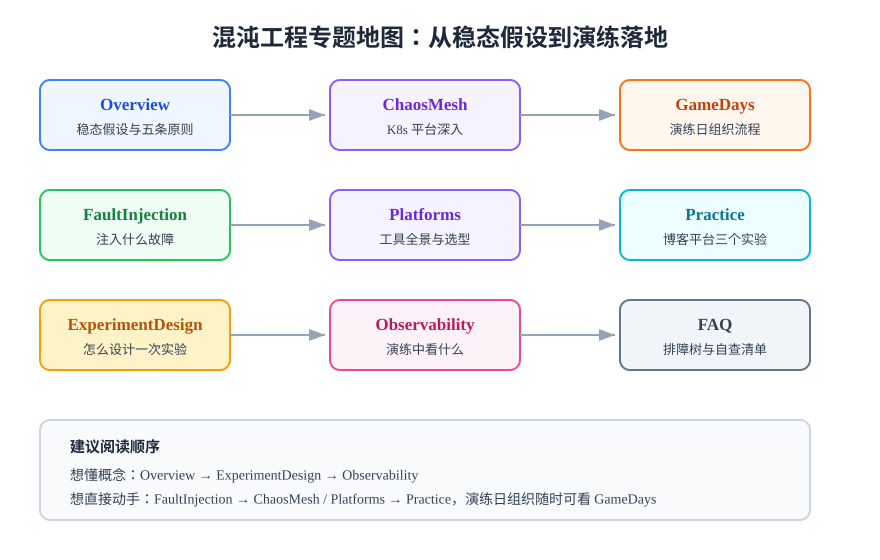

# 混沌工程

混沌工程（Chaos Engineering）是在系统上**主动、受控地注入故障**，用实验的方式验证系统韧性（Resilience）的工程学科。它回答的问题是：**熔断配了、重试写了、告警建了——但它们在真实故障面前真的有效吗？**

::: tip 一句话理解
监控告诉你「出了问题」，测试告诉你「代码对不对」，混沌工程告诉你「**出问题时系统撑不撑得住**」。
:::

## 专题地图

| 页面 | 内容 | 适合谁读 |
| --- | --- | --- |
| [概述与稳态假设](Overview/index.md) | 混沌工程是什么、五条原则、什么时候不该做 | 所有人，先读这页 |
| [故障注入分类](FaultInjection/index.md) | 资源、网络、进程、应用四个层次的故障与真实事件对应 | 设计实验的人 |
| [实验设计方法](ExperimentDesign/index.md) | 稳态指标、假设、爆炸半径、中止条件与实验模板 | 第一次做实验的人 |
| [Chaos Mesh 深入](ChaosMesh/index.md) | K8s 环境下的平台架构、实验类型、安全基线 | K8s 用户 |
| [工具全景与选型](Platforms/index.md) | Chaos Mesh / Litmus / ChaosBlade / Chaos Toolkit / 云托管 / 商业平台 | 做选型的人 |
| [演练中的可观测](Observability/index.md) | 注入必须被看见、恢复必须被计时、告警必须被验证 | SRE 与值班同学 |
| [演练日组织](GameDays/index.md) | GameDay 流程、角色分工、时间轴与纪律 | 组织演练的人 |
| [实战：博客平台演练](Practice/index.md) | 在 Docker Compose 环境做三个故障注入实验 | 想直接动手的人 |
| [常见问题](FAQ/index.md) | 分诊决策树、高频问答、上线自查清单 | 所有人 |

## 与相邻专题的分工

| 相邻专题 | 它讲什么 | 本专题讲什么 |
| --- | --- | --- |
| [监控告警](../Monitoring/index.md) | 平时看什么指标、怎么配告警 | 用故障注入**验证**监控和告警真的有效 |
| [备份与容灾](../BackupDR/index.md) | 数据丢了怎么恢复、容灾怎么切换 | **运行时**故障下系统行为是否达标（容灾演练验证恢复能力，混沌验证韧性） |
| [服务网格](../ContainerOrchestration/ServiceMesh/index.md) | 熔断、重试、超时怎么配置 | 配置之后**注入故障验证它们生效** |
| [Kubernetes](../Kubernetes/index.md) | 平台本身怎么用 | 平台之上怎么做故障注入实验 |
| [微服务治理](../../Backend/Microservices/index.md) | 服务间治理语义的代码与配置 | 配置生效性的实验验证 |
| [项目实战：博客平台](../../../project/Complete/BlogPlatform/index.md) | 真实项目的混沌演练落地记录 | 与实战页一一呼应 |

## 版本状态速览（2026-10 核对）

| 工具 | 最新版本 | 状态 |
| --- | --- | --- |
| Chaos Mesh | 2.8.4（2026-08-18） | 主线，CNCF 孵化，支持 K8s 1.30~1.35 |
| LitmusChaos | 3.31.0（2026-07） | 主线，CNCF 孵化 |
| ChaosBlade | CLI 1.8.0（2025-10）+ Blade AI 0.7.0（2026-08） | CNCF Sandbox，节奏放缓 |
| Chaos Toolkit | 持续发布（pip 安装） | OpenChaos 规范参考实现 |
| AWS Fault Injection Service | 托管服务 | GA，按动作分钟计费 |
| Azure Chaos Studio | 托管服务 | GA |

:::warning 时效提醒
混沌工具迭代较快，LitmusChaos v3 相对 v2 术语变化很大（Chaos Experiment → Chaos Fault 等）。查文档时先确认版本，本文所有版本信息核对时间为 **2026 年 10 月**。
:::

## 建议学习路径

1. **建立概念**：读[概述](Overview/index.md)与[实验设计](ExperimentDesign/index.md)，理解稳态假设这个核心。
2. **动手最小实验**：跟随[实战页](Practice/index.md)在本地 Compose 环境完成三个实验，全程不到一小时。
3. **选型与平台化**：读[工具全景](Platforms/index.md)决定用哪个工具，K8s 用户深入 [Chaos Mesh](ChaosMesh/index.md)。
4. **组织常态化**：用[演练日组织](GameDays/index.md)把单次实验升级为周期性 GameDay，用[可观测](Observability/index.md)闭环验证。

## 参考资料

- [Principles of Chaos（混沌工程原则）](https://principlesofchaos.org/)
- [Chaos Mesh 官方文档](https://chaos-mesh.org/docs/)
- [LitmusChaos 官方文档](https://docs.litmuschaos.io/)
- [Chaos Toolkit 官方文档](https://chaostoolkit.org/)
- [AWS Fault Injection Service 文档](https://docs.aws.amazon.com/fis/)
