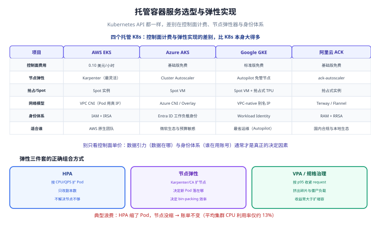

# 托管容器服务

**托管容器服务（CaaS，以托管 Kubernetes 为代表）把「控制面」从你手里拿走，只留下「节点」和「工作负载」两件事给你。** 它适合已经容器化、需要复杂调度或长驻服务的团队；而它最花钱的地方不是控制面，是**节点的资源预留**——把 request 设得虚高，是云账单里最容易被忽视的浪费源。



## 1. 托管 K8s 到底托了什么

以托管 Kubernetes 为例，「托管」不是「全托管」，责任边界一定要先划清：

| 组件 | 谁负责 | 说明 |
| --- | --- | --- |
| API Server / etcd / 调度器 / 控制器 | **云厂商** | 控制面高可用、版本升级、故障自愈由云负责 |
| 节点（Worker Node） | **你**（可托管化） | 节点池用谁、机型、容量、是否 Spot，都是你的决定 |
| 工作负载（Pod / Deployment / Service） | **你** | YAML 怎么写、副本数、探针、资源请求，全靠你 |
| 网络插件与 CNI | 厂商提供方案、**你选型** | 决定 Pod 有没有真实 VPC IP |
| 身份与权限（RBAC + 工作负载身份） | **你** | 集群内 RBAC 与云资源访问的桥接要自己配 |
| 可观测与日志 | **你** | 控制面之外的指标、日志采集要自己装 |

:::warning 一个常见误解
「托管 K8s 就是不用管节点了」是错的。**只要你还看得见节点（Node 对象），就还要管节点**：容量不够要加、机型不划算要换、内核版本要滚。真正「看不见节点」的形态是 GKE Autopilot 这类——按 Pod 请求的资源计费，节点完全由平台管理。
:::

## 2. 三大托管 K8s：控制面计费与弹性实现

以下事实**截至 2026-09 核对**，价格为公开发布的列表价，实际以官网为准：

| 维度 | AWS EKS | Azure AKS | Google GKE |
| --- | --- | --- | --- |
| 控制面价格 | **0.10 美元/小时（约 73 美元/月）** | 基础版（Free）**控制面免费** | 标准版**控制面免费** |
| 弹性实现 | **Karpenter**（源于 AWS、现属 CNCF），最灵活 | **Cluster Autoscaler**；<br/>Karpenter 支持**截至 2026 年中仍在预览** | 节点自动扩缩容 + **Autopilot**（完全免管节点、按 Pod **请求**的资源计费） |
| 网络模型 | **VPC CNI**：Pod 直接拿**真实 VPC IP** | **Azure CNI / Overlay** 可选 | **VPC-native 别名 IP** |
| 工作负载身份 | IAM + **IRSA**（IAM Roles for Service Accounts） | **Entra ID 工作负载身份** | **Workload Identity** |
| 计费折扣 | 一年期 **Compute Savings Plans 通常省 30%~40%** | **Reservations 最高约 72%** | **承诺使用折扣：1 年约 37%、3 年约 57%** |
| 国内对应 | — | — | — |

**阿里云 ACK** 是国内的对应产品，能力形态与 EKS / AKS / GKE 类似；**其控制面与节点的具体计费口径以阿里云官网为准，本页不列举具体价格**。

:::tip 怎么选
- 想在 AWS 生态里要最灵活的节点弹性 → **EKS + Karpenter**。
- 已经有企业身份体系（Entra ID）→ **AKS** 的工作负载身份最省心，且基础版控制面免费。
- 不想碰节点、只想写 Pod → **GKE Autopilot**（代价是失去对节点的控制）。
- 国内业务、需要合规与低延迟 → **阿里云 ACK**。
:::

## 3. Karpenter 与 Cluster Autoscaler 的差别

这是 EKS 用户最该搞清的一对概念，两者解决的问题相同、机制完全不同：

| 维度 | Cluster Autoscaler（CA） | Karpenter |
| --- | --- | --- |
| 工作方式 | 扩缩**预定义的节点组（ASG / 节点池）** | 直接调用云 API **按需创建符合要求的实例** |
| 机型选择 | 限于节点组里配置的机型 | 可跨机型、跨代次、跨可用区自由匹配 |
| 扩容速度 | 较慢（要改 ASG 期望容量再等实例起来） | 更快（直接创建实例、按需挑选） |
| 成本优化 | 依赖你预先规划好多种节点组 | 自动倾向更便宜的可满足容量 |
| 碎片与装箱 | 需要人工设计节点组来减少碎片 | 支持按 Pod 需求做装箱（consolidation） |
| 成熟度 | 成熟稳定，各云通用 | EKS 上成熟；**AKS 上截至 2026 年中仍在预览** |

```yaml [karpenter-nodepool.yaml]
apiVersion: karpenter.sh/v1
kind: NodePool
metadata:
  name: general
spec:
  template:
    spec:
      requirements:
        - key: karpenter.sh/capacity-type
          operator: In
          values: ["spot", "on-demand"]   # 优先 Spot，兜底按需
        - key: kubernetes.io/arch
          operator: In
          values: ["arm64", "amd64"]
        - key: karpenter.k8s.aws/instance-category
          operator: In
          values: ["c", "m", "r"]         # 允许三类机型，便于装箱
      nodeClassRef:
        group: karpenter.k8s.aws
        kind: EC2NodeClass
        name: default
  disruption:
    consolidationPolicy: WhenEmptyOrUnderutilized
    consolidateAfter: 1m                # 空闲/低利用时主动整合，回收成本
```

:::info 判断标准
如果你**能说清「为什么需要这个节点组、为什么是这个机型」**，CA 就够用；如果你只想说「我要一个能满足这批 Pod 的便宜节点」，那就是 Karpenter 的场景。
:::

## 4. Spot / 抢占实例的使用纪律

Spot（AWS）与抢占式实例（阿里云）**可省 60%~90%**，是托管容器上最大的单项降本手段，但它有纪律：

| 纪律 | 做法 | 原因 |
| --- | --- | --- |
| 只跑可中断负载 | 无状态服务、批处理、CI Runner | 实例随时会被回收（通常提前 2 分钟通知） |
| 配优雅终止 | 设 `terminationGracePeriodSeconds`，收到 `SIGTERM` 后停止接新请求、处理完存量再退出 | 默认 30 秒可能不够，长请求会被打断 |
| 配 PDB | 用 PodDisruptionBudget 保证回收期间仍有副本可用 | 防止一次性被回收太多导致服务不可用 |
| 多机型多可用区 | NodePool 里放宽机型与 AZ | 单一机型/可用区容量耗尽时无法补充 |
| 关键组件用按需兜底 | 数据库、核心网关、控制组件走按需或预留 | 这些实例被回收不可接受 |

```yaml [order-api.yaml]
apiVersion: apps/v1
kind: Deployment
metadata:
  name: order-api
spec:
  replicas: 6
  selector:
    matchLabels: { app: order-api }
  template:
    metadata:
      labels: { app: order-api }
    spec:
      terminationGracePeriodSeconds: 60      # 给存量请求留足处理时间
      containers:
        - name: api
          image: registry.example.com/order-api:1.8.3
          lifecycle:
            preStop:
              exec:
                command: ["sh", "-c", "sleep 15"]   # 让 LB 先摘流量，再开始退出
---
apiVersion: policy/v1
kind: PodDisruptionBudget
metadata:
  name: order-api-pdb
spec:
  minAvailable: 4          # 6 副本中至少保留 4 个，滚动与回收都受约束
  selector:
    matchLabels: { app: order-api }
```

:::danger Spot 上的三个经典事故
1. **不给 `preStop` 缓冲**：Pod 收到信号立刻退出，此时负载均衡器还没摘掉它，会有一批请求打到已关闭的进程上。正确写法是让容器先「假装还在、但不接新请求」，等 LB 摘完流量再真正退出。
2. **PDB 设得太宽松或没设**：`minAvailable` 设成 1，等于允许一次只留 1 个副本，波动就会被用户感知。正确做法是按「能接受的最少可用容量」来设，并与副本数联动。
3. **把有状态服务放 Spot**：本地盘、主从角色会被回收打断。正确做法是有状态组件用按需实例或托管数据库。
:::

## 5. HPA / VPA / 节点弹性三件套

三层弹性各管一段，配错会出现「Pod 扩了但没地方跑」或「节点扩了但 Pod 没扩」：

| 层级 | 组件 | 管什么 | 关键前提 |
| --- | --- | --- | --- |
| Pod 副本数 | **HPA**（Horizontal Pod Autoscaler） | 按指标（CPU/QPS/自定义）增减**副本数** | Pod 必须设 **request**，否则 CPU 利用率无法计算 |
| Pod 资源规格 | **VPA**（Vertical Pod Autoscaler） | 调整**单个 Pod 的 request/limit** | 与 HPA 基于同一指标同时用会互相打架 |
| 节点容量 | **Karpenter / Cluster Autoscaler** | 增减**节点**来容纳 Pending 的 Pod | 节点池要允许足够多的机型 |

```yaml [hpa.yaml]
apiVersion: autoscaling/v2
kind: HorizontalPodAutoscaler
metadata:
  name: order-api
spec:
  scaleTargetRef:
    apiVersion: apps/v1
    kind: Deployment
    name: order-api
  minReplicas: 4
  maxReplicas: 30
  metrics:
    - type: Resource
      resource:
        name: cpu
        target:
          type: Utilization
          averageUtilization: 65      # 目标利用率，留出突发余量
  behavior:
    scaleDown:
      stabilizationWindowSeconds: 300  # 缩容冷静期，避免抖动
```

:::tip 正确的组合方式
**HPA 管副本数 + 节点弹性管容量 + VPA 只用在「推荐模式」给出 request 建议**。若必须让 VPA 自动改 request，就不要再让 HPA 盯着同一个 CPU 指标，否则会来回震荡。实践中更稳的做法是：VPA 出建议、人（或定时任务）改配置，HPA 负责运行时伸缩。
:::

## 6. 镜像与仓库

镜像不托管在节点上，而是集中在**容器镜像仓库**里按需拉取。三条工程要求：

- **就近拉取**：把仓库放在与集群同地域，拉取速度与流量成本都会更好。
- **层复用**：镜像层越少、越稳定，节点上命中的缓存越多，扩容时 Pod 起来越快。构建优化看 [Docker](../../Docker/index.md)。
- **确定性标签**：生产用**不可变标签**（如 `:1.8.3` 或 digest），不要用 `:latest`——否则「谁在什么时候改了镜像」无法追踪，回滚也无从谈起。

```yaml [image-pull-policy.yaml]
containers:
  - name: api
    # 用固定标签，配合 imagePullPolicy: IfNotPresent 命中节点缓存
    image: registry.example.com/order-api:1.8.3
    imagePullPolicy: IfNotPresent
```

:::warning `:latest` + `Always` 是「看起来很安全」的反模式
`:latest` 配 `Always` 会让每次起 Pod 都拉一次镜像，扩容变慢、流量费变高，而且**同一份配置在不同时间可能跑到不同代码**。正确做法是版本化标签 + `IfNotPresent`，需要强制更新时用滚动重启。
:::

## 7. request / limit 怎么设

这是托管容器上**最直接影响账单**的一项配置，也是浪费最集中之处（**Flexera 2025 调研称组织平均浪费约 27% 云支出；CAST AI 2025 基准称集群平均 CPU 利用率仅约 13%**，与 request 虚高直接相关）。

设置方法：**按 p95 实测用量 + 20% 余量设 request**。

| 项 | 建议 | 说明 |
| --- | --- | --- |
| CPU request | **p95 实际用量 × 1.2** | request 决定调度与计费，虚高＝真金白银浪费 |
| CPU limit | **不设，或设为 request 的 3~5 倍** | 设得过紧会触发 CPU 节流（throttling），延迟反而变差 |
| 内存 request | **p95 实际用量 × 1.2** | 内存是「不可压缩」资源，虚高会挤占可调度容量 |
| 内存 limit | **request 的 1.2~1.5 倍** | 超限会被 OOM Kill；留太少会频繁重启 |

```yaml [resources.yaml]
resources:
  requests:
    cpu: "500m"      # 由 p95 用量换算而来，不是「拍脑袋取整」
    memory: "512Mi"
  limits:
    memory: "640Mi"  # 约 request 的 1.25 倍
    # CPU 不设 limit，避免节流；由 HPA 与节点弹性兜住总量
```

:::danger 两类反模式
1. **所有服务统一写 `cpu: "2"`**：等于把「每副本至少占用 2 核」写成默认值，集群利用率会被压到 10%~20%。正确做法是按服务实测 p95 分别设置，并用 VPA 的推荐值校准。
2. **request 远小于实际用量**：Pod 被调度到「看起来够用」的节点上，实际跑起来抢资源、互相影响。正确做法是 request 以 p95 为基准、limit 留出突发余量。
:::

:::tip 怎么拿到 p95
把容器的 CPU/内存使用率指标接进监控（见 [监控与可观测](../../Monitoring/index.md)），取**过去 14 天同时段**的 p95 值，再乘 1.2。业务有明显峰谷时，要分别看峰值时段与低谷时段，而不是只看全月平均。
:::

## 8. 一条可运行的 kubectl 命令组与预期输出

假设你已用 `kubectl` 连上集群（`kubectl get nodes` 能列出节点）：

```shell
# 1. 看节点容量与已分配资源：找出「request 虚高但实际用量低」的节点
kubectl describe nodes | grep -A 6 "Allocated resources" | head -n 20
# 预期输出（形如）：
# Allocated resources:
#   Resource           Requests      Limits
#   cpu                1850m (46%)   3200m (80%)
#   memory             3Gi (38%)     4Gi (51%)

# 2. 看 Pod 实际用量：与 request 对比，差额就是可回收的部分
kubectl top pods -A --sort-by=cpu | head -n 10
# 预期输出（形如）：
# NAMESPACE   NAME                         CPU(cores)   MEMORY(bytes)
# prod        order-api-7c9f8d5b4-2xkzp   38m          176Mi

# 3. 看有没有因为资源不足而 Pending 的 Pod（节点弹性是否及时）
kubectl get pods -A --field-selector=status.phase=Pending
# 预期：无输出 = 没有因容量不足卡住的 Pod；有输出则检查 Karpenter/CA 是否正常扩容

# 4. 看 HPA 的当前副本数与目标利用率
kubectl get hpa
# 预期输出（形如）：
# NAME        REFERENCE              TARGETS         MINPODS  MAXPODS  REPLICAS
# order-api   Deployment/order-api   42%/65%         4        30       6

# 5. 看节点的可中断性（哪些是 Spot）
kubectl get nodes -L karpenter.sh/capacity-type
# 预期输出（形如）：
# NAME           STATUS   ROLES    AGE   CAPACITY-TYPE
# ip-10-0-1-23   Ready    <none>   2d    spot
```

**判读方法**：

- 命令 1 的 `Requests` 占比高、命令 2 的实际用量低 → **request 虚高**，按第 7 节调低。
- 命令 4 的 `TARGETS` 长期远低于设定值（如 `12%/65%`）→ **副本数过多**，可下调 `minReplicas`。
- 命令 5 里出现 `on-demand` 的工作负载 → 确认它是否真的不可中断。

## 9. 验证方式

| 检查项 | 期望 | 实测 | 结论 |
| --- | --- | --- | --- |
| `kubectl top pods` 实际用量 | 与 request 同数量级（差距 < 2 倍） | 待填写 | ⏳ |
| `kubectl get hpa` TARGETS | 在 40%~80% 区间波动，长期不贴下限 | 待填写 | ⏳ |
| `kubectl get pods --field-selector=status.phase=Pending` | 无输出 | 待填写 | ⏳ |
| 节点容量类型 | 可中断负载跑在 `spot` 上 | 待填写 | ⏳ |
| PDB 生效 | 驱逐时可用副本数不跌破 `minAvailable` | 待填写 | ⏳ |

## 参考资料

- Kubernetes 官方文档（HPA / PDB / 资源管理）：https://kubernetes.io/docs/concepts/workloads/autoscaling/
- Kubernetes 资源请求与限制：https://kubernetes.io/docs/concepts/configuration/manage-resources-containers/
- Amazon EKS 用户指南：https://docs.aws.amazon.com/eks/latest/userguide/what-is-eks.html
- Karpenter 官方文档：https://karpenter.sh/docs/
- Azure Kubernetes Service 文档：https://learn.microsoft.com/azure/aks/
- Google Kubernetes Engine 文档（含 Autopilot）：https://cloud.google.com/kubernetes-engine/docs
- 阿里云容器服务 ACK：https://help.aliyun.com/zh/ack/
- 本专题其余章节：[概述与选型](../Overview/index.md) ｜ [云成本治理（FinOps）](../FinOps/index.md) ｜ [实战：迁移与验收](../Practice/index.md)
- 相邻专题：[Kubernetes](../../Kubernetes/index.md) ｜ [Docker](../../Docker/index.md) ｜ [监控与可观测](../../Monitoring/index.md)
