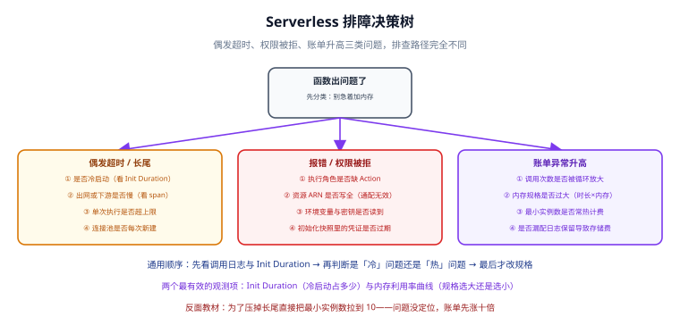

# 常见问题与排错

本页收集 Serverless 与托管容器落地时**最常被问到、也最容易踩坑**的问题。每个问题按「结论 → 原因 → 做法」三段回答，能直接照着做。



| # | 问题 | 一句话结论 |
| --- | --- | --- |
| 1 | 冷启动为什么忽长忽短 | 五段耗时里只有两段归你管，先看是哪段在抖 |
| 2 | 执行环境复用是否可靠 | 不可靠，只能当「可能复用」来设计 |
| 3 | 函数里能不能用连接池 | 客户端可以外提，裸连接池不行 |
| 4 | 超时上限怎么调 | 调到「下游 p99 + 余量」，不是调到平台上限 |
| 5 | VPC 内访问为什么变慢 | ENI 创建与网络路径变化，冷启动叠加更明显 |
| 6 | 并发上限与限流怎么设 | 先给下游算容量，再倒推函数并发 |
| 7 | 账单为什么比预估高 | 时长、下游、日志、流量四类隐性成本 |
| 8 | 如何处理大文件 | 别让函数做大文件，改用流式 + 分段 |
| 9 | 如何做灰度与回滚 | 用版本 + 别名加权，提前保留旧版本 |
| 10 | 何时该从函数换回容器 | 出现长连接、长任务、持续满载三类信号时 |

## 1. 冷启动为什么忽长忽短？

**结论**：冷启动是「五段耗时之和」，其中平台调度段与代码下载段的波动最大，所以同一个函数可能一次 200 ms、一次 2 秒。

**原因**：按[云函数工程化](../FunctionEngineering/index.md)的拆解，①平台调度与沙箱创建、②代码/镜像下载受宿主机容量与镜像层缓存影响，波动最明显；③运行时启动与④初始化代码执行取决于你的语言与代码。命中热实例时五段全免，所以「有时快得离谱」也是正常的。

**做法**：

1. 先量化：在日志里筛 `Init Duration`（或平台的等价字段），确认冷启动确实发生了，并看它落在哪一段。
2. 减小段②：精简依赖、减小包体、镜像分层。
3. 缩短段③④：换轻量运行时、把重型初始化外提为惰性单例。
4. 想彻底消除：给用户可感知的路径配**预置并发 / 最小实例数 ≥ 1**，或用 **SnapStart**（AWS Lambda，**最初只支持 Java（2022 年推出），后续扩展到 Python 与 .NET**；Java 场景收益最大）。
5. 换隔离模型：**Cloudflare Workers** 的冷启动约 **1 ms 量级**，对延迟极敏感的边缘场景是另一条路。

:::tip 判断标准
**冷启动是否「必须优化」，取决于它出现在谁的请求上。** 后台异步任务冷启动 3 秒没人管；面向用户的接口冷启动 800 ms 就该处理了。
:::

## 2. 执行环境复用是否可靠？

**结论**：不可靠。执行环境**可能**被复用，但你不能依赖它——任何时刻都可能被回收或新起实例。

**原因**：平台为了节省资源会在空闲后回收实例，也会因为流量增长新起实例。所以「上一次请求写的全局变量」下一次请求未必还在，即使还在，也只在**那一个实例**里。

**做法**：

| 你想做的事 | 能不能依赖复用 | 正确做法 |
| --- | --- | --- |
| 复用客户端对象（SDK） | **可以**，但要能自动重连 | 模块顶层创建客户端 |
| 缓存有时效的配置 | 不行 | 带 TTL 的惰性缓存 + 本地默认值兜底 |
| 用本地内存存限流计数 | 不行 | 用 Redis / 平台的限流能力 |
| 用本地磁盘存中间结果 | 不行 | 用对象存储 |
| 用全局变量传请求上下文 | **绝对不行** | 上下文在 handler 内传递 |

```js [src/handler.mjs]
// ❌ 错误：并发请求会互相覆盖这个变量
let currentUser = null;

export const handler = async (event) => {
  currentUser = event.userId;          // 并发下会串数据
  return await doWork(currentUser);
};

// ✅ 正确：上下文在 handler 内创建、在 handler 内结束
export const handler = async (event) => {
  const currentUser = event.userId;
  return await doWork(currentUser);
};
```

:::danger 最危险的一类 bug
「本地内存缓存 + 多实例」会表现为**偶发的数据不一致**：用户刷新几次，有时看到新数据、有时看到旧数据。排查时容易怀疑数据库，实际是缓存只在部分实例生效。正确做法是**要么用共享缓存，要么不做缓存**。
:::

## 3. 函数里能不能用连接池？

**结论**：**客户端对象可以外提复用，但传统意义的「连接池」不能直接搬进函数**——高并发下会打爆下游数据库。

**原因**：函数按并发起实例，每个实例一个连接池，100 并发就是 100 个池；实例回收后连接不会优雅归还，数据库侧会积累大量僵尸连接。

**做法**：

1. **外提客户端、内建事务**：把 SDK 客户端放模块顶层复用；事务对象在 handler 内创建并结束。
2. **用连接池代理收口**：数据库前面加一层连接池代理（如 RDS Proxy），由它统一管理到数据库的真实连接。
3. **限制并发**：给函数设预留并发上限，等于给下游的连接数设了上限。
4. **量级要小**：把每个实例的连接池上限设成 1~2，而不是 10。

```js [src/db.mjs]
import { Pool } from "pg";

// ✅ 外提，但把池上限压到很小；配合连接池代理使用
const pool = new Pool({
  connectionString: process.env.DB_URL,
  max: 1,                    // 每个实例最多 1 条连接
  idleTimeoutMillis: 10_000, // 空闲连接主动释放，减少僵尸连接
});

export async function withTransaction(fn) {
  const client = await pool.connect();
  try {
    await client.query("BEGIN");
    const result = await fn(client);
    await client.query("COMMIT");
    return result;
  } catch (err) {
    await client.query("ROLLBACK");
    throw err;
  } finally {
    client.release();
  }
}
```

## 4. 超时上限怎么调？

**结论**：按「下游调用的 p99 + 处理时间 + 余量」设，**不要贴着平台上限设**。

**原因**：超时设得过大有三个副作用：故障时请求会挂很久（用户干等）、下游拥塞时函数不释放并发额度、重试风暴更难收敛。设得过小则会在下游慢时误报失败。

**做法**：

| 平台 | 单次执行上限 | 建议设置 |
| --- | --- | --- |
| AWS Lambda | **15 分钟** | 面向用户的接口 5~20 秒 |
| Cloudflare Workers | 免费版 CPU **10 ms/请求**；<br/>付费版 CPU 默认 **30 秒**、最高 **5 分钟**；<br/>Cron Triggers 与 Queue Consumers 最长 **15 分钟** | 边缘接口通常 1~30 秒 |
| 阿里云函数计算 FC | 长任务最长 **24 小时** | 按业务需要，但仍要设合理值 |

```yaml [template.yaml（节选）]
Globals:
  Function:
    Timeout: 20      # 秒；下游 p99 约 3s，留足重试与冷启动余量
```

:::warning 超时是「最后防线」而不是「等待窗口」
正确做法是**在函数内对下游调用也设超时**（通常比函数超时短 30% 以上），这样能拿到明确的错误信息并优雅降级，而不是让整个函数被平台强杀。
:::

## 5. VPC 内访问为什么变慢？

**结论**：把函数接入 VPC 后冷启动会变慢，因为要为实例创建网络接口（ENI）并建立 VPC 内网络路径。

**原因**：函数原本跑在平台的共享网络中，出网直接走平台通道；接入 VPC 后要绑定到子网与安全组，冷启动多出网络初始化步骤；若再走 NAT 网关出公网，还会叠加 NAT 的带宽与连接跟踪开销。

**做法**：

1. **只在必要时接 VPC**：需要访问 VPC 内的数据库、缓存时才接。
2. **规划好子网容量**：子网 IP 不足会导致 ENI 创建失败，表现为「函数调用偶发失败」。要预留足够的 IP。
3. **区分「访问 VPC 内」与「访问公网」**：接了 VPC 又要访问公网，要配 NAT 网关，这会同时增加延迟与流量成本。
4. **用 VPC 端点（Endpoint）替代公网绕行**：访问同地域的托管服务（对象存储、密钥服务）时，优先走 VPC 端点。
5. **给冷启动留余量**：接入 VPC 的函数，冷启动预期要放宽，必要时配预置容量。

## 6. 并发上限与限流怎么设？

**结论**：**先算下游能扛多少，再倒推函数的并发上限**；并发上限是保护下游的刹车，不是性能旋钮。

**原因**：函数天然会随流量无限扩实例，如果没有上限，一次突发会把下游数据库打满，形成「函数自动扩容 → 下游雪崩 → 全线失败」的连锁反应。

**做法**：

| 层次 | 手段 | 作用 |
| --- | --- | --- |
| 入口 | API 网关 / WAF 的限流 | 挡住明显的异常流量 |
| 函数 | 预留并发上限（Reserved Concurrency） | 该函数最多同时跑多少个 |
| 函数 | 预置并发 / 最小实例数 | 保证延迟的下限容量 |
| 下游 | 数据库连接上限、队列长度 | 真正的容量边界 |
| 异步 | 队列 + 死信队列（DLQ） | 把突发转为排队，失败可重投 |

```shell
# 给函数设预留并发上限（AWS Lambda）
aws lambda put-function-concurrency \
  --function-name cloudnative-thumbnail \
  --reserved-concurrent-executions 20
# 预期：该函数最多 20 个并发实例，超出的请求会被节流（Throttling）
```

:::danger 并发相关的两个典型事故
1. **不设上限 + 下游是自建数据库**：一次营销活动把函数扩到几百并发，数据库连接被打满，全站不可用。正确做法是**先设预留并发**（可从小值开始逐步放大），并给异步处理加队列。
2. **把限流只做在函数层**：函数层限流后大量请求被节流，用户体验是「随机失败」。正确做法是**在入口做限流并返回明确的 429 + 重试建议**，函数层只做兜底保护。
:::

## 7. 账单为什么比预估高？

**结论**：函数账单不只是「调用次数 × 单价」，**时长、下游服务、日志、流量**四类隐性成本经常超过计算本身。

**原因**：

| 成本项 | 为什么容易超预期 | 怎么查 |
| --- | --- | --- |
| 计算时长 | 内存配置影响单价；上游重试会放大调用次数 | 看「GB-秒」用量与平均值 |
| 下游服务 | 函数只是入口，数据库/存储/队列的用量同步增长 | 按服务聚合账单（见 [FinOps](../FinOps/index.md)） |
| 日志 | 采集、存储、检索分别计费，且随请求量线性增长 | 看日志服务的用量与保留期 |
| 流量 | 跨可用区、跨地域、出公网流量 | 看流量明细与 NAT 网关用量 |

**做法**：

1. **按服务维度聚合账单**，而不是只看一张总额账单。
2. **设置日志保留期**（如 30 天），不要「永不过期」。
3. **算单位成本**（每次请求 / 每笔订单）而不是总金额，避免业务增长时误判。
4. **检查重试风暴**：上游重试 + 函数失败重试会成倍放大调用量，配合幂等设计（见[云函数工程化](../FunctionEngineering/index.md)）收敛。
5. **选 arm64**：可获得约三成更好的性价比。

## 8. 如何处理大文件？

**结论**：**不要让函数「把大文件读进内存再处理」**，改成「流式处理 + 分段 + 异步」。

**原因**：函数内存有限、执行时长有上限、下载与上传的时间都会计费。把数 GB 文件读进内存会直接 OOM；超时则任务失败且可能要重头再来。

**做法**：

1. **用流式 API**：对象存储 SDK 支持流式读，处理库尽量支持流式输入输出。
2. **分段并行**：把大文件切成分片，每个分片一个函数调用并行处理，再合并。
3. **用异步模式**：入口函数只负责「登记任务 + 入队」，实际处理交给队列消费者，避免同步请求超时。
4. **能不放函数就不放**：超过平台能力范围（如 Lambda 15 分钟、内存上限）的大文件任务，改用容器任务或批处理服务。**阿里云函数计算 FC 的容器镜像最大 30 GB、长任务最长 24 小时**，是这类场景的另一选项。
5. **处理结果直接写回对象存储**，不要经函数中转给客户端。

## 9. 如何做灰度与回滚？

**结论**：用**不可变版本 + 别名加权路由**做灰度，并且**灰度前就准备好回滚**。

**原因**：函数不像容器那样有「滚动更新」，每次部署产生一个不可变版本。别名（Alias）指向某个版本，可以在别名上加权重，把一部分流量分给新版本。

**做法**：

```shell
# 1% 流量打到新版本 v2（稳定版仍是 v1）；用 jq 拼配置，避免手写 JSON 出错
CANARY=$(jq -nc --argjson w 0.01 '.AdditionalVersionWeights = { "2": $w } | tostring')
aws lambda update-alias \
  --function-name cloudnative-thumbnail \
  --name live \
  --function-version 1 \
  --routing-config "$CANARY"

# 逐档放大：把 0.01 依次改成 0.10、0.50 后重复上面两步
# 回滚 / 全量：清空附加权重
NO_CANARY=$(jq -nc '.AdditionalVersionWeights = {} | tostring')
aws lambda update-alias \
  --function-name cloudnative-thumbnail \
  --name live \
  --function-version 1 \
  --routing-config "$NO_CANARY"
```

**每一档要看的数据**：错误率、p95 延迟、冷启动比例、新版本资源用量。完整的灰度脚本与验收判据见[实战：迁移与验收](../Practice/index.md)。

:::warning 回滚前的三个准备
1. **保留旧版本**：不要急着清理旧版本的部署包，否则想回滚时无法快速切回。
2. **保持数据兼容**：新旧版本的存储 key 规则、数据结构要能互相读，否则回滚后会出现「请求回来了但数据读不到」。
3. **提前演练**：在非生产环境走一遍回滚流程，确认执行时间与验证方式。
:::

## 10. 何时该从函数换回容器？

**结论**：出现「长连接、长任务、持续满载」三类信号中的任意一类，就该认真考虑换回容器。

**原因**：函数的模型是「一个事件、干一小段活、结束」。凡是需要「一直活着」或「持续跑满」的负载，都在和这个模型对抗，成本和复杂度都会上升。

**做法**：

| 信号 | 具体表现 | 该换成 |
| --- | --- | --- |
| 长连接 | WebSocket / SSE / gRPC 流被反复中断 | 托管 K8s / PaaS（见[托管容器服务](../ContainerService/index.md)） |
| 长任务 | 单次执行接近或超过平台上限（如 Lambda 15 分钟） | 容器任务 / 批处理服务 / FC 长任务 |
| 持续满载 | CPU 长期打满，按执行时长计费比容器更贵 | 托管 K8s 或预留实例 |
| 高频固定流量 | 每秒稳定大量请求、无波峰波谷 | 预留实例 / 托管 K8s |
| 需要特权 / 内核能力 | 需要特殊网络协议、内核模块 | IaaS |
| 本地调试成本过高 | 每次排错都要云端往返，开发效率明显下降 | 托管容器（本地可完整复现） |

:::tip 换回去不丢人
**从函数换回容器不是「迁移失败」**，而是选型随业务演进的自然结果。反过来（容器换函数）也一样。关键是**用单位成本和 SLO 判断，而不是用「先进/落后」判断**。判断方法见[概述与选型](../Overview/index.md)。
:::

## 11. 运行时报弃用怎么办？

**结论**：把运行时版本写进 IaC，并订阅官方的运行时弃用公告，**提前一到两个季度升级**。

**原因**：云厂商会按生命周期淘汰旧运行时，进入弃用期后逐步限制创建新函数，最终停止支持。等公告临近才动手，会变成「被动全量升级」。

**做法**：以 AWS Lambda 为例（**截至 2026-09 核对**）：

- Node.js：`nodejs22.x`（EOL **2027-04**）、`nodejs24.x`（EOL **2028-04**）可用；`nodejs20.x` 已于 **2026-04-30** 进入第一阶段弃用、**2026-08-31** 起禁止创建新函数。
- Python：`python3.12` / `python3.13` / `python3.14` 可用；`python3.9`、`python3.10` 已弃用。
- 其他：Java 21/25、.NET 8/10、Ruby 3.2~4.0、`provided.al2023`（自定义运行时）。

**升级步骤**：

1. 在 IaC 里把 `runtime` 集中管理（一个变量或参数），避免散落在多个文件。
2. 本地用目标运行时跑一遍事件样例与单元测试。
3. 灰度发布新版本（运行时升级会生成新版本，天然适合按别名加权灰度）。
4. 观察一周后全量，并清理旧版本的别名字段。

:::danger 运行时升级的两个坑
1. **依赖原生二进制的包**（图片处理、加密、数据库驱动）：升级运行时时**必须重新构建依赖**，否则会出现「能加载但一调用就崩」。正确做法是在 CI 里按目标运行时重新安装依赖并构建。
2. **升级顺手改业务逻辑**：出问题时无法判断是运行时变更还是逻辑变更导致的。正确做法是**先等价升级、验证通过后再改逻辑**。
:::

## 参考资料

- AWS Lambda 运行时支持与弃用计划：https://docs.aws.amazon.com/lambda/latest/dg/lambda-runtimes.html
- AWS Lambda 并发与节流：https://docs.aws.amazon.com/lambda/latest/dg/lambda-concurrency.html
- AWS Lambda 别名与版本：https://docs.aws.amazon.com/lambda/latest/dg/configuration-aliases.html
- Cloudflare Workers 限制与定价：https://developers.cloudflare.com/workers/platform/limits/
- 阿里云函数计算 FC 常见问题：https://help.aliyun.com/zh/functioncompute/
- Kubernetes 资源与自动扩缩容：https://kubernetes.io/docs/concepts/workloads/autoscaling/
- 本专题其余章节：[Serverless 与函数计算](../Serverless/index.md) ｜ [云函数工程化](../FunctionEngineering/index.md) ｜ [托管容器服务](../ContainerService/index.md) ｜ [云成本治理（FinOps）](../FinOps/index.md)
