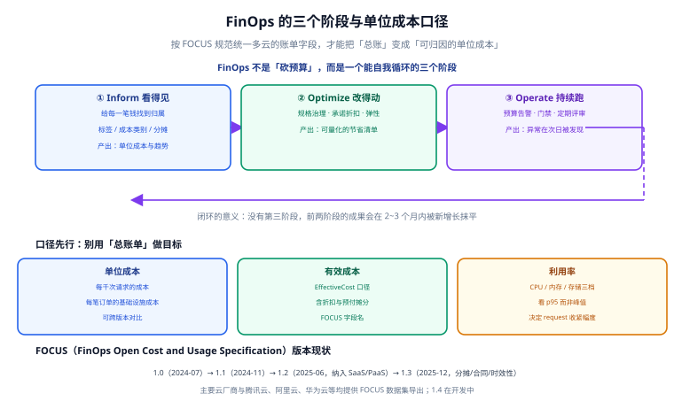
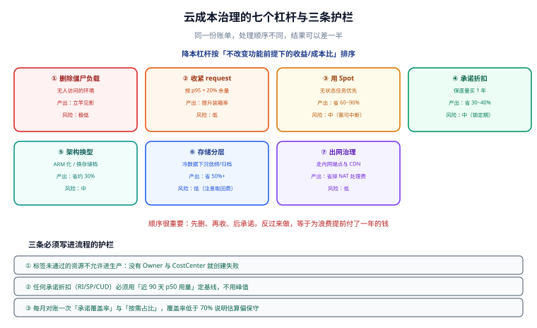

# 云成本治理（FinOps）

**FinOps（云成本治理）不是「省钱」，而是让「花多少钱」和「带来多少业务价值」变成可对话的数字。** 它要解决的问题很具体：账单每月都在涨，但没人说得清钱花在哪、该不该花、涨得对不对。本页给出三阶段闭环、统一账单口径（FOCUS）、单位成本与有效成本的口径定义、七个降本杠杆与三条护栏，并给一段可直接跑的账单分析代码。



## 1. 三阶段闭环：Inform → Optimize → Operate

FinOps 的价值不在单次降本，而在**持续运转的闭环**。三个阶段缺一个都会退化：

| 阶段 | 中文 | 要回答的问题 | 产出物 | 常见失败 |
| --- | --- | --- | --- | --- |
| **Inform** | 看得见 | 钱花在哪？谁花的？涨了多少？ | 分账账单、单位成本看板、预算告警 | 只有一张总账单；无标签，分不清归属 |
| **Optimize** | 改得动 | 哪里可以降？降了会不会伤业务？ | 优化项清单、预期收益、回滚方案 | 只减资源不看 SLO，导致事故 |
| **Operate** | 持续跑 | 怎么让它长期有效？ | 月度评审、预算机制、门禁与规范 | 做完一次优化就没人管了 |

:::tip 一句话理解
**Inform 是「仪表盘」，Optimize 是「踩油门/踩刹车」，Operate 是「定期的车检与规则」。** 没有 Inform 的 Optimize 是盲砍，没有 Operate 的 Optimize 是一次性运动。
:::

:::info 为什么必须先做 Inform
**Flexera 2025 调研称组织平均浪费约 27% 云支出；CAST AI 2025 基准称集群平均 CPU 利用率仅约 13%。** 这两个数字说明：大部分浪费不是「用不起」，而是「看不见」。先把账分清，降本机会会自己浮出来。
:::

## 2. 为什么要统一账单口径：FOCUS 的演进

多云环境最大的痛点是：**每家云厂商的账单字段、服务命名、折扣表达方式都不一样**。同一份报表里，AWS 叫 `UnblendedCost`、另一家叫别的名字，跨云比价与汇总只能靠人工 Excel。

**FOCUS（FinOps Open Cost and Usage Specification）** 就是为解决这件事而生的开放规范（**版本演进截至 2026-09 核对**）：

| 版本 | 发布时间 | 关键变化 |
| --- | --- | --- |
| FOCUS 1.0 | 2024-07 | 首个正式版本，统一成本与用量基础列 |
| FOCUS 1.1 | 2024-11 | 补充字段与使用指引 |
| FOCUS 1.2 | 2025-06 | **把 SaaS 与 PaaS 账单纳入同一 schema**；**新增 `InvoiceId`** |
| **FOCUS 1.3** | **2025-12 发布** | **新增分摊费用列**；**独立的 Contract Commitment 数据集**；**数据集时效性与完整性标记** |
| FOCUS 1.4 | 开发中 | — |

**已提供或支持 FOCUS 数据集**的厂商包括 AWS、Microsoft、Google Cloud、Oracle、Databricks、Grafana、华为、腾讯云、阿里云等。

:::warning 统一 schema 带来的三个直接好处
1. **跨云可汇总**：字段同名同义，一张表就能汇总多云的同一指标。
2. **SaaS 与 PaaS 能进同一张报表**：不再需要单独维护几套 Excel。
3. **1.3 之后能表达「预付与合同承诺」**：独立的 Contract Commitment 数据集让「买了多少承诺、用了多少、还剩多少」可计算，这对 Savings Plans / Reservations / CUD 的效果评估是刚需。
:::

## 3. 核心口径：单位成本与有效成本

这是两个最容易被忽略、却决定「降本是否真的成功」的口径。

### 3.1 单位成本（unit economics）

**单位成本 = 基础设施成本 ÷ 业务量**，例如：

- 每次 API 请求的基础设施成本（元 / 千次请求）
- 每笔订单的基础设施成本（元 / 单）
- 每 GB 处理数据的基础设施成本（元 / GB）

**为什么它比总账单重要**：业务量翻倍时总账单上涨是正常的，单看总额会误判「成本失控」。而单位成本下降，才说明效率真的提升了。

### 3.2 有效成本（EffectiveCost）

**有效成本 = 含折扣与预付摊分后的实际成本**，而不是按标价（List Cost）计算的金额。

| 口径 | 含义 | 用在什么场景 |
| --- | --- | --- |
| 标价（List Cost） | 按公开单价计算，不含任何折扣 | 做预算的「最坏情况」参考 |
| **有效成本（EffectiveCost）** | 含折扣、Spot、Savings Plans / Reservations / CUD 摊销后的真实成本 | **所有成本分析与优化效果评估都应基于它** |
| 摊销后成本（Amortized） | 把一次性预付按使用周期摊到每天 | 月度对比、部门分账 |
| 未摊销成本（Unblended） | 账单当天实际扣款金额 | 现金流视角、财务对账 |

:::danger 三个口径错误
1. **用总账单评估优化效果**：业务量涨了 50%、账单涨了 20%，其实是效率大幅提升，但看总额会得出「成本恶化」的错误结论。正确做法是同时看**单位成本**。
2. **用标价评估折扣效果**：买了 Savings Plans 之后标价不变，你会以为「一点没省」。正确做法是看 **EffectiveCost** 或摊销后成本。
3. **不区分「一次性预付」与「当月消耗」**：预付那天的账单会异常高，造成误判。正确做法是把预付按周期摊销后再做趋势对比。
:::

### 3.3 四种口径对照示意

把同一笔支出用四种口径表达，差异一眼可见（**示意数据**）：

| 场景 | List Cost | EffectiveCost | Amortized | Unblended |
| --- | --- | --- | --- | --- |
| 按需实例跑满一月 | 1000 | 1000 | 1000 | 1000 |
| 买了 Savings Plans 后的同一负载 | 1000 | 700 | 700 | 预付当月可能为 0、之后的月份也可能为 0（已在上月支付） |
| 用 Spot 跑的同一负载 | 1000 | 300 | 300 | 300 |
| 月末同时支付下月预付 | 1000 | 700 | 700 | 当月扣款 = 700 + 预付全额，会异常偏高 |

**结论**：做趋势对比与优化效果评估用 **EffectiveCost / Amortized**；做现金流与财务对账用 **Unblended**；做预算上限参考用 **List Cost**。**不要用同一个口径回答所有问题。**

## 4. 标签与成本分摊

**没有标签，就没有分摊；没有分摊，就没有责任人。** 这是 Inform 阶段最该先做的一件事。

### 4.1 必填标签

| 标签键 | 含义 | 示例 | 是否强制 |
| --- | --- | --- | --- |
| `owner` | 责任团队 | `team-payment` | **强制** |
| `cost-center` | 成本中心 | `cc-1001` | **强制** |
| `env` | 环境 | `prod` / `staging` / `dev` | **强制** |
| `service` | 服务名 | `order-api` | **强制** |
| `managed-by` | 谁创建的 | `terraform` / `karpenter` | 建议 |
| `ttl` | 计划回收时间 | `2026-10-31`（临时环境用） | 建议 |

### 4.2 成本类别（Cost Category）

标签只能表达「谁用了」，成本类别还能表达「这是哪类支出」：

- **按环境**：prod / non-prod —— 非生产环境的成本最该被盯。
- **按用途**：业务流量 / CI/CD / 监控日志 / 数据备份 / 实验性项目。
- **按采购方式**：按需 / Spot / 承诺折扣 —— 用来评估折扣覆盖率。

:::tip 落地顺序
**先给存量资源补标签（可脚本批量），再在新资源的 IaC 里把必填标签做成模板，最后在流水线加门禁**：缺必填标签的部署直接失败。这样标签才不会越用越乱。IaC 侧的标签统一管理见 [Terraform](../../Terraform/index.md)。
:::

## 5. 预算与告警

预算告警的价值在于**在月底收到惊吓之前就收到提醒**。

| 告警类型 | 触发条件 | 接收人 | 动作 |
| --- | --- | --- | --- |
| 月度预算告警 | 实际支出达预算 50% / 80% / 100% | 团队负责人 | 50% 关注，80% 开始核查，100% 冻结非必要变更 |
| 异常增长告警 | 单服务日环比增长 > 30% | 服务 owner | 24 小时内定位原因 |
| 单位成本告警 | 单位成本环比上升 > 15% | 团队负责人 | 结合业务量判断是效率下降还是口径变化 |
| 闲置资源告警 | 资源利用率连续 7 天 < 5% | 服务 owner | 确认后回收或降配 |

:::warning 只设「总额告警」是不够的
总额告警会在业务增长时频繁误报，逐渐被所有人忽略。**更有用的组合是「预算告警（管上限）+ 异常增长告警（管突变）+ 单位成本告警（管效率）」**，三者分别对应不同的行动。
:::

## 6. 七个降本杠杆与三条护栏



### 6.1 七个杠杆（按见效速度排序）

| # | 杠杆 | 典型收益 | 风险 |
| --- | --- | --- | --- |
| 1 | **清理闲置资源**：未挂载的磁盘、闲置 IP、废弃的测试集群 | 一次性，往往最低风险 | 低（注意别删了在用的） |
| 2 | **存储分层与生命周期**：冷数据转低频 / 归档，日志设保留期 | 存储费用可降 30%~70% | 低（注意取回成本与延迟） |
| 3 | **request / limit 对齐实测**：按 p95 + 20% 设 | 集群利用率可从约 13% 显著提升 | 中（设得太紧会节流） |
| 4 | **采购方式优化**：Spot / Savings Plans / Reservations / CUD | Spot 省 **60%~90%**；<br/>AWS 一年期 Compute Savings Plans 通常省 **30%~40%**；<br/>Azure Reservations 最高约 **72%**；<br/>GKE 承诺使用折扣 1 年约 **37%**、3 年约 **57%** | 中（承诺期锁定，需预测稳态用量） |
| 5 | **架构右迁**：稳定长驻 → 托管容器；事件驱动 → 函数 | 视负载，缩到零的场景收益最大 | 中（改造与回归成本） |
| 6 | **网络与出口优化**：同地域同 AZ 通信、CDN、减少跨区流量 | 出口流量费常被低估 | 低 |
| 7 | **可观测成本治理**：日志采样、指标降基数、缩短保留期 | 上量后效果显著 | 低（注意别丢排错能力） |

### 6.2 三条护栏（红线）

:::danger 成本优化必须守住的三条线
1. **不能牺牲 SLO**：任何降本变更都要先明确「允许的延迟/可用性边界」，并在灰度中验证。把生产副本数砍到刚好不报警，是把风险当成本节约。
2. **不能绕过安全与合规**：备份、加密、审计日志、多可用区这些「不产生直接业务价值」的支出，**在监管或合同要求下不可削减**。省掉它们省下的钱，远小于一次事故的代价。
3. **必须可回滚**：每一项优化都要有明确的回滚动作与验收判据（见下面第 9 节）。「先改了看看」在成本治理里是不允许的，因为成本变化有滞后性，出问题时往往已经过了一个账期。
:::

:::tip 承诺折扣的正确用法
**只对「稳态基线用量」买承诺**——比如过去 3 个月每天都在跑的负载。波峰部分留给按需或 Spot。买多了会变成「用不完的浪费」，比不买更糟。
:::

## 7. 一段可跑的账单分析代码

下面这段脚本读取 FOCUS 风格的账单导出（CSV），按服务聚合**有效成本**并计算环比。不依赖第三方库，本地可直接运行：

```python [scripts/cost_by_service.py]
#!/usr/bin/env python3
"""按服务聚合 FOCUS 风格账单，输出各服务两个账期的有效成本与环比。

输入：billing/focus-export.csv
必需列：BillingPeriodStart, ServiceName, EffectiveCost
可选列：ChargeCategory（Usage / Purchase / Tax / Credit）
"""
import csv
from collections import defaultdict
from datetime import datetime

INPUT = "billing/focus-export.csv"


def load(path):
    """返回 {(service, period): effective_cost}"""
    totals = defaultdict(float)
    with open(path, newline="", encoding="utf-8") as handle:
        for row in csv.DictReader(handle):
            # 只统计用量类费用，排除税与信用额度，避免口径混淆
            if row.get("ChargeCategory") not in (None, "", "Usage"):
                continue
            service = row["ServiceName"] or "Unknown"
            # BillingPeriodStart 形如 2026-08-01T00:00:00Z，取到月份
            period = datetime.fromisoformat(
                row["BillingPeriodStart"].replace("Z", "+00:00")
            ).strftime("%Y-%m")
            # 有效成本：含折扣与预付摊分，而不是标价
            totals[(service, period)] += float(row.get("EffectiveCost") or 0.0)
    return totals


def report(totals):
    periods = sorted({period for _, period in totals})
    if len(periods) < 2:
        print("至少需要两个账期的数据才能计算环比")
        return
    current, previous = periods[-1], periods[-2]

    services = sorted({service for service, _ in totals})
    rows = []
    for service in services:
        cur = totals.get((service, current), 0.0)
        prev = totals.get((service, previous), 0.0)
        delta = cur - prev
        pct = (delta / prev * 100) if prev > 0 else float("inf")
        rows.append((service, prev, cur, delta, pct))

    rows.sort(key=lambda r: r[3], reverse=True)   # 涨得最多的排最前

    print(f"账期对比：{previous} -> {current}")
    print(f"{'服务':<28}{'上月':>12}{'本月':>12}{'环比':>12}")
    for service, prev, cur, delta, pct in rows:
        pct_text = "新增" if pct == float("inf") else f"{pct:+.1f}%"
        print(f"{service:<28}{prev:>12.2f}{cur:>12.2f}{pct_text:>12}")

    total_prev = sum(r[1] for r in rows)
    total_cur = sum(r[2] for r in rows)
    print("-" * 64)
    print(f"{'合计':<28}{total_prev:>12.2f}{total_cur:>12.2f}"
          f"{(total_cur - total_prev) / total_prev * 100 if total_prev else 0:>11.1f}%")


if __name__ == "__main__":
    report(load(INPUT))
```

**运行方式与预期输出**：

```shell
python3 scripts/cost_by_service.py
# 预期输出（示例数据）：
# 账期对比：2026-08 -> 2026-09
# 服务                                  上月        本月          环比
# Amazon Elastic Kubernetes Service   18420.55    24110.30      +30.9%
# AWS Lambda                           2130.40     1890.12      -11.3%
# Amazon S3                             980.10      976.44       -0.4%
# ------------------------------------------------------------------
# 合计                                21531.05    26976.86        25.3%
```

:::tip 拿到这张表之后做什么
**先看「涨得最多的前三名」**，逐项判断是「业务增长导致的合理上涨」还是「配置/浪费导致的异常上涨」。判断依据就是第 3 节的单位成本——若业务量同步增长，则看单位成本是否稳定；若业务量没变而成本上涨，就是异常。
:::

## 8. 月度成本评审议程模板

FinOps 的 Operate 阶段需要一个**固定节奏的短会**。议程模板：

| 时段 | 议题 | 输入 | 输出 |
| --- | --- | --- | --- |
| 0~5 min | 总览：本月总成本、环比、预算执行率 | 账单报表 | 是否需要触发异常核查 |
| 5~15 min | 单位成本回顾：各核心服务的单位成本趋势 | 单位成本看板 | 效率下降的服务清单 |
| 15~30 min | 异常归因：环比增幅 Top 3 服务 | 第 7 节脚本输出 | 每个异常的根因与责任人 |
| 30~40 min | 优化项进展：上期优化项的收益与回滚情况 | 优化项清单 | 关闭 / 延续 / 放弃 |
| 40~50 min | 新增优化项：本期新识别的机会 | 闲置资源告警、折扣覆盖率 | 下期优化项与预期收益 |
| 50~55 min | 折扣与承诺：覆盖率、到期时间、续购建议 | 承诺折扣使用率 | 续购 / 调整决策 |
| 55~60 min | 护栏检查：本月的优化是否触碰 SLO / 合规 / 回滚要求 | 变更记录 | 违规项整改 |

:::warning 评审会最容易开的两个坏样子
1. **开成「汇报会」**：只念数字、不产生行动项。正确做法是**每次会议必须产出负责人 + 截止时间的优化项**。
2. **开成「批斗会」**：只看谁花得多，不看谁的业务增长快。正确做法是**用单位成本对话**，而不是用总金额。
:::

## 9. 验证方式

用下面的检查确认你的 FinOps 闭环是否真的在运转：

```shell
# 1. 检查是否存在无 owner 标签的资源（不同云命令不同，这里是示意写法）
aws resourcegroupstaggingapi get-resources \
  --query "ResourceTagMappingList[?!Tags[?Key=='owner']].ResourceARN" \
  --output text | head
# 预期：输出为空 = 所有资源都有 owner 标签；有输出则先补标签再谈分摊

# 2. 跑一次账单分析
python3 scripts/cost_by_service.py
# 预期：输出各服务的有效成本与环比，且合计与账单门户的「摊销后成本」量级一致

# 3. 检查承诺折扣覆盖率
# 预期：Savings Plans / Reservations / CUD 覆盖了 60%~80% 的稳态基线用量，
#       剩余部分由按需与 Spot 承担（覆盖率不是越高越好，过高说明买多了）
```

| 检查项 | 期望 | 实测 | 结论 |
| --- | --- | --- | --- |
| 必填标签覆盖率 | 生产资源 100% | 待填写 | ⏳ |
| 单位成本 | 环比不上升（或上升幅度小于业务量增幅） | 待填写 | ⏳ |
| 预算告警 | 已按 50% / 80% / 100% 三级配置 | 待填写 | ⏳ |
| 闲置资源 | 连续 7 天利用率 < 5% 的资源已清理 | 待填写 | ⏳ |
| 优化项回滚 | 每项优化都有回滚方案与验收判据 | 待填写 | ⏳ |

## 参考资料

- FinOps Foundation 官网：https://www.finops.org/
- FOCUS 规范（FinOps Open Cost and Usage Specification）：https://focus.finops.org/
- FinOps 框架（Inform / Optimize / Operate）：https://www.finops.org/framework/
- AWS 成本与用量报告（CUR）：https://docs.aws.amazon.com/cur/latest/userguide/what-is-cur.html
- AWS Cost Explorer 与 Savings Plans：https://docs.aws.amazon.com/savingsplans/latest/userguide/what-is-savings-plans.html
- Cloudflare Workers 定价：https://developers.cloudflare.com/workers/platform/pricing/
- 本专题其余章节：[托管容器服务](../ContainerService/index.md) ｜ [概述与选型](../Overview/index.md) ｜ [实战：迁移与验收](../Practice/index.md)
- 相邻专题：[监控与可观测](../../Monitoring/index.md) ｜ [Terraform](../../Terraform/index.md)
