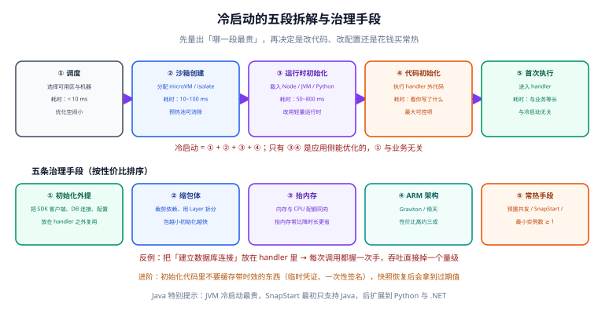

# 云函数工程化

**写一个能跑的函数只要 10 行代码，让它在生产里稳定跑一年要做的却远不止这些。** 本页把「函数能上线」到「函数可运维」之间的差距补齐：冷启动怎么拆、初始化代码怎么写、幂等怎么做、本地怎么调、IaC 怎么管、日志怎么留，最后用一组对照数据说明「连接建在哪里」为什么值得较真。



## 1. 冷启动五段拆解

冷启动不是「一个耗时数字」，而是**五段串行的耗时之和**。拆开才知道该优化哪一段（时间为典型量级，**截至 2026-09 核对的经验值，请以本地实测为准**）：

| 段 | 阶段 | 典型耗时 | 受什么影响 | 你能做什么 |
| --- | --- | --- | --- | --- |
| ① | 平台调度与沙箱创建 | 50~300 ms | 平台实现、机型、可用区容量 | 基本无法优化；用预置容量绕过 |
| ② | 代码 / 镜像下载与解压 | 20~500 ms | 包体大小、依赖数量、镜像层数 | 精简依赖、减小包体、合并镜像层 |
| ③ | 运行时启动 | 30~200 ms（JS/Python）<br/>**500 ms~数秒（JVM）** | 语言与运行时 | 选轻量运行时；JVM 用 SnapStart |
| ④ | 初始化代码执行 | 10 ms~数秒 | 模块顶层做了什么 | **纪律的战场**：外提、懒加载、不阻塞 |
| ⑤ | handler 首次执行 | 视业务而定 | JIT、类加载、首次连接 | 预热后稳定；避免首次做重活 |

:::tip 一句话理解
**① ② ③ 是平台和打包的事，④ ⑤ 是你的代码的事。** 大部分「我的函数冷启动要 5 秒」的案例，问题都出在 ④ 里做了建库表连接、加载大模型、读远程配置这类重活。
:::

## 2. 五条治理手段

按「性价比」从高到低排列，前两条几乎零成本：

| 手段 | 做法 | 效果 | 成本 |
| --- | --- | --- | --- |
| ① 减包体 | 用打包工具 tree-shaking、剔除 devDependencies、避免整包引入 SDK | 段②显著变短 | 零 |
| ② 换架构 / 运行时 | Lambda 选 **arm64（Graviton）**；能用 Node/Python 就不上 JVM | 段②③变短；性价比约高三成 | 零（需回归测试） |
| ③ 初始化瘦身 | 连接、SDK 客户端外提为惰性单例；重活移出顶层 | 段④大幅变短 | 一次代码改造 |
| ④ 保持热实例 | 最小实例数 ≥ 1（FC）/ 预置并发（Lambda） | 段①~④基本消失 | 为待机容量付费 |
| ⑤ 快照恢复 | **SnapStart**（AWS Lambda，**最初只支持 Java（2022 年推出），后续扩展到 Python 与 .NET**） | 段③④跳过 | 需满足快照兼容性约束 |

:::warning 不要把「定时 ping 保活」当方案
用定时器每隔几分钟调一次函数来「保持热」，在并发伸缩面前很脆弱：平台可能把实例调度到别处、并发上来仍会新建实例，而 ping 请求本身也要付费。正确做法是用平台的**预置并发 / 最小实例数**这类一等公民能力。
:::

## 3. 初始化代码的三条纪律

模块顶层代码（以及初始化钩子）是冷启动优化的主战场。三条纪律：

### 3.1 外提：可复用的重对象放到 handler 外面

SDK 客户端、数据库连接句柄、编解码器这类「无副作用、构造昂贵」的对象，应在模块顶层创建一次，被同一执行环境内的后续请求复用。

```js [src/order-handler.mjs]
import { DynamoDBClient } from "@aws-sdk/client-dynamodb";
import { DynamoDBDocumentClient, GetCommand } from "@aws-sdk/lib-dynamodb";

// ✅ 外提：整个执行环境生命周期内只构造一次
const client = new DynamoDBClient({});
const docClient = DynamoDBDocumentClient.from(client);

export const handler = async (event) => {
  const { Item } = await docClient.send(
    new GetCommand({ TableName: "orders", Key: { id: event.pathParameters.id } })
  );
  return { statusCode: Item ? 200 : 404, body: JSON.stringify(Item ?? {}) };
};
```

### 3.2 别缓存时效性东西：会过期的数据不要长期驻留

执行环境的存活时间**不确定**，可能是几秒，也可能是几小时。把「有时效性的配置」「短暂的令牌」「限流计数」缓存在模块变量里，会出现「某些实例用的是 3 小时前的配置」这种极难排查的问题。

```js [src/flags.mjs]
// ❌ 错误：模块级缓存永不过期，实例存活多久就用多久的旧值
const flags = await fetchFeatureFlags();

// ✅ 正确：带 TTL 的惰性缓存，过期自动重取
let cache = { value: null, expiresAt: 0 };
export async function getFeatureFlags() {
  if (Date.now() > cache.expiresAt) {
    cache = { value: await fetchFeatureFlags(), expiresAt: Date.now() + 30_000 };
  }
  return cache.value;
}
```

### 3.3 别建需要保活的连接：初始化的连接会僵死

这看起来和第 3.1 条矛盾，其实说的是两件事：

- **能做**：创建一个「客户端对象」（连接池由 SDK / 连接池代理管理，能自动重连）。
- **别做**：在初始化阶段建立**必须一直活着**的连接（裸 TCP 长连接、WebSocket、事务级会话），因为实例被回收时连接会僵死，而你的代码并不知情。

:::danger 三个必踩的坑
1. **在 handler 里每次 new 一个数据库客户端**：每请求一次建连握手（TLS + 认证），延迟与下游连接数都会爆炸。正确写法见 3.1，把客户端外提；数据库侧再配 **RDS Proxy / 连接池代理**收口连接数。
2. **在模块顶层 `await` 一个远程配置**：所有冷启动都要先等它返回，段④被无限拉长；远程配置挂掉时函数直接不可用。正确写法是带 TTL 的惰性加载，或用本地默认值兜底。
3. **把事务状态挂在模块变量上**：并发请求共享同一个模块作用域，会互相串数据。正确写法是事务对象在 handler 内创建、在 handler 内结束。
:::

## 4. 幂等设计

事件源多数是**至少一次**语义，重复投递是常态而非异常。幂等的标准做法是**幂等键 + 去重表**。

### 4.1 设计幂等键

| 场景 | 幂等键构成 | 示例 |
| --- | --- | --- |
| 支付回调 | 支付渠道 + 交易号 | `alipay:202609250001` |
| 订单创建 | 业务单号 + 操作类型 | `order:SO20260925001:create` |
| 对象存储事件 | 桶名 + 对象 key + 事件 ID | `s3:uploads/a.jpg:evt-9f0c` |
| 队列消息 | 消息 ID（或业务 ID + 版本） | `mq:msg-7c1a` |

原则：**幂等键必须由业务语义决定，不能是「本次请求的随机 ID」**——随机 ID 每次都不同，等于没去重。

### 4.2 去重表结构

```sql [schema/order_idempotency.sql]
CREATE TABLE idempotency_record (
  idempotency_key VARCHAR(160) NOT NULL,          -- 幂等键
  function_name    VARCHAR(64)  NOT NULL,          -- 哪个函数写入的，便于排错
  status           VARCHAR(16)  NOT NULL,          -- processing / succeeded / failed
  result_body      JSONB,                          -- 缓存首次成功的结果
  created_at       TIMESTAMPTZ  NOT NULL DEFAULT now(),
  expires_at       TIMESTAMPTZ  NOT NULL,          -- 到期可清理，避免表无限膨胀
  PRIMARY KEY (idempotency_key)
);

-- 便于定期清理过期记录
CREATE INDEX idx_idempotency_expires ON idempotency_record (expires_at);
```

### 4.3 幂等执行流程

```ts [src/idempotent.ts]
type Outcome =
  | { kind: "first" }
  | { kind: "replay"; body: unknown }
  | { kind: "in-progress" };

export async function beginIdempotent(
  db: Pool,
  key: string,
  fnName: string,
  ttlSeconds = 86400
): Promise<Outcome> {
  // 1) 抢占：唯一主键保证只有一个请求能插入成功
  const insert = await db.query(
    `INSERT INTO idempotency_record (idempotency_key, function_name, status, expires_at)
     VALUES ($1, $2, 'processing', now() + ($3 || ' seconds')::interval)
     ON CONFLICT (idempotency_key) DO NOTHING`,
    [key, fnName, String(ttlSeconds)]
  );
  if (insert.rowCount === 1) return { kind: "first" };

  // 2) 已有记录：看是已完成还是仍在处理
  const { rows } = await db.query(
    `SELECT status, result_body FROM idempotency_record WHERE idempotency_key = $1`,
    [key]
  );
  const row = rows[0];
  if (row?.status === "succeeded") return { kind: "replay", body: row.result_body };
  return { kind: "in-progress" };   // 让上游稍后重试，或返回 409
}

export async function finishIdempotent(
  db: Pool,
  key: string,
  status: "succeeded" | "failed",
  body: unknown
): Promise<void> {
  await db.query(
    `UPDATE idempotency_record SET status = $2, result_body = $3 WHERE idempotency_key = $1`,
    [key, status, JSON.stringify(body)]
  );
}
```

**接入方式**：handler 第一件事就是 `beginIdempotent`，`first` 才执行业务并在结束后 `finishIdempotent`；`replay` 直接返回缓存结果；`in-progress` 返回 `409` 让上游重试。

:::info 更省事的做法
AWS 侧的 **Powertools 的 idempotency 工具**已经把这套逻辑（含 DynamoDB 去重与结果缓存）封装好了，不必每次手写。自建幂等表则更可控、可查、可跨云迁移，二者按团队情况选。
:::

## 5. 本地调试方案

本地调试的目标是：**不改代码、不连云端，就能用真实事件结构跑通逻辑。**

### 5.1 本地容器运行

各家都有本地运行器，本质都是「本地起一个容器，喂事件、跑 handler」：

```shell
# AWS：SAM CLI 本地运行，指定事件文件
sam local invoke HelloFunction -e events/apigw.json

# AWS：本地起 HTTP 服务，模拟 API Gateway
sam local start-api --port 3000
# 预期：Mounting HelloFunction at http://127.0.0.1:3000/hello [GET]
curl -s "http://127.0.0.1:3000/hello?name=local"

# Cloudflare：本地跑 workerd
npx wrangler dev --port 8787
# 预期：Ready on http://127.0.0.1:8787
curl -s "http://127.0.0.1:8787/?name=local"
```

### 5.2 事件样例 JSON

把真实事件保存成文件，既能本地调试，也能当回归测试用例：

```json [events/apigw.json]
{
  "resource": "/hello",
  "path": "/hello",
  "httpMethod": "GET",
  "queryStringParameters": { "name": "local" },
  "requestContext": { "requestId": "local-test-0001" },
  "isBase64Encoded": false
}
```

```json [events/s3-put.json]
{
  "Records": [
    {
      "eventName": "ObjectCreated:Put",
      "s3": {
        "bucket": { "name": "uploads-demo" },
        "object": { "key": "origin/a.jpg", "size": 204800 }
      }
    }
  ]
}
```

:::tip 把事件样例接进单元测试
把 `events/*.json` 作为测试夹具，对 handler 做「输入事件 → 断言返回/副作用」的测试，就能在没有云凭证的 CI 里跑通大部分回归。这也是把函数逻辑写成**纯函数**（输入事件、输出结果、副作用通过注入的客户端）的最大收益。
:::

## 6. 基础设施即代码

函数必须用代码创建，否则「这个环境为什么和那个环境不一样」永远查不清。三种常见写法，选一种坚持用：

### 6.1 serverless.yml

```yaml [serverless.yml]
service: cloudnative-thumbnail

provider:
  name: aws
  runtime: nodejs22.x
  architecture: arm64              # Graviton
  region: ap-southeast-1
  memorySize: 1024                 # 图片处理偏内存型，先给足再调
  timeout: 20
  environment:
    BUCKET: ${env:THUMB_BUCKET}    # 敏感值走环境注入，不写死

functions:
  makeThumbnail:
    handler: src/thumbnail.handler
    events:
      - s3:
          bucket: ${env:THUMB_BUCKET}
          event: s3:ObjectCreated:*
          existing: true
    reservedConcurrency: 20        # 防止打爆下游
```

### 6.2 Terraform 片段（函数 + 触发器）

```hcl [lambda.tf]
resource "aws_lambda_function" "thumbnail" {
  function_name = "cloudnative-thumbnail"
  role          = aws_iam_role.lambda_exec.arn
  runtime       = "nodejs22.x"
  handler       = "src/thumbnail.handler"
  architectures = ["arm64"]
  memory_size   = 1024
  timeout       = 20
  filename      = "dist/thumbnail.zip"
  source_code_hash = filebase64sha256("dist/thumbnail.zip")
}

resource "aws_lambda_permission" "allow_bucket" {
  statement_id  = "AllowExecutionFromS3Bucket"
  action        = "lambda:InvokeFunction"
  function_name = aws_lambda_function.thumbnail.function_name
  principal     = "s3.amazonaws.com"
  source_arn    = aws_s3_bucket.uploads.arn
}
```

:::warning IaC 里最容易漏的两项
1. **`source_code_hash`**：不写它，代码更新后 Terraform 可能认为「无事发生」，部署了个寂寞。正确写法是像上面那样绑定产物哈希。
2. **运行时版本与架构**：不写 IaC 全靠控制台，运行时弃用时（如 Lambda `nodejs20.x` 于 2026-08-31 起禁止创建新函数）就会出现「本地能改、线上不能建」的窘境。正确做法是把 `runtime`、`architectures` 都纳入代码评审。
:::

## 7. 日志与可观测

### 7.1 结构化日志

函数日志的天然优势是「每个请求都有 requestId」，把上下文字段固定下来即可直接查询：

```js [src/logger.mjs]
export function log(level, message, extra = {}) {
  // 单行 JSON：便于日志服务直接按字段检索
  console.log(JSON.stringify({
    level,
    message,
    ts: new Date().toISOString(),
    service: process.env.SERVICE_NAME ?? "unknown",
    ...extra,
  }));
}
```

### 7.2 三件事必须打

- **链路 ID**：`requestId` / `traceId`，串起函数、下游 API、数据库。
- **业务标识**：订单号、用户 ID、对象 key，便于按业务维度捞日志。
- **耗时与结果**：处理耗时、调用下游耗时、成功/失败。

### 7.3 日志保留期与费用

| 日志配置 | 现象 | 建议 |
| --- | --- | --- |
| 保留期「永不过期」 | 日志存储费逐月累积，是常见的隐性成本 | 生产 30~90 天，超出转对象存储归档 |
| 无过滤地打印大对象 | 单条日志几十 KB，写入费叠加 | 只打关键字段，大对象打摘要 |
| 不打日志 | 线上问题只能靠猜 | 至少保留错误 + 关键路径日志 |

:::info 日志也是要花钱的
日志服务的**采集、存储、检索**常常分别计费，而函数日志量会随请求量线性增长。上量之前先把保留期和采样策略定下来——否则过几个月它会成为账单里增长最快的一项。这也是[云成本治理（FinOps）](../FinOps/index.md)里常见的「隐性成本」来源。
:::

## 8. 对照压测：handler 里建连接 vs 全局建连接

这是最能说明「初始化纪律价值」的一组对照。以下数字为**示意量级（本地 Postgres + TLS，100 次热调用，仅供参考），请在你自己的环境复现**：

| 指标 | handler 内每次建连 | 全局惰性单例复用 | 差异 |
| --- | --- | --- | --- |
| 平均延迟 | 约 78 ms | 约 6 ms | **约 13 倍** |
| P95 延迟 | 约 95 ms | 约 9 ms | 约 10 倍 |
| 每次调用的建连次数 | 1 | 约 1 / 实例生命周期 | — |
| 100 并发下的下游连接数 | ≈ 100 且随并发线性增长 | ≈ 实例数，由池上限封顶 | 下游能否扛住的分界线 |
| 冷启动段④耗时 | 短（建连摊到每次调用） | 略长（首次建连一次） | 用一次 CPU 换每次延迟 |

```shell
# 复现思路（本地 Docker 起 Postgres，压测 100 次热调用）
docker run -d --name pg -e POSTGRES_PASSWORD=secret -p 5432:5432 postgres:16
# 对「每次建连」与「全局复用」两个版本分别压测，记录平均/P95
# 预期：全局复用版本平均延迟显著更低，且下游连接数不随并发线性增长
```

:::tip 结论
**连接（客户端对象）建在模块顶层，事务建在 handler 里。** 前者让每次调用省下一次握手，后者保证并发不串数据。
:::

## 9. 验证方式

写完函数后用下面三件事验收工程化是否到位：

```shell
# 1. 本地跑通事件样例
sam local invoke ThumbnailFunction -e events/s3-put.json
# 预期：输出执行结果 JSON，且无 "Task timed out" 字样

# 2. 幂等验证：同一个幂等键连发两次，第二次应命中缓存
curl -s -X POST "https://<api>/orders" -H "Idempotency-Key: order:SO20260925001:create" -d '{"sku":"A1"}'
curl -s -X POST "https://<api>/orders" -H "Idempotency-Key: order:SO20260925001:create" -d '{"sku":"A1"}'
# 预期：两次返回相同结果，且数据库中该幂等键只有一行记录

# 3. 观察冷启动段④耗时是否被压下来
aws logs filter-log-events --log-group-name /aws/lambda/cloudnative-thumbnail \
  --filter-pattern "REPORT"
# 预期：REPORT 行含 Init Duration（有则说明发生了冷启动及段④耗时），热调用无 Init Duration
```

| 检查项 | 期望 | 实测 | 结论 |
| --- | --- | --- | --- |
| 本地事件样例 | 跑通、无超时 | 待填写 | ⏳ |
| 重复幂等键 | 第二次返回缓存结果、表内仅一行 | 待填写 | ⏳ |
| 冷启动 Init Duration | 明显小于优化前 | 待填写 | ⏳ |
| 连接复用 | 下游连接数不随并发线性增长 | 待填写 | ⏳ |

## 参考资料

- AWS Lambda 最佳实践（初始化、连接复用）：https://docs.aws.amazon.com/lambda/latest/dg/best-practices.html
- AWS Lambda SnapStart：https://docs.aws.amazon.com/lambda/latest/dg/snapstart.html
- AWS Powertools for Lambda（含 idempotency 工具）：https://docs.powertools.aws.dev/lambda/typescript/latest/utilities/idempotency/
- AWS SAM CLI 本地调试：https://docs.aws.amazon.com/serverless-application-model/latest/developerguide/using-sam-cli-local.html
- Cloudflare Workers 本地开发（wrangler dev）：https://developers.cloudflare.com/workers/wrangler/commands/
- 阿里云函数计算 FC 开发指南：https://help.aliyun.com/zh/functioncompute/
- 本专题其余章节：[Serverless 与函数计算](../Serverless/index.md) ｜ [实战：迁移与验收](../Practice/index.md) ｜ [常见问题与排错](../FAQ/index.md)
- 相邻专题：[CI/CD 自动部署与回滚](../../../Tools/CICD/DeployRollback/index.md) ｜ [Terraform](../../Terraform/index.md)
