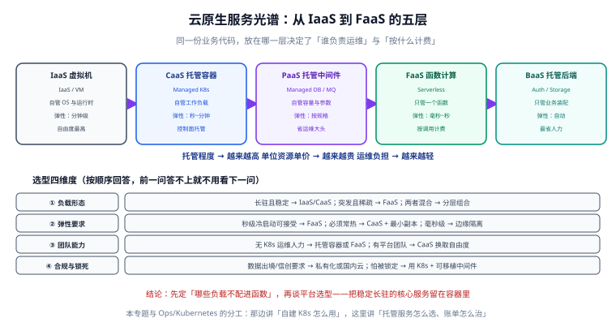

# 概述与选型

**云原生托管服务的光谱，本质是一条「你把责任交给云厂商多少」的滑杆**：从 IaaS 到 BaaS，你管的东西越来越少、启动速度越来越快、但可控性与可移植性也在下降。本页给出这条光谱、四个选型维度、四种典型架构组合，以及一张「什么负载不该进函数」的反面清单，帮你在「自己搭」和「全托管」之间找到落点。



## 1. 云原生到底在讲什么

云原生（Cloud Native）不是一个产品，而是一套**让应用天然适配云环境**的做法：以容器为交付单元、以声明式 API 描述期望状态、以弹性伸缩应对流量波动、以可观测性支撑持续运维。落到工程实践上，它最终会收敛成一句话：

> **哪些能力自己写、哪些能力买托管服务。**

这句话的答案不是「全都上 Serverless」，也不是「全都自建」，而是按负载形态逐项决定。所以本页先讲清楚光谱，再讲怎么选。

## 2. 五层托管服务光谱

从下到上，托管程度递增。记牢这条链，选型时就有坐标系（截至 2026-09 核对，产品以各家官网为准）：

| 层级 | 全称 | 你负责 | 云厂商负责 | 典型产品 | 交付单元 |
| --- | --- | --- | --- | --- | --- |
| **IaaS** | Infrastructure as a Service | OS 打补丁、运行时、中间件、扩缩容、高可用 | 物理机、虚拟化、网络、存储硬件 | AWS EC2、阿里云 ECS | 虚拟机 |
| **CaaS** | Container as a Service | 容器编排配置、工作负载定义、节点池策略 | **控制面**、节点生命周期、集群升级 | AWS EKS、Azure AKS、GKE、阿里云 ACK | Pod / 容器 |
| **PaaS** | Platform as a Service | 应用代码与配置，其余基本不管 | 运行时、中间件、扩缩容、发布 | 托管 MySQL / Redis / Kafka、App Service | 应用实例 |
| **FaaS** | Function as a Service | 单个函数代码 + 触发配置 | 执行环境、伸缩、负载均衡、按需计费 | AWS Lambda、Cloudflare Workers、阿里云函数计算 FC | 函数 |
| **BaaS** | Backend as a Service | 前端 / 客户端代码 | 数据库、认证、存储、推送整套后端 | Firebase、Supabase、Cloudflare D1 + KV + R2 | 后端托管能力 |

:::info 这条链最容易记混的一点
**CaaS 与 PaaS 的分界线是「你要不要写编排配置」**。EKS 虽然叫「托管 Kubernetes」，但你仍要写 YAML 描述工作负载，所以是 CaaS；而托管数据库你只填参数、不写编排，所以是 PaaS。
:::

:::tip 一句话理解
光谱往左是「自由但费人」，往右是「省心但受限」。**选型的本质是给「自由度」定价**——如果某个自由你根本用不上，那它就是在白花钱。
:::

## 3. 每层再展开：什么时候停在哪一层

| 停在 | 适合的情况 | 代价 |
| --- | --- | --- |
| **IaaS** | 需要自定义内核参数、特殊硬件、GPU 训练、遗留系统迁移 | 补丁、扩容、故障恢复全是你的事，人力成本高 |
| **CaaS** | 已有容器化应用、需要复杂调度 / 有状态工作负载、团队有 K8s 能力 | 控制面费用、节点池治理、K8s 学习曲线 |
| **PaaS** | 只想要「一个能连的数据库 / 消息队列」，不想运维 | 版本受限、参数受限、迁移有粘性 |
| **FaaS** | 事件驱动、流量波峰波谷大、单次任务可拆成无状态函数 | 冷启动、执行时长上限、本地调试体验差 |
| **BaaS** | 小团队 / 原型 / 前端主导，后端只要 CRUD 与认证 | 数据模型绑定厂商、复杂查询能力弱 |

## 4. 选型四维度

不要凭「新技术酷」选型。依次问四个问题，答案会自己收敛。

### 4.1 负载形态：是不是无状态、是不是事件驱动

- **无状态 + 事件驱动 + 单次短任务** → 优先 FaaS。例如图片转码、Webhook 接收、定时清理。
- **长连接 / 长任务 / 有状态** → 不要硬塞 FaaS。例如 WebSocket 长连接服务、超过 15 分钟的批处理、本地内存缓存会话。
- **CPU 持续跑满** → FaaS 反而更贵（按执行时长计费），应回到 CaaS 或 IaaS。

### 4.2 弹性要求：波动幅度与响应速度

| 波动特征 | 推荐 | 理由 |
| --- | --- | --- |
| 平缓、可预测 | 固定容量 + 预留实例 | 预留可省 30%~70%，弹性收益不明显 |
| 有明显波峰波谷，峰谷差 > 5 倍 | FaaS 或 CaaS + 自动伸缩 | 按用付费，波谷不掏钱 |
| 秒级突发、要求无损 | FaaS + 预置并发 / 常驻实例 | 冷启动会被用户感知，需提前预热 |
| 夜间可缩到零 | FaaS 或 KEDA 驱动缩容 | 缩到零才能真正不花钱 |

### 4.3 团队能力：运维人力是隐性成本

- 没有专职运维、没有 K8s 经验 → 别直接上自建集群。托管 K8s 或 FaaS 更现实。
- 已有 SRE 团队和平台工程能力 → CaaS 可控性收益更大，不必为了「少写运维」牺牲架构自由度。
- 只有 1~2 个后端 → BaaS + FaaS 的组合能让小团队维持很高的交付速度。

### 4.4 合规与锁死：能不能接受厂商绑定

- **数据合规**：数据是否必须留在特定地域、特定行业云？函数计算与托管数据库通常都支持指定地域与 VPC。
- **技术锁死**：把业务逻辑写进厂商专有的触发器语法、专有数据模型，迁移成本会很高。
- **缓解手段**：把核心业务逻辑放在**框架无关的纯函数**里，云厂商 SDK 只出现在薄的适配层，这样换平台时改的是适配层而不是业务代码。

## 5. 四种典型架构组合

### 5.1 全自建（IaaS 为主）

```text
用户 → SLB/ELB → 自管 Nginx 集群 → 自建 VM 上的应用 → 自建 MySQL 主从
```

- **特征**：所有组件都在自己的 VM 上，最大可控性。
- **适合**：强合规、需要深度定制、已有成熟运维体系。
- **成本结构**：机器买断或预留为主，人力成本占比高。

### 5.2 托管容器（CaaS 为主）

```text
用户 → Ingress/ALB → 托管 K8s（应用 Deployment） → 托管数据库（PaaS）
```

- **特征**：控制面交给云，工作负载仍由自己声明式管理。
- **适合**：微服务较多、需要复杂调度、团队懂 K8s。
- **成本结构**：控制面固定费 + 节点费（按需/Spot/预留混合）。
- 详见[托管容器服务](../ContainerService/index.md)。

### 5.3 Serverless 优先（FaaS + BaaS）

```text
用户 → API 网关 / Workers → 函数 → 托管数据库 + 对象存储 + 消息队列
```

- **特征**：没有长期运行的服务器，缩到零、按调用付费。
- **适合**：事件驱动业务、流量极度不均、团队小。
- **成本结构**：请求数 + 计算时长 + 下游托管服务用量。
- 详见[Serverless 与函数计算](../Serverless/index.md)。

### 5.4 混合（最现实的答案）

大多数成熟系统最终是混合形态：

| 组件 | 落点 | 原因 |
| --- | --- | --- |
| 核心交易服务 | 托管 K8s | 需要长驻、需要精细控制并发与连接池 |
| 图片转码 / 报表导出 | 函数 | 突发、无状态、单次短任务 |
| 定时清理任务 | 函数 + 定时触发器 | 每天跑几分钟，不值得为它养机器 |
| 数据库 / 缓存 | PaaS | 自建数据库的高可用成本远高于托管差价 |
| 前端静态资源 | 对象存储 + CDN | 无需计算 |

:::tip 判断顺序
先问「这个组件能不能缩到零还不影响正确性」，能就优先函数；不能就放托管容器；容器也不需要就退回 IaaS。**从右往左试，而不是从左往右堆。**
:::

## 6. 反面清单：什么负载不该进函数

这张表是本页最该记住的部分。函数不是万能容器，以下场景硬上会持续踩坑：

| 不该进函数的情况 | 具体表现 | 该放哪 | 原因 |
| --- | --- | --- | --- |
| 长连接服务 | WebSocket、gRPC 流、SSE 长推 | 托管 K8s / PaaS | 函数实例按请求生命周期存在，连接无法长期保活 |
| 单次执行超过平台上限 | 超过 15 分钟的大批处理 | 容器 / 批处理服务 / 异步任务队列 | Lambda 上限 15 分钟，超时直接失败且不可续 |
| 常驻后台进程 | 常驻 Worker、内存队列消费者 | 托管 K8s | 函数执行完实例会被回收，无「常驻」概念 |
| 需要本地磁盘状态 | 落本地文件再读、依赖本地缓存目录 | 对象存储 / 容器 + 卷 | 执行环境可能被复用也可能被新起，本地盘不可依赖 |
| 高频固定流量 | 每秒稳定几千请求、CPU 长期打满 | 预留实例 / 托管 K8s | 按执行时长计费，持续满载时单价比容器贵 |
| 大文件处理 | 处理数 GB 视频、超大模型 | 容器 + 大内存机型 | 平台内存与包体限制、下载上传开销会被重复计费 |
| 强顺序保证的任务 | 必须严格串行、依赖全局锁 | 单实例消费者 / 分布式锁服务 | 函数天然并发，顺序要靠下游机制保证 |
| 需要特殊内核能力 | 需要 root、加载内核模块、特定网络协议 | IaaS | 沙箱环境不提供特权容器与内核模块 |

:::danger 三个最常见的判断错误
1. **把「websocket 网关」写成函数**：函数实例在连接空闲时可能被回收，长连接会莫名断开。正确做法是把长连接放在托管容器 / 网关服务里，只在消息落库后调用函数做异步处理。
2. **拿函数做「每天跑 3 小时」的批处理**：单次 15 分钟上限会直接失败。正确做法是拆成 12 个并行小任务，或用容器任务（如 ECS Task / 阿里云批处理）跑长任务。
3. **依赖本地 `/tmp` 做跨请求缓存**：执行环境复用是**尽力而为**，随时可能被新实例替换。正确做法是把需要共享的状态放到 Redis / 对象存储 / 数据库里。
:::

:::warning 一条经验法则
如果某个负载需要「一直活着」或「一次性跑很久」，它就不是函数的场景。**函数擅长的是「来一个事件、干一小段活、结束」。**
:::

## 7. 与相邻专题的分工

选型落定后，具体实施会进入相邻专题，边界如下：

- 决定用托管 K8s 后，**集群内部的对象模型**（Pod / Deployment / Service / Ingress）看 [Kubernetes](../../Kubernetes/index.md)；**云上的控制面与节点弹性**看[托管容器服务](../ContainerService/index.md)。
- 镜像怎么构建、层怎么优化看 [Docker](../../Docker/index.md)；镜像怎么进云端仓库、函数怎么拉取看[托管容器服务](../ContainerService/index.md)。
- 集群建好后的 Helm 打包与 Argo CD 交付看 [容器编排进阶](../../ContainerOrchestration/index.md)。
- 函数与镜像的**发布流水线、灰度回滚**参考 [CI/CD 自动部署与回滚](../../../Tools/CICD/DeployRollback/index.md)。
- 集群、数据库、函数本身要「用代码创建」时回到 [Terraform](../../Terraform/index.md)。
- 选型之后要算钱，看[云成本治理（FinOps）](../FinOps/index.md)。

## 8. 验证方式：把你的负载填进这张表

本页无需部署任何资源，用一张「选型归档表」做验证——把手上每个服务填进去，若出现「负载形态」与「落点」明显矛盾，就说明选型有问题：

```text [selection-review.md]
| 服务 | 负载形态 | 弹性要求 | 团队能力 | 锁死容忍度 | 落点 | 是否需要复核 |
| --- | --- | --- | --- | --- | --- | --- |
| 订单 API | 长驻、有状态连接池 | 平缓 | 有 SRE | 低 | 托管 K8s | 否 |
| 图片转码 | 事件驱动、无状态、<30s | 突发 | 有 SRE | 中 | 函数 | 否 |
| 报表导出 | 单次 40 分钟 | 低频 | 有 SRE | 低 | 容器任务 | 是（超函数上限） |
| 用户 WebSocket | 长连接 | 持续 | 有 SRE | 低 | 托管 K8s | 是（不可进函数） |
```

**预期结果**：表中不存在「负载形态为长连接 / 长任务，落点却填函数」的行。若存在，按第 6 节的反面清单调整落点。

## 参考资料

- AWS 计算服务选型（EC2 / ECS / EKS / Lambda / Fargate）：https://docs.aws.amazon.com/whitepapers/latest/choosing-an-aws-compute-service/choosing-an-aws-compute-service.html
- AWS Lambda 官方文档：https://docs.aws.amazon.com/lambda/latest/dg/welcome.html
- Cloudflare Workers 官方文档：https://developers.cloudflare.com/workers/
- 阿里云函数计算 FC 文档：https://help.aliyun.com/zh/functioncompute/
- Kubernetes 官方文档：https://kubernetes.io/docs/home/
- 本专题其余章节：[Serverless 与函数计算](../Serverless/index.md) ｜ [托管容器服务](../ContainerService/index.md) ｜ [云成本治理（FinOps）](../FinOps/index.md)
