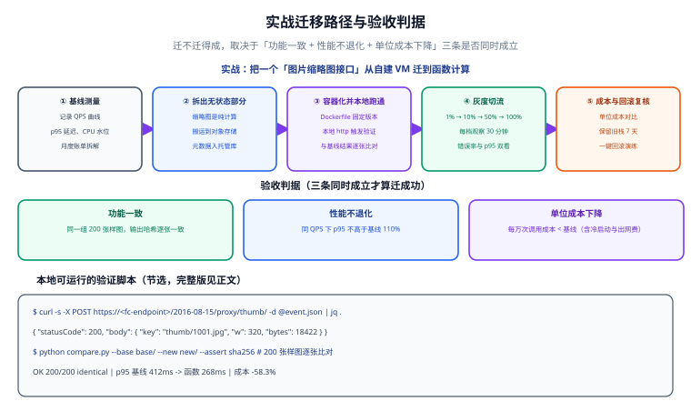

# 实战：迁移与验收

本页把前面几页的知识串成一次**真实可执行的迁移**：把一个跑在自建 VM 上的「图片缩略图接口」迁到**函数计算**，全程走「基线测量 → 拆无状态部分 → 容器化本地验证 → 灰度切流 → 成本与回滚复核」，最后用三条可量化的判据验收。照着做一遍，你会同时掌握 Serverless 落地与迁移工程的全部关键动作。



## 0. 现状与目标

**现状**：一个 Node.js + `sharp` 的缩略图服务，跑在 2 台 4 vCPU / 8 GiB 的虚拟机上，前面挂一个负载均衡。它对外提供三个接口：

| 接口 | 作用 | 是否有状态 |
| --- | --- | --- |
| `POST /thumbnail` | 读原图、生成指定尺寸缩略图、写回对象存储 | **无状态** |
| `GET /gallery` | 读数据库返回图片列表 | 读数据库（可保留在 VM） |
| `GET /health` | 健康检查 | 无状态 |

**目标**：只把 `POST /thumbnail` 迁到函数计算，其余接口暂时留在 VM 上。**不要一次全迁**——迁移的范围越小，灰度与回滚越可控。

| 指标 | 迁移前 | 迁移后目标 |
| --- | --- | --- |
| 峰值 QPS | 约 40 | 不降低 |
| p95 延迟 | 约 320 ms | ≤ 迁移前（允许 +10% 以内） |
| 单次缩略图成本 | 待测（基线） | **下降** |
| 运维动作 | 打补丁、扩容、看机器 | 无（缩到零） |

:::tip 为什么选这个负载做迁移
它同时具备「无状态、事件驱动、单次短任务、突发流量」四个特征——正好落在[概述与选型](../Overview/index.md)里「优先函数」的那一格。如果换成一个长连接或 40 分钟的批处理，这个实战就不是好示范了。
:::

## 1. 基线测量

**没有基线就没有验收。** 迁移前必须先把旧服务的功能、性能、成本三份数据固化下来。

### 1.1 性能基线

```shell
# 用 hey 压测旧服务的缩略图接口（需先安装 hey）
hey -n 2000 -c 20 -m POST \
  -H "content-type: application/json" \
  -d '{"key":"origin/a.jpg","width":320}' \
  "http://old-thumb.example.com/thumbnail"
```

**预期输出（示例）**：

```text
Summary:
  Total:        62.4187 secs
  Slowest:      1.2043 secs
  Fastest:      0.0921 secs
  Average:      0.3106 secs
  Requests/sec: 32.0413

Status code distribution:
  [200] 2000 responses
```

同时记录旧服务的资源占用，作为「浪费」的对照：

```shell
# 在两台 VM 上分别执行，取 p95 与平均利用率
top -bn1 | head -n 5
# 预期：CPU 平均利用率长期低于 15%，内存稳定在 3 GiB 左右
```

### 1.2 成本基线

把旧服务的月度成本拆成可对比的口径（**价格以官网为准，这里只演示拆法**）：

| 项 | 口径 | 金额（示例） |
| --- | --- | --- |
| 虚拟机 | 2 × 4 vCPU / 8 GiB 按需 | 约 240 美元/月 |
| 负载均衡 | 固定费 + 流量费 | 约 30 美元/月 |
| 对象存储 / 出口流量 | 按用量 | 约 45 美元/月 |
| **合计** | — | **约 315 美元/月** |

**基线单位成本**：按月均 180 万次缩略图请求计算，**约 0.000175 美元/次**。

:::warning 基线要测「业务量同时段」的数据
拿月末高峰的 QPS 和月初低谷的成本做分母，算出来的单位成本毫无意义。正确做法是取**连续 7 天、覆盖至少一个完整峰谷周期**的数据，并把业务量（请求数）一起记进基线表。
:::

## 2. 拆无状态部分

迁移的核心动作是**把有状态的部分留在原地，把无状态的部分搬走**。逐行过一遍旧代码：

```js [旧代码片段：src/server.js（节选）]
// ── 有状态 / 长驻假设（不能进函数）────────────────
const pool = new Pool({ connectionString: process.env.DB_URL });  // 数据库连接池
app.set("cache", new Map());                                      // 本地内存缓存
server.listen(3000);                                             // 长驻监听

// ── 无状态（可以进函数）──────────────────────────
app.post("/thumbnail", async (req, res) => {
  const { key, width } = req.body;
  const original = await s3.getObject({ Bucket: BUCKET, Key: key });   // 读对象存储
  const buf = await sharp(original.Body).resize({ width }).toBuffer(); // 纯计算
  await s3.putObject({ Bucket: BUCKET, Key: toThumbKey(key, width), Body: buf });
  res.json({ ok: true, key: toThumbKey(key, width) });                 // 无本地状态
});
```

| 部分 | 判断 | 处理 |
| --- | --- | --- |
| `POST /thumbnail` 逻辑 | 无状态、纯计算 + 对象存储读写 | **迁到函数** |
| 数据库连接池 | 长驻连接、有状态 | 留在 VM（`/gallery` 继续用） |
| 本地内存缓存 | 依赖实例存活、多实例不共享 | **不迁**，需要缓存就用托管 Redis |
| `server.listen` | 长驻监听 | 由函数的运行时接管 |

:::danger 三个拆分时的常见错误
1. **把连接池直接搬进函数**：函数实例随时被回收，连接池会不断重建连接，反而打爆数据库。正确做法是函数里用**惰性单例客户端** + 数据库侧配连接池代理（见[云函数工程化](../FunctionEngineering/index.md)）。
2. **把本地内存缓存一起搬过去**：多实例之间不共享，命中率会降到接近 0，还可能返回过期数据。正确做法是改用托管 Redis 或干脆不缓存。
3. **拆分时顺手改了业务逻辑**：迁移和重构混在一起，出问题时无法判断是「迁移引入」还是「重构引入」。正确做法是**先等价迁移、验证通过后再重构**。
:::

## 3. 容器化并本地验证

### 3.1 函数代码

```js [src/handler.mjs]
import { S3Client, GetObjectCommand, PutObjectCommand } from "@aws-sdk/client-s3";
import sharp from "sharp";

// ✅ 外提：客户端在整个执行环境生命周期内复用
const s3 = new S3Client({
  region: process.env.AWS_REGION,
  // 本地调试时指向 minio；生产留空即走默认端点
  ...(process.env.S3_ENDPOINT ? { endpoint: process.env.S3_ENDPOINT, forcePathStyle: true } : {}),
});

const BUCKET = process.env.BUCKET;
const ALLOWED_WIDTHS = new Set([160, 320, 640]);   // 白名单，防止被刷出无限缓存键

const thumbKey = (key, width) => `thumb/${width}/${key}`;

export const handler = async (event) => {
  const body = JSON.parse(event.body ?? "{}");
  const { key, width } = body;

  if (!key || !ALLOWED_WIDTHS.has(Number(width))) {
    return { statusCode: 400, body: JSON.stringify({ error: "invalid key or width" }) };
  }

  const original = await s3.send(new GetObjectCommand({ Bucket: BUCKET, Key: key }));
  const chunks = [];
  for await (const chunk of original.Body) chunks.push(chunk);

  // sharp 的 resize 是纯 CPU 计算，无外部副作用
  const buf = await sharp(Buffer.concat(chunks)).resize({ width: Number(width) }).toBuffer();
  const target = thumbKey(key, width);

  await s3.send(new PutObjectCommand({ Bucket: BUCKET, Key: target, Body: buf, ContentType: "image/webp" }));

  return {
    statusCode: 200,
    headers: { "content-type": "application/json" },
    body: JSON.stringify({ ok: true, key: target, bytes: buf.length }),
  };
};
```

### 3.2 生产镜像

```dockerfile [Dockerfile]
# ---- 构建阶段：装依赖（含 sharp 的原生二进制）----
FROM public.ecr.aws/lambda/nodejs:22 AS build
WORKDIR /build
COPY package.json package-lock.json ./
RUN npm ci --omit=dev
COPY src ./src

# ---- 运行阶段：Lambda 容器镜像 ----
FROM public.ecr.aws/lambda/nodejs:22
COPY --from=build /build/node_modules ./node_modules
COPY --from=build /build/src ./src

# Lambda 容器镜像的入口必须是 handler 的「文件.导出名」
CMD ["src/handler.handler"]
```

```shell
# 构建 arm64 镜像（务必指定平台，否则 sharp 的原生二进制不匹配）
docker build --platform linux/arm64 -t cloudnative-thumbnail:1.0.0 .

# 推送到仓库
aws ecr get-login-password --region ap-southeast-1 | \
  docker login --username AWS --password-stdin <account>.dkr.ecr.ap-southeast-1.amazonaws.com
docker tag cloudnative-thumbnail:1.0.0 \
  <account>.dkr.ecr.ap-southeast-1.amazonaws.com/cloudnative-thumbnail:1.0.0
docker push <account>.dkr.ecr.ap-southeast-1.amazonaws.com/cloudnative-thumbnail:1.0.0
# 预期：推送成功，镜像大小约 300~500 MB，arm64 架构
```

:::warning 架构不匹配是容器化最容易踩的坑
在 Apple Silicon 或 amd64 机器上构建后直接部署到 `arm64` 函数，会出现「本地跑得好好的、线上一调用就崩」的现象，原因就是 `sharp` 这类带原生二进制的依赖架构不匹配。正确做法是**构建时显式指定 `--platform`**，并让构建架构与函数架构一致。
:::

### 3.3 docker compose 本地环境

用 compose 起一个本地对象存储（minio）和初始化容器，再用 SAM 把函数跑在本地：

```yaml [docker-compose.yml]
services:
  minio:
    image: minio/minio:latest
    command: server /data --console-address ":9001"
    ports:
      - "9000:9000"
      - "9001:9001"
    environment:
      MINIO_ROOT_USER: minioadmin
      MINIO_ROOT_PASSWORD: minioadmin
    volumes:
      - minio-data:/data
    healthcheck:
      test: ["CMD", "mc", "ready", "local"]
      interval: 5s
      timeout: 3s
      retries: 10

  minio-init:
    image: minio/mc:latest
    depends_on:
      minio:
        condition: service_healthy
    entrypoint: >
      /bin/sh -c "
      mc alias set local http://minio:9000 minioadmin minioadmin &&
      mc mb --ignore-existing local/uploads-demo &&
      mc cp /seed/a.jpg local/uploads-demo/origin/a.jpg &&
      echo 'init done'
      "
    volumes:
      - ./seed:/seed:ro

volumes:
  minio-data:
```

```json [local-env.json]
{
  "Parameters": {
    "BUCKET": "uploads-demo",
    "S3_ENDPOINT": "http://host.docker.internal:9000",
    "AWS_REGION": "ap-southeast-1",
    "AWS_ACCESS_KEY_ID": "minioadmin",
    "AWS_SECRET_ACCESS_KEY": "minioadmin"
  }
}
```

```shell
# 1. 启动本地依赖
docker compose up -d
# 预期：minio 与 minio-init 容器启动，日志出现 init done

# 2. 在本地跑函数（SAM 会自动用 Docker 起 Lambda 运行时并注入上面的环境变量）
sam local start-api --env-vars local-env.json --port 3000
# 预期：Mounting src.handler at http://127.0.0.1:3000/thumbnail [POST]

# 3. 本地验证调用
curl -s -X POST "http://127.0.0.1:3000/thumbnail" \
  -H "content-type: application/json" \
  -d '{"key":"origin/a.jpg","width":320}'
# 预期输出：
# {"ok":true,"key":"thumb/320/origin/a.jpg","bytes":18422}

# 4. 确认真的写进去了
curl -s "http://127.0.0.1:9000/uploads-demo/thumb/320/origin/a.jpg" -o /tmp/t.webp
file /tmp/t.webp
# 预期：/tmp/t.webp: RIFF (little-endian) data, Web/P image, 320x...
```

```yaml [template.yaml]
AWSTemplateFormatVersion: "2010-09-09"
Transform: AWS::Serverless-2016-10-31
Description: cloudnative thumbnail function

Globals:
  Function:
    Timeout: 20
    MemorySize: 1024        # 图片处理偏内存，先给足再按 p95 调
    Architectures: [arm64]

Resources:
  ThumbnailFunction:
    Type: AWS::Serverless::Function
    Properties:
      PackageType: Image
      ImageUri: <account>.dkr.ecr.ap-southeast-1.amazonaws.com/cloudnative-thumbnail:1.0.0
      Environment:
        Variables:
          BUCKET: !Ref ThumbBucket
      Policies:
        - S3CrudPolicy: { BucketName: !Ref ThumbBucket }
      FunctionUrlConfig:
        AuthType: NONE      # 演示用；生产接 API Gateway 或改 AWS_IAM
    Metadata:
      DockerTag: 1.0.0
      DockerContext: ./
      Dockerfile: Dockerfile
```

## 4. 灰度切流（1% → 10% → 50% → 100%）

灰度用 **Lambda 别名（Alias）加权路由**实现：稳定版是 `1`，新版本是 `2`，用一个 `live` 别名控制权重。

```shell
# 发布新版本（每次更新代码都会产生一个新版本号）
aws lambda publish-version \
  --function-name cloudnative-thumbnail \
  --description "migrate from vm"
# 预期输出包含："Version": "2"

# 阶段 1：1% 流量到 v2（用 jq 拼配置，避免手写 JSON 出错）
CANARY=$(jq -nc --argjson w 0.01 '.AdditionalVersionWeights = { "2": $w } | tostring')
aws lambda update-alias \
  --function-name cloudnative-thumbnail \
  --name live \
  --function-version 1 \
  --routing-config "$CANARY"
# 预期：无报错

aws lambda get-alias --function-name cloudnative-thumbnail --name live
# 预期输出（节选）：
# "FunctionVersion": "1",
# "RoutingConfig": { "AdditionalVersionWeights": { "2": 0.01 } }
```

用脚本把「升档 + 观察」串起来，避免手抖：

```shell
#!/usr/bin/env bash
# scripts/canary.sh —— 逐档放大灰度权重，每档观察 10 分钟
set -euo pipefail
FN="cloudnative-thumbnail"
ALIAS="live"

# 每一档：稳定版版本号、新版本号、新版本权重
for step in "1:2:0.01" "1:2:0.10" "1:2:0.50"; do
  STABLE="${step%%:*}"; rest="${step#*:}"
  NEW="${rest%%:*}"; WEIGHT="${rest##*:}"

  # 用 jq 生成 JSON，避免手工拼串出错（需先安装 jq）
  ROUTING=$(jq -nc --arg v "$NEW" --argjson w "$WEIGHT" \
    '.AdditionalVersionWeights = { ($v): $w } | tostring')

  echo "==> 灰度到 ${WEIGHT}（stable=v${STABLE}, new=v${NEW}）"
  aws lambda update-alias \
    --function-name "$FN" --name "$ALIAS" \
    --function-version "$STABLE" \
    --routing-config "$ROUTING"

  # 观察期：拉取两个版本的错误率
  sleep 600
  aws cloudwatch get-metric-statistics \
    --namespace AWS/Lambda --metric-name Errors \
    --dimensions Name=FunctionName,Value="$FN" Name=Resource,Value="${FN}:${NEW}" \
    --start-time "$(date -u -d '10 minutes ago' +%Y-%m-%dT%H:%M:%SZ)" \
    --end-time "$(date -u +%Y-%m-%dT%H:%M:%SZ)" \
    --period 60 --statistics Sum --query "Datapoints[].Sum"
  # 预期：所有 Datapoint 都是 0（无错误）才继续下一档
done

# 阶段 4：100% 切到新版本（把 v2 设为稳定版，清空附加权重）
CLEAR=$(jq -nc '.AdditionalVersionWeights = {} | tostring')
aws lambda update-alias \
  --function-name "$FN" --name "$ALIAS" \
  --function-version 2 --routing-config "$CLEAR"
# 预期：FunctionVersion 变为 2，AdditionalVersionWeights 为空对象
```

**每一档的验收动作**（这就是灰度的意义——每档都要真的看数据）：

```shell
# 1. 功能是否正常
curl -s -X POST "https://<fn-url>/thumbnail" -H "content-type: application/json" \
  -d '{"key":"origin/a.jpg","width":320}'
# 预期：{"ok":true,"key":"thumb/320/origin/a.jpg","bytes":...}

# 2. 连续调用确认没有冷启动导致的失败
for i in $(seq 1 50); do
  curl -s -o /dev/null -w "%{http_code} %{time_total}\n" \
    -X POST "https://<fn-url>/thumbnail" -H "content-type: application/json" \
    -d '{"key":"origin/a.jpg","width":320}'
done
# 预期：全部为 200，time_total 稳定在数百毫秒内

# 3. 逐张比对结果是否一致（见第 5 节脚本）
python3 scripts/compare_thumbs.py \
  --old http://old-thumb.example.com --new https://<fn-url> --list keys.txt
# 预期：总数 500，通过 500，失败 0
```

:::tip 灰度观察期看什么
只看错误率是不够的。**每一档至少看四项**：错误率、p95 延迟、冷启动比例（函数日志里的 `Init Duration` 出现频率）、以及新版本的资源用量（用于后续成本核算）。
:::

## 5. 逐张图片哈希比对脚本

「接口返回 200」不等于「生成的图是对的」。缩略图迁移必须**逐张比对像素级效果**：

```python [scripts/compare_thumbs.py]
#!/usr/bin/env python3
"""逐张比对旧/新两套缩略图服务：先比尺寸，再用感知哈希（dHash）比内容。

用法示例：
  python3 scripts/compare_thumbs.py \
    --old http://old-thumb.example.com \
    --new https://<fn-url> \
    --list keys.txt \
    --tolerance 2
"""
import argparse
import hashlib
import io
import sys
from pathlib import Path
from urllib.request import Request, urlopen

from PIL import Image


def fetch(url: str) -> tuple[Image.Image, str]:
    """下载图片，返回 (PIL Image, sha256)。"""
    req = Request(url, headers={"User-Agent": "thumb-compare/1.0"})
    with urlopen(req, timeout=30) as resp:
        raw = resp.read()
    return Image.open(io.BytesIO(raw)), hashlib.sha256(raw).hexdigest()


def dhash(img: Image.Image, size: int = 8) -> int:
    """计算 dHash（差分感知哈希），对编码器差异不敏感。"""
    gray = img.convert("L").resize((size + 1, size), Image.LANCZOS)
    pixels = list(gray.getdata())
    bits = 0
    for row in range(size):
        base = row * (size + 1)
        for col in range(size):
            bits = (bits << 1) | (1 if pixels[base + col] > pixels[base + col + 1] else 0)
    return bits


def hamming(a: int, b: int) -> int:
    return bin(a ^ b).count("1")


def main() -> int:
    parser = argparse.ArgumentParser()
    parser.add_argument("--old", required=True, help="旧服务基址")
    parser.add_argument("--new", required=True, help="新服务基址")
    parser.add_argument("--list", required=True, help="图片 key 清单（每行一个）")
    parser.add_argument("--tolerance", type=int, default=2, help="感知哈希允许的汉明距离")
    parser.add_argument("--path", default="thumbnail", help="接口路径")
    args = parser.parse_args()

    keys = [line.strip() for line in Path(args.list).read_text(encoding="utf-8").splitlines() if line.strip()]
    passed, failed = 0, []

    for key in keys:
        url_old = f"{args.old.rstrip('/')}/{args.path}?key={key}"
        url_new = f"{args.new.rstrip('/')}/{args.path}?key={key}"
        try:
            img_old, sha_old = fetch(url_old)
            img_new, sha_new = fetch(url_new)
        except Exception as exc:                      # noqa: BLE001
            failed.append((key, f"请求失败: {exc}"))
            continue

        # 1) 尺寸必须完全一致
        if img_old.size != img_new.size:
            failed.append((key, f"尺寸不一致 {img_old.size} != {img_new.size}"))
            continue

        # 2) 字节哈希相同 → 完全一致，直接通过
        if sha_old == sha_new:
            passed += 1
            continue

        # 3) 字节不同（编码器版本差异）→ 退化为感知哈希容差比对
        dist = hamming(dhash(img_old), dhash(img_new))
        if dist > args.tolerance:
            failed.append((key, f"感知哈希差异 {dist} > 容差 {args.tolerance}"))
        else:
            passed += 1

    print(f"总数 {len(keys)}，通过 {passed}，失败 {len(failed)}")
    for key, reason in failed:
        print(f"  FAIL {key}: {reason}")
    return 1 if failed else 0


if __name__ == "__main__":
    sys.exit(main())
```

```shell
# 生成待比对清单（从对象存储列出原图 key）
aws s3api list-objects-v2 --bucket uploads-demo --prefix origin/ \
  --query "Contents[].Key" --output text | tr '\t' '\n' > keys.txt
wc -l keys.txt
# 预期：500 keys.txt

python3 scripts/compare_thumbs.py \
  --old http://old-thumb.example.com --new https://<fn-url> --list keys.txt
# 预期输出：
# 总数 500，通过 500，失败 0
```

:::info 为什么用感知哈希而不是字节哈希
即使代码完全相同，`sharp` 或 `libwebp` 的**小版本差异**也可能让输出字节不同。硬拿 sha256 比对会把「其实视觉一致」的图判为失败。**正确策略是：字节一致直接通过；字节不一致时退化为感知哈希 + 容差**——既能抓住真实的画质退化，又不会被编码器版本噪声淹没。
:::

## 6. 成本与回滚复核

### 6.1 成本复核

切到 100% 后等一个完整账期，用第 1 节的同一口径重新计算：

| 指标 | 迁移前 | 迁移后 | 变化 |
| --- | --- | --- | --- |
| 计算成本 | 2 × VM 按需 | 函数请求数 + GB-秒（arm64） | **下降** |
| 负载均衡 | 固定费 + 流量 | 函数 URL / API 网关 | 下降或持平 |
| 对象存储 | 按用量 | 按用量（基本不变） | 持平 |
| VM 残余 | 2 台 | 1 台（`/gallery` 继续用） | 下降 |
| **月请求量** | 180 万次 | 180 万次 | 持平 |
| **单位成本** | 0.000175 美元/次 | 待实测 | **应低于基线** |

```shell
# 用账单口径验证计算成本确实变了（按服务聚合有效成本）
python3 scripts/cost_by_service.py
# 预期：AWS Lambda 一行的环比为负或与请求量增幅匹配
#       且「EC2」一行的环比明显下降（少了一台 VM）
```

### 6.2 回滚方案

**灰度期间任何一档出问题，都要能 1 分钟内退回去**：

```shell
# 回滚：把 live 别名整体切回旧版本，并清空附加权重
NO_CANARY=$(jq -nc '.AdditionalVersionWeights = {} | tostring')
aws lambda update-alias \
  --function-name cloudnative-thumbnail \
  --name live \
  --function-version 1 \
  --routing-config "$NO_CANARY"
# 预期：FunctionVersion 变为 1，AdditionalVersionWeights 为空

# 验证已回滚
aws lambda get-alias --function-name cloudnative-thumbnail --name live \
  --query "FunctionVersion" --output text
# 预期：1
```

:::danger 回滚必须提前演练，不能等出事再试
1. **不要在 100% 切换后才想起回滚**：此时旧版本可能已经被「清理部署包」策略删掉。正确做法是保留旧版本至少一个完整账期，或者确认可以随时重新部署上一版镜像。
2. **回滚不只是改别名**：如果新版本已经往对象存储写了不同命名规则的缩略图，回滚后旧服务可能读不到。正确做法是**保持新旧版本的存储 key 规则一致**（本次迁移就是先按此原则拆分的）。
3. **回滚后要复核数据**：回滚只解决「请求走哪里」，不解决「已经产生的数据对不对」。正确做法是回滚后跑一次第 5 节的比对脚本。
:::

## 7. 三条验收判据

迁移是否成功，看这三条，不看完「感觉变快了」。

| # | 判据 | 量化标准 | 验证方式 | 结论 |
| --- | --- | --- | --- | --- |
| 1 | **功能一致** | 抽样 500 张图片，感知哈希差异 ≤ 2 的比例 100% | `compare_thumbs.py` 输出「通过 500，失败 0」 | ⏳ |
| 2 | **性能不退化** | 同参数压测下，p95 延迟 ≤ 迁移前 +10%；错误率 = 0 | `hey` 压测 + CloudWatch 错误率 | ⏳ |
| 3 | **单位成本下降** | 每千次请求成本低于基线，且业务量口径一致 | `cost_by_service.py` + 单位成本计算 | ⏳ |

:::warning 三条判据缺一不可
- 只满足 1 和 2 → 迁移成功但没省钱，说明选型或资源配置错了（回去看[概述与选型](../Overview/index.md)）。
- 只满足 2 和 3 → 可能悄悄改变了输出质量（画质退化、尺寸变了）。
- 只满足 1 和 3 → 可能用更差的延迟换成本，用户会感知到。
:::

## 8. 验证方式

把上面的动作收敛成一次可重复的验收：

```shell
# 1. 本地环境起来、函数能被调用
docker compose up -d && sam local start-api --env-vars local-env.json --port 3000 &
curl -s -X POST "http://127.0.0.1:3000/thumbnail" -H "content-type: application/json" \
  -d '{"key":"origin/a.jpg","width":320}'
# 预期：{"ok":true,"key":"thumb/320/origin/a.jpg","bytes":...}

# 2. 线上灰度到 100% 且别名指向新版本
aws lambda get-alias --function-name cloudnative-thumbnail --name live \
  --query "FunctionVersion" --output text
# 预期：2

# 3. 逐张比对通过
python3 scripts/compare_thumbs.py \
  --old http://old-thumb.example.com --new https://<fn-url> --list keys.txt
# 预期：总数 500，通过 500，失败 0

# 4. 压测不退化
hey -n 2000 -c 20 -m POST -H "content-type: application/json" \
  -d '{"key":"origin/a.jpg","width":320}' "https://<fn-url>/thumbnail"
# 预期：Requests/sec 不低于基线的 90%，状态码分布全是 200

# 5. 成本口径确认
python3 scripts/cost_by_service.py
# 预期：Lambda 行出现且环比方向与业务量一致；EC2 行明显下降
```

| 检查项 | 期望 | 实测 | 结论 |
| --- | --- | --- | --- |
| 本地 compose 起环境 | minio + 初始化完成 | 待填写 | ⏳ |
| 本地调用函数 | 返回 `ok: true` 且对象存储有产物 | 待填写 | ⏳ |
| 灰度各档错误率 | 全部为 0 | 待填写 | ⏳ |
| 逐张比对 | 500 张全部通过 | 待填写 | ⏳ |
| 压测 | p95 不高于基线 +10% | 待填写 | ⏳ |
| 单位成本 | 低于基线 | 待填写 | ⏳ |
| 回滚演练 | 1 分钟内切回旧版本且验证通过 | 待填写 | ⏳ |

## 参考资料

- AWS Lambda 容器镜像：https://docs.aws.amazon.com/lambda/latest/dg/images-create.html
- AWS Lambda 别名与加权路由：https://docs.aws.amazon.com/lambda/latest/dg/configuration-aliases.html
- AWS SAM CLI 本地调试：https://docs.aws.amazon.com/serverless-application-model/latest/developerguide/using-sam-cli-local.html
- MinIO 官方文档（本地对象存储）：https://min.io/docs/minio/container/index.html
- sharp 官方文档（图片处理）：https://sharp.pixelplumbing.com/
- 阿里云函数计算 FC（容器镜像与长任务）：https://help.aliyun.com/zh/functioncompute/
- 本专题其余章节：[云函数工程化](../FunctionEngineering/index.md) ｜ [Serverless 与函数计算](../Serverless/index.md) ｜ [云成本治理（FinOps）](../FinOps/index.md) ｜ [常见问题与排错](../FAQ/index.md)
- 相邻专题：[CI/CD 自动部署与回滚](../../../Tools/CICD/DeployRollback/index.md) ｜ [Docker](../../Docker/index.md) ｜ [Kubernetes](../../Kubernetes/index.md)
