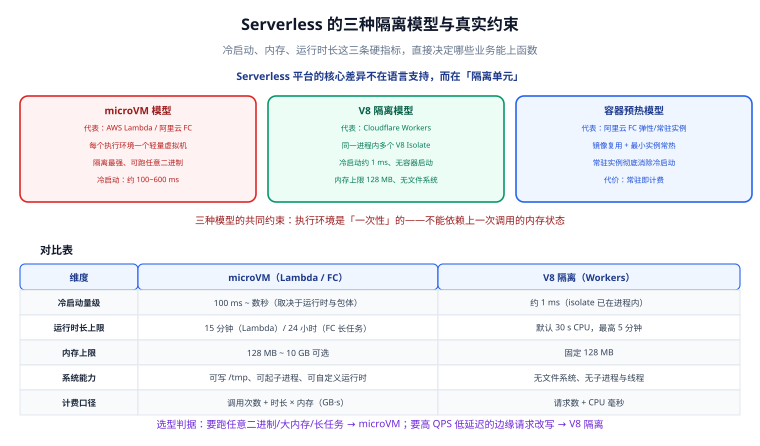

# Serverless 与函数计算

**函数即服务（Function as a Service，FaaS）是「按事件触发的、你不管理服务器的计算单元」。** 它最吸引人的不是「没有服务器」，而是**缩到零**——没有流量时你几乎不付钱；最让人头疼的也不是部署，而是**冷启动**与**执行环境复用不可依赖**。本页讲清 FaaS 的本质、三种隔离模型、事件源与平台差异，并给出一个可部署可验证的完整 HTTP 函数。



## 1. FaaS 的本质：三个特征

抛开各家实现细节，FaaS 一定有这三个特征，缺一个就不算：

1. **事件驱动**：函数不会自己运行，必须由事件触发——HTTP 请求、对象上传、消息入队、定时器、数据库变更。
2. **弹性伸缩到零**：并发请求来多少，平台起多少个实例；没有请求时实例数可以是 0。
3. **按用量计费**：计费口径是「请求次数 + 计算时长（或 CPU 时间）」，不是「机器开机时长」。

这不只是「便宜」，而是**成本结构与流量结构对齐**了：流量为零时成本为零，流量突增时自动扩容。代价是**你失去了对执行环境的长期假设**——不能假设进程一直在、不能依赖本地磁盘、不能假设下一次请求还是同一个实例。

## 2. 三种隔离模型

平台用什么技术把不同租户的执行环境隔开，直接决定了冷启动速度、内存上限和能跑什么语言。目前主流是三种：

### 2.1 microVM 隔离

以 **AWS Lambda**、阿里云函数计算的无服务器实例为代表。每个执行环境是一个轻量虚拟机（Firecracker 之类的 microVM），内核级隔离，安全性最高。

- 优点：隔离强、可以跑任意语言与原生二进制、内存上限大。
- 缺点：启动要拉起内核 + 用户态运行时，冷启动在**数百毫秒到数秒**量级。

### 2.2 V8 isolate 隔离

以 **Cloudflare Workers** 为代表——代码跑在 **V8 isolate（运行时 workerd）** 里，多个租户共享同一个 V8 进程，用 isolate 做逻辑隔离。

- 优点：**冷启动约 1 毫秒量级**，因为不需要拉起进程或内核。
- 缺点：**每个 isolate 内存上限 128 MB**、只支持 JavaScript / TypeScript（及编译到 WASM 的语言）、部分 Node.js 内置模块只提供桩实现。

### 2.3 容器预热 / 常驻实例

不是「冷启动优化」，而是**直接不让你冷启动**：平台预先拉起一批容器实例并保持常驻，请求来了直接分配。

- AWS Lambda 的**预置并发（Provisioned Concurrency）**：按你设定的并发数提前初始化执行环境。
- 阿里云函数计算的**常驻实例**：需预购常驻资源池（截至 2026-09 仅 GPU 函数支持），彻底无冷启动。
- 阿里云函数计算的**最小实例数 ≥ 1**：弹性实例的轻量预热，成本低于常驻实例。
- **SnapStart**（AWS Lambda）：把初始化后的内存快照存下来，冷启动时直接恢复快照。**最初只支持 Java（2022 年推出），后续扩展到 Python 与 .NET**；其余运行时（如 Node.js）只能靠预置并发消除冷启动。

### 2.4 三种模型横向对比

| 维度 | microVM（Lambda / FC 弹性实例） | V8 isolate（Workers） | 容器预热 / 常驻（预置并发 / 常驻实例） |
| --- | --- | --- | --- |
| 隔离级别 | 内核级 | 进程内逻辑隔离 | 内核级（容器） |
| 典型冷启动 | 数百 ms ~ 数秒 | 约 1 ms 量级 | 0（已初始化） |
| 内存上限 | 可配到数 GB | **每 isolate 128 MB** | 取决于机型，可达数 GB |
| 语言支持 | 任意语言 / 原生二进制 | JS / TS / WASM 为主 | 任意语言 |
| 适用场景 | 通用后端、与 VPC 内资源集成 | 边缘计算、API 网关、轻量鉴权 | 对延迟敏感的核心路径 |
| 计费 | 请求数 + 时长 | 请求数 + **CPU 时间** | 额外为预置容量付费 |

:::info 为什么 Workers 按「CPU 时间」计费
因为 V8 isolate 的「挂起等待」几乎不占资源——函数在等 `fetch` 返回时，CPU 是空闲的。所以 Cloudflare 只对真正消耗 CPU 的时间计费，等待 I/O 的时间不算。这也是 Workers 免费版「每次请求 CPU 上限 10 ms」仍然能跑不少业务的原因（**1**0ms 是 CPU 时间，不是墙钟时间）。
:::

## 3. 事件源类型清单

FaaS 的能力边界很大程度上取决于「平台支持哪些事件源」。常见五类：

| 事件源 | 触发方式 | 典型用途 | 注意事项 |
| --- | --- | --- | --- |
| **HTTP** | API 网关 / 内置路由 / Workers Router | REST API、Webhook 接收 | 冷启动直接暴露给用户，需预热或预置并发 |
| **对象存储** | 对象上传 / 删除事件通知 | 图片转码、日志解析、病毒扫描 | 事件可能重复投递，**必须幂等** |
| **消息队列** | 队列消息到达 | 削峰填谷、异步解耦 | 需处理批次失败与死信队列（DLQ） |
| **定时任务** | Cron / 定时触发器 | 清理、对账、报表 | 单次执行要控制在平台上限内 |
| **数据库变更流** | CDC / 变更流 | 索引同步、缓存失效、审计 | 顺序性与重复消费要额外设计 |

:::warning 事件源不等于「至少一次」或「恰好一次」
多数平台的对象存储事件与队列投递是**至少一次（at-least-once）**语义：同一个事件可能被投递两次。所以**幂等不是优化项，是正确性要求**。幂等的具体做法见[云函数工程化](../FunctionEngineering/index.md)。
:::

## 4. 主流平台对照

以下事实**截至 2026-09 核对**，具体以各家官网为准：

| 维度 | AWS Lambda | Cloudflare Workers | 阿里云函数计算 FC 3.0 |
| --- | --- | --- | --- |
| 隔离模型 | microVM（Firecracker） | V8 isolate（workerd） | microVM / 容器 |
| 单次执行上限 | **15 分钟** | 免费版 CPU 10 ms/请求；<br/>付费版 CPU 默认 30 s、最高可配 5 min；<br/>Cron Triggers 与 Queue Consumers 最长 15 min | 长任务最长 **24 小时** |
| 内存 / CPU 上限 | 可配到数 GB | 每 isolate **128 MB** | CPU 函数用弹性实例；<br/>GPU 函数支持弹性 / 常驻 / 混合 |
| Node.js 运行时 | `nodejs22.x`（EOL 2027-04）、<br/>`nodejs24.x`（EOL 2028-04）；<br/>`nodejs20.x` 已于 2026-04-30 进入第一阶段弃用、<br/>2026-08-31 起禁止创建新函数 | 内置 JS 运行时（`compatibility_date` 控制行为） | 按官方 Node.js 运行时列表 |
| Python 运行时 | `python3.12` / `python3.13` / `python3.14` 可用；<br/>`python3.9`、`python3.10` 已弃用 | — | 按官方运行时列表 |
| 其他运行时 | Java 21/25、.NET 8/10、Ruby 3.2~4.0、<br/>`provided.al2023`（自定义运行时） | WASM | 多语言运行时 + 自定义容器 |
| 消除冷启动 | SnapStart（Java/Python/.NET）、<br/>预置并发（全部运行时） | 冷启动本身约 1 ms，通常无需预热 | 弹性实例最小实例数 ≥ 1、<br/>浅休眠、常驻实例（GPU） |
| 计费口径 | 请求数 + GB-秒 | 请求数 + CPU 毫秒 | **CU（Compute Unit）**，阶梯单价 |
| 免费 / 起步价 | 按量，无月费 | 免费版 10 万请求/天；<br/>付费 5 美元/月起含 1000 万请求 + 3000 万 CPU 毫秒 | 按量，无月费 |

**Cloudflare Workers 计费补充**（截至 2026-09 核对）：付费版超出套餐后，**每百万请求 0.30 美元、每百万 CPU 毫秒 0.02 美元**。

**架构选择建议**：

- 需要访问 VPC 内数据库、需要大内存、需要任意语言 → **Lambda / FC**。
- 边缘鉴权、A/B 路由、轻量 API、把逻辑推到离用户最近的地方 → **Workers**。
- 需要 GPU、需要长任务（最长 24 小时）、需要国内合规与低延迟 → **FC**。

## 5. 冷启动与计费的挂钩关系

这两个概念常被分开讲，其实它们是**同一个设计决策的两面**：

| 设计选择 | 对冷启动的影响 | 对成本的影响 |
| --- | --- | --- |
| 用弹性实例、最小实例数 0 | 有冷启动 | 最省，没请求不花钱 |
| 最小实例数 ≥ 1（FC）/ 预置并发（Lambda） | 基本消除 | 为常驻容量付固定的「待机费」 |
| 选 **arm64（Graviton）** | 无影响 | **约三成更好的性价比**（Lambda 官方口径） |
| 包体更大 / 依赖更多 | 冷启动更慢 | 影响很小 |
| 把连接与客户端初始化外提到全局 | 冷启动更快 | 无明显影响 |

:::tip 一句话理解
**冷启动是「省钱」的代价，预热是「省时间」的代价。** 你不可能同时最省时间和最省钱，只能在「用户能否感知」这条线上做取舍——用户感知不到的地方，让它冷着。
:::

:::info 阿里云 FC 3.0 的计费细节（截至 2026-09 核对）
FC 3.0 已**取消旧的「服务（service）」概念**，直接创建函数，API 版本为 `2023-03-30`。CPU 函数只能用**弹性实例**；GPU 函数支持**弹性实例 / 常驻实例 / 混合模式**三种，可无损切换。弹性实例**最小实例数为 0 时按量计费、有冷启动；设为 ≥1 可预热**。**浅休眠（原闲置）**状态下 **vCPU 不计费、GPU 按 1/5 计费**。**常驻实例仅 GPU**，需预购常驻资源池，彻底无冷启动。容器镜像最大 **30 GB**，长任务最长 **24 小时**。
:::

## 6. 完整可运行的 HTTP 函数示例

下面给出一个「返回 JSON 的 HTTP 接口」，用 **AWS Lambda + Node.js** 实现，可直接部署并 curl 验证。

### 6.1 函数代码

```js [src/handler.mjs]
// 关键：客户端在 handler 外部初始化，可被同一执行环境复用
const RESPONSE_HEADERS = { "content-type": "application/json; charset=utf-8" };

/**
 * Lambda 的 HTTP 入口（由 API Gateway / Function URL 触发）
 * event 里包含请求信息，这里只演示最简形态
 */
export const handler = async (event) => {
  const name = event?.queryStringParameters?.name ?? "world";

  return {
    statusCode: 200,
    headers: RESPONSE_HEADERS,
    body: JSON.stringify({
      message: `hello, ${name}`,
      runtime: process.version,          // 便于确认实际运行时版本
      arch: process.arch,                // arm64 说明命中了 Graviton
      requestId: event?.requestContext?.requestId ?? "local",
    }),
  };
};
```

### 6.2 部署描述文件（AWS SAM）

```yaml [template.yaml]
AWSTemplateFormatVersion: "2010-09-09"
Transform: AWS::Serverless-2016-10-31
Description: cloudnative demo - hello function

Globals:
  Function:
    Timeout: 10                 # 秒；业务不要贴着 15 分钟上限写
    MemorySize: 256             # MB，先给保守值，用压测再调
    Architectures:
      - arm64                   # Graviton，性价比约高三成
    Runtime: nodejs22.x         # 截至 2026-09 支持的 Node 运行时

Resources:
  HelloFunction:
    Type: AWS::Serverless::Function
    Properties:
      Handler: src/handler.handler
      CodeUri: ./
      FunctionUrlConfig:
        AuthType: NONE          # 演示用；生产请改成 AWS_IAM 或接 API Gateway
```

### 6.3 部署与调用验证

```shell
# 1. 构建并部署（需已配置 AWS 凭证）
sam build
sam deploy --guided \
  --stack-name cloudnative-hello \
  --region ap-southeast-1 \
  --resolve-s3

# 2. 取出函数 URL
aws lambda get-function-url-config \
  --function-name cloudnative-hello-HelloFunction-xxxxxxxx \
  --query FunctionUrl --output text
# 预期输出（形如）：
# https://abcdefg1234.lambda-url.ap-southeast-1.on.aws/

# 3. 调用验证
curl -s "https://abcdefg1234.lambda-url.ap-southeast-1.on.aws/?name=cloudnative"
```

**预期输出**：

```json
{
  "message": "hello, cloudnative",
  "runtime": "v22.x.x",
  "arch": "arm64",
  "requestId": "5f9c2b1a-3d4e-4c7a-9f01-1a2b3c4d5e6f"
}
```

### 6.4 等价的最小 Workers 实现

边缘场景用 Workers 更直接。**截至 2026-09 核对**：当 `compatibility_date` 为 **2026-08-04 及以后**时，`nodejs_compat` 与 `nodejs_compat_v2` **默认开启**。

```js [src/worker.js]
export default {
  async fetch(request) {
    const url = new URL(request.url);
    const name = url.searchParams.get("name") ?? "world";

    return Response.json({
      message: `hello, ${name}`,
      colo: request.cf?.colo ?? "local", // 命中的边缘节点
    });
  },
};
```

```toml [wrangler.toml]
name = "cloudnative-hello"
main = "src/worker.js"
compatibility_date = "2026-08-04"   # 该日期起 nodejs_compat 默认开启
```

```shell
npx wrangler deploy
# 预期输出（形如）：
# Uploaded cloudnative-hello (1.23 sec)
# Deployed cloudnative-hello triggers (0.45 sec)
#   https://cloudnative-hello.<你的子域>.workers.dev

curl -s "https://cloudnative-hello.<你的子域>.workers.dev/?name=edge"
# 预期：{"message":"hello, edge","colo":"SIN"}
```

:::warning Workers 内置模块的边界
`node:buffer`、`node:crypto`、`node:stream`、`node:events`、`node:path`、`node:url` 等可用；但 `node:child_process`、`node:cluster`、`node:worker_threads`、`node:vm`、`node:dgram`、`node:http2` 是**「能 import 但不能用」的桩**。压缩后包体上限已放宽到 **64 MiB**。需要状态时通过**绑定（bindings）**访问 KV、R2、D1（官方建议 **10 GB 以内**）、Queues、Durable Objects、Hyperdrive。
:::

## 7. 常用清单

### 7.1 触发器与集成

- HTTP：函数 URL / API 网关 / Workers 路由。
- 对象存储：上传、删除、批量操作事件。
- 消息：队列 / 主题订阅，注意配死信队列。
- 定时：Cron / 定时触发器，注意时区与执行上限。
- 数据库变更流：CDC 流触发，注意顺序性。
- 其他：邮件接收、日志订阅、CI 事件、IoT 消息。

### 7.2 关键配置项

- 运行时版本与架构（`arm64` 优先）。
- 超时（`Timeout`）：留出下游调用的余量。
- 内存（`MemorySize`）：影响 CPU 配额与单价。
- 并发上限：防止故障时打爆下游数据库。
- 预置并发 / 最小实例数：只在用户可感知的路径上开。
- 环境变量与密钥：用平台的密钥服务，不要硬编码。

## 8. 易错点与建议

:::danger 四个高频错误
1. **在模块顶层做耗时初始化，却指望它省钱**：模块顶层代码在每次冷启动时都会执行。正确做法是把**无副作用、可复用**的客户端（SDK、连接池）放顶层，把**有副作用、依赖时效**的读操作（如读特征开关）放到 handler 里带缓存。
2. **把运行时版本写死在文档里不更新**：`nodejs20.x` 在 Lambda 上已于 **2026-04-30** 进入第一阶段弃用、**2026-08-31** 起禁止创建新函数。正确做法是订阅官方运行时弃用公告，并把版本写进 IaC 统一升级。
3. **用函数处理长连接**：WebSocket 会话在实例被回收时会断。正确做法是把长连接交给托管容器 / 网关，函数只处理消息落库后的异步逻辑。
4. **假设事件只来一次**：对象存储与队列事件是至少一次语义。正确做法是每个副作用都带幂等键（见[云函数工程化](../FunctionEngineering/index.md)）。
:::

:::tip 三个立竿见影的优化
- 把架构切到 **arm64**，通常可拿到约三成更好的性价比，且代码几乎不用改。
- 给用户可感知的路径开**最小实例数 ≥ 1** 或**预置并发**，其余路径保持冷启动。
- 把包体做小、把连接外提，冷启动能显著变快。
:::

## 9. 验证方式

部署完成后，用压测确认冷启动与延迟是否符合预期（需已部署上面的 Hello 函数）：

```shell
# 连续 20 次调用，观察首次与后续的耗时差
for i in $(seq 1 20); do
  curl -s -o /dev/null -w "%{time_total}\n" \
    "https://abcdefg1234.lambda-url.ap-southeast-1.on.aws/?name=bench"
done
```

**预期结果**：第一次（冷启动）明显高于后续（热调用），差距即冷启动开销。**若差距超过 1 秒且该路径面向用户，就应考虑最小实例数 ≥ 1 或预置并发。**

| 检查项 | 期望 | 实测 | 结论 |
| --- | --- | --- | --- |
| `sam deploy` | 部署成功、输出函数 URL | 待填写 | ⏳ |
| `curl ...?name=cloudnative` | 返回 `hello, cloudnative` | 待填写 | ⏳ |
| `arch` 字段 | `arm64` | 待填写 | ⏳ |
| `npx wrangler deploy` | 输出 workers.dev 地址 | 待填写 | ⏳ |
| 20 次调用耗时 | 首次明显高于后续 | 待填写 | ⏳ |

## 参考资料

- AWS Lambda 开发者指南：https://docs.aws.amazon.com/lambda/latest/dg/welcome.html
- AWS Lambda 运行时支持与弃用计划：https://docs.aws.amazon.com/lambda/latest/dg/lambda-runtimes.html
- AWS Lambda SnapStart：https://docs.aws.amazon.com/lambda/latest/dg/snapstart.html
- Cloudflare Workers 文档：https://developers.cloudflare.com/workers/
- Cloudflare Workers 定价：https://developers.cloudflare.com/workers/platform/pricing/
- 阿里云函数计算 FC：https://help.aliyun.com/zh/functioncompute/
- 本专题其余章节：[云函数工程化](../FunctionEngineering/index.md) ｜ [概述与选型](../Overview/index.md) ｜ [常见问题与排错](../FAQ/index.md)
