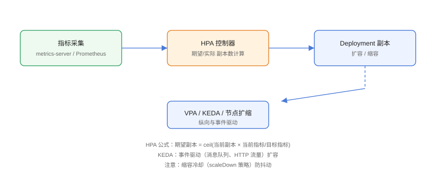

# 弹性伸缩：HPA、VPA 与 KEDA

弹性伸缩是 Kubernetes 应对流量波动的核心能力：**水平伸缩**加副本、**垂直伸缩**调资源、**集群伸缩**加节点，三者配合形成「工作负载 + 节点」两级弹性。本页覆盖 HPA、VPA、KEDA 与 Cluster Autoscaler，并给出生产推荐组合。

## 核心概念与工作原理



| 组件 | 英文 | 作用 | 维度 |
| --- | --- | --- | --- |
| 水平 Pod 自动扩缩 | HPA | 按指标增减副本数 | 工作负载 |
| 垂直 Pod 自动扩缩 | VPA | 自动调整 CPU/内存 requests | 工作负载 |
| 事件驱动自动扩缩 | KEDA | 按消息队列、HTTP 等外部指标扩缩 | 工作负载 |
| 集群自动扩缩 | Cluster Autoscaler / Karpenter | 增减节点 | 集群 |
| 节点数伸缩 | Node Autoscaler（云厂商） | 按待调度 Pod 扩缩节点组 | 集群 |

工作原理：HPA 通过 metrics API 周期性读取 Pod 指标（CPU/内存/自定义指标）→ 计算 `desiredReplicas = ceil(currentReplicas × currentValue / targetValue)` → 更新 Deployment 的 `replicas`。KEDA 则把外部事件源（Kafka、Redis、HTTP 请求数等）转换成指标喂给 HPA，实现「有事件才扩、没事件缩到零」。

## 版本现状

::: info 版本说明
Kubernetes 1.30+ 的 HPA 已原生支持 **custom metrics** 多指标缩放（GKE 自 2026-03 提供托管 custom metrics），KEDA 2.16+ 是事件驱动扩缩的事实标准。生产环境推荐 **HPA + KEDA + Cluster Autoscaler/Karpenter** 组合。
:::

## HPA：水平扩缩

### 前置条件：安装 Metrics Server

```shell
kubectl apply -f https://github.com/kubernetes-sigs/metrics-server/releases/latest/download/components.yaml

# 验证指标可用
kubectl top nodes
kubectl top pods
```

### 创建 HPA

```yaml [hpa.yaml]
apiVersion: autoscaling/v2
kind: HorizontalPodAutoscaler
metadata:
  name: web-hpa
spec:
  scaleTargetRef:
    apiVersion: apps/v1
    kind: Deployment
    name: web
  minReplicas: 2
  maxReplicas: 10
  metrics:
    - type: Resource
      resource:
        name: cpu
        target:
          type: Utilization
          averageUtilization: 60
    - type: Resource
      resource:
        name: memory
        target:
          type: Utilization
          averageUtilization: 80
  behavior:
    scaleDown:
      stabilizationWindowSeconds: 300
      policies:
        - type: Percent
          value: 10
          periodSeconds: 60
    scaleUp:
      stabilizationWindowSeconds: 0
      policies:
        - type: Percent
          value: 100
          periodSeconds: 60
```

```shell
kubectl apply -f hpa.yaml
kubectl get hpa -w
```

### 压测验证扩缩

```shell
# 开一个负载 Pod 压 Deployment
kubectl run load --rm -it --image=busybox --restart=Never \
  -- sh -c 'while true; do wget -q -O- http://web-svc/ > /dev/null; done'

# 观察副本数增长
kubectl get hpa web-hpa -w
kubectl get pods -l app=web -w

# 停止压测后观察缩容（注意 stabilization 窗口）
```

## VPA：垂直扩缩

VPA 适合**无状态且 CPU/内存需求稳定的工作负载**，它会根据历史用量推荐并自动更新 requests。注意：VPA 与 HPA 在同一指标上**不能同时开启**。

```yaml [vpa.yaml]
apiVersion: autoscaling.k8s.io/v1
kind: VerticalPodAutoscaler
metadata:
  name: web-vpa
spec:
  targetRef:
    apiVersion: apps/v1
    kind: Deployment
    name: web
  updatePolicy:
    updateMode: "Auto"
  resourcePolicy:
    containerPolicies:
      - containerName: "*"
        minAllowed:
          cpu: 100m
          memory: 128Mi
        maxAllowed:
          cpu: "2"
          memory: 2Gi
```

```shell
kubectl apply -f vpa.yaml
kubectl describe vpa web-vpa
# Recommendation 区块给出 cpu/memory 建议值
```

## KEDA：事件驱动扩缩

### 安装 KEDA

```shell
helm repo add kedacore https://kedacore.github.io/charts
helm repo update
helm install keda kedacore/keda --namespace keda --create-namespace
```

### 按 HTTP 请求数扩缩

```yaml [keda-http.yaml]
apiVersion: keda.sh/v1alpha1
kind: ScaledObject
metadata:
  name: web-scaledobject
spec:
  scaleTargetRef:
    name: web
  minReplicaCount: 1
  maxReplicaCount: 20
  triggers:
    - type: prometheus
      metadata:
        serverAddress: http://prometheus.monitoring:9090
        metricName: http_requests_total
        query: sum(rate(http_requests_total{service="web"}[2m]))
        threshold: "50"
```

### 按消息队列长度扩缩（Kafka 示例）

```yaml [keda-kafka.yaml]
apiVersion: keda.sh/v1alpha1
kind: ScaledObject
metadata:
  name: consumer-scaledobject
spec:
  scaleTargetRef:
    name: consumer
  minReplicaCount: 0
  maxReplicaCount: 30
  pollingInterval: 10
  cooldownPeriod: 120
  triggers:
    - type: kafka
      metadata:
        bootstrapServers: kafka-broker:9092
        topic: orders
        lagThreshold: "100"
        consumerGroup: orders-group
```

关键点：`minReplicaCount: 0` 表示消息积压才启动消费者，空闲时缩到零，省资源省钱。

## 集群级扩缩：Cluster Autoscaler 与 Karpenter

### Cluster Autoscaler

```shell
# AWS EKS 安装示例
helm repo add autoscaler https://kubernetes.github.io/autoscaler
helm install cluster-autoscaler autoscaler/cluster-autoscaler \
  --namespace kube-system \
  --set autoDiscovery.clusterName=my-cluster \
  --set awsRegion=ap-southeast-1
```

工作方式：Pod 因资源不足 Pending → CA 检测到不可调度 Pod → 扩容节点组 → 调度成功；节点长期低利用率时缩容。

### Karpenter（AWS 等云厂商）

Karpenter 按**实际 Pod 需求**直接创建最合适的实例类型，比节点组粒度更细、启动更快：

```yaml [karpenter-nodepool.yaml]
apiVersion: karpenter.sh/v1
kind: NodePool
metadata:
  name: default
spec:
  template:
    spec:
      requirements:
        - key: kubernetes.io/arch
          operator: In
          values: ["amd64"]
        - key: karpenter.sh/capacity-type
          operator: In
          values: ["on-demand"]
  disruption:
    consolidationPolicy: WhenUnderutilized
    expireAfter: 720h
```

## 伸缩策略与稳定性

HPA `behavior` 是生产必备：通过 `stabilizationWindowSeconds` 防止抖动，通过 `policies` 控制单次扩缩速度。

| 场景 | 推荐配置 |
| --- | --- |
| 促销秒杀 | `scaleUp` 策略 100%/30s，关掉缩容稳定窗口 |
| 日常业务 | 缩容稳定窗口 300s，扩容 100%/60s |
| 消息积压 | KEDA `minReplicaCount: 0` + 快速扩容 |
| 夜间低峰 | 缩容到 minReplicas，配合 CronScaledObject 定时 |

## 易错点与最佳实践

::: danger 常见问题
1. **HPA 不生效但 `kubectl top` 正常**：HPA 依赖 metrics.k8s.io API，Metrics Server 未就绪或 RBAC 缺失都会导致 `unable to fetch metrics`。
2. **CPU 与内存目标一起设置但 Pod 无 limits**：利用率按 requests 计算，requests 缺失时指标无法正确换算。给容器显式声明 requests/limits。
3. **VPA 与 HPA 同时控 CPU**：两者同时调节同一指标会互相打架。要么只用 HPA，要么 VPA 只调内存。
4. **缩容过快导致雪崩**：缩容稳定窗口太短，流量一降就砍副本，回升时又来不及扩容。保留 5~10 分钟稳定窗口。
5. **只看工作负载不看节点**：Pod 扩了但节点没扩，新副本一直 Pending。集群级伸缩必须配套。
:::

::: tip 最佳实践
- 先给容器设置**合理的 requests**：它是 HPA 与调度的基础，设置过小会让节点超卖。
- 扩容快、缩容慢：扩容用 100%/60s，缩容用 10%/5min，兼顾响应速度与稳定性。
- 用 **KEDA ScaledObject** 统一管理「事件型工作负载」，把 `minReplicaCount` 设为 0 省成本。
- 用 `kubectl describe hpa` 看事件（`SuccessfulRescale`/`FailedGetResourceMetric`）排查扩缩异常。
- 为关键服务设置**最小副本数**（至少 2，跨节点分布），防止单点故障。
:::

## 实战：完整弹性闭环

```shell
# 1. 创建带 requests/limits 的 Deployment
kubectl apply -f - <<'EOF'
apiVersion: apps/v1
kind: Deployment
metadata:
  name: web
spec:
  replicas: 2
  selector:
    matchLabels: {app: web}
  template:
    metadata:
      labels: {app: web}
    spec:
      containers:
        - name: web
          image: nginx:1.27
          resources:
            requests: {cpu: 200m, memory: 256Mi}
            limits: {cpu: "1", memory: 1Gi}
          ports:
            - containerPort: 80
EOF

# 2. 创建 Service 与 HPA
kubectl expose deploy web --port=80 --target-port=80
kubectl apply -f hpa.yaml

# 3. 压测 10 分钟
kubectl run load --rm -it --image=busybox --restart=Never \
  -- sh -c 'while true; do wget -q -O- http://web > /dev/null; done'

# 4. 观察（另开终端）
kubectl get hpa web-hpa -w
kubectl get pods -l app=web -w

# 5. 停止压测，等待缩容回 minReplicas
kubectl get hpa web-hpa
```

## 验证方式

```shell
# HPA 状态
kubectl get hpa web-hpa -o yaml
kubectl describe hpa web-hpa | tail -20

# 指标可用性
kubectl get --raw /apis/metrics.k8s.io/v1beta1/pods | head

# KEDA 状态
kubectl get scaledobject -n keda
kubectl get scalers -n keda

# 节点伸缩日志（Cluster Autoscaler）
kubectl logs -n kube-system deploy/cluster-autoscaler --tail=50
```

预期：压测时 `desiredReplicas` 上升至 10，停止后 5 分钟窗口内回落到 2；KEDA 页面显示 trigger 阈值与当前值。

## 参考资料

- Kubernetes HPA 文档：<https://kubernetes.io/docs/tasks/run-application/horizontal-pod-autoscale/>
- VPA 文档：<https://github.com/kubernetes/autoscaler/tree/master/vertical-pod-autoscaler>
- KEDA 官方文档：<https://keda.sh/docs/>
- Karpenter 文档：<https://karpenter.sh/docs/>
