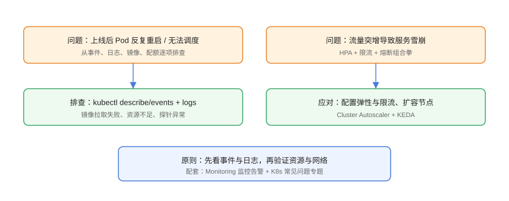

# 常见问题与最佳实践

本页汇总容器编排进阶专题的高频问题：从「Helm 装完资源不存在」「HPA 不伸缩」「Istio 配置不生效」到「多集群切换失手」，给出排查顺序与结论。每个问题遵循「现象 → 排查 → 解决 → 验证」的结构。

## 问题排查总览



## Helm 相关问题

### Q1：`helm install` 成功但资源没创建

**排查**：

```shell
helm status myapp -n demo
helm get manifest myapp -n demo | kubectl apply --dry-run=client -f - 2>&1
kubectl -n demo get events --sort-by=.lastTimestamp
```

**原因与解决**：

1. 模板条件不满足：模板里的 `ingress.enabled` 判断为 false，资源被跳过。检查 `helm template` 输出。
2. 命名空间不一致：资源装到了默认命名空间。`helm install -n demo` 并确认所有资源都有 `namespace`。
3. 校验失败被 API Server 拒绝：看 events 中的 `FailedCreate`。

**验证**：`kubectl -n demo get all` 能看到预期资源，`helm status` 为 `deployed`。

### Q2：升级后想回到上一个版本

```shell
helm history myapp -n demo
helm rollback myapp <修订号> -n demo
kubectl -n demo rollout status deployment/myapp
```

**最佳实践**：生产升级使用 `--atomic --timeout 5m`，失败自动回滚；回滚后立即确认监控无异常。

### Q3：values 改了但升级没生效

检查是不是 **`--set` 优先级最高**导致覆盖了 values 文件，或者模板里写死了值：

```shell
# 查看最终生效的配置
helm get values myapp -n demo
helm get manifest myapp -n demo | grep -A5 "image:"
```

## Operator 相关问题

### Q4：CR 创建了但控制器没反应

**排查**：

```shell
kubectl get crd | grep <你的资源>
kubectl describe <kind> <name>
kubectl -n <operator-ns> logs deploy/<operator> --tail=100
```

**常见原因**：

1. CRD 未注册（`kubectl get crd` 为空）——先 apply CRD。
2. 控制器权限不足（RBAC 缺 resources/verbs）——`kubectl auth can-i list <kind> --as=system:serviceaccount:<ns>:<sa>`。
3. 控制器 watch 的 API 组与 CRD 不一致——检查 `group` 字段。

### Q5：调谐循环空转 / CPU 飙升

**解决**：

1. 确认没有自触发事件（更新子资源触发 watch）。
2. 设置 `MaxConcurrentReconciles` 与限速器。
3. 用 `ctrl.Logger` 输出关键状态，避免每次 Reconcile 重复做全量工作。

## 服务网格相关问题

### Q6：Sidecar 注入后业务访问失败

**排查顺序**：

```shell
kubectl logs deploy/<app> -c istio-proxy --tail=50
istioctl proxy-status
istioctl analyze
```

**常见原因**：

1. mTLS STRICT 但对方未注入 Sidecar。
2. AuthorizationPolicy 未放行该来源。
3. 目标服务名/端口与 VirtualService 不匹配。

### Q7：灰度流量比例不对

检查 **DestinationRule subset 标签**与 Pod 标签是否一致：

```shell
kubectl get pods --show-labels | grep version
kubectl get destinationrule -o yaml
istioctl analyze | grep -i subset
```

## 弹性伸缩相关问题

### Q8：HPA 一直显示 `<unknown>`

```shell
kubectl describe hpa web-hpa
kubectl get --raw /apis/metrics.k8s.io/v1beta1/pods
```

**原因**：Metrics Server 未装或未就绪、RBAC 缺失、容器没有 requests。修复后等 1~2 个采集周期（15s×N）再看。

### Q9：扩容后 Pod 一直 Pending

```shell
kubectl describe pod <pending-pod> | tail -20
kubectl top nodes
```

**原因**：节点资源不足。方案：

1. 装 Cluster Autoscaler/Karpenter；
2. 检查 `nodeSelector`/`taints` 是否排除了可用节点；
3. 检查 PVC 是否只能绑定到特定可用区。

### Q10：缩容太慢 / 太快

通过 HPA `behavior` 调节稳定窗口与速率：

```yaml
behavior:
  scaleDown:
    stabilizationWindowSeconds: 600   # 调大→缩容更稳
  scaleUp:
    stabilizationWindowSeconds: 0
```

## GitOps 相关问题

### Q11：Argo CD 显示 OutOfSync 但同步后马上又 OutOfSync

**原因**：集群资源被外部修改（有人 kubectl edit、webhook 注入默认值）。排查：

```shell
argocd app diff web
kubectl -n web get deploy web -o yaml | grep -i "replicas\|image"
```

**解决**：启用 `selfHeal` 并约定「集群只读」；有 webhook 注入时使用 `ServerSideApply` 与 `Replace=true` 对比。

### Q12：Secret 不该进 Git，怎么管理？

方案选型：

| 方案 | 原理 | 适合 |
| --- | --- | --- |
| sealed-secrets | 公钥加密，集群内解密 | 小团队、快速落地 |
| SOPS + KMS | 加密 Git 中的文件 | 需要审计与多云 |
| External Secrets Operator | 从云密钥管理同步 | 已用云厂商密钥 |
| Vault | 动态密钥、租约 | 中大规模企业 |

## 多集群与容灾相关问题

### Q13：主集群故障，流量切不过去

**排查清单**：

1. GSLB 健康检查是否把主集群摘除（检查 DNS 解析结果）。
2. 备集群数据是否就绪（延迟/只读校验）。
3. 备集群的 Ingress/证书是否与域名匹配。
4. 是否做过真实演练——没演练过的容灾等于没有容灾。

### Q14：跨集群访问 Service 404

```shell
# 确认 ServiceExport/ServiceImport 状态
kubectl get serviceexport,serviceimport -A
# 确认 MCS 控制器与网格版本支持
kubectl describe serviceimport web -n default
```

## 安全相关问题

### Q15：Pod 启动被 PSA restricted 拒绝

```shell
kubectl run bad --image=nginx --restart=Never -n web --privileged
# admission webhook ... violates restricted
```

**解决**：给容器补 `securityContext`（runAsNonRoot、drop ALL、只读根文件系统），确需特权的组件单独放到豁免命名空间，并记录理由。

### Q16：镜像扫描出 CRITICAL 但业务急着上线

**处理原则**：

1. 区分「可缓解」与「可利用」：结合运行上下文评估。
2. 临时放行要登记豁免（owner + 到期时间），在文档库记录。
3. 长期方案：升级基础镜像、加运行时检测（Falco）兜底。

## 通用最佳实践清单

::: tip 生产环境清单
- 所有应用走 Helm Chart + GitOps 单一来源，禁止 kubectl 直改生产。
- HPA 给足 `behavior` 稳定窗口，扩容快、缩容慢。
- 每个命名空间有 NetworkPolicy 默认拒绝 + PSA restricted。
- 镜像 CI 门禁：scan + sign + verify 全链路。
- 关键服务最小副本数 2，跨节点分布。
- 每季度一次真实容灾演练，演练后写复盘。
- 构建前 `pnpm docs:build` 类似的道理：上线前本地验证，别把问题带到生产。
:::

## 参考资料

- Helm FAQ：<https://helm.sh/docs/faq/>
- Kubernetes 故障排查：<https://kubernetes.io/docs/tasks/debug/>
- Istio 排障：<https://istio.io/latest/docs/ops/diagnostic-tools/>
- Argo CD 排障：<https://argo-cd.readthedocs.io/en/stable/operator-manual/troubleshooting/>
