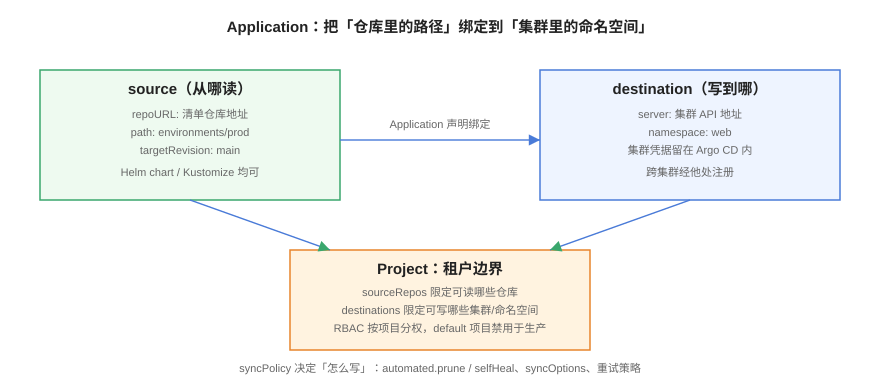

# Argo CD：安装与核心对象



Argo CD 是目前采用率最高的 GitOps 控制器：有 Web UI、有成熟的 Application/ApplicationSet 模型、CNCF 毕业项目。本页覆盖安装、核心对象的逐字段解释、同步策略与 RBAC，并把「单页入门版」的漂移自愈演练扩成可反复执行的完整流程。

## 版本与安装

::: info 版本口径（2026-10）
主线 **3.5**（3.5.3 / 2026-09-14），3.4 与 3.3 维护中，**3.2 已于 2026-08-04 EOL**。Argo CD 每季度发一个 minor（2/5/8/11 月的首个周二），**仅最近 3 个 minor 收补丁**。3.6 计划 2026-11-03 GA。内置 Helm 4.2.1、Kustomize 5.8.1，测试过的 Kubernetes 为 1.33~1.36。
:::

```shell
# 官方 Helm Chart 安装（生产推荐，参数可版本化）
helm repo add argo https://argoproj.github.io/argo-helm
helm repo update
kubectl create ns argocd
helm install argocd argo/argo-cd \
  --namespace argocd \
  --set server.service.type=LoadBalancer \
  --set configs.params."server\.insecure"=true

# 获取初始管理员密码
kubectl -n argocd get secret argocd-initial-admin-secret \
  -o jsonpath="{.data.password}" | base64 -d

# 安装 CLI 并登录，登录后立即改密码
curl -sSL -o argocd https://github.com/argoproj/argo-cd/releases/latest/download/argocd-linux-amd64
sudo install -m 555 argocd /usr/local/bin/argocd
argocd login <SERVER-ADDRESS> --insecure
argocd account update-password
```

::: danger 安装易错点
1. **初始密码 Secret 用完即删**：`argocd-initial-admin-secret` 改密码后应删除，避免新成员用初始凭据进来。
2. **`server.insecure=true` 只在 TLS 由 Ingress 终结时使用**：直连暴露 80 端口等于明文传管理凭据。
3. **生产不要用 `latest` 镜像 tag**：Helm Chart 版本与 App 版本一起锁死，升级按 minor 逐个走。
:::

## 核心对象：Application

Application 是 Argo CD 的原子单元，回答两个问题——**从哪读**（source）、**写到哪**（destination）：

```yaml [application.yaml]
apiVersion: argoproj.io/v1alpha1
kind: Application
metadata:
  name: web
  namespace: argocd
spec:
  project: default
  source:
    repoURL: https://github.com/example/app-manifests.git
    targetRevision: main
    path: environments/prod
  destination:
    server: https://kubernetes.default.svc
    namespace: web
  syncPolicy:
    automated:
      prune: true        # Git 中删除的资源会从集群删除
      selfHeal: true     # 集群被手工改动后自动改回
      allowEmpty: false  # Git 变成空目录时禁止同步（防误删整个环境）
    syncOptions:
      - CreateNamespace=true
      - ServerSideApply=true
    retry:
      limit: 3
      backoff: {duration: 5s, factor: 2, maxDuration: 3m}
```

| 字段 | 作用 | 生产建议 |
| --- | --- | --- |
| `project` | 隔离边界 | 禁止生产用 `default`，见下节 |
| `source.targetRevision` | 跟踪哪个分支/标签 | 生产跟 tag 或受保护分支，不要跟 `HEAD` |
| `automated.prune` | Git 删了集群也删 | 先在 dev 验证；关闭会导致资源残留越积越多 |
| `automated.selfHeal` | 漂移自动恢复 | 开启后必须配合「集群只读」的团队纪律 |
| `syncOptions` | 同步行为微调 | `ServerSideApply=true` 应对大对象与字段归属冲突 |

## 核心对象：Project

AppProject 是**多租户边界**——它限定一个项目能读哪些仓库、能写哪些集群和命名空间：

```yaml [project-blog.yaml]
apiVersion: argoproj.io/v1alpha1
kind: AppProject
metadata:
  name: blog
  namespace: argocd
spec:
  sourceRepos:
    - https://github.com/example/blog-config.git
  destinations:
    - server: https://kubernetes.default.svc
      namespace: blog-*
  clusterResourceWhitelist: []      # 不允许动集群级资源
  namespaceResourceBlacklist:
    - group: ""
      kind: ResourceQuota
  roles:
    - name: developer
      policies:
        - p, proj:blog:developer, applications, sync, blog/*, allow
      groups:
        - blog-devs
```

没有 Project 约束的 Application 可以读任意仓库、写任意命名空间——**任何一个人配置失误，都能把别人的环境覆盖掉**。

## 漂移检测与自愈

```shell
# 演示漂移：绕过 Git 直接改副本数（模拟有人在集群里手工 kubectl scale）
kubectl -n web scale deploy/web --replicas=9

# 观察 Argo CD 检测到漂移
argocd app get web
# STATUS: OutOfSync，差异详情里能看到 replicas: desired=3 actual=9

# selfHeal 开启时，控制器会在同步窗口内把副本数改回 Git 声明的值
kubectl -n web get deploy web -o jsonpath='{.spec.replicas}'
# 期望：3
```

漂移不总是「有人手贱」：HPA 会动态改副本数、Webhook 准入控制器会注入 sidecar。对这类**合法漂移**要显式忽略，否则自愈会和它们打架：

```yaml [ignore-differences.yaml]
spec:
  ignoreDifferences:
    - group: apps
      kind: Deployment
      jsonPointers: ["/spec/replicas"]   # 交给 HPA 管理，不参与 diff
    - group: apps
      kind: Deployment
      managedFieldsManagers: [kube-controller-manager]
```

## 关闭自动同步时的操作

```shell
argocd app sync web                          # 手动同步
argocd app sync web --prune                  # 连带清理已删除资源
argocd app sync web --revision <commit>      # 同步到指定提交
argocd app wait web --health --timeout 120   # 等待健康
```

生产环境推荐 **prod 关 automated、dev 开 automated**：dev 快速收敛，prod 的每次同步由「合并 PR」这个动作触发人工确认。

## RBAC 与账号纪律

```shell
# 为每个真人建本地账号（或对接 OIDC/SSO）
argocd account list
argocd rbac can blog-devs sync blog/* --project blog
```

三条纪律：

1. **admin 只留给平台组**，业务团队按 Project 授权；
2. **API 凭据按人/按机器人发放**，共享账号出了事查不到人；
3. **审计日志接进告警**：`argocd-server` 的访问日志出现 sync/rollback 动作时推送通知。

## 易错点与最佳实践

::: danger 六个高频坑
1. **`prune: false` + 长期不清理**：Git 里删掉的清单永远留在集群，半年后没人知道哪些资源是「活的」。先开 dev，prod 在变更窗口内手动 `sync --prune` 一次观察。
2. **Self-Heal 与手工运维拉锯**：有人坚持 `kubectl edit`，3 分钟后被改回，然后抱怨「Argo CD 有 bug」。这是约定不是 bug——所有变更走 Git。
3. **忘配 `ignoreDifferences`**：HPA 调副本、mutating webhook 注入字段被当成漂移反复纠正，应用反复滚动重启。
4. **大对象用 client-side apply 报错**：CRD 过大时改用 `ServerSideApply=true`。
5. **Application 全堆在 `default` Project**：没有边界就没有权限管理，出事故互相牵连。
6. **用 `latest` tag 跟踪 chart**：上游 chart 一更新集群就跟着变，而 Git 里什么都没改——事实源名存实亡。
:::

::: tip 最佳实践
- 每个 Application 的 `targetRevision` 锁定受保护分支或 tag；
- 把 Argo CD 自身的安装也写进 Git（Helm values 入库），用「App of Apps」或 ApplicationSet 管理 Argo CD 管的 Application；
- 定期巡检：`argocd app list -o name | wc -l` 与预期对比，失管 Application 是腐化的起点。
:::

## 验证方式

```shell
argocd app list                                   # 期望：目标应用全部 Synced/Healthy
argocd app get web                                # 期望：Sync Status: Synced
kubectl -n web scale deploy/web --replicas=9 && sleep 200
kubectl -n web get deploy web -o jsonpath='{.spec.replicas}'
# 期望（selfHeal 开启）：3 —— 漂移在自愈窗口内被纠正
argocd app history web                            # 期望：能看到每次同步的修订记录
```

## 相关页面

- 没有界面的另一条路线：[Flux：另一条主线](../FluxCD/index.md)
- 多环境多集群：[ApplicationSet 与配置仓库设计](../RepoStructure/index.md)
- 发布编排：[渐进发布与回滚](../ProgressiveDelivery/index.md)

## 参考资料

- Argo CD 官方文档：<https://argo-cd.readthedocs.io/>
- AppProject 说明：<https://argo-cd.readthedocs.io/en/stable/operator-manual/declarative-bootstrapping/>
- RBAC 配置：<https://argo-cd.readthedocs.io/en/stable/operator-manual/rbac/>
