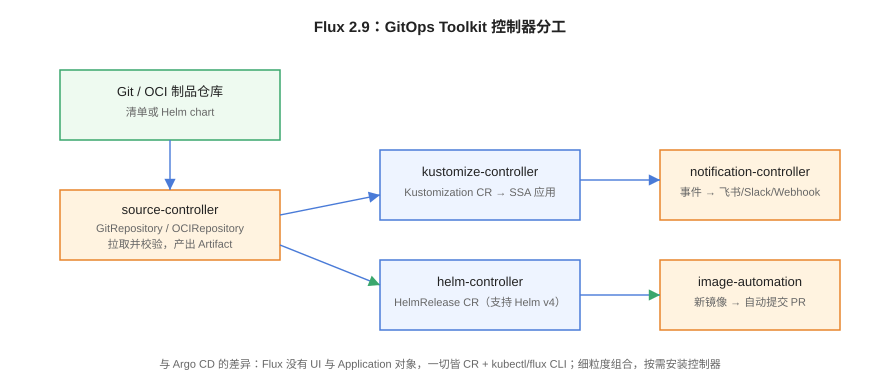

# Flux：另一条主线



Flux 是 CNCF 毕业项目、GitOps 的另一条主线：没有 Web UI、没有 Application 对象，一切皆 CRD + `kubectl`/`flux` CLI。它把 GitOps 拆成一组可独立安装、可自由组合的控制器（GitOps Toolkit），适合喜欢声明式一切、把 GitOps 当平台能力内嵌的团队。

## 版本口径（2026-10）

::: info
主线 **Flux 2.9**（v2.9.5 / 2026-08-31），支持 Kubernetes 1.34~1.36。2.8 与 2.7 维护中；**2.6 已随 2.9 宣布 EOL、2.5 随 2.8 宣布 EOL**。helm-controller 自 2.8 起支持 **Helm v4**；2.10 计划 2026 年 Q4 中后期（Alerting API 升 v1、SPIFFE 集成）。**升级前必须先跑 `flux migrate`** 清理已移除的 v1beta2 API，否则会被弃用 API 卡住升级。
:::

## GitOps Toolkit：控制器分工

Flux 不是单体，而是一组各司其职的控制器，每个控制器只管一类 CRD：

| 控制器 | 核心 CRD | 职责 |
| --- | --- | --- |
| source-controller | `GitRepository` / `OCIRepository` / `Bucket` | 拉取并校验源（commit 签名、制品摘要），产出 Artifact |
| kustomize-controller | `Kustomization` | 渲染 Kustomize、Server-Side Apply、依赖排序、健康评估 |
| helm-controller | `HelmRelease` | 以 Helm 方式交付（values 管理、回滚、支持 Helm v4） |
| notification-controller | `Alert` / `Provider` / `Receiver` | 事件外发（飞书/Slack/Webhook）、Webhook 触发器 |
| image-reflector / image-automation | `ImageRepository` / `ImageUpdateAutomation` | 发现新镜像 tag 并自动向 Git 提交更新 |

```shell
# 引导安装到集群（bootstrap 会同时把 Flux 自身配置写回 Git）
flux bootstrap github \
  --owner=example --repository=fleet-config --branch=main \
  --path=clusters/prod --personal

# 验证组件
flux check
flux get sources git
flux get kustomizations
```

`bootstrap` 的设计很「Flux」：**Flux 管理的第一批对象就是 Flux 自己的安装清单**，从此升级 Flux 也是一次 Git 提交。

## 最小可用示例

```yaml [kustomization.yaml]
apiVersion: kustomize.toolkit.fluxcd.io/v1
kind: Kustomization
metadata:
  name: blog
  namespace: flux-system
spec:
  interval: 5m
  sourceRef:
    kind: GitRepository
    name: fleet-config
  path: ./overlays/prod
  prune: true                      # 等价 Argo CD 的 prune
  wait: true                       # 等资源 Ready 再算成功
  timeout: 3m
  healthChecks:
    - apiVersion: apps/v1
      kind: Deployment
      name: blog
      namespace: blog-prod
```

```yaml [helmrelease.yaml]
apiVersion: helm.toolkit.fluxcd.io/v2
kind: HelmRelease
metadata:
  name: redis
  namespace: blog-prod
spec:
  interval: 10m
  chart:
    spec:
      chart: redis
      version: "20.x"              # 锁大版本，避免被动升级
      sourceRef:
        kind: HelmRepository
        name: bitnami
  values:
    architecture: standalone
```

## Argo CD 还是 Flux？

| 维度 | Argo CD | Flux |
| --- | --- | --- |
| 上手方式 | Web UI 点选，可视化 diff | 纯 CLI/YAML，没有界面 |
| 对象模型 | Application / AppProject，一个对象管一个应用 | 一组细粒度 CR，可自由组合 |
| 多租户 | Project + RBAC 较成熟 | 靠命名空间隔离与 Kubernetes 原生 RBAC |
| Helm 集成 | 渲染引擎（template 后 diff） | 原生 HelmRelease（保留 Helm 语义与回滚） |
| 依赖编排 | Sync Waves / Hooks | Kustomization 的 `dependsOn` 显式 DAG |
| 渐进发布 | 配 Argo Rollouts 同厂 | 配 Flagger（同为 Flux 生态） |
| 适用人群 | 团队想要「看得见的交付平台」 | 团队把 GitOps 当平台内建能力、一切走 Git |

::: tip 选型建议
**先看团队，再看功能**：需要给几十个业务团队一个可视化交付界面 → Argo CD；平台组自己管理集群、要求「所有东西包括控制器本身都在 Git 里」→ Flux。两者都完全满足 OpenGitOps 四原则，不存在「哪个更 GitOps」，只有「哪个更贴你的组织」。
:::

## 易错点与最佳实践

::: danger 高频坑
1. **跳版本升级被弃用 API 卡死**：2.6 → 2.9 直升会撞上 `v1beta2` API 移除。先 `flux migrate -f .` 迁移清单，再逐 minor 升控制器。
2. **`prune` 不敢开**：Flux 的 prune 与 Argo CD 语义相同——Git 里删了集群就删。不开则资源残留，开了则必须信任 Git 事实源。
3. **HelmRelease 不锁版本**：`version: "*"` 意味着 chart 一发新版集群就跟着变，违反「变更必须来自 Git 提交」。
4. **没有配 `dependsOn`**：数据库迁移与应用部署并行跑导致启动失败。用 Kustomization 链显式表达依赖。
5. **把 secret 值写进 HelmRelease values**：values 也是 Git 的一部分，明文密钥照样泄密。密钥路线见[密钥管理](../Secrets/index.md)。
:::

::: tip 最佳实践
- `flux bootstrap` 的路径（`--path=clusters/prod`）就是多集群管理的骨架，每个集群一份清单目录；
- `flux diff`（2.7+）可以在 PR 里预览变更，把 CI 的流水线检查变成「对配置仓库跑 diff」；
- 通知先配好再上生产：`Alert` + 飞书 Provider 十行 YAML，同步失败不再靠「想起来看一眼」。
:::

## 验证方式

```shell
flux check                                    # 期望：所有组件 ✓
flux get kustomizations                       # 期望：Ready True
flux get helmreleases -A                      # 期望：目标 Release Ready
flux reconcile kustomization blog --with-source   # 手动触发一次对齐
# 制造漂移验证自愈
kubectl -n blog-prod scale deploy/blog --replicas=9
sleep 330 && kubectl -n blog-prod get deploy blog -o jsonpath='{.spec.replicas}'
# 期望：回到 Git 声明的副本数（interval 5m 内）
```

## 相关页面

- 有界面的对照：[Argo CD：安装与核心对象](../ArgoCD/index.md)
- 密钥解密（Flux 内置 SOPS）：[密钥管理](../Secrets/index.md)

## 参考资料

- Flux 官方文档：<https://fluxcd.io/flux/>
- Flux 安装与升级指南：<https://fluxcd.io/flux/installation/>
- Flux 发布与路线图：<https://fluxcd.io/roadmap/>
