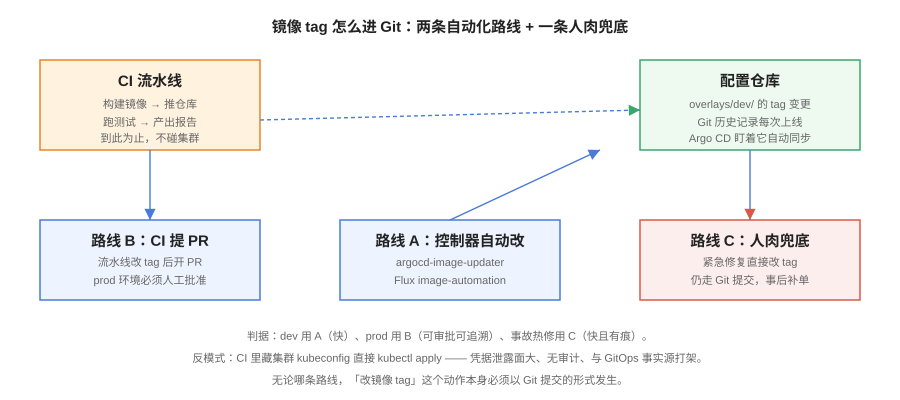

# 镜像更新与 CI 分工



GitOps 划走了 CI 的「部署权」，但留了一个新问题：**新构建的镜像 tag 由谁、以什么方式写进配置仓**。本页讲清 CI 与 CD 的责任边界、三条镜像更新路线的取舍，以及它们如何共同保证「每一次上线都是一次 Git 提交」。

## 责任边界

| 阶段 | 负责 | 产物 | 不允许做 |
| --- | --- | --- | --- |
| CI：构建 | GitHub Actions / GitLab CI / Jenkins | 应用镜像、SBOM、测试报告 | 拿集群凭据 `kubectl apply` |
| CI：更新清单 | CI 机器人或镜像更新控制器 | **配置仓的新提交（PR）** | 直接改集群 |
| CD：同步 | Argo CD / Flux（集群内） | 对齐后的集群状态 | 跳过 Git 变更集群 |

::: danger 最后一公里挪进集群，凭据面缩小一个数量级
Push 模式下 CI 需要 prod 集群管理员权限，CI 系统被打穿 = 集群被打穿。GitOps 模式下 CI 对集群**零权限**，它只向配置仓提交——而配置仓有分支保护与 PR 审批。凭据面从「CI → 集群」收缩为「集群内控制器 → 只读 Git」。
:::

## 路线 A：控制器自动改（dev 环境）

让控制器自己盯镜像仓库、自动更新 Git：

- **Flux**：`image-reflector-controller` 扫描镜像仓库新 tag，`image-automation-controller` 自动提交 Git——原生内置；
- **Argo CD**：`argocd-image-updater` 插件，按注解声明的策略更新 Application 的参数（写回 Git 或只改参数）。

```yaml [flux-image-update.yaml]
apiVersion: image.toolkit.fluxcd.io/v1beta2
kind: ImagePolicy
metadata:
  name: blog-dev
  namespace: flux-system
spec:
  imageRepositoryRef: {name: blog}
  filterTags:
    pattern: '^main-[a-f0-9]+-(?P<ts>[0-9]+)$'
    extract: '$ts'
  policy:
    numerical: {order: asc}        # 取时间戳最大的 tag
```

::: info 版本现状
Flux 的 image 自动化 CR（`image.toolkit.fluxcd.io/v1beta2`）在 2.9 周期已列入移除计划、迁移至 v1 API，升级前同样跑 `flux migrate`；Argo 官方对 `argocd-image-updater` 的长期定位有过调整讨论，**生产采用前先核对官方仓库当前状态**，不确定就选路线 B。
:::

## 路线 B：CI 提 PR（prod 环境）

CI 构建通过后，以机器人身份向配置仓提交「晋级 PR」，人工审批后合并：

```yaml [.github/workflows/promote.yaml]
name: Promote to prod
on:
  workflow_dispatch:
    inputs:
      tag: {description: "image tag to promote", required: true}
jobs:
  open-pr:
    runs-on: ubuntu-latest
    steps:
      - uses: actions/checkout@v4
        with: {repository: example/blog-config}
      - run: |
          cd overlays/prod
          kustomize edit set image ghcr.io/example/blog:main-${{ inputs.tag }}
          git config user.name "ci-bot"
          git config user.email "ci@example.com"
          git checkout -b promote/prod-${{ inputs.tag }}
          git commit -am "chore: promote blog to prod (main-${{ inputs.tag }})"
          git push origin promote/prod-${{ inputs.tag }}
      - run: gh pr create --title "Promote prod main-${{ inputs.tag }}" --fill
        env:
          GH_TOKEN: ${{ secrets.BOT_TOKEN }}
```

PR diff 就是上线的全部内容——**审批 PR 就是审批发布**，这是 GitOps 给多环境团队最大的红利。

## 路线 C：人肉兜底（事故热修）

凌晨三点服务挂了，等 CI 等不起。热修也必须走 Git：直接向配置仓提交「把 tag 改回上一个版本」的提交（或用终端跑完 `git revert` + push），**禁止绕过 Git 直接改集群**——selfHeal 会把你的手工改动改回去，而且没有痕迹。

## 镜像 tag 策略

| 策略 | 例子 | 判据 |
| --- | --- | --- |
| `git-sha`（推荐） | `main-a1b2c3` | tag 与提交一一对应，审计/回滚/复现三者天然对齐 |
| 语义化版本 | `v1.4.2` | 对外发布的组件；需要发版流程支撑 |
| `latest` | ❌ 禁止 | 「最新」不是事实源，回滚与审计全部失效 |

::: tip commit-sha + 时间戳双后缀
`main-a1b2c3-1727928000` 能同时回答「哪个提交构建的」和「哪个更新」，ImagePolicy 按 ts 排序取最新——dev 自动跟最新的工程细节就靠它。
:::

## 易错点与最佳实践

::: danger 五个边界坑
1. **CI 里偷偷留一份 kubeconfig「以便应急」**：应急通道一旦存在就会变成日常通道。应急 = 直接改 Git（路线 C），30 秒内生效并不比 kubectl 慢多少。
2. **ImagePolicy 排序字段选错**：按字母序排 tag，`v2` 会排在 `v10` 前面。数值型 tag 用 `numerical`，时间戳后缀是最稳的排序键。
3. **机器人 token 权限过大**：CI 机器人只需要**配置仓的写权限**，不需要其他任何仓库，更不需要集群权限。
4. **PR 自动合并没有保护**：`auto-merge` 只该用于 dev overlay；prod 的分支保护（要求 review、要求状态检查）缺一不可。
5. **镜像构建完没有 SBOM 与签名**：GitOps 让「谁部署的」可审计，但「部署的是什么」需要 SBOM/cosign 补全，供应链治理见 [安全加固 · SBOM 与软件供应链](../../../../Ops/SecurityHardening/SbomSupplyChain/index.md)。
:::

::: tip 最佳实践
- 三条路线按环境组合：**dev 用 A（全自动）、prod 用 B（自动开 PR + 人工审批）、热修用 C（直达 Git）**；
- CI 的流水线里加一步「对配置仓跑 kustomize build」，渲染不过不晋级；
- 每个镜像 tag 在配置仓的历史里只能出现一次晋升方向：要么进、要么退，禁止反复横跳。
:::

## 验证方式

```shell
# 验证边界：CI 对集群确实零权限
# （在 CI 的 job 里执行，期望报 401/403 或连接失败）
kubectl get ns

# 验证路线 B 的完整闭环
# 1. 触发 promote workflow → 配置仓出现 PR
# 2. 审批合并 → argocd app get web 出现新修订
argocd app history web
# 期望：最新修订的 revision = 刚合并的提交

# 验证回退闭环：revert 后自动回到旧 tag
git revert <晋级提交> --no-edit && git push
argocd app wait web --health --timeout 300
kubectl -n blog-prod get deploy blog -o jsonpath='{.spec.template.spec.containers[0].image}'
# 期望：镜像 tag 回到上一版本
```

## 相关页面

- 晋级落到哪些目录：[配置仓库设计与多环境](../RepoStructure/index.md)
- 发布编排与回滚细节：[渐进发布与回滚](../ProgressiveDelivery/index.md)
- 流水线本体设计：[CI/CD · 流水线设计](../../../../Tools/CICD/PipelineDesign/index.md)

## 参考资料

- Flux Image Automation：<https://fluxcd.io/flux/guides/image-update/>
- argocd-image-updater：<https://argocd-image-updater.readthedocs.io/>
- GitHub Actions：<https://docs.github.com/actions>
