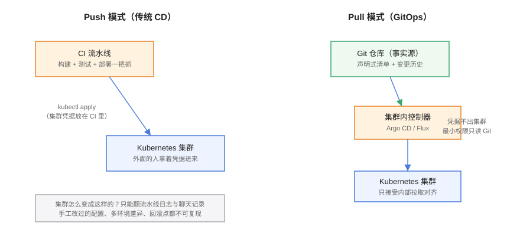
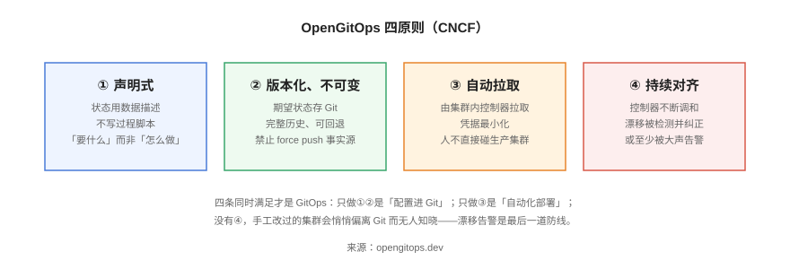
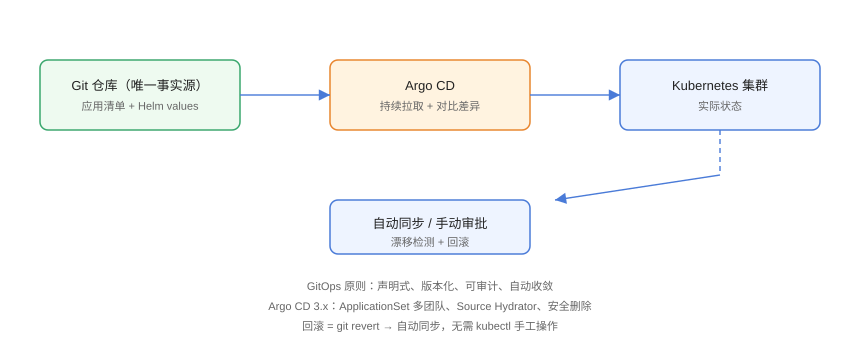

# GitOps 理念与工作原理



GitOps 的核心是**把「运维集群」变成「改代码」**：环境的期望状态全部用声明式清单描述、放进 Git 仓库，由运行在集群内的控制器持续对齐。本页讲清四条原则、推与拉的本质区别，以及什么场景不该上 GitOps。

## 四原则（OpenGitOps）



CNCF 的 OpenGitOps 工作组把 GitOps 归纳为四条原则，四条**同时满足**才算 GitOps：

| # | 原则 | 英文 | 关键判据 |
| --- | --- | --- | --- |
| ① | 声明式 | Declarative | 状态用数据描述（YAML/HCL），不写过程脚本；「要什么」而非「怎么做」 |
| ② | 版本化、不可变 | Versioned and Immutable | 期望状态存 Git，有完整历史；禁止 force push 事实源分支 |
| ③ | 自动拉取 | Pulled Automatically | 由集群内控制器拉取并应用；集群凭据不出集群、权限最小化 |
| ④ | 持续对齐 | Continuously Reconciled | 控制器不断调和期望与实际；漂移被纠正，或至少被大声告警 |

常见误区是只做到一半：**「配置进 Git」但没有控制器对齐**（原则①②有了，③④没有）只是配置管理；**「CI 自动部署」**（只有③的形态）是自动化交付。两者的差距会在第一次事故时显现——没有事实源，你无法回答「集群现在为什么是这个状态」。

## 推（Push）与拉（Pull）

传统 CD 是**推模式**：CI 流水线在集群外面拿着 kubeconfig，`kubectl apply` 把变更推进集群。GitOps 是**拉模式**：CI 只负责构建与产出清单，集群内的控制器（Argo CD、Flux）主动拉取 Git 中的期望状态并对齐。

两种模式的差异落在四个实际问题上：

| 维度 | Push 模式 | Pull 模式（GitOps） |
| --- | --- | --- |
| 凭据面 | 集群凭据放在 CI 系统里，泄露面 = CI 的攻击面 | 凭据只在集群内，CI 对集群零权限 |
| 审计 | 分散在流水线日志、聊天记录里 | Git 提交历史即完整变更记录 |
| 漂移 | 部署完就结束，之后的手工改动无人知晓 | 控制器持续检测，手工改动会被纠正或告警 |
| 灾难恢复 | 重建集群需要回忆「当时部署了什么」 | 从 Git 重新同步即可恢复全部应用层状态 |

::: tip 判断标准一句话
**你的集群能不能从零重建？** 拉模式下答案是「能，重新同步一遍 Git」；推模式下答案通常是「要翻流水线历史，还得问老同事」。
:::

## 一次同步的完整过程

以 Argo CD 为例，从提交到生效经过五步：

1. **提交**：开发者向配置仓库提交变更（改副本数、换镜像 tag），经 PR 审批合并到 `main`；
2. **拉取**：控制器按轮询间隔（默认 3 分钟）或 Webhook 触发，拉取最新清单并渲染（Kustomize build / Helm template）；
3. **对比**：把渲染结果与集群实际状态逐字段 diff，得出 `OutOfSync` 与差异详情；
4. **调和**：按 `syncPolicy` 自动同步或等人工点击；应用过程可按 Sync Waves 排序，也可先跑 PreSync Hook（如数据库备份）；
5. **报告**：同步结果与健康状态写回 Application 对象，通过 UI/CLI/通知渠道暴露；健康检查不过则标记 `Degraded`。



## 适用与不适用

| 场景 | 是否适合 | 原因 |
| --- | --- | --- |
| Kubernetes 应用交付 | ✅ 首选 | 资源天然声明式，与控制器模式完美契合 |
| 多环境一致性管理 | ✅ | overlay/values 表达差异，事实源唯一 |
| 合规审计要求高的团队 | ✅ | Git 历史 = 变更审计记录 |
| 频繁变更的基础设施（建机器、建集群） | ⚠️ 用 IaC | 归 [Terraform](../../../Terraform/index.md)，别和应用清单混在一个仓库 |
| 传统虚机上的命令式运维 | ❌ | 状态无法声明式描述，硬套只会得到一份没人信的「假事实源」 |
| 数据库数据本身 | ❌ | GitOps 管结构（DDL 变更清单）不管数据；数据归备份体系 |

::: danger 最容易踩的认知坑
1. **GitOps 不是「把 YAML 提交到 Git」就完事**：没有控制器持续对齐，Git 里的清单很快和集群脱节，变成谁都不敢信的摆设。
2. **不是所有资源都该进 GitOps**：CRD 安装、证书轮转这类「集群级一次性动作」交给管理工具或 Operator 更合适；硬塞进应用清单仓库会让 diff 噪音淹没真正的业务变更。
3. **GitOps 不能替代 CI**：构建、测试、安全扫描仍在 CI；GitOps 只接管「变更如何进入集群」这最后一公里。
:::

## 验证方式

```shell
# 确认集群里已有 GitOps 控制器（以 Argo CD 为例）
kubectl -n argocd get pods
# 期望：argocd-server / argocd-application-controller / argocd-repo-server 处于 Running

# 确认一个 Application 的四要素（事实源、目标、状态、健康）
argocd app get web
# 期望能读出 repoURL/path、destination、Sync Status、Health Status 四组信息
```

## 相关页面

- 工具落地：[Argo CD：安装与核心对象](../ArgoCD/index.md)、[Flux：另一条主线](../FluxCD/index.md)
- 仓库怎么设计：[配置仓库设计与多环境](../RepoStructure/index.md)
- 与 IaC 的边界：[Terraform 概述与选型](../../../Terraform/Overview/index.md)

## 参考资料

- OpenGitOps 原则：<https://opengitops.dev/>
- Argo CD 核心概念：<https://argo-cd.readthedocs.io/en/stable/core-concepts/>
- Google SRE 与声明式配置（延伸阅读）：<https://sre.google/>
