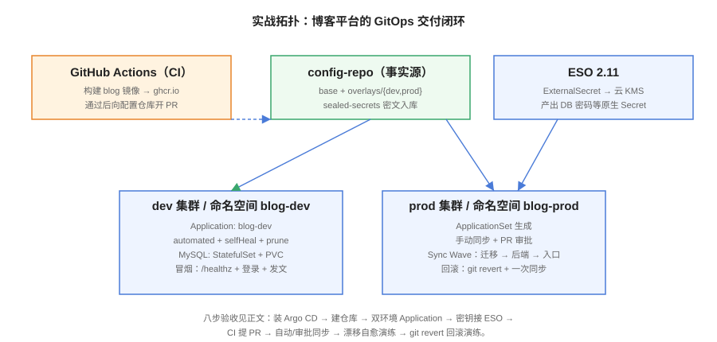

# 实战：博客平台 GitOps 交付



本页把前几页的能力拼成一个完整可复现的落地：给「全栈博客平台」建一套 GitOps 交付体系——双环境（dev/prod）、密钥走 External Secrets、CI 提 PR 晋级、漂移自愈与回滚演练各一次。全部步骤可验证，照着做完你就有了一套可以直接复用到任何项目的 GitOps 骨架。

## 前置条件

```shell
# 可用的 Kubernetes 集群（本地 kind/minikube 亦可）
kubectl get nodes                        # 期望：Ready
helm version                             # 期望：v3.x
argocd version --client                  # 期望：v3.5.x
```

| 组件 | 用途 | 版本口径 |
| --- | --- | --- |
| Argo CD | 交付控制器 | 3.5.x |
| External Secrets Operator | 密钥同步 | 2.11.x |
| Kustomize | 环境差异渲染 | 5.x |
| GitHub Actions（或任意 CI） | 构建与晋级 PR | — |

## 第一步：初始化配置仓库

```shell
mkdir blog-config && cd blog-config && git init
mkdir -p base overlays/dev overlays/prod clusters/prod

# base：与环境和镜像无关的公共清单
cat > base/deployment.yaml <<'EOF'
apiVersion: apps/v1
kind: Deployment
metadata:
  name: blog
  labels: {app: blog}
spec:
  selector: {matchLabels: {app: blog}}
  template:
    metadata: {labels: {app: blog}}
    spec:
      containers:
        - name: blog
          image: ghcr.io/example/blog # 占位，tag 由 overlay 决定
          ports: [{containerPort: 8080}]
          readinessProbe:
            httpGet: {path: /healthz, port: 8080}
EOF

cat > base/kustomization.yaml <<'EOF'
resources: [deployment.yaml, service.yaml]
EOF
```

overlay 与 Application 的完整写法见 [配置仓库设计与多环境](../RepoStructure/index.md)；推送后确认 `kustomize build overlays/dev` 能渲染出完整清单。

## 第二步：安装 Argo CD 并接入仓库

```shell
helm repo add argo https://argoproj.github.io/argo-helm && helm repo update
kubectl create ns argocd
helm install argocd argo/argo-cd -n argocd \
  --set configs.params."server\.insecure"=true
kubectl -n argocd rollout status deploy/argocd-server

argocd admin initial-password -n argocd     # 取初始密码，登录后改掉
argocd login <SERVER-ADDRESS> --insecure
argocd repo add https://github.com/example/blog-config.git
```

## 第三步：创建双环境 Application

```shell
# dev：全自动同步
argocd app create blog-dev \
  --repo https://github.com/example/blog-config.git \
  --path overlays/dev --dest-namespace blog-dev \
  --sync-policy automated --self-heal --auto-prune

# prod：手动同步（合并 PR 即触发人工确认）
argocd app create blog-prod \
  --repo https://github.com/example/blog-config.git \
  --path overlays/prod --dest-namespace blog-prod

argocd app list      # 期望：blog-dev Synced，blog-prod OutOfSync（待首次同步）
```

规模化后替换为 ApplicationSet，模板见 [配置仓库设计与多环境](../RepoStructure/index.md)。

## 第四步：密钥接 External Secrets

```shell
helm repo add external-secrets https://charts.external-secrets.io
helm install external-secrets external-secrets/external-secrets \
  -n external-secrets --create-namespace
```

```yaml [overlays/prod/external-secret.yaml]
apiVersion: external-secrets.io/v1
kind: ExternalSecret
metadata: {name: blog-db, namespace: blog-prod}
spec:
  refreshInterval: 1h
  secretStoreRef: {name: prod-secrets, kind: ClusterSecretStore}
  target: {name: blog-db, creationPolicy: Owner}
  data:
    - secretKey: password
      remoteRef: {key: prod/blog/db, property: password}
```

三路线的选型与落地细节见 [密钥管理](../Secrets/index.md)。**任何环境下，`kubectl get secret -o yaml` 的明文产物都不允许回到 Git。**

## 第五步：CI 构建与晋级

```shell
# CI 构建镜像（dev 环境）
docker build -t ghcr.io/example/blog:main-$(git rev-parse --short HEAD) .

# dev 晋级：CI 机器人直接提交
cd overlays/dev && kustomize edit set image ghcr.io/example/blog:main-a1b2c3
git commit -am "chore: dev deploy main-a1b2c3" && git push
# Argo CD 3 分钟内自动同步

# prod 晋级：同样动作改为开 PR（完整 workflow 见镜像更新页）
```

## 第六步：发布、漂移与回滚三项演练

```shell
# ① 发布演练：正常路径
argocd app sync blog-prod && argocd app wait blog-prod --health --timeout 300
curl -sf http://<prod-ingress>/healthz     # 期望：200

# ② 漂移演练：绕过 Git 改副本数
kubectl -n blog-dev scale deploy/blog --replicas=9
argocd app get blog-dev                    # 期望：OutOfSync
sleep 200
kubectl -n blog-dev get deploy blog -o jsonpath='{.spec.replicas}'
# 期望：回到 Git 声明值（自愈生效）

# ③ 回滚演练：revert 坏提交
git revert <坏提交> --no-edit && git push
argocd app wait blog-prod --health --timeout 300
kubectl -n blog-prod get deploy blog -o jsonpath='{.spec.template.spec.containers[0].image}'
# 期望：镜像 tag 回到上一版本
```

## 验收清单

| # | 验收项 | 命令/方法 | 期望 |
| --- | --- | --- | --- |
| 1 | 控制器就绪 | `kubectl -n argocd get pods` | 全部 Running |
| 2 | 双环境同步 | `argocd app list` | dev Synced / prod Synced |
| 3 | 渲染可审查 | `kustomize build overlays/prod` | 输出完整清单，无占位符残留 |
| 4 | 密钥零明文 | `grep -rn stringData overlays/` | 无输出 |
| 5 | ESO 同步 | `kubectl -n blog-prod get externalsecret blog-db` | SecretSynced True |
| 6 | CI 不碰集群 | CI job 内 `kubectl get ns` | 401/403 或连接失败 |
| 7 | 漂移自愈 | 第六步演练② | 恢复 Git 声明值 |
| 8 | 回滚闭环 | 第六步演练③ | 镜像回到上一版本，历史可查 |

## 易错点回顾

::: danger 实战环节最容易翻车的三处
1. **跳过第三步的 Project 边界**：demo 阶段全用 `default` 项目，上生产前必须补齐，否则权限重构成本巨大。
2. **prod 上了自动同步才想起来要审批**：同步策略先想清楚再创建 Application——dev 自动、prod 手动，靠「合并 PR」控制节奏。
3. **演练只演成功路径**：漂移自愈与回滚这两个「坏路径」才是验收重点，绿灯应用人人会看，出事时的第一反应决定恢复时间。
:::

## 下一步

- 发布编排细化：迁移 Job 的 Wave 编排与 Canary，见 [渐进发布与回滚](../ProgressiveDelivery/index.md)；
- 集群级备份（Argo CD 管不到的数据与状态），见 [备份与容灾](../../../BackupDR/index.md)；
- 监控 Argo CD 自身：`argocd_*` 指标接入 Prometheus，见 [监控告警](../../../Monitoring/index.md)。

## 参考资料

- Argo CD Helm Chart：<https://github.com/argoproj/argo-helm>
- 本专题各页参考资料汇总见 [常见问题与最佳实践](../FAQ/index.md)
