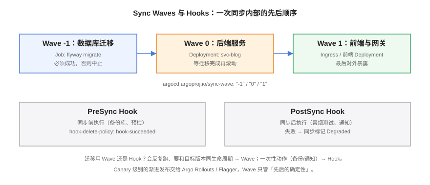

# 渐进发布与回滚



「合并进 main」不等于「发布成功」。本页讲 GitOps 里**发布内部的先后编排**（Sync Waves、Hooks）、**流量级渐进发布**（Argo Rollouts / Flagger 的 Canary），以及最重要的安全网——**回滚为什么必须等于 `git revert`**。

## 同步内部的先后：Sync Waves

一次同步里，数据库迁移、后端、入口的上线顺序必须确定。Argo CD 用注解排波次：

```yaml [wave-annotations.yaml]
# 每个资源加注解，数值小的先同步、且等其 Healthy 后才进入下一波
metadata:
  annotations:
    argocd.argoproj.io/sync-wave: "-1"
```

| Wave | 内容 | 编排理由 |
| --- | --- | --- |
| -1 | 数据库迁移 Job（flyway/liquibase） | 迁移必须先成功，且**向后兼容**（先加列后删列） |
| 0 | 后端 Deployment | 等表结构就绪再滚动新版本 |
| 1 | 前端、Ingress | 代码就绪后才对外暴露 |

Flux 用 Kustomization 的 `dependsOn` 表达同样的 DAG：

```yaml [depends-on.yaml]
apiVersion: kustomize.toolkit.fluxcd.io/v1
kind: Kustomization
metadata:
  name: blog-app
  namespace: flux-system
spec:
  dependsOn:
    - name: blog-db-migrate
  path: ./overlays/prod/app
```

## 一次性动作：Hooks

Wave 管「**反复出现的资源**的顺序」，Hooks 管「**一次性动作**」——备份、预检、冒烟、通知：

```yaml [presync-backup.yaml]
apiVersion: batch/v1
kind: Job
metadata:
  name: blog-db-presync-backup
  annotations:
    argocd.argoproj.io/hook: PreSync          # 同步前执行
    argocd.argoproj.io/hook-delete-policy: HookSucceeded
spec:
  template:
    spec:
      containers:
        - name: backup
          image: ghcr.io/example/blog-backup:v1
          command: ["./backup.sh"]
      restartPolicy: Never
```

| 类型 | 时机 | 典型用途 |
| --- | --- | --- |
| `PreSync` | 同步前，失败则中止同步 | 数据库备份、容量预检 |
| `PostSync` | 同步且健康后 | 冒烟测试、发布通知 |
| `SyncFail` | 同步失败后 | 告警、清理 |
| `Skip` | 跳过该资源 | 临时禁用某清单 |

::: tip Wave 还是 Hook 的判据
**这个动作会和应用一起反复出现吗？** 会（如迁移 Job 每次发版都要跑）→ Wave，让它随版本演进；不会（如本次发版前临时备份）→ Hook，用完即删。把一次性动作写成 Wave 资源，它会在以后每次同步时被反复 reconcile。
:::

## 流量级渐进发布

Wave 保证「先后的确定性」，但全量切换仍然是一步到位。要「先给 5% 流量试水」需要专门的发布控制器：

| 工具 | 生态 | 机制 |
| --- | --- | --- |
| Argo Rollouts | Argo 生态 | 自定义 `Rollout` 资源替代 Deployment，按步骤切流量（5% → 25% → 100%），每步可挂分析（Analysis）自动判定 |
| Flagger | Flux 生态 | 监听 Deployment，自动创建 canary，按指标（Prometheus 查询）逐步加权 |

```yaml [rollout-canary.yaml]
apiVersion: argoproj.io/v1alpha1
kind: Rollout
metadata:
  name: blog
spec:
  replicas: 4
  strategy:
    canary:
      steps:
        - setWeight: 5            # 5% 流量进新版
        - pause: {duration: 5m}   # 观察 5 分钟
        - analysis:
            templates: [{templateName: error-rate}]   # 指标不达标自动中止
        - setWeight: 25
        - pause: {duration: 10m}
        - setWeight: 100
  selector: {matchLabels: {app: blog}}
  template:
    metadata: {labels: {app: blog}}
    spec:
      containers: [{name: blog, image: ghcr.io/example/blog:main-a1b2c3}]
```

::: info 与网格的关系
Rollouts/Flagger 切流量依赖 Service/Ingress 或服务网格（VirtualService）。网格侧的流量规则怎么写，见 [服务网格 · 流量管理](../ServiceMesh/TrafficManagement/index.md)；本页只强调一点：**渐进发布的每个中间状态都必须落盘**——由 Rollouts 清单进 Git，控制器按声明推进，而不是人在终端里手敲 `kubectl patch`。
:::

## 回滚：一切回到 Git

```shell
# 查看同步历史
argocd app history web

# 方式一：临时止血（集群与 Git 暂时不一致）
argocd app rollback web 3

# 方式二：GitOps 正解（推荐）
git revert <坏提交> --no-edit
git push origin main
# 控制器自动同步回旧状态，所有环境一起回滚
```

| 方式 | 集群状态 | Git 状态 | 适用 |
| --- | --- | --- | --- |
| `argocd app rollback` | 回到旧版 | **仍是坏提交** | 深夜止血，事后必须补 revert |
| `git revert` + push | 自动回旧版 | **已修正** | 默认选择；审计链完整 |
| 重新部署旧镜像 tag | 手动改 | 漂移 | 不推荐，等价于放弃事实源 |

::: danger rollback 之后必须补 revert
`argocd app rollback` 会让集群「领先/偏离」于 Git——下一次自动同步可能把坏版本**再拉回来**。止血动作只有两步是完整的：`rollback`（立刻生效）→ `git revert`（修正事实源）→ `sync`（对齐）。
:::

## 易错点与最佳实践

::: danger 五个发布编排坑
1. **迁移不向后兼容**：先删列再发版，新版回滚到旧版时旧代码读到缺列直接崩。迁移纪律：**加列 → 双写 → 切读 → 后续版本再删列**。
2. **Wave 之间没有健康等待**：Argo CD 默认等上一波 Healthy 才进下一波，但如果资源没有配置合理的 readinessProbe，「Healthy」就是假的——先修探针再谈编排。
3. **Hook 失败被忽略**：PostSync 冒烟失败只标记 Degraded 不回滚。把关键冒烟接入 Analysis，让指标驱动自动中止。
4. **Canary 百分比写死在注解里靠人改**：权重必须进 Git（Rollouts 清单本身就是事实源），改权重 = 改清单 = 留痕。
5. **回滚只回应用不回配置**：坏的可能不是镜像而是 values。revert 的是配置仓提交，天然覆盖镜像、参数、副本数所有维度。
:::

::: tip 最佳实践
- 每次发布前 PreSync 备份数据库（发布与备份的关系见 [备份与容灾](../../BackupDR/index.md)——备份恢复的是**数据与集群状态**，`git revert` 恢复的是**清单声明**，两者互补不可替代）；
- prod 的自动化同步关掉，用「合并 PR」当发布按钮；
- 发布窗口内盯 `argocd app wait --health` 的输出或通知，Degraded 不留过夜。
:::

## 验证方式

```shell
# 演练一次完整发布 + 回滚
git checkout -b release-test && # 修改 overlays/prod 镜像 tag
git commit -am "chore: release test v2" && git push && # 合并后：
argocd app wait web --health --timeout 300      # 期望：Health Status: Healthy

git revert HEAD --no-edit && git push           # 回滚
argocd app wait web --health --timeout 300      # 期望：回到上一版本且 Healthy
argocd app history web                          # 期望：历史里能看到两个方向的修订

# Wave 编排验证：同步过程中观察各资源的波次顺序
argocd app get web --refresh
# 期望：迁移 Job 先 Completed，后端后 Ready，入口最后变更
```

## 相关页面

- 排波次的前提——仓库结构：[配置仓库设计与多环境](../RepoStructure/index.md)
- 镜像 tag 谁来改：[镜像更新与 CI 分工](../ImageUpdate/index.md)

## 参考资料

- Sync Waves 与 Hooks：<https://argo-cd.readthedocs.io/en/stable/user-guide/sync-waves/>
- Argo Rollouts：<https://argoproj.github.io/argo-rollouts/>
- Flagger：<https://flagger.app/>
